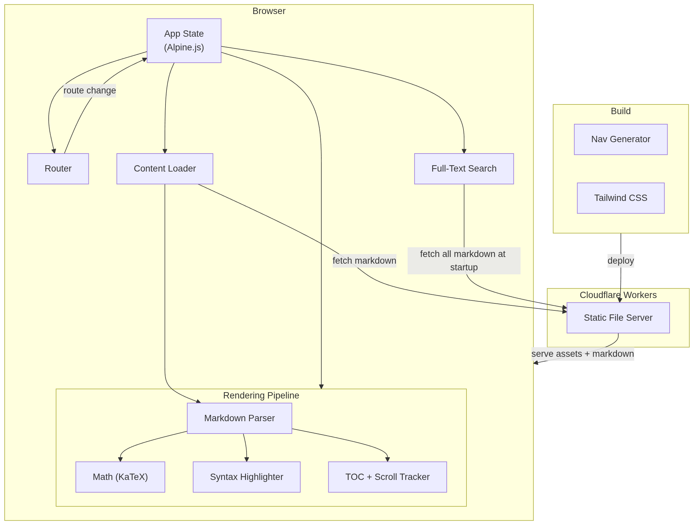

# Blog Architecture

A client-side SPA for browsing hierarchical markdown documentation, deployed as static files on Cloudflare Workers. No bundler, no framework — Alpine.js for reactivity, marked.js for markdown parsing, KaTeX for math, Highlight.js for code.


<figure><figcaption></figcaption></figure>


## Module Map

```
index.html             → entry point, loads scripts in order
├── utils.js           → slug generation (shared across modules)
├── navigation-data.js → static page tree (generated by build script)
├── router.js          → hash-based routing and path validation
├── search.js          → full-text search, indexed at startup
├── content-loader.js  → fetches and parses markdown, with caching
├── marked-extensions.js → protects LaTeX delimiters from the markdown parser
├── toc-generator.js   → extracts headings, tracks active section via IntersectionObserver
├── renderer.js        → KaTeX, Highlight.js, timeline class detection
└── app.js             → Alpine.js app state, wires all modules together
```

Scripts load in order via `<script>` tags. Each module is a plain class; `app.js` initializes them after the DOM is ready.

## Routing

Hash-based routing — the URL fragment encodes the full path (`#category/page`, `#category/folder/page`, `#category/page#section`).

On every `hashchange`, the router splits off the in-page anchor, validates the path against `/^[a-zA-Z0-9-_/]*$/` to block directory traversal, then calls into `app.js` to load content. No server round-trip — the browser never leaves the page.

## Content Loading

`ContentLoader` maps a route to a markdown file path, fetches it, and hands the parsed HTML to Alpine. The mapping is straightforward: segments in the URL become segments in the file path (`math/precalculus/summary` → `/math/precalculus/summary.md`).

**Cache:** parsed HTML is stored in a `Map` keyed by file path. Repeat visits skip the fetch and re-parse entirely — no expiry, lives for the session.

## Search

Full-text search with a flat in-memory index built at startup.

**Indexing approach:** all markdown files are fetched in parallel (`Promise.all`). Each file is scanned line-by-line and split on headers (`#`, `##`, `###`) into sections. Each section becomes an index entry: `{ title, category, page, link, plainText }`. The link includes the in-page anchor so clicking a result scrolls directly to the matched section.

**Query approach:** linear scan over the index — `filter` by substring match on `title` and `plainText`. Simple and fast enough given the content size. Results are capped at 10, queries are debounced at 300ms.

**Scalability note:** at 200+ pages, the index build time and memory cost become the bottleneck. The right fix is to move index generation to build time and serve `dist/search-index.json` — the same move already made for navigation data.

## Rendering Pipeline

After Alpine flushes new content to the DOM, a `MutationObserver` fires and runs post-render steps in order:

1. Assign slug-based IDs to `h2`/`h3` headings
2. Build the TOC and start an `IntersectionObserver` for active-section tracking
3. KaTeX auto-render for `$...$` and `$$...$$`
4. Highlight.js on `pre code` blocks, scoped to `#content`
5. Scroll to anchor (if present) or reset to top

`MutationObserver` replaced a fixed `setTimeout` — it fires exactly when Alpine is done, not after a fixed guess.

## Deployment

```
./build.sh       → compiles Tailwind, copies src/ + content dirs to dist/
npx wrangler deploy  → deploys dist/ to Cloudflare Workers (static file serving)
```

No server-side logic. Navigation data (`navigation-data.js`) is generated at build time by `scripts/gen-nav.js`.
