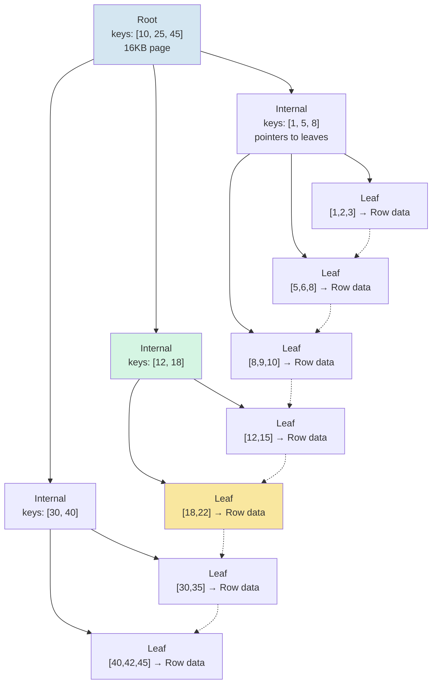
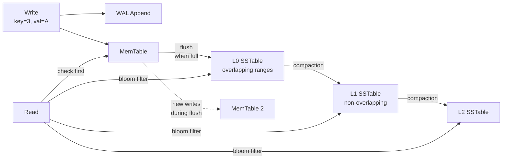
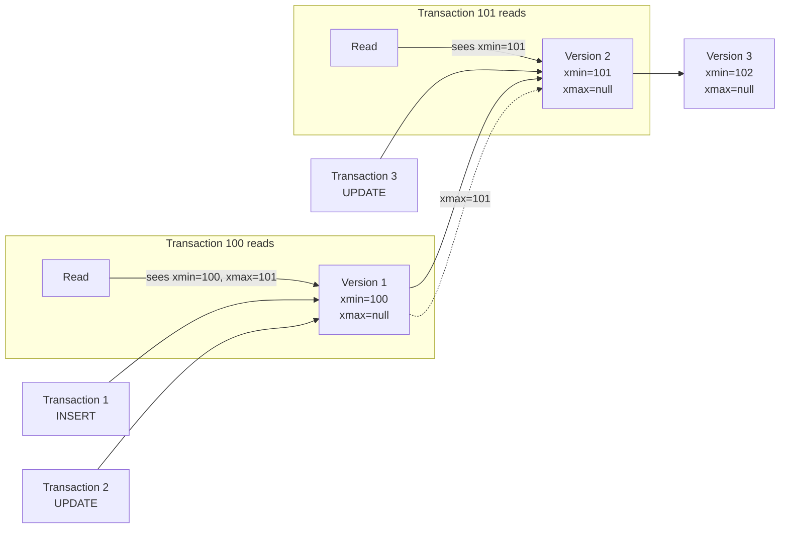
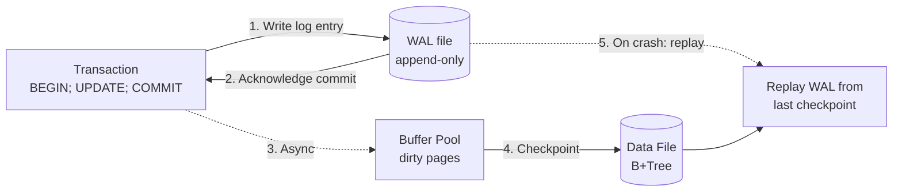

# Database Algorithms

## B+Tree

The foundational data structure for relational database indexes.

### The Problem

Disk reads are slow (~10ms seek) but sequential reads are fast. A naively sorted list lets you binary-search but requires moving data on every insert (O(n) to shift). A BST with pointers at each node means one disk seek per level, so searching 1 billion rows could need 30 seeks.

**A B+Tree solves both**: pack hundreds of sorted keys into one disk page, so one seek reads many keys. With ~2000 keys per page, a 4-level tree holds 2000³ = 8 billion keys — only 4 seeks for any lookup.

### Anatomy

Each node = one disk page (8KB–16KB). Two node types:

```
Internal node:  [ key1 | ptr1 | key2 | ptr2 | key3 | ptr3 | ... ]
Leaf node:      [ key1 | data1 | key2 | data2 | key3 | data3 | ... ]
                ─────────────────────────────────────────────────────
                Leaf nodes also have a "next leaf" pointer
```

- **Internal nodes** contain keys + child pointers. Key `K` at position `i` means: *all values in child `i` are ≤ K, all values in child `i+1` are > K*.
- **Leaf nodes** contain keys + actual data (or a pointer to it, like a CTID in PostgreSQL).
- Leaf nodes form a **linked list** so range scans (`WHERE key BETWEEN 10 AND 50`) walk left→right without backtracking up the tree.

### Search: trace for key = 22

```
Root page:     [10, 25, 45]         → 22 < 25, go left
  ↓
Internal page: [12, 18]             → 22 > 18, go right
  ↓
Leaf page:     [18, 22, 30] → data  → found at position 1
```

At each level: binary search within the page to decide which child to follow. Only as many page reads as tree height.

### Visual: searching for 22



Walk from root → internal (via 22 < 25, then 22 > 18) → leaf (found). Three page reads total.

### Insert with split

Insert key = 6 into leaf [5,6,8] that has space → just insert in sorted position. Simple.

Insert key = 7 into a *full* leaf (page holds max 4 keys for illustration):

```
Before:     Leaf: [1, 2, 5, 8]   Parent: [10, 25]
            Insert 7 → overflow!

Step 1 — Split:     Left  = [1, 2, 5]   Right = [7, 8]
                    Middle key = 5 (promoted to parent)

Step 2 — Promote:   Parent before: [10, 25]
                    Parent after:  [5, 10, 25]
                    Children become: [left, right] → parent now has 3 children

Step 3 — If parent is now full → split parent too (propagate upward).
                    (Here parent has room, so done.)
```

Result: the tree grows wider, not deeper. All leaves stay at the same depth forever.

### Key properties

- **Fan-out**: ~2000 keys per 16KB page (with 8-byte keys). A 3-level tree: 2000³ = 8B keys.
- **Height**: log_{fanout}(n). 1B rows → height 3 (root + 1 internal + leaf = 3 seeks worst case).
- **Self-balancing**: All leaves always at the same depth. Splits propagate up, never change depth of existing leaves.
- **Leaf linked list**: Range scan = sequential page reads, not tree traversal.
- **Buffer pool friendly**: Hot internal pages (root, top levels) stay cached — most reads hit only the leaf page on disk.

### Pseudocode

```pseudocode
// ── Search ──
function BTreeSearch(root, target_key)
    node ← root
    while not IsLeaf(node)
        i ← BinarySearch(node.keys, target_key)
        // keys[i] is the smallest key ≥ target_key
        // follow child i (the branch for keys ≤ node.keys[i])
        node ← node.children[i]
    // node is now a leaf
    return BinarySearch(node.keys, target_key)

// ── Insert ──
function BTreeInsert(tree, key, value)
    leaf ← FindLeaf(tree.root, key)
    InsertEntry(leaf, key, value)
    if IsFull(leaf)
        SplitAndPropagate(leaf)

function SplitAndPropagate(node)
    left, right, middle_key ← SplitHalf(node)

    if IsRoot(node)
        tree.root ← NewInternalNode([middle_key], [left, right])
    else
        parent ← node.parent
        InsertKey(parent, middle_key)
        ReplaceChild(parent, old = node, new_children = [left, right])
        if IsFull(parent)
            SplitAndPropagate(parent)

function SplitHalf(node)
    mid ← floor(NumKeys(node) / 2)
    left  ← NewNode(keys = node.keys[0:mid],    children = node.children[0:mid+1])
    right ← NewNode(keys = node.keys[mid+1:],   children = node.children[mid+1:])
    return (left, right, middle_key = node.keys[mid])
```

## LSM-Tree



Write path:
1. Write is appended to the WAL (sequential disk write).
2. Key-value is inserted into the MemTable (sorted, in-memory skip list).
3. When the MemTable is full, it becomes immutable and a new MemTable takes over.
4. The immutable MemTable is flushed to disk as an SSTable (sequential write).
5. Background compaction merges SSTables, discarding old versions and tombstones.

Read path:
1. Check MemTable first.
2. Check each SSTable from newest to oldest (bloom filters skip irrelevant SSTables).
3. Merge results → return the latest version.

Compaction strategies:
- **Size-Tiered (STCS)**: When N SSTables of similar size exist, merge them into one larger SSTable. Simple but causes write amplification spikes.
- **Leveled (LCS)**: L0 has overlapping SSTables. Deeper levels are non-overlapping with exponentially increasing size. Minimizes space amplification but increases write amplification.
- **Time-Window (TWCS)**: For time-series data. SSTables within the same time window are compacted together. Old windows are dropped.

```pseudocode
function Compact(sstables)                              // merge N sorted files into 1
    iterators ← [NewIterator(s) for s in sstables]
    writer ← NewSSTableWriter()

    while not AllExhausted(iterators)
        candidate ← min(iterators, by = CurrentKey)     // smallest current key
        (key, value, timestamp, tombstone) ← Next(candidate)

        if tombstone and key not in any later file
            continue                                    // safe to discard

        WriteEntry(writer, key, value, timestamp)

    writer.Close()
```

## MVCC (Multi-Version Concurrency Control)

MVCC allows concurrent readers and writers without blocking by maintaining multiple versions of each row:



Each row has hidden metadata:
- **xmin**: Transaction ID that created this version.
- **xmax**: Transaction ID that deleted/updated this version (or null if live).
- A transaction sees a row version if `xmin ≤ tx_id` and `xmax > tx_id OR xmax = null`.

```pseudocode
function IsVisible(tuple, snapshot)
    // snapshot bounds: the reading transaction's xmin..xmax window
    if not IsCommitted(tuple.xmin)
        return false                                    // creator never committed
    if tuple.xmin > snapshot.xmax
        return false                                    // created after reader's snapshot

    if tuple.xmax = null
        return true                                     // no deleter

    if not IsCommitted(tuple.xmax)
        return true                                     // deleter not yet committed

    if tuple.xmax ≤ snapshot.xmax
        return false                                    // deleted before reader

    return true
```

**PostgreSQL**: Versions stored in heap (same page). Dead tuples are cleaned by `VACUUM`. Hot Standby uses a snapshot conflict mechanism.

**MySQL (InnoDB)**: Versions stored in the undo log. The current version is in the clustered index; older versions are reconstructed from undo records. Purge thread cleans obsolete undo entries.

**Cassandra**: Uses `tombstones` for deletes and a timestamp per cell. Compaction reconciles versions — the highest timestamp wins. No VACUUM needed; compaction handles cleanup.

## Write-Ahead Log (WAL)

The WAL is an append-only file where every change is recorded *before* it reaches the data files. This guarantees durability without flushing data pages on every transaction:



A `COMMIT` is not durable until the WAL flush completes. On crash recovery, the database:
1. Finds the last checkpoint (a consistent state).
2. Replays all committed transactions from the WAL since that checkpoint.
3. Rolls back uncommitted transactions using undo logs.

```pseudocode
function RecoverFromCrash()
    checkpoint ← ReadLastCheckpoint()
    committed ← ReadCommittedTransactions()             // from transaction log
    records ← WALEntriesSince(checkpoint.lsn)

    for record in records
        if record.tx ∈ committed
            Redo(record)                                // re-apply the change
        else
            Undo(record)                                // revert the change

    BuildNewCheckpoint()                                // new consistent state
```

- **MySQL (InnoDB)**: Redo log (`ib_logfile`). Circular, fixed-size. Handles redo (replay). Undo log handles rollback and MVCC.
- **PostgreSQL**: WAL in `pg_wal/`. Supports full recovery, point-in-time recovery (PITR), and replication streaming.
- **SQL Server**: Transaction log (`.ldf`). Log records contain the logical operation. Supports point-in-time restore and log shipping.

## Merkle Trees

Used by Cassandra, DynamoDB, and Git for **anti-entropy** (detecting out-of-sync data between replicas):

- Each partition's data is hashed into a Merkle tree (a binary hash tree).
- The root hash summarizes all data in that partition.
- Nodes exchange root hashes. If they match, the data is consistent.
- If they differ, they recursively compare child hashes to pinpoint the exact range that diverges.
- Only the divergent sub-range needs to be repaired (incremental repair).

## Bloom Filters

A probabilistic data structure used to answer "has this key been seen before?" with no false negatives and configurable false positive rate:

- A bit array of size `m` with `k` hash functions.
- On insert: set bits `h1(key)`, `h2(key)`, ..., `hk(key)` to 1.
- On lookup: if any of those bits is 0, the key is definitely not present.
- If all bits are 1, the key *might* be present (false positive possible).
- Cassandra stores a Bloom filter per SSTable in memory. Before reading an SSTable, check the Bloom filter — skip it if the key is definitely not present. This avoids unnecessary disk I/O.

```pseudocode
function BloomFilterNew(m, k)
    // m = bit array size (in bits), k = number of hash functions
    bits ← BitArray(m)
    seeds ← GenerateRandomSeeds(k)
    return (bits, seeds)

function BloomFilterAdd(filter, key)
    (bits, seeds) ← filter
    for each seed in seeds
        h ← Hash(key, seed) mod len(bits)
        bits[h] ← 1

function BloomFilterMaybeContains(filter, key) returns boolean
    (bits, seeds) ← filter
    for each seed in seeds
        h ← Hash(key, seed) mod len(bits)
        if bits[h] = 0
            return false                                // definitely not present
    return true                                         // might be present

function OptimalHashCount(bits_per_key)
    // k = (m/n) × ln(2)
    return round(bits_per_key × ln(2))
```
