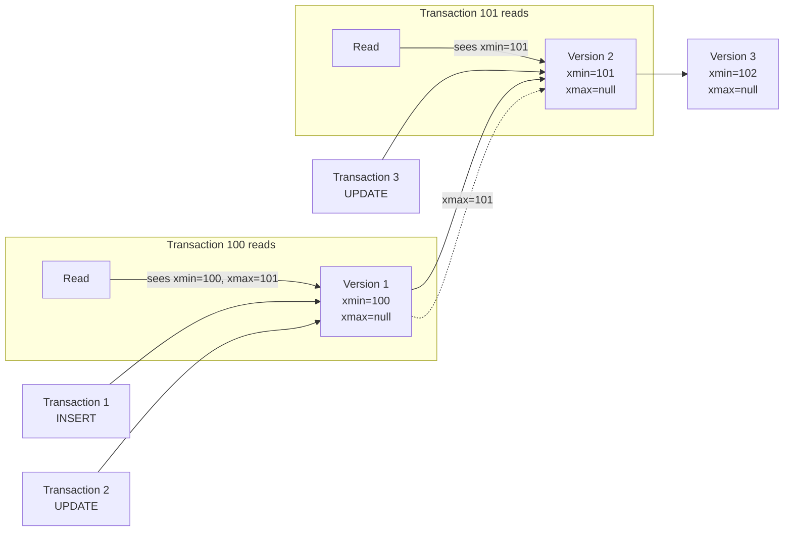
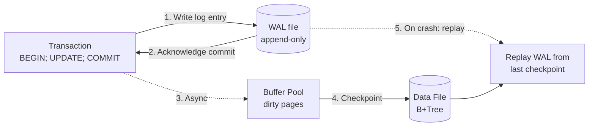

# Database Algorithms

## MVCC (Multi-Version Concurrency Control)

MVCC allows concurrent readers and writers without blocking by maintaining multiple versions of each row:



Each row has hidden metadata:
- **xmin**: Transaction ID that created this version.
- **xmax**: Transaction ID that deleted/updated this version (or null if live).
- A transaction sees a row version if `xmin ≤ tx_id` and `xmax > tx_id OR xmax = null`.

```pseudocode
function IsVisible(tuple, snapshot)
    // snapshot bounds: the reading transaction's xmin..xmax window
    if not IsCommitted(tuple.xmin)
        return false                                    // creator never committed
    if tuple.xmin > snapshot.xmax
        return false                                    // created after reader's snapshot

    if tuple.xmax = null
        return true                                     // no deleter

    if not IsCommitted(tuple.xmax)
        return true                                     // deleter not yet committed

    if tuple.xmax ≤ snapshot.xmax
        return false                                    // deleted before reader

    return true
```

**PostgreSQL**: Versions stored in heap (same page). Dead tuples are cleaned by `VACUUM`. Hot Standby uses a snapshot conflict mechanism.

**MySQL (InnoDB)**: Versions stored in the undo log. The current version is in the clustered index; older versions are reconstructed from undo records. Purge thread cleans obsolete undo entries.

**Cassandra**: Uses `tombstones` for deletes and a timestamp per cell. Compaction reconciles versions — the highest timestamp wins. No VACUUM needed; compaction handles cleanup.

## Write-Ahead Log (WAL)

The WAL is an append-only file where every change is recorded *before* it reaches the data files. This guarantees durability without flushing data pages on every transaction:



A `COMMIT` is not durable until the WAL flush completes. On crash recovery, the database:
1. Finds the last checkpoint (a consistent state).
2. Replays all committed transactions from the WAL since that checkpoint.
3. Rolls back uncommitted transactions using undo logs.

```pseudocode
function RecoverFromCrash()
    checkpoint ← ReadLastCheckpoint()
    committed ← ReadCommittedTransactions()             // from transaction log
    records ← WALEntriesSince(checkpoint.lsn)

    for record in records
        if record.tx ∈ committed
            Redo(record)                                // re-apply the change
        else
            Undo(record)                                // revert the change

    BuildNewCheckpoint()                                // new consistent state
```

- **MySQL (InnoDB)**: Redo log (`ib_logfile`). Circular, fixed-size. Handles redo (replay). Undo log handles rollback and MVCC.
- **PostgreSQL**: WAL in `pg_wal/`. Supports full recovery, point-in-time recovery (PITR), and replication streaming.
- **SQL Server**: Transaction log (`.ldf`). Log records contain the logical operation. Supports point-in-time restore and log shipping.

## Merkle Trees

Used by Cassandra, DynamoDB, and Git for **anti-entropy** (detecting out-of-sync data between replicas):

- Each partition's data is hashed into a Merkle tree (a binary hash tree).
- The root hash summarizes all data in that partition.
- Nodes exchange root hashes. If they match, the data is consistent.
- If they differ, they recursively compare child hashes to pinpoint the exact range that diverges.
- Only the divergent sub-range needs to be repaired (incremental repair).

## Bloom Filters

A probabilistic data structure used to answer "has this key been seen before?" with no false negatives and configurable false positive rate:

- A bit array of size `m` with `k` hash functions.
- On insert: set bits `h1(key)`, `h2(key)`, ..., `hk(key)` to 1.
- On lookup: if any of those bits is 0, the key is definitely not present.
- If all bits are 1, the key *might* be present (false positive possible).
- Cassandra stores a Bloom filter per SSTable in memory. Before reading an SSTable, check the Bloom filter — skip it if the key is definitely not present. This avoids unnecessary disk I/O.

```pseudocode
function BloomFilterNew(m, k)
    // m = bit array size (in bits), k = number of hash functions
    bits ← BitArray(m)
    seeds ← GenerateRandomSeeds(k)
    return (bits, seeds)

function BloomFilterAdd(filter, key)
    (bits, seeds) ← filter
    for each seed in seeds
        h ← Hash(key, seed) mod len(bits)
        bits[h] ← 1

function BloomFilterMaybeContains(filter, key) returns boolean
    (bits, seeds) ← filter
    for each seed in seeds
        h ← Hash(key, seed) mod len(bits)
        if bits[h] = 0
            return false                                // definitely not present
    return true                                         // might be present

function OptimalHashCount(bits_per_key)
    // k = (m/n) × ln(2)
    return round(bits_per_key × ln(2))
```
