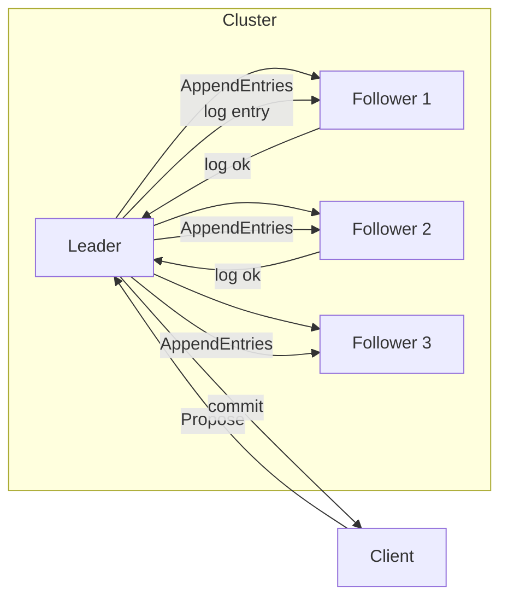
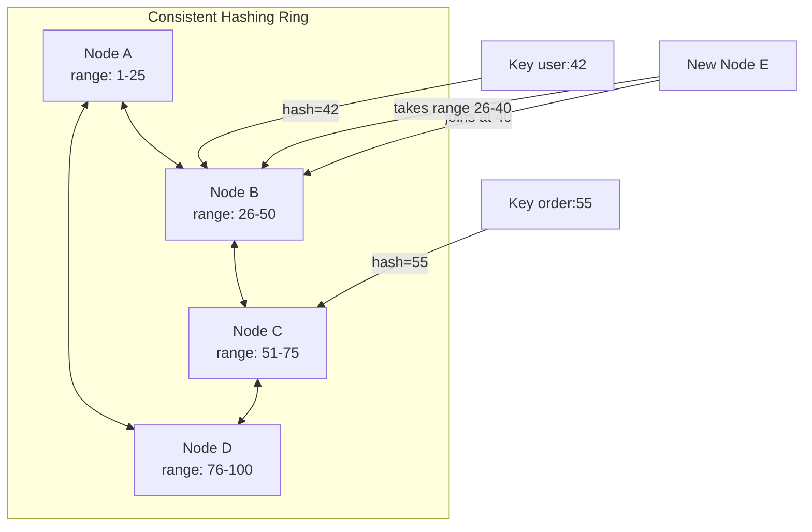

# Database Concurrency & Scaling

## Transaction & Concurrency

### ACID Properties

ACID stands for Atomicity (all-or-nothing execution), Consistency (data always follows rules/constraints), Isolation (concurrent transactions don't interfere with each other), Durability (saved data survives power loss).

In a high-throughput environment, Isolation is mostly relaxed because perfect isolation (Serializability) is incredibly expensive. To guarantee that every transaction appears to happen one after another, the database must employ aggressive locking or validation, which forces transactions to wait in line. This creates a massive bottleneck that kills performance. Therefore, engineers often choose weaker isolation levels (like *Read Committed* or *Repeatable Read*) to allow higher concurrency and speed, accepting the risk of specific data anomalies (like Phantom Reads) as the "price" for scale.

### Transaction Isolation Levels

**Read Uncommitted** is the lowest level, where a transaction can read data modified by another transaction but not yet committed. This allows "dirty reads" — if the other transaction rolls back, your transaction has processed invalid data. Use only for non-critical logging or analytics where absolute accuracy is less important than raw speed.

**Read Committed** is the most common default (PostgreSQL, Oracle, SQL Server). Guarantees a transaction can only read committed data. Prevents dirty reads but allows "non-repeatable reads" — querying the same row twice in one transaction may return different data if another transaction commits an update in between. Use for most standard web applications — balances concurrency and data integrity.

**Repeatable Read** ensures that reading a row twice within a transaction returns the same data, effectively locking that version for your session. Prevents non-repeatable reads but can still allow "phantom reads" — new rows added by others may appear in range queries. Use for reporting dashboards or financial calculations where numbers must remain consistent throughout the operation.

**Serializable** is the strictest level. Forces transactions to run as if they happened one after another, preventing all anomalies (dirty reads, non-repeatable reads, phantoms). Massive performance cost due to heavy locking or frequent transaction retries. Use only for critical operations — preventing double-booking in reservations or sensitive banking transfers.

| Isolation Level | Dirty Read | Non-Repeatable Read | Phantom Read |
|---|---|---|---|
| Read Uncommitted | Possible | Possible | Possible |
| Read Committed | Prevented | Possible | Possible |
| Repeatable Read | Prevented | Prevented | Possible |
| Serializable | Prevented | Prevented | Prevented |

### Race Condition

A Race Condition occurs when the final outcome of a process depends on the uncontrollable timing or ordering of concurrent events. Example: two users withdrawing $10 from a shared wallet of $100:

1. User A reads balance: $100.
2. User B reads balance: $100 (before A saves).
3. User A calculates $100 - $10 = $90 and saves.
4. User B calculates $100 - $10 = $90 and saves. Final balance is $90, but should be $80. The second update "raced" the first and overwrote it — a Lost Update anomaly.

### Optimistic vs Pessimistic Locking

Isolation levels handle locks implicitly, but sometimes explicit control is needed:

**Pessimistic Locking** (`SELECT ... FOR UPDATE`): Assumes a conflict *will* happen. Locks the row immediately on read. No one else can touch it until commit. Use for high-contention data (e.g., a central generic wallet).

**Optimistic Locking**: Assumes a conflict *probably won't* happen. Does not lock the row on read. Instead, reads a version number (e.g., `version: 1`). On update, checks if the version is still 1. If someone else changed it to 2, the update fails and the application retries. Use for lower contention to avoid blocking database connections.

```sql
-- Optimistic locking: read version first
SELECT balance, version FROM accounts WHERE id = 1;
-- balance = 100, version = 1

-- User A's update (succeeds)
UPDATE accounts
SET balance = 120, version = 2
WHERE id = 1 AND version = 1;
-- Affected rows = 1 → SUCCESS

-- User B's update (fails — version is now 2)
UPDATE accounts
SET balance = 120, version = 2
WHERE id = 1 AND version = 1;
-- Affected rows = 0 → FAIL → retry

-- User B reads latest and retries
SELECT balance, version FROM accounts WHERE id = 1;
-- balance = 120, version = 2
UPDATE accounts SET balance = 150, version = 3
WHERE id = 1 AND version = 2;
```

***

## Performance & Schema Design

### N+1 Query Problem

The N+1 Query Problem is a performance issue primarily in ORMs (GORM, Hibernate, Entity Framework). It occurs when code fetches a parent record (1 query) and then iterates through a loop to fetch related child records for *each* parent (N queries). Example: fetching 100 `Users` and executing a new SQL query inside a loop for each user's `Address` — 101 total database calls.

**Identify**: Look for a waterfall of identical `SELECT` statements in database logs or APM tools (Datadog, New Relic).

**Fix**: Eager Loading / Batch Fetching:
- In SQL: Use a `JOIN`.
- In application code: Fetch user IDs first, then run `SELECT * FROM addresses WHERE user_id IN (1, 2, 3...)`.
- Most ORMs support `.Preload()` or `.With()`.

### Normalization (3NF) vs Denormalization

**Normalization** (3NF) is the standard design for write-heavy OLTP systems (banking, e-commerce, inventory). Reduces data redundancy and ensures integrity. Every piece of data lives in exactly one place — updating a customer's address requires one update, not updates across every order.

**Denormalization** is an optimization for read-heavy OLAP systems. Duplicates data across tables to avoid expensive `JOIN`s. Example: storing `username` directly in the `Posts` table rather than just `user_id`. Faster reads, slower/complex writes (must update multiple places).

| | Normalization | Denormalization |
|---|---|---|
| Writes | Fast — single table | Slow — multiple tables |
| Reads | Slower — joins required | Fast — single table |
| Data integrity | Strong | Redundancy risk |
| Use case | OLTP (transactions) | OLAP (analytics) |

### Connection Pooling

A cache of open, reusable database connections instead of opening/closing a connection per request. Without pooling, each API call requires: TCP handshake → TLS handshake → DB authentication → query → close. At 10,000 requests/sec, this overwhelms both the application and the database.

Connection pooling keeps a set of connections alive. A request "borrows" an existing connection, executes the query, and returns it to the pool immediately. Key parameters: `max_pool_size`, `min_idle`, `connection_timeout`, `idle_timeout`.

***

## Replication & Scaling

### Synchronous vs Asynchronous Replication

**Synchronous Replication**: Primary sends data to the replica and *waits* for acknowledgment before telling the client "Success." Zero data loss (RPO=0). Increases write latency (network round-trip). Reduces availability — if the replica is down, the primary cannot accept writes.

**Asynchronous Replication**: Primary writes locally, immediately acknowledges "Success" to the client, then forwards data to the replica in the background. Faster, no blocking on replica failures. Risk of data loss if the primary crashes before forwarding the latest data.

| | Sync | Async |
|---|---|---|
| RPO | 0 | Window of data loss (replication lag) |
| Write latency | Higher (wait for replica) | Lower (local only) |
| Availability | Lower (replica failure blocks writes) | Higher (replica failure ignored) |
| Use case | Financial ledgers, critical data | Social media, analytics |

### Vertical vs Horizontal Scaling

**Vertical Scaling** (Scale Up): Make a single server stronger — more CPU, RAM, faster storage (e.g., `t3.medium` → `m5.2xlarge`). Simple but has an upper hardware limit, and a single server is a single point of failure.

**Horizontal Scaling** (Scale Out): Add more servers to handle load, splitting data across them (Sharding). Offers infinite scale and high availability (node failures are survivable). Trade-off is massive complexity — you lose ACID guarantees across nodes and must manage data distribution, rebalancing, and cross-node queries.

### Strong vs Eventual Consistency

**Strong Consistency**: Once a write is confirmed, any subsequent read from any node returns the new value. Requires coordination (Paxos/Raft or synchronous replication). Increases latency, reduces scalability. Use for financial ledgers, inventory, password changes.

**Eventual Consistency**: If no new updates are made, all reads will *eventually* return the last updated value. For a short window (milliseconds to seconds), a user may read stale data. Allows high availability and speed — no blocking for sync. Use for social media feeds, DNS, analytics.

***

## Distributed Transactions

### Two-Phase Commit (2PC)

When data is sharded or spans multiple services, a single database's ACID properties no longer apply. The traditional solution is Two-Phase Commit:

1. **Prepare Phase**: A coordinator tells all participants to "Prepare" (lock resources, verify they can commit).
2. **Commit Phase**: If all say "Yes," the coordinator sends "Commit." If any says "No," the coordinator sends "Abort."

Problem: 2PC is a blocking protocol. If the coordinator crashes or the network fails after the Prepare phase, participants hold locks indefinitely — freezing the system.

### Saga Pattern

The modern standard for high-volume distributed systems, especially fintech:

Instead of a single ACID transaction, a business process is broken into a sequence of local transactions. Each step updates its own database and publishes an event to trigger the next step. On failure, **compensating transactions** undo the completed steps (e.g., "Refund Money" if "Disburse Loan" fails after "Deduct Money" succeeds).

Sagas embrace eventual consistency rather than strong consistency, allowing high availability and performance even when parts of the network are slow.

Two choreography styles:
- **Choreography**: Each service publishes events that trigger the next service. Simple but hard to trace.
- **Orchestration**: A central coordinator (orchestrator) tells each service what to do. Better observability and control.

### Sharding

Partitioning data across multiple database instances by a shard key:

- **Hash-based**: `shard = hash(shard_key) % N`. Even distribution but range queries across shards are expensive.
- **Range-based**: Each shard owns a key range (e.g., `users 1-1000` on shard 1, `1001-2000` on shard 2). Good for range scans but may cause hot spots.
- **Directory-based**: A lookup service maps key to shard. Flexible but adds a hop.

Sharding challenges: cross-shard transactions (require 2PC/Saga), resharding (rebalancing data when adding nodes), and the need for a distributed query engine for global queries.

***

## Distributed Consensus

### Consensus Protocols (Paxos, Raft, VSR)

Distributed consensus ensures multiple nodes agree on a single value, even when some fail. This is the foundation for fault-tolerant replicated state machines in distributed databases.

**Raft** (CockroachDB, TiDB, etcd): Designed for understandability.



- One leader per term, elected by majority vote.
- Leader replicates log entries to followers.
- An entry is committed when the leader receives acknowledgments from a majority.
- Term = epoch. Timeout-based leader election (150-300ms random).
- Safety: At most one leader per term. A candidate only wins if it has the most up-to-date log.

**Paxos** (Spanner, Cassandra): More complex but proven in production. Multi-Paxos optimizes the basic protocol by pre-electing a leader (similar to Raft's stable leader). Spanner uses Paxos for replica group consensus.

**VSR** (TigerBeetle): Virtual Synchrony Replication. Combines view change protocol with synchronous replication. Has only 3 types of messages, making it simpler to reason about and test deterministically.

### Gossip Protocol

Nodes periodically exchange membership and state information with a small set of peers. Used by Cassandra, Consul, and Redis Cluster:

- Each node tracks heartbeats for all other nodes.
- A node gossips with 1-3 random peers every second.
- After a configurable timeout, a node is marked as suspicious (and later dead) if no heartbeat received.
- Propagation is exponential — a membership change spreads to all nodes in O(log n) rounds.

### Consistent Hashing



Distributes keys across nodes so that adding or removing a node only affects a fraction of the keys (1/n). Used by Cassandra, DynamoDB, and consistent cache rings.

**Virtual nodes (vnodes)**: Each physical node is represented by 100+ virtual nodes on the ring. This improves load distribution and speeds up recovery — a failed node's load is spread across all other nodes, not just its successor.
