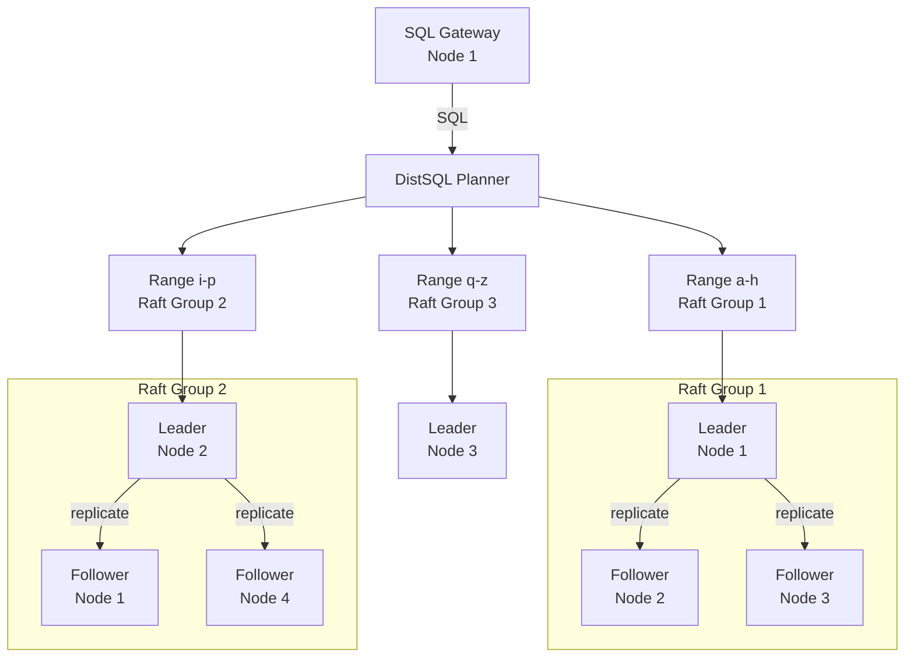
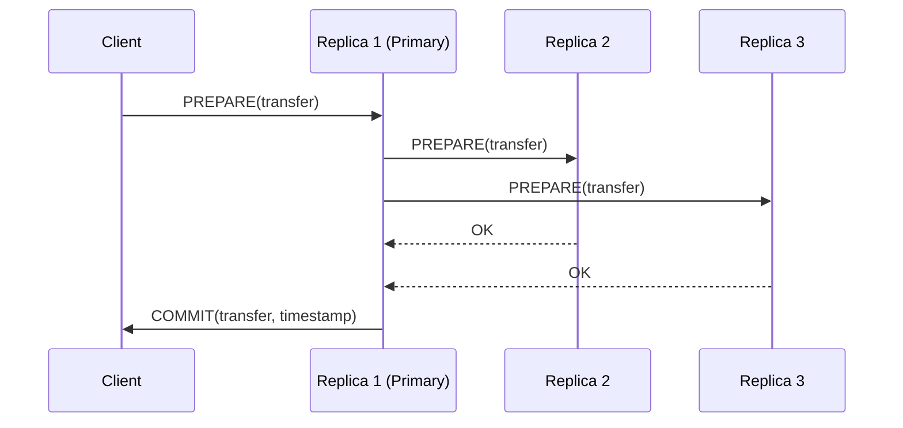

# Distributed Database Deep Dives

> **Note**: Per-database deep dives have moved to dedicated files:
> - [PostgreSQL Internals](./deep-dives/postgresql.md)
> - [MongoDB Internals](./deep-dives/mongodb.md)
> - [Redis Internals](./deep-dives/redis.md)
> - [Cassandra Internals](./deep-dives/cassandra.md)
> - [Google Spanner Internals](./deep-dives/spanner.md)

## CockroachDB

CockroachDB is a distributed SQL database that combines a transactional key-value store with a SQL layer. It uses **range-based sharding** with **Raft consensus** per range for fault tolerance.

Key concepts:

- **Range**: A contiguous range of the key space (default 512MB). Ranges split automatically as they grow.
- **Raft per range**: Each range is a Raft group — majority writes survive node failures.
- **DistSQL**: Distributes SQL execution across nodes. Joins are pushed down to data owners (parallel scans).
- **Serializable Snapshot Isolation**: CockroachDB's default isolation. Uses HLC (Hybrid Logical Clock) to order transactions without a global clock.
- **Clock Uncertainty**: Nodes maintain HLC = max(physical clock, last observed HLC). A transaction's commit timestamp is propagated to all participants. If clocks are skewed beyond a threshold (500ms default), transactions may be retried.
- **Pebble**: CockroachDB's storage engine (Go rewrite of RocksDB) — an LSM-tree for the KV layer beneath the SQL layer.

**Write Path**: SQL → DistSQL → range leader → Pebble SSTable → Raft replicate to followers → commit.

**Read Path**: SQL → range leader (or follower with `follower_read_timestamp()`) → Pebble → return.

## TigerBeetle

TigerBeetle is a purpose-built financial accounting database. It is not a general-purpose database — it models double-entry accounting primitives (Accounts, Transfers) with a strict set of invariants.

Key concepts:

- **Single-writer design**: Only one replica is the primary at any time. There is no concurrent write coordination — all writes go through the primary. This eliminates distributed concurrency complexity entirely. The primary replicates to backups synchronously.
- **VSR Protocol** (Virtual Synchrony Replication):
  - Only 3 message types: `Prepare`, `PrepareOk`, `StartViewChange`.
  - View = epoch with one primary. Messages are ordered by op number.
  - All replicas apply state machine commands in the same deterministic order.
  - No transactions, no locking, no distributed commit — just replicated state machine execution.
- **LSM-inspired storage**: TigerBeetle's storage is inspired by LSM-trees but heavily specialized for financial operations. The database stores only Accounts and Transfers. No dynamic schema, no secondary indexes, no joins.
- **Double-entry accounting**: Every transfer debits one account and credits another. The sum of all account balances must equal zero. TigerBeetle enforces this at the protocol level — impossible to create a transfer that doesn't balance.
- **Deterministic simulation testing**: TigerBeetle is tested with the "Simulator" — a deterministic simulation that models network partitions, node crashes, disk failures, and clock skew. This caught dozens of obscure bugs before production deployment.
- **No concurrent reads/writes**: There is no MVCC, no snapshot isolation, no speculative reads. Every operation is serialized through the primary's state machine. This simplicity enables TigerBeetle to achieve microsecond-scale latencies while providing strong durability guarantees.

**Use Case**: Ledger systems, payment processing, asset transfers — any financial system that needs to track debits and credits with absolute correctness.

***

## References

- [PostgreSQL Documentation — Transaction Isolation](https://www.postgresql.org/docs/current/transaction-iso.html)
- [MySQL Documentation — InnoDB Locking and Transaction Model](https://dev.mysql.com/doc/refman/8.0/en/innodb-locking-transaction-model.html)
- [PostgreSQL Documentation — Index Types](https://www.postgresql.org/docs/current/indexes-types.html)
- [Cassandra Documentation — Storage Engine](https://cassandra.apache.org/doc/latest/cassandra/architecture/storage_engine.html)
- [Martin Kleppmann — Designing Data-Intensive Applications](https://dataintensive.net/)
- [PostgreSQL Documentation — WAL](https://www.postgresql.org/docs/current/wal-intro.html)
- [AWS Database Blog — Optimistic vs Pessimistic Locking](https://aws.amazon.com/blogs/database/managing-concurrency-with-optimistic-locking-in-amazon-rds/)
- [Microsoft — Saga Pattern](https://learn.microsoft.com/en-us/azure/architecture/patterns/saga)
- [CockroachDB — Serializable Isolation](https://www.cockroachlabs.com/blog/serializable-sql-isolation/)
- [CockroachDB Architecture Documentation](https://www.cockroachlabs.com/docs/stable/architecture/overview)
- [Google Spanner — TrueTime and External Consistency](https://research.google/pubs/pub39966/)
- [Cassandra — Architecture in Depth](https://cassandra.apache.org/doc/latest/cassandra/architecture/)
- [TigerBeetle — Design and Architecture](https://tigerbeetle.com/docs/architecture)
- [Raft Consensus Protocol](https://raft.github.io/)
- [Use The Index, Luke! — Composite Indexes](https://use-the-index-luke.com/sql/where-clause/the-equals-operator/concatenated-keys)
- [Vlad Mihalcea — N+1 Query Problem](https://vladmihalcea.com/n-plus-1-query-problem/)
- [Wikipedia — Write-Ahead Logging](https://en.wikipedia.org/wiki/Write-ahead_logging)
- [Wikipedia — CAP Theorem](https://en.wikipedia.org/wiki/CAP_theorem)
