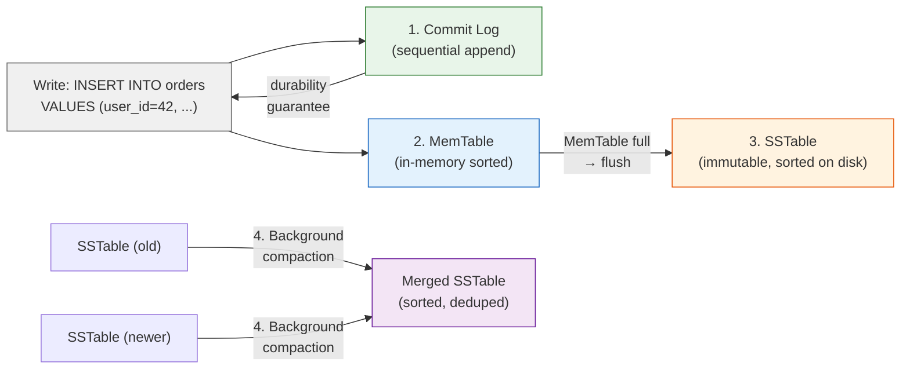
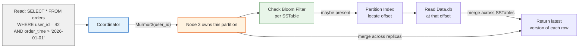

# Cassandra — Architecture

> For the underlying mechanics of LSM-Trees, Merkle Trees, and Bloom Filters,
> see [Storage Engines](../storage-engines.md) and [Database Algorithms](../algorithms.md).

## What Makes It Unique

- **Always-on, no single point of failure** — every node is identical; no master, no failover, no downtime for node loss
- **Linear write scalability** — throughput scales linearly as you add nodes; designed for write-heavy workloads
- **Multi-DC topology built in** — aware of data center boundaries; replication and consistency policies can differ per DC
- **Trades consistency for availability** — AP in the CAP theorem; eventual consistency is the default; strong consistency is opt-in and expensive

## Storage Model

Cassandra uses an **LSM-Tree** storage engine. Writes flow through:

1. **Commit Log** (sequential append for durability)
2. **MemTable** (in-memory sorted structure)
3. **SSTable** (immutable sorted file on disk)

SSTables use a **multi-component format** (Cassandra 5.0 BTI format): `Data.db` (sorted rows),
`Partitions.db` (partition index), `Rows.db` (row index), `Filter.db` (bloom filter),
`Summary.db` (index sampling), and metadata/checksum files.

Data is distributed via **consistent hashing** — `Murmur3(partition_key)` maps each row to a node.
The **partition key** part of the PRIMARY KEY determines placement. All rows in a partition are stored
together on one node. **Clustering columns** determine sort order within a partition.

Compaction merges SSTables using one of three strategies:
**Size-Tiered** (merge N files of similar size), **Leveled** (L0 → L1 → L2, non-overlapping exponential levels),
or **Time-Window** (compact within time windows, drop expired windows).

(For LSM-Tree mechanics, see [LSM-Tree](../storage-engines.md#lsm-tree))

## Indexing Model

Cassandra's primary "index" is the partition key hash — it tells the coordinator which node owns the data.
**Clustering columns** act as an ordered index within a partition, enabling efficient range scans
(`WHERE partition_key = ? AND clustering_col > ?`).

Secondary indexes are limited and use SSTable-attached storage:
- **SAI (Storage-Attached Indexing)** — index files alongside SSTables. Supports prefix and numeric
  range queries. Better performance than legacy SASI.
- **Materialized Views** — automatic denormalization. Writes to the base table propagate to view tables
  on different partition keys, enabling different query patterns.

**Best practice**: design tables for your query patterns (one table per query) rather than relying on
secondary indexes.

**Key partition size consideration**: large partitions degrade compaction and repair performance.
Monitor partition sizes and use time-bucketing or composite keys to keep partitions manageable.

(For Bloom Filter and Merkle Tree mechanics, see [Bloom Filters](../algorithms.md#bloom-filters) and [Merkle Trees](../algorithms.md#merkle-trees))
