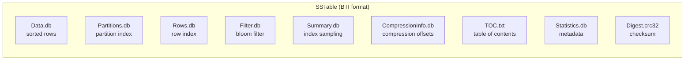
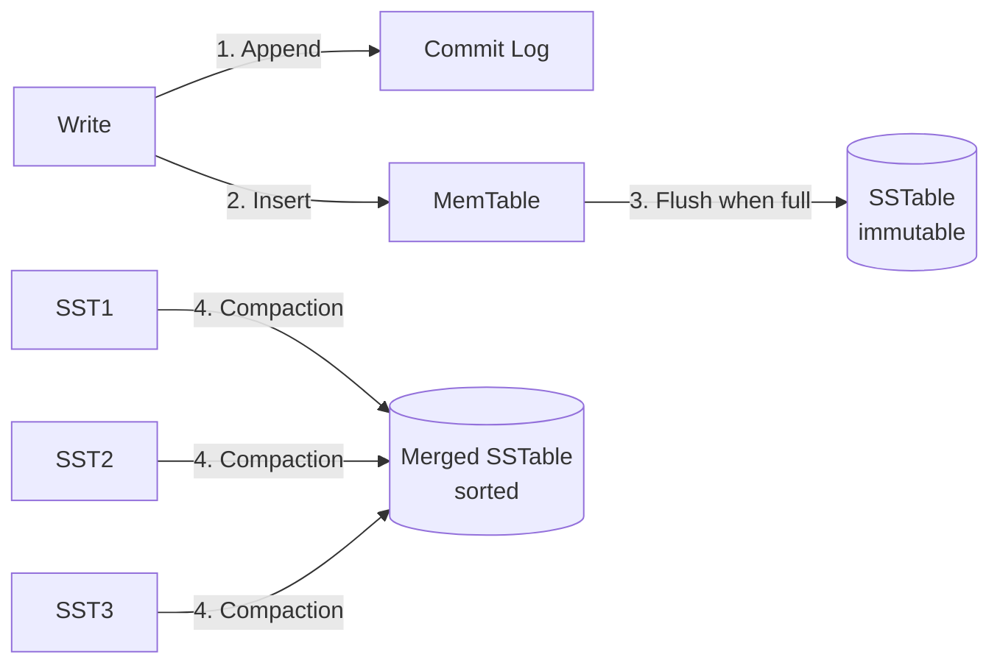
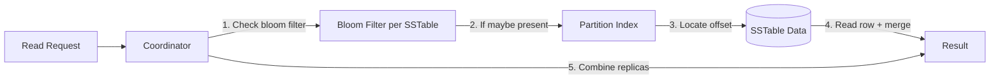
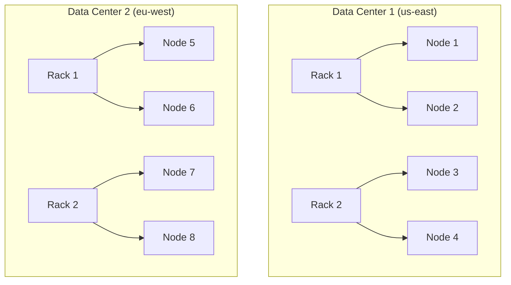

# Cassandra Internals

## Data Model

Cassandra is a **wide-column, partitioned row store**. The data model is defined by:

- **Keyspace**: Top-level namespace (analogous to a database). Defines replication strategy and factor.
- **Table**: Logical grouping of rows with a defined schema (partition key + clustering columns + regular columns).
- **Partition key**: The first part of the PRIMARY KEY — hashed to determine which node owns the row.
- **Clustering columns**: Columns that determine sort order *within* a partition.
- **Regular columns**: Data columns, indexed by the clustering columns.

```sql
CREATE TABLE orders (
    user_id    UUID,        -- partition key
    order_time TIMESTAMP,   -- clustering column
    product_id UUID,        -- clustering column
    amount     DECIMAL,     -- regular column
    status     TEXT,        -- regular column
    PRIMARY KEY ((user_id), order_time, product_id)
);
```

In this example:
- All orders for a user are stored together on one node (same partition key)
- Within the partition, orders are sorted by `(order_time, product_id)`
- Range queries within the partition are efficient: `WHERE user_id = ? AND order_time > ?`

## Storage Engine

### SSTable Structure

Cassandra stores data in **SSTables** (Sorted String Tables) — immutable, sorted files on disk. Cassandra 5.0 uses the **BTI format** by default:



| Component | Description | Size |
|---|---|---|
| `Data.db` | Sorted rows with clustering order | Primary data |
| `Partitions.db` | Partition key → offset (BTI format) | ~0.1-1% of data |
| `Rows.db` | Row index within partitions (BTI format) | ~0.1-1% of data |
| `Filter.db` | Bloom filter for "does key exist?" | ~1-2% of data |
| `Summary.db` | Sampled index (every N entries) | ~0.01% of data |
| `CompressionInfo.db` | Chunk offsets for decompression | ~0.01% of data |
| `Statistics.db` | SSTable metadata and statistics | Small |
| `Digest.crc32` | Checksum for integrity verification | Small |

**Write path**:
1. Write to **Commit Log** (sequential append, durable)
2. Write to **MemTable** (in-memory sorted structure)
3. When MemTable is full → flush as SSTable (sequential write)
4. **Compaction** merges SSTables in the background



### Compaction Strategies

| Strategy | Use Case | Behavior |
|---|---|---|
| **STCS** (Size-Tiered) | Default, general purpose | Merge SSTables of similar size into larger ones |
| **LCS** (Leveled) | Read-heavy, point lookups | Organize SSTables into levels (L0→L1→L2), each 10x larger |
| **TWCS** (Time-Window) | Time-series, metrics | SSTables in the same time window are compacted together |

**STCS**: When N (default 4) SSTables of similar size exist, merge them into one. Simple but can cause read amplification (check many SSTables) and write amplification spikes during large merges.

**LCS**: L0 has overlapping SSTables from flushes. Deeper levels (L1, L2...) are non-overlapping with exponentially increasing sizes (10x per level). Minimizes read amplification but increases write amplification.

**TWCS**: Time-series optimized. Data is written to the active time window. At the end of the window, SSTables within that window are compacted. Old windows are dropped (TTL/deletion). Best for metrics, IoT.

### Bloom Filter

A **probabilistic** data structure stored in RAM per SSTable. Answers "does this partition exist in this SSTable?":
- **False positives possible**: May say "yes" when the key doesn't exist (unnecessary I/O)
- **False negatives impossible**: If it says "no", the key is definitely not in that SSTable

**Configuration**: `bloom_filter_fp_chance` (default 0.01 for STCS/TWCS, 0.1 for LCS). Lower = more memory, less I/O. Higher = less memory, more I/O.

## Read Path



1. **Bloom filter check**: Skip SSTables that definitely don't contain the partition.
2. **Partition index**: Find the byte offset of the partition in the SSTable.
3. **Data read**: Read from the offset. Cassandra reads the entire partition (all rows within it).
4. **Merge across SSTables**: The same partition may exist in multiple SSTables. The newest version wins (by timestamp).
5. **Merge across replicas**: The coordinator compares responses from all contacted replicas, returning the latest data.

## Consistency Model

Cassandra provides **tunable consistency** — the application chooses the consistency level for each query:

| Level | Description | Use Case |
|---|---|---|
| `ONE` | One replica responds (fastest, weakest) | High-velocity writes, non-critical reads |
| `TWO` | Two replicas | Slightly stronger |
| `THREE` | Three replicas | Stronger still |
| `QUORUM` | `(replication_factor / 2) + 1` replicas | Balance of consistency and speed |
| `LOCAL_QUORUM` | Quorum within the local data center | Multi-DC: avoid cross-DC latency |
| `EACH_QUORUM` | Quorum in each DC | Strong multi-DC consistency |
| `ALL` | All replicas (slowest, strongest) | Critical reads/writes |
| `SERIAL` | Quorum + Paxos for linearizability | Lightweight transactions |
| `LOCAL_SERIAL` | LOCAL_QUORUM + Paxos | Same as SERIAL, local DC |

**Write consistency**: `ONE` = coordinator waits for one replica acknowledgment (writes are sent to all replicas regardless of CL). `QUORUM` = waits for quorum acknowledgments.
**Read consistency**: `ONE` = read from one replica (may get stale data), `QUORUM` = read from quorum (most recent).
**CL = QUORUM for both reads and writes**: Ensures read-your-writes consistency (strong consistency).

## Repair Mechanisms

### Hinted Handoff

If a replica is down when a write arrives, the coordinator stores a **hint** (the write + destination). When the replica comes back, hints are replayed. Hints expire after `max_hint_window_in_ms` (default 3 hours).

### Read Repair

On a read with CL > ONE, the coordinator compares responses from replicas. If they differ, the stale replica is updated before the response is returned to the client (blocking read repair). Since Cassandra 4.0, background read repair (`read_repair_chance`) was removed.

### Anti-Entropy (Merkle Trees)

Periodic repair (nodetool repair) compares data across replicas using Merkle trees:

```mermaid
graph TD
    subgraph "Node A Merkle Tree"
        R1[Root: hash(A1+A2+A3+A4)]
        A1[Hash: partition 1]
        A2[Hash: partition 2]
        A3[Hash: partition 3]
        A4[Hash: partition 4]
        R1 --> A1 & A2 & A3 & A4
    end
    subgraph "Node B Merkle Tree"
        R2[Root: hash(B1+B2+B3+B4)]
        B1[Hash: partition 1]
        B2[Hash: partition 2]
        B3[Hash: partition 3]
        B4[Hash: partition 4]
        R2 --> B1 & B2 & B3 & B4
    end
    R1 -.->|different| R2
    A2 -.->|different| B2
    B2 -.->|repair partition 2 only| A2
```

If root hashes differ, recursively compare children to find the exact partitions that diverged. Only those partitions need repair (sub-range/full repair). Incremental repair tracks repaired/unrepaired SSTable markers and repairs only data written since the last incremental repair.

## Gossip Protocol

Nodes exchange cluster state information every 1 second with 1-3 random peers:

- Each node tracks heartbeats for all other nodes
- **Phi Accrual Failure Detector**: A suspicion level based on heartbeat arrival times. If the phi value exceeds a threshold (default 8), the node is marked as down.
- Propagation: O(log n) rounds for a state change to reach all nodes

## Lightweight Transactions (LWT)

Cassandra supports linearizable transactions using **Paxos** (Paxos commit, not Raft):

1. **Prepare**: Proposer sends a Prepare message with a ballot number
2. **Promise**: Acceptors promise not to accept older ballots
3. **Accept**: Proposer sends the value with the agreed ballot
4. **Commit**: Acceptors commit the value

Used for `INSERT ... IF NOT EXISTS` or `UPDATE ... IF condition`. LWT is 4-5x slower than regular writes — use sparingly.

## Secondary Indexes

| Type | Description | Use Case |
|---|---|---|
| SASI | SSTable-attached index | Low-cardinality columns |
| SAI (Storage Attached Indexing) | Newer, better performance | High-cardinality columns |
| Materialized View | Automatic denormalization | When you know the query patterns |

**SAI**: Index data stored in separate files alongside SSTables. Supports prefix queries and numeric range queries. Better performance than SASI. Note: SAI is a filtering engine, not a full-text search replacement.

**Best practice**: Secondary indexes in Cassandra are limited. Design tables around the query patterns (one table per query pattern) rather than relying on secondary indexes. Use materialized views or denormalization when possible.

## Cluster Topology



- **Snitch**: Determines which racks/data centers each node belongs to. `GossipingPropertyFileSnitch`, `Ec2Snitch`, `GoogleCloudSnitch`
- **Replication strategy**: `NetworkTopologyStrategy` defines how many replicas per DC
- **Consistent hashing**: Data is distributed using the Murmur3 hash of the partition key. Equivalent to random partitioning.

**Key performance factors**:
- **Partition size**: Large partitions degrade performance. Monitor and keep partitions reasonably sized for your workload.
- **Compaction**: STCS causes write amplification spikes during compaction. LCS causes more constant write amplification.
- **GC pressure**: Cassandra is JVM-based. Tune heap and GC settings carefully; official docs recommend 16GB heaps with specific GC tuning.
- **Bloom filter memory**: Allocate enough memory for bloom filters. Monitor memory usage and adjust `bloom_filter_fp_chance` accordingly.

---

*Last verified against official Apache Cassandra documentation: 2026-06-13*
