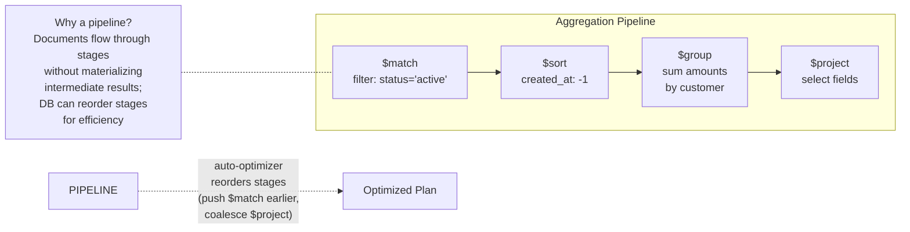

# MongoDB — Architecture

> For the underlying mechanics of B-Trees, WAL, and related algorithms,
> see [Storage Engines](../storage-engines.md) and [Database Algorithms](../algorithms.md).

## What Makes It Unique

- **Developer-first document model** — store data as JSON-like documents; no migrations, no joins, no schema enforcement
- **Flexible schema** — documents in the same collection can have different fields; schema evolves with the code
- **Rich query language on JSON** — not just key-value lookup: nested field queries, array operations, aggregation pipelines
- **Reactive change streams** — applications can subscribe to real-time notifications of data changes with resumable tokens

## Storage Model

MongoDB uses the **WiredTiger** storage engine (default since 3.2). WiredTiger uses **B-Trees** for
both data and indexes, with page-level compression (Snappy default, Zlib, Zstd).

Documents are stored as **BSON** (Binary JSON). Each document has an `_id` field — a 12-byte ObjectId
by default. Document size limit is 16MB; GridFS splits larger files into 255KB chunk documents.

Write path: **Journal (WAL)** → **WiredTiger Cache** → **Checkpoint** (every 60s, dirty pages flushed to disk).
The journal is 100MB per file, pruned after checkpoints.

(For B-Tree mechanics, see [B-Tree](../storage-engines.md#b-tree))

## Indexing Model

MongoDB indexes are **B-Trees** built over document fields. Index types include: single field, compound
(leftmost prefix rule), multikey (array fields — one index entry per element), text (inverted index),
geospatial (2dsphere), hashed (sharding), TTL (auto-delete), and wildcard (dynamic field coverage).



Compound indexes follow the **ESR rule** (Equality first, Sort next, Range last) for maximum selectivity.
A covered query reads from the index without fetching documents when the index stores all projected fields.

**Sharding architecture**: `mongos` routers receive queries, consult config servers (a replica set storing
cluster metadata), and fan out to shards. Data is split into **chunks** (128MB default contiguous shard-key
ranges). The **balancer** migrates chunks between shards. Choice of shard key is critical:
hashed (even distribution, no range queries) vs ranged (range queries supported, hot-spot risk) vs zones
(geo-pinning).

```mermaid
flowchart LR
    C[Client] -->|"query"| M[mongos Router]
    M -->|"where does this<br/>shard key live?"| CS[Config Servers<br/>(replica set)]
    CS -->|"chunk → shard map"| M
    M -->|"route to shard 2"| S1[Shard 1<br/>chunks a-h]
    M --> S2[Shard 2<br/>chunks i-p]
    M --> S3[Shard 3<br/>chunks q-z]
    S1 & S2 & S3 -->|"each shard is<br/>a replica set"| R["Merged Result"]
    BAL[Balancer] -.->|"migrates chunks<br/>evenly"| S1
    BAL -.-> S2
    BAL -.-> S3
```
