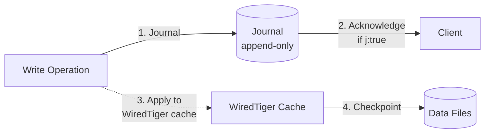
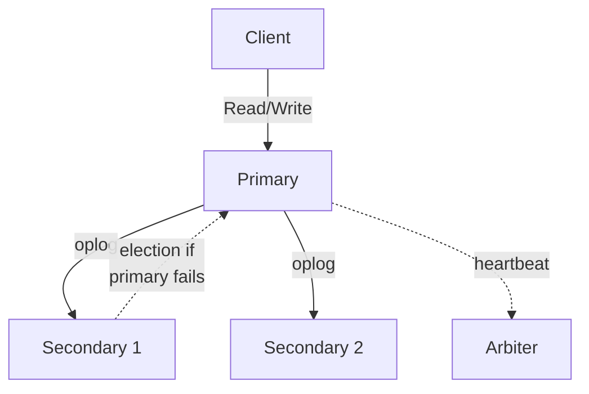

# MongoDB Internals

## Storage Engine: WiredTiger

MongoDB uses **WiredTiger** as the default storage engine (since MongoDB 3.2). It supports two access patterns:

| Mode | Default | Use Case |
|---|---|---|
| B-Tree | Yes | General purpose, read-heavy, mixed workloads |
| LSM | No (configurable per collection) | Write-heavy, time-series, high-ingestion |

### B-Tree Mode

Data and indexes are stored in B-Trees with 4KB-32KB pages (configurable). Key characteristics:

- **Page-level compression**: Snappy (default), Zlib, or Zstd. Pages decompressed into cache, compressed on disk.
- **Cache**: WiredTiger maintains an internal cache (default: 50% of (RAM - 1GB) or 256MB). All reads and writes go through this cache.
- **Checkpoints**: Every 60 seconds, WiredTiger takes a consistent snapshot of the database — flushes all dirty pages to disk. On crash, replays the journal (WAL) since the last checkpoint.
- **Eviction**: When the cache is full, WiredTiger evicts clean pages and writes dirty pages to disk using an LRU-approximation algorithm.

### LSM Mode

Optimized for write-heavy workloads. New data goes to:
1. MemTable (in-memory, sorted)
2. Flushed to Level 0 SSTable (immutable, overlapping ranges)
3. Compaction merges into deeper levels (non-overlapping)

Uses bloom filters per SSTable for fast point lookups.

### Journal (WAL)

MongoDB's journal is a write-ahead log. Write operations go to the journal first before the data files are updated:



- Default: `j:true` — journal is flushed before acknowledging the write (durable).
- `j:false`: Faster but risk data loss on crash (the last 60 seconds of writes may be lost).
- Journal files are 100MB per file, automatically pruned after checkpoints.

## Document Model

MongoDB stores data as **BSON documents** (Binary JSON). Each document has an `_id` field (primary key, 12-byte ObjectId by default).

**BSON types**: String, Integer, Double, Boolean, Date, ObjectId, Array, Embedded Document, Binary, RegExp, Decimal128, etc.

**Document size limit**: 16MB per document. For larger data, use GridFS (splits files into 255KB chunks stored as separate documents).

**Dynamic schema**: Documents in the same collection can have different fields. Schema validation can be enforced via JSON Schema (`validator` option).

## CRUD Operations

| Operation | Description | Complexity |
|---|---|---|
| `insertOne` / `insertMany` | Insert documents | O(1) per doc |
| `find` | Query with filter, projection | O(log n) with index |
| `updateOne` / `updateMany` | Atomic update with operators | O(log n) |
| `deleteOne` / `deleteMany` | Remove documents | O(log n) |
| `bulkWrite` | Batch of ordered/unordered ops | O(n) |

**Update operators**: `$set`, `$unset`, `$inc`, `$push`, `$pull`, `$addToSet`, `$rename`, `$min`, `$max`

**Atomicity**: Only single-document operations are atomic. Multi-document transactions were added in MongoDB 4.0 (replica sets) and 4.2 (sharded clusters).

## Aggregation Pipeline

The aggregation pipeline processes documents through a sequence of stages. Each stage transforms the document stream:

| Stage | Function | Memory |
|---|---|---|
| `$match` | Filter documents | Pipeline |
| `$project` | Reshape documents | Pipeline |
| `$group` | Group by key, accumulate | Up to 100MB per group |
| `$sort` | Order documents | Up to 100MB |
| `$lookup` | Left outer join with another collection | Up to 100MB |
| `$unwind` | Deconstruct array into multiple docs | Pipeline |
| `$bucket` | Categorize into buckets | Pipeline |
| `$facet` | Multiple pipelines on same input | Up to 100MB each |

**Pipeline optimization**: The optimizer automatically:
- Reorders stages (`$match` + `$sort` → use sorted index)
- Coalesces projections
- Inserts `$limit` early when possible

## Index System

### Index Types

| Index Type | Description |
|---|---|
| `_id` (default) | Unique B-Tree on primary key |
| Single field | B-Tree on any field |
| Compound | B-Tree on multiple fields (leftmost prefix rule) |
| Multikey | B-Tree on array fields — one entry per element |
| Text | Inverted index for full-text search |
| Geospatial (2dsphere) | Grid-based index for GeoJSON |
| Hashed | Hash index for equality-only (sharding) |
| TTL | Automatically deletes documents after TTL |
| Wildcard | Indexes all/some fields dynamically |

### Compound Index Design

Same leftmost prefix rule as SQL B-Trees. Additional MongoDB-specific rules:

- **ESR rule**: Place equality fields first, sort field next, range field last
- **Covered query**: If all required fields are in the index, MongoDB reads from the index without fetching documents

### Indexing Overhead

| Index Type | Write Overhead | Storage Overhead |
|---|---|---|
| Single field | ~5-10% | ~20-30% of data size |
| Compound | ~10-20% | ~30-50% of data size |
| Multikey | ~20-50% | Highly variable |
| Text | ~50-100% | ~50-100% of data size |

## Replica Sets

A replica set is a group of `mongod` instances that maintain the same data set.



**Oplog** (operations log): A capped collection (`local.oplog.rs`) that records all write operations. Secondaries replay the oplog asynchronously.

**Election**: When the primary becomes unreachable, secondaries hold an election. The node with the highest priority and most up-to-date oplog wins. Elections use a Raft-like protocol.

**Rollback**: If a secondary becomes primary before receiving all oplog entries from the old primary, the old primary must roll back uncommitted writes on reconnection (up to 300MB by default).

**Read preferences**:
- `primary`: Read from primary (strong consistency)
- `secondary`: Read from secondary (eventual, stale reads)
- `nearest`: Read from lowest-latency node
- `primaryPreferred`: Primary if available, else secondary
- `secondaryPreferred`: Secondary if available, else primary

## Sharding

```mermaid
graph TD
    Client -->|query| M[mongos<br/>router]
    M -->|metadata| CS[Config Servers<br/>(replica set)]
    M -->|routed query| S1[Shard 1<br/>chunks a-h]
    M -->|routed query| S2[Shard 2<br/>chunks i-p]
    M -->|routed query| S3[Shard 3<br/>chunks q-z]
```

**Shard key**: A field or compound index that determines data distribution. Choice is critical:
- **Hashed shard key**: Even distribution, no range queries across shards
- **Ranged shard key**: Range queries are efficient, risk of hot spots
- **Zone sharding**: Pin specific ranges to specific shards (geo-distribution)

**Chunks**: Contiguous ranges of the shard key (default 64MB). Chunks split when they exceed the chunk size. The balancer migrates chunks between shards to maintain balance.

**Balancer**: Background process that distributes chunks evenly across shards. Migration involves copying data and updating the config server metadata.

**Queries without shard key**: Broadcast to all shards (`$in` query). Fast aggregation with `merge` on mongos. Slow without proper filtering.

## Change Streams

An API for real-time change notifications. Uses the oplog to stream inserts, updates, replacements, deletes, and DDL operations. Can be filtered by document key, operation type, or fullDocument mode.

**Resume token**: Each change has a unique resume token. Clients can resume the stream from the last processed token.

## Consistency Model

- **Single document**: Strong consistency (primary reads)
- **Multi-document transactions**: Strong consistency (read concern `majority`, write concern `majority`)
- **Secondary reads**: Eventual consistency (replication lag)
- **Causal consistency sessions**: Guarantee causal ordering across reads and writes

**Write concern**: `w: 1` (ack from primary), `w: 'majority'` (ack from majority), `w: 'all'` (ack from all)
**Read concern**: `local` (uncommitted data), `available` (no guarantee), `majority` (committed data), `linearizable` (most recent data)

## Performance Characteristics

| Operation | Latency (p99) | Throughput |
|---|---|---|
| Point read (indexed) | 1-5ms | 10K-100K ops/sec per node |
| Range scan (indexed) | 5-20ms | 5K-50K ops/sec |
| Write with `w:1, j:false` | 1-3ms | 20K-100K ops/sec |
| Write with `w:majority, j:true` | 5-15ms | 5K-20K ops/sec |
| Aggregation (memory) | 10-100ms | 1K-10K ops/sec |

**Working set**: MongoDB performs best when the working set fits in RAM. The WiredTiger cache should be large enough to hold frequently accessed data and indexes.
