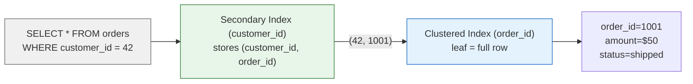
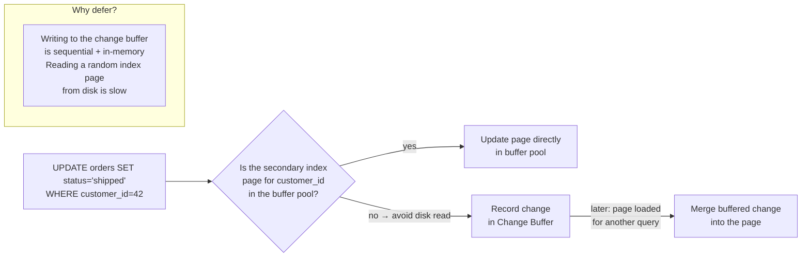

# MySQL (InnoDB) — Architecture

> For the underlying mechanics of B-Trees, WAL, MVCC, and related algorithms,
> see [Storage Engines](../storage-engines.md) and [Database Algorithms](../algorithms.md).

## What Makes It Unique

- **The default OLTP workhorse** — powering the majority of production web applications; the LAMP stack's M
- **Clustered PK means fast PK lookups** — rows are stored in PK order; primary key access is a single tree traversal with no heap hop
- **Pragmatic defaults** — ships with sensible configuration out of the box; balanced for mixed read-write workloads
- **Massive ecosystem** — the most managed cloud services (RDS, Aurora), most hosting panels, most ORMs support it

## Storage Model

InnoDB uses a **clustered B+Tree**. The primary key IS the row's physical location — leaf pages contain
full rows ordered by PK. There is no separate heap, no CTID. If you don't define a PK, InnoDB generates
a hidden 6-byte `DB_ROW_ID`.

Sequential PKs (auto-increment) always append to the rightmost leaf — minimal page splits.
Random PKs (UUID) scatter inserts across the entire tree, fragmenting pages and bloating the buffer pool.

The **buffer pool** caches index pages, data pages, undo pages, and change buffer entries.
Pages are 16KB. Each page stores its LSN for crash recovery — pages with LSN >= checkpoint need no replay.

(For B-Tree mechanics, see [B-Tree](../storage-engines.md#b-tree))

## Indexing Model

Secondary indexes store `(key, primary_key)` in a separate B+Tree. Every secondary lookup follows a
**double-hop**: secondary index → PK → clustered index. This makes covering indexes critical —
include all queried columns in the secondary index to avoid the second hop.

Because the PK is the row locator, PK updates cascade to **every** secondary index. A narrow PK
(e.g., `BIGINT`) keeps all secondary indexes compact.

**Change Buffer** optimizes this: when a DML modifies a secondary index page not in the buffer pool,
InnoDB records the change in the change buffer (persistent, in system tablespace) without loading
the page from disk. When the page is eventually loaded, buffered changes merge. This eliminates
random reads during writes — especially impactful for indexes with poor cache hit rates.

**Adaptive Hash Index**: InnoDB monitors B-Tree access patterns. When the same page is repeatedly
accessed by the same key prefix, it builds a hash table in the buffer pool. Subsequent point lookups
skip the B-Tree and hit O(1). Not persistent (rebuilt on restart), only equality queries.

(For B-Tree index structure and MVCC undo chain, see [B-Tree](../storage-engines.md#b-tree) and [MVCC](../algorithms.md#mvcc-multi-version-concurrency-control))
