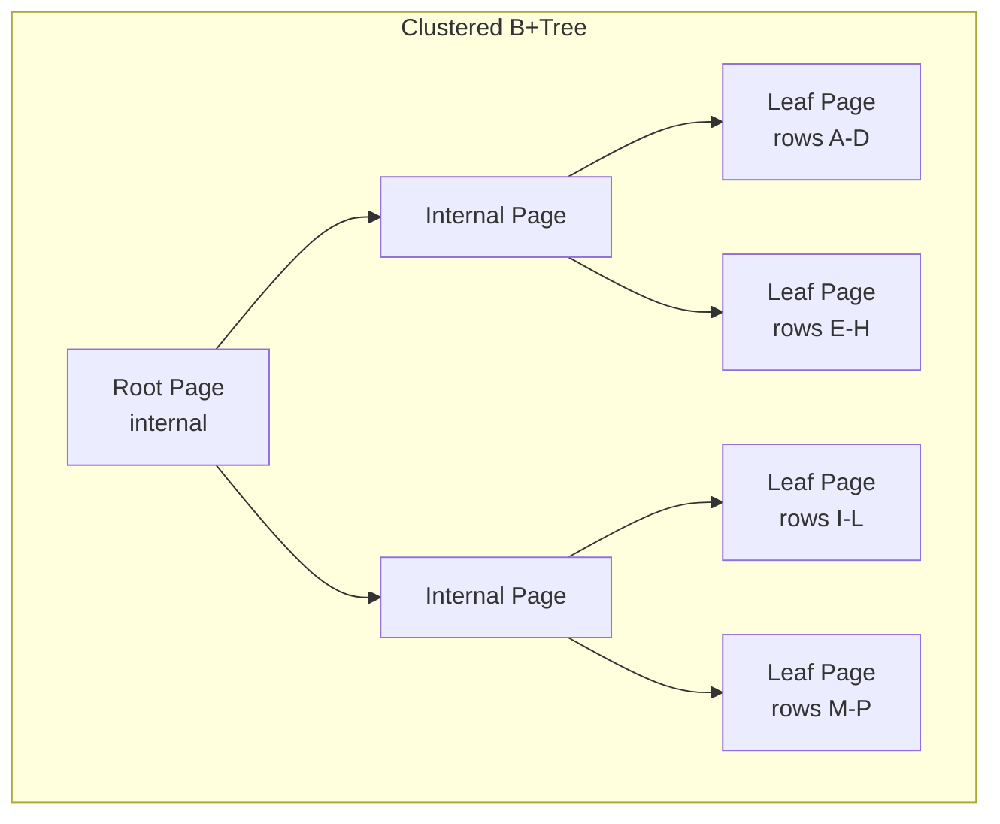
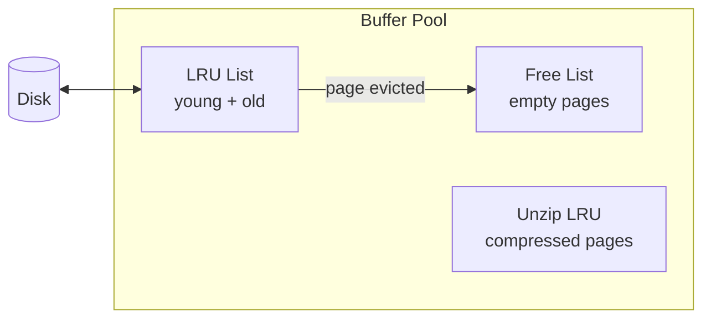
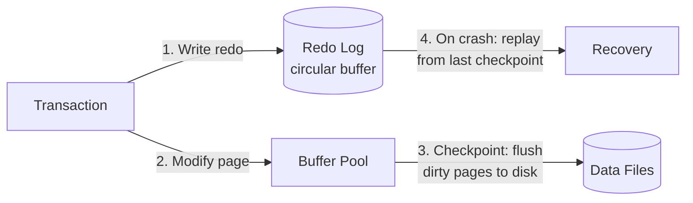

# MySQL Internals

## Storage Engine: Clustered B+Tree

InnoDB uses a **clustered B+Tree** as its primary storage structure. The table *is* the index — data rows are stored in the leaf pages of the primary key B+Tree.

### Page Structure

InnoDB pages are 16KB. Each page has:

| Component | Size | Description |
|---|---|---|
| FIL Header | 38 bytes | Page checksum, LSN, page type, space ID, page number |
| Page Header | 56 bytes | Index ID, number of records, free space pointer |
| Infimum + Supremum | 26 bytes | Artificial boundary records |
| User Records | Variable | Actual row data, ordered by primary key |
| Free Space | Variable | Between user records and page directory |
| Page Directory | Variable | Slot array for binary search within page |
| FIL Trailer | 8 bytes | Checksum matching FIL Header (torn page detection) |

**Page types**: INDEX (B-Tree node), UNDO_LOG, INODE, IBUF_BITMAP, FSP_HDR, TRX_SYS, etc.

### Row Formats

| Format | Header | Features |
|---|---|---|
| COMPACT | 5 bytes | Variable-length length array, NULL bitmap |
| REDUNDANT (legacy) | 6 bytes | Longer header, first 768 bytes of overflow stored inline |
| DYNAMIC (default since 5.7) | 5 bytes | Overflow values stored fully off-page (BLOB, TEXT) |
| COMPRESSED | 5 bytes | Page-level compression (zlib/lz4) + DYNAMIC overflow |

**Off-page storage**: For DYNAMIC and COMPRESSED, the decision is based on whether the entire row fits on the B-tree page; there is no fixed 767-byte cutoff. For COMPACT and REDUNDANT, values > 767 bytes are stored in overflow pages. The B-Tree leaf stores a 20-byte pointer to the overflow.

## Clustered Index

- **Primary key required**: If no explicit PK, InnoDB uses the first UNIQUE NOT NULL column, or generates a hidden 6-byte `DB_ROW_ID`.
- **Rows in PK order**: Physical layout follows primary key order on page (logical, not necessarily physical on disk).
- **Insertion**: Appends near the end of the B+Tree for auto-increment PKs (sequential writes). Random PKs (UUID) cause page splits and fragmentation.

## Secondary Indexes

- Store `(indexed columns, primary key)` in a separate B+Tree.
- **Lookup**: Search secondary index B+Tree → get PK → search clustered B+Tree → get full row. This is why covering indexes matter.
- **No heap pointer**: Unlike PostgreSQL's CTID, InnoDB always uses the PK as the row locator. PK updates cascade to all secondary indexes.

## Buffer Pool

The buffer pool caches index pages, data pages, undo pages, and change buffer entries:

- **LRU with midpoint insertion**: Pages are inserted at the 3/8 point (old block). Accessed pages move to the young sublist (5/8). This prevents full table scans from flooding the cache.
- **Page hash table**: O(1) lookup by (space_id, page_no) — avoids LRU scan.
- **Read-ahead**: Linear (sequential pattern detected) and random (same extent pages) to prefetch.
- **Flushing**: Clean pages evicted immediately. Dirty pages flushed by page cleaner threads (adaptive flushing based on redo log generation rate).

## Change Buffer

Merges secondary index modification into the buffer pool **deferred**:

1. A DML modifies a secondary index page not in the buffer pool
2. Instead of reading the page from disk, InnoDB records the change in the change buffer (persistent in system tablespace)
3. When the page is eventually read into the buffer pool, buffered changes are merged
4. Also merges periodically in the background

**Types cached**: Inserts, delete-marking operations, and purges. UPDATE is mapped to DELETE-MARK + INSERT.

**Benefit**: Reduces random I/O for secondary indexes. Disproportionately helpful for indexes with low cache hit rates.

## Redo Log (ib_logfile)

Circular write-ahead log for crash recovery:

- **Physical logging**: Records physical page-level changes (page number, offset, data). Not logical row operations.
- **Group commit**: Multiple transactions flush their redo together for efficiency.
- **Log sequence number (LSN)**: Every redo record has an LSN. Each page stores the LSN of the last modification (`FIL_PAGE_LSN`). During recovery, pages with LSN ≥ checkpoint LSN are skipped.
- **Doublewrite buffer**: Before writing a page from the buffer pool to its data file location, InnoDB writes it to the doublewrite buffer. As of MySQL 8.0.20, this resides in dedicated doublewrite files rather than a fixed 2MB area in the system tablespace. This prevents torn pages — if a partial page write occurs during crash, InnoDB recovers from the doublewrite copy.

## Undo Log

Stores old row versions for MVCC and rollback:

- **Stored in system tablespace** or separate undo tablespace (MySQL 8.0+).
- **Two types**: INSERT undo (can be discarded after transaction commits) and UPDATE undo (needed for MVCC until no active transaction needs it).
- **Rollback segment**: 1024 undo slots per segment for the default 16KB page size (scales with page size: 256 for 4KB, 512 for 8KB, 2048 for 32KB). Multiple segments for concurrency.
- **MVCC**: A reader traverses the undo chain (`DB_ROLL_PTR`) to reconstruct the row version visible to its read view.

## Adaptive Hash Index (AHI)

InnoDB can build a hash index over frequently accessed B-Tree pages:

- **Built automatically**: Monitors index lookups. When a pattern emerges (same page accessed repeatedly via the same prefix), a hash table is constructed.
- **Stored in buffer pool**: Uses ~1% of buffer pool for hash table entries.
- **Not persistent**: Rebuilt on restart.
- **Limitation**: Only equality lookups (no range). Prefix of the index key can be any length.
- **Contention issue**: AHI is partitioned (default 8 partitions via `innodb_adaptive_hash_index_parts`). On high-concurrency systems, disabling AHI can improve performance.

## Locking

| Lock Type | Granularity | Description |
|---|---|---|
| Table-level | Table | Intention locks (IS, IX), AUTO-INC, LOCK TABLES |
| Record lock | Index record | Locks a single index entry (always an index, even for heap-like access) |
| Gap lock | Gap between records | Precludes phantom rows in REPEATABLE READ |
| Next-key lock | Record + gap | Record lock + gap lock before it (default in REPEATABLE READ) |
| Insert intention lock | Gap | Special gap lock for INSERT — multiple inserters can coexist if inserting to different positions |
| Predicate lock | Page | For spatial indexes |

- **Row-level locking**: InnoDB locks **index entries**, not rows. A table without a PK uses the hidden `DB_ROW_ID` index.
- **Deadlock detection**: Waits-for graph is traversed. Victim chosen by transaction weight. `innodb_deadlock_detect` can be disabled for high-concurrency workloads.
- **MVCC**: Consistent reads (SELECT without FOR SHARE/UPDATE) are non-locking — they read from the undo snapshot based on the transaction's read view.

## Transaction Isolation

| Level | Dirty Read | Non-repeatable Read | Phantom | Implementation |
|---|---|---|---|---|
| READ UNCOMMITTED | Possible | Possible | Possible | Reads latest version |
| READ COMMITTED | Prevented | Possible | Possible | Reads committed version per statement |
| REPEATABLE READ (default) | Prevented | Prevented | Possible in theory | Consistent read view per transaction |
| SERIALIZABLE | Prevented | Prevented | Prevented | All reads are locking (SELECT ... FOR SHARE) |

- REPEATABLE READ uses **consistent read** — a read view opened at the first read persists for the entire transaction.
- Phantom rows are prevented in practice by **next-key locking** (gap locks block inserts).

## Replication

MySQL replication is based on the **binary log** (binlog):

| Log format | Description |
|---|---|
| **Statement-based (SBR)** | Logs actual SQL. Compact but non-deterministic for some queries (e.g., `NOW()`, `LIMIT` without ORDER BY). |
| **Row-based (RBR)** | Logs before/after row images. Deterministic, more verbose. Default since MySQL 5.7. |
| **Mixed (MBR)** | Uses SBR by default, switches to RBR for unsafe statements. |

**Asynchronous replication**: Default mode. The source writes to its binlog and does not wait for replicas. Replicas connect and pull binlog events via the **I/O thread** (writes to relay log) and **SQL thread** (applies relay log).

**Semi-synchronous replication**: The source waits for at least one replica to acknowledge receipt before returning to the client. Trade-off: stronger durability vs higher commit latency.

**Group Replication** (InnoDB Cluster): Single-group replication (single-primary or multi-primary mode) using Paxos-based group communication. Provides automatic failover, strong consistency within the group, and conflict detection across primary nodes. Not to be confused with Multi-Source Replication, which is a separate feature.

**GTID (Global Transaction Identifiers)** (MySQL 5.6+): Each transaction is assigned a unique `(source_id:transaction_id)`. GTIDs simplify failover — no need to track binlog file/position.

**Relay log**: Written by the replica's I/O thread, read by the SQL thread. The relay log is like a local copy of the source's binlog.

## Query Execution

MySQL uses a **layered query execution model** — the server layer handles parsing/optimization, the storage engine handles data access:

**Parser**: SQL grammar based on a LALR(1) parser. Validates syntax, resolves table/column names, builds a parse tree. Stored procedures are cached in memory after first parse.

**Optimizer**: Cost-based optimizer (CBO) that generates query execution plans:

| Access Method | Description | When Used |
|---|---|---|
| **INDEX (unique lookup)** | Single-row lookup via unique index | Equality on PK or UNIQUE index |
| **REF** | Non-unique index lookup | Equality on non-unique index |
| **RANGE** | Index range scan | `>`, `<`, `BETWEEN`, `IN`, `LIKE 'prefix%'` |
| **INDEX (full scan)** | Scan all entries of an index | Covering index, or index smaller than table |
| **FULL TABLE SCAN** | Read entire clustered index | No index, large portion of rows needed |

**Join strategies**:
- **Nested Loop Join** (default): For each row in the outer table, scan the inner table (or index).
- **Hash Join** (MySQL 8.0.18+): Used for equi-joins when no index is available. Builds a hash table on the smaller table, probes with the larger.
- **Block Nested Loop (BNL)**: For each block of outer rows (join_buffer_size), scan the inner table once. Removed in MySQL 8.0.20 (replaced by hash join).
- **Batched Key Access (BKA)**: Multi-row index lookup with join buffering. Used with Multi-Range Read (MRR).
- **Note**: MySQL does not implement Merge Join.

**MRR (Multi-Range Read)**: Sorts index lookups by primary key before fetching rows. Converts random I/O into more sequential I/O. Enabled by the `mrr` flag in `optimizer_switch`; `mrr_cost_based` controls whether the optimizer makes a cost-based choice between using and not using MRR.

**EXPLAIN output**: Key columns:
- `type`: The access method (`const`, `ref`, `range`, `index`, `ALL`)
- `key`: The index chosen
- `rows`: Estimated rows examined
- `Extra`: Additional info (`Using index`, `Using where`, `Using temporary`, `Using filesort`, `Using index condition`)

**Index Condition Pushdown (ICP)**: Pushes parts of the WHERE clause that reference index columns down to the storage engine layer. The engine filters index entries before reading the full row, reducing I/O.

**Common optimizations**:
- **Covering indexes**: Include all queried columns so the engine reads only the index (no clustered index lookup).
- **Composite indexes**: Order columns by selectivity (most selective first) for equality conditions, put range conditions last.
- **Prefix indexes**: `INDEX(col(10))` — index only the first N bytes of a VARCHAR. More compact but may increase false matches.

**Key factors**:
- **Buffer pool hit ratio**: Most important metric. Target > 99% for read-heavy workloads.
- **Redo log size**: Too small causes frequent checkpoints (stalls writes). Rule of thumb: allow 30-60 minutes of writes.
- **Innodb_flush_log_at_trx_commit**: `0` (logs written and flushed once per second), `1` (fsync each commit, safe), `2` (logs written after each commit but only flushed once per second, lose ~1s on crash).
- **Doublewrite buffer**: Adds ~5-10% write overhead but prevents data corruption. Can be disabled on Fusion-io devices that support atomic writes.

---

*Last verified against official MySQL documentation: 2026-06-13*
