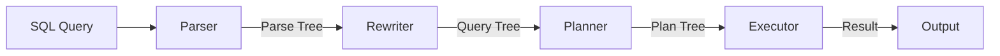
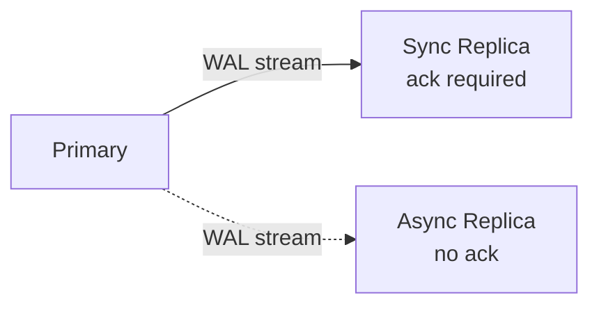

# PostgreSQL Internals

## Storage Engine

### Heap Storage

PostgreSQL uses a **heap-based** storage model — rows are stored in heap pages (8KB each) without any particular order.

```mermaid
graph TD
    subgraph "Heap Page (8KB)"
        H[PageHeaderData<br/>24 bytes] --> I[ItemIdData Array<br/>(offset, length) pairs]
        I --> FS[Free Space]
        FS --> T1[Tuple 1]
        FS --> T2[Tuple 2]
        FS --> T3[Tuple 3]
    end
```

**Page layout**: Each 8KB page has:
- **PageHeaderData** (24 bytes): LSN, checksum, free space pointer, page flags
- **ItemIdData array**: `(offset, length)` pointers to each tuple, grows from the start
- **Free space**: Between the ItemId array and tuples
- **Tuples**: Grow from the end toward the free space

**CTID**: Each row has a `CTID = (page_number, tuple_index)` — a direct pointer to its location on disk. This is the fastest way to locate a row.

**TOAST** (The Oversized-Attribute Storage Technique): Values > 2KB are compressed and stored in a separate TOAST table. The main tuple holds a pointer to the TOAST chunk. Values > 32KB are stored without compression (too expensive to compress).

### MVCC (Multi-Version Concurrency Control)

PostgreSQL implements MVCC by keeping multiple row versions (tuples) in the heap. Each tuple has hidden system columns:

| Column | Size | Purpose |
|---|---|---|
| `xmin` | 4 bytes | Transaction ID that created this tuple |
| `xmax` | 4 bytes | Transaction ID that deleted/updated this tuple (0 if live) |
| `cmin` | 2 bytes | Command ID within the creating transaction |
| `cmax` | 2 bytes | Command ID within the deleting transaction |
| `ctid` | 6 bytes | Pointer to next tuple version (for HOT updates) |

**Tuple visibility**:
- A tuple is visible if `xmin` is committed AND (`xmax` is not committed OR `xmax` exceeds current snapshot)
- A transaction sees tuples where `xmin ≤ txid` and (`xmax = 0` or `xmax > txid`)

**HOT (Heap-Only Tuples)**: When a row is updated and the new version fits on the same page, PostgreSQL creates a HOT chain — the new ctid points to the next version on the same page. This avoids updating indexes. If the new version doesn't fit, indexes must be updated.

### VACUUM

Dead tuples accumulate over time. VACUUM reclaims space and prevents transaction ID wraparound:

- **Concurrent VACUUM**: Runs alongside normal operations. Scans pages, removes dead tuples, updates the Free Space Map and Visibility Map.
- **Visibility Map**: A bitmap tracking which pages have all-visible tuples. Enables index-only scans (skip heap fetch if page is all-visible) and efficient vacuum (skip all-visible pages).
- **Free Space Map**: Tracks available space per page for new tuple placement.
- **Transaction ID Wraparound**: Transaction IDs are 32-bit (~4 billion). After `2^31` transactions, IDs wrap around. `VACUUM FREEZE` marks tuples with a special "frozen" xmin that never needs comparison.
- **Autovacuum**: Background daemon that automatically triggers vacuum based on dead tuple thresholds.

## Write-Ahead Log (WAL)

PostgreSQL's WAL is the foundation for durability, replication, and point-in-time recovery:

```mermaid
flowchart LR
    Tx[Transaction] -->|1. Write WAL record| WAL[(WAL segment<br/>16MB each)]
    WAL -->|2. Flush to disk<br/>at COMMIT| WAL
    Tx -->|3. Modify heap page| BP[Buffer Pool<br/>shared_buffers]
    BP -->|4. Checkpoint<br/>(dirty pages flushed)| DF[(Data Files)]
    WAL -->|5. On crash: replay| Recovery
```

**LSN (Log Sequence Number)**: Each WAL record has a unique LSN — the byte position in the WAL stream. Every data page stores the LSN of the last WAL record that modified it (`pd_lsn`). During crash recovery, pages with LSN ≥ the checkpoint redo point are already up-to-date and skipped.

**WAL segments**: Stored in `pg_wal/`, each 16MB. Segments are recycled (not deleted) to avoid file creation overhead.

**Full Page Writes**: At the first modification after a checkpoint, the entire page is written to the WAL. This prevents "torn pages" — partial writes that leave a page in an inconsistent state after a crash.

**Checkpoints**: A background process that flushes all dirty buffers to disk and advances the redo point. `checkpoint_completion_target` spreads the I/O over time to avoid spikes.

**WAL Archiving**: Completed WAL segments can be copied to a safe location. Enables Point-in-Time Recovery (PITR) — replay WAL from a base backup to any point in time.

## Index System

PostgreSQL has the most extensive index system of any open-source database:

| Index Type | Use Case | Storage |
|---|---|---|
| B-Tree (default) | Equality + range queries, ordering | Balanced tree, stores (key, CTID) |
| GiST | Full-text, geometry, ranges | Generalized Search Tree |
| GIN | Arrays, JSONB, tsvector | Inverted index (value → rows) |
| BRIN | Time-series, naturally ordered data | Block range min/max |
| SP-GiST | k-d trees, quad-trees, network addresses | Space-partitioned tree |
| Hash | Equality-only (rarely used) | Hash table |

**B-Tree internals**: Stores `(key, CTID)` pairs in a balanced tree. Supports deduplication (compressing duplicate keys). Pages are 8KB (default), can be up to 32KB with non-default block sizes.

**Index-Only Scan**: If the visibility map shows a page is all-visible, PostgreSQL can answer queries from the index alone without fetching the heap tuple.

## Query Execution



**Parser**: Converts SQL text to a parse tree using a LALR(1) grammar. Validates syntax and permissions.

**Rewriter**: Applies rules (views, rules) to transform the query tree. `CREATE VIEW` creates a rewrite rule that expands views at query time.

**Planner / Optimizer**: The heart of PostgreSQL. Cost-based optimizer with three join strategies:

1. **Nested Loop Join** — O(n*m). Best when one relation is small. Can use an index on the inner relation.
2. **Hash Join** — O(n+m). Builds a hash table on the smaller relation, probes with the larger. Best for equi-joins on unsorted data.
3. **Merge Join** — O(n+m). Sorts both relations on the join key, then merges. Best for sorted data or when ORDER BY matches the join key.

**Cost estimation**: Based on `reltuples` (row count) and `relpages` (page count) from `pg_class`, plus column-level statistics from `ANALYZE` (most common values, histogram bounds, correlation, null fraction).

**Executor**: Iterates over plan nodes. Each node produces tuples for the parent node (Volcano-style pull model). Supports parallel nodes — Gather/Gather Merge distribute work to parallel workers.

**JIT (Just-In-Time Compilation)**: Using LLVM, PostgreSQL compiles expression evaluation, tuple deforming, and filter functions into machine code. 2-5x faster for CPU-bound queries with complex expressions.

### Join Strategies

| Strategy | When optimal | Memory | Complexity |
|---|---|---|---|
| Nested Loop | One side very small | O(1) | O(n*m) |
| Hash Join | Medium tables, equi-join | O(min(n,m)) | O(n+m) |
| Merge Join | Large sorted tables | O(n+m) | O(n+m) |

## Replication

**Streaming Replication (physical)**: Primary streams WAL to replicas in real-time. Synchronous: commit waits for at least one replica (RPO=0). Asynchronous: replicas may lag (RPO > 0).



**Logical Replication**: Publishes changes at the row level (INSERT, UPDATE, DELETE) rather than physical WAL blocks. Supports selective replication (specific tables), cross-version replication, and bidirectional replication.

**Hot Standby**: Replicas can serve read queries while receiving WAL. Uses snapshot conflict resolution — if a query conflicts with a WAL replay operation, the query is either cancelled or waits (`max_standby_archive_delay`, `max_standby_streaming_delay`).

## Performance Tuning

| Parameter | Default | Description |
|---|---|---|
| `shared_buffers` | 128MB | Cache for data pages. Typically 25% of RAM |
| `effective_cache_size` | 4GB | OS cache estimate for planner cost |
| `work_mem` | 4MB | Memory per sort/hash operation |
| `maintenance_work_mem` | 64MB | Memory for VACUUM, CREATE INDEX |
| `wal_buffers` | 16MB | WAL buffer before flush |
| `max_parallel_workers` | 8 | Max parallel workers for queries |
| `random_page_cost` | 4.0 | Cost of random I/O vs sequential |

## Advanced Features

- **CTEs / WITH queries**: Materialized by default (optimization fence) or inline with `NOT MATERIALIZED` (PG12+)
- **Window functions**: `ROW_NUMBER()`, `RANK()`, `LAG()`, `LEAD()` — evaluated after joins, before ORDER BY
- **Recursive CTEs**: `WITH RECURSIVE` for graph traversal, tree queries
- **Triggers**: `BEFORE/AFTER/INSTEAD OF`, row-level or statement-level, `FOR EACH ROW/STATEMENT`
- **Foreign Data Wrappers (FDW)**: Query external databases (postgres_fdw, mysql_fdw, etc.) as local tables
- **Extensions**: PostGIS (spatial), pgvector (vector search), pg_partman (partition management), pg_stat_statements (query performance)
- **Table Partitioning**: Range, list, hash — with partition pruning at planning time
- **Parallel Query**: Parallel seq scan, parallel index scan, parallel join, parallel aggregation, partial aggregation
- **SSI (Serializable Snapshot Isolation)**: True serializability using predicate locks and conflict detection — prevents all anomalies including phantoms

## Storage Size Analysis

| Object | Size |
|---|---|
| Heap page | 8 KB |
| Tuple header | 23 bytes (plus alignment) |
| B-Tree internal page | 8 KB (hundreds of keys) |
| WAL segment | 16 MB |
| Transaction ID | 32-bit (4 billion wrap limit) |
| Max row size | 1.6 TB (with TOAST) |
| Max table size | 32 TB |
