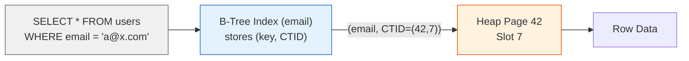
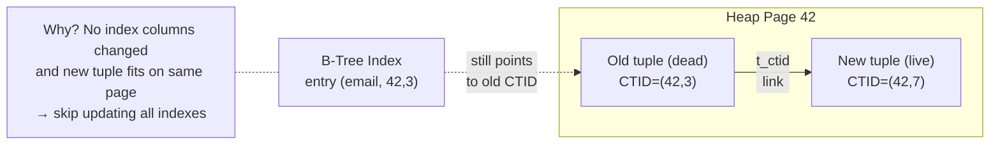
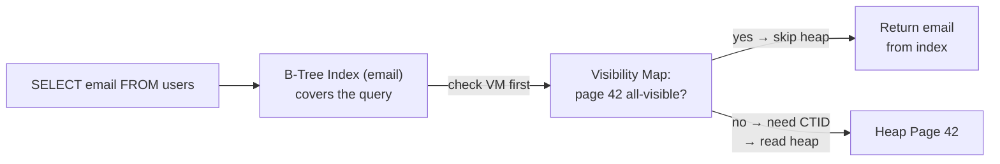

# PostgreSQL — Architecture

> For the underlying mechanics of B-Trees, heap storage, WAL, MVCC, and related algorithms,
> see [Storage Engines](../storage-engines.md) and [Database Algorithms](../algorithms.md).

## What Makes It Unique

- **Extensible by design** — pluggable storage, index types, procedural languages, and foreign data wrappers make it more a framework than a database
- **Strict SQL standards compliance** — closest open-source implementation to the SQL standard, with a philosophy of correctness over convenience
- **The open-source Oracle** — feature parity with commercial databases for enterprise workloads; most widely deployed object-relational DBMS
- **Process-per-connection model** — each connection gets an OS process, providing strong isolation at the cost of higher memory per connection

## Storage Model

PostgreSQL uses **heap storage** — tables are unordered collections of rows in 8KB pages. Each row has a physical identifier: `CTID = (page_number, slot_index)` — a direct disk pointer.

New rows go into any page with free space (tracked by the Free Space Map). Updates mark the old row as dead and insert a new version (MVCC in the heap). Dead rows accumulate until `VACUUM` reclaims space and updates the Visibility Map.

(For B-Tree and heap page mechanics, see [B-Tree](../storage-engines.md#b-tree) and [Heap](../storage-engines.md#heap))

## Indexing Model

Indexes are **separate B-Trees** (or GiST, GIN, BRIN, SP-GiST, Hash) that store `(key, CTID)` pairs.
Every index lookup requires **two reads**: index → CTID → heap page.



**HOT (Heap-Only Tuples)**: When you do an UPDATE, PG writes a new tuple with a new CTID (MVCC — old tuple stays, marked dead). Because indexes store `(key, CTID)` — not a logical row ID — every index on the table must get a new entry pointing to the new CTID. This happens on *every* UPDATE regardless of which column was modified, because the CTID itself changed. With 10 indexes, one UPDATE = 10 extra index writes. This is **index write amplification**.

HOT skips all index writes when (1) no indexed column changed and (2) the new tuple fits on the *same* 8KB heap page as the old one. PG chains old→new via `t_ctid` within the page, and the index entry keeps pointing to the old CTID. On lookup, the engine follows the chain to the live version. If the new tuple spills to a different page (no free space in the current one), HOT is lost.



**Index-Only Scans**: PG's double-lookup model normally costs two reads per row: index → CTID → heap. An index-only scan should skip the heap — but PG can't trust index data alone: the index entry may point to a dead tuple on a page full of MVCC churn. PG needs proof the page is clean.

The Visibility Map provides that proof — a per-page bitmap saying "every tuple on this page is visible to all transactions." When VM = all-visible and the query only needs columns in the index, PG serves from the index alone. Result: 1 read instead of 2 per row.

- Requires a covering index (all query columns in the index)
- VM is updated by VACUUM; without regular VACUUM, dead tuples accumulate and index-only scans degrade to normal index + heap lookups



### Parking Lot Analogy

| Parking Lot | Data Structure | Role |
|-------------|---------------|------|
| Directory | B-Tree | License plate → spot (quick lookup) |
| Parking spots | Heap | Actual cars at physical spots |
| Row status sheet | Visibility Map | Per-row: "clean" (no cars left) or "dirty" (some have left) |

```go
package main

type Position struct{ Row, Spot int }

type Spot struct {
	Plate, Owner string
	Dead         bool // "withdrawn" — car left
	CTIDRow      int  // t_ctid: "→ Row X, Spot Y"
	CTIDSpot     int
}

func main() {
	directory := map[string]Position{} // B-Tree

	rows := make([][]Spot, 5) // Heap (5 rows, 4 spots each)
	for i := range rows {
		rows[i] = make([]Spot, 4)
	}

	rowStatus := make([]bool, 5) // Visibility Map
	for i := range rowStatus {
		rowStatus[i] = true
	}

	// ── 1. INSERT ──
	directory["ABC123"] = Position{0, 1}
	rows[0][1] = Spot{Plate: "ABC123", Owner: "Alice"}
	rowStatus[0] = true
	//   B-Tree:  {"ABC123" => (0,1)}
	//   Heap:    Row 0, Spot 1 = {ABC123, Alice}
	//   VM:      Row 0 = clean

	// ── 2. HOT: same car shifts spots within Row 0 ──
	rows[0][1].Dead = true
	rows[0][1].CTIDRow = 0
	rows[0][1].CTIDSpot = 3
	rows[0][3] = Spot{Plate: "ABC123", Owner: "Alice"}
	rowStatus[0] = false
	//   B-Tree:  {"ABC123" => (0,1)}        ← unchanged (plate = key didn't change)
	//   Heap:    Row 0, Spot 1 = {dead, t_ctid → (0,3)}
	//            Row 0, Spot 3 = {ABC123, Alice}
	//   VM:      Row 0 = dirty (dead spot)

	// ── 3. No-HOT: car moves to different row ──
	delete(directory, "ABC123")
	directory["ABC123"] = Position{2, 0}
	rows[0][3].Dead = true
	rows[2][0] = Spot{Plate: "ABC123", Owner: "Alice"}
	rowStatus[0] = false
	//   B-Tree:  {"ABC123" => (2,0)}        ← entry rewritten (plate = key changed)
	//   Heap:    Row 0, Spot 3 = {dead}
	//            Row 2, Spot 0 = {ABC123, Alice}
	//   VM:      Row 0 = dirty, Row 2 = clean

	// ── 4. Lookup ──
	pos, ok := directory["ABC123"]
	if !ok {
		// not found
	} else if rowStatus[pos.Row] {
		// clean → trust directory, 1 lookup
	} else {
		// dirty → walk to spot, follow t_ctid chain if dead
	}
	_ = pos
}
```

(For B-Tree index structure, see [Indexing](../storage-engines.md#b-tree))
