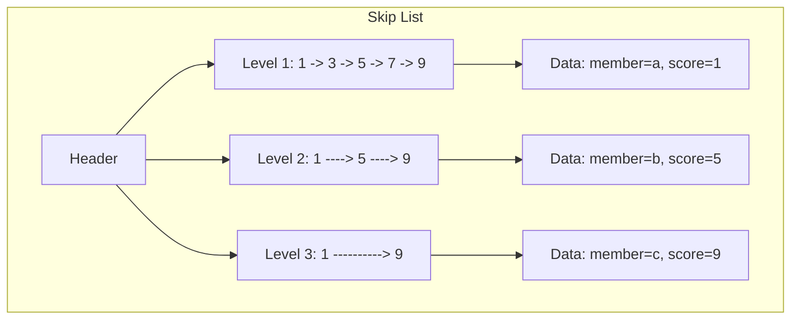
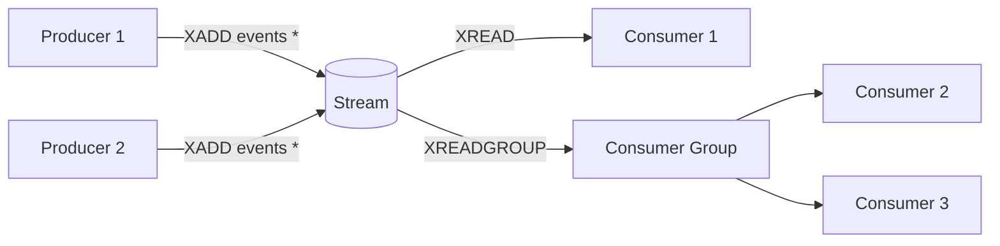
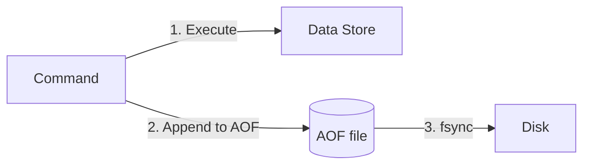
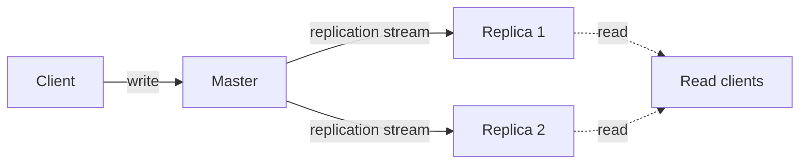

# Redis Internals

## Architecture

Redis is an **in-memory data structure store** with optional persistence. It uses a **single-threaded event loop** for command execution (all commands execute sequentially on the main thread), which eliminates concurrency complexity and provides atomicity for individual commands. Redis 6.0+ introduced optional multi-threaded I/O (`io-threads`) for networking.

```
Client → TCP socket → [read buffer] → command parser → command handler → [write buffer] → Client
                        ↑                                ↓
                      event loop                    data store
```

**Single-threaded model**: All commands execute sequentially on the main thread. This means:
- No race conditions on data structures
- No locking overhead
- Predictable latency (no context switching)
- High throughput for simple commands

**I/O multiplexing**: Uses `epoll` (Linux) / `kqueue` (macOS) to handle thousands of concurrent connections in a single thread.

## Data Structures & Internal Encoding

Redis provides 11 data types, each with optimized internal encodings:

### String

| Encoding | Description | Max Size |
|---|---|---|
| `int` | 64-bit signed integer stored as integer | 8 bytes |
| `embstr` | Short string (<44 bytes, embedded in Redis object) | 44 bytes |
| `raw` | Long string (dynamically allocated) | 512 MB |

Operations: `GET`, `SET`, `INCR`, `DECR`, `APPEND`, `GETSET`, `MSET`, `MGET`, `STRLEN`

### List

| Encoding | Description | When Used |
|---|---|---|
| **quicklist** | Linked list of ziplist nodes (since Redis 3.2) | Always |
| `ziplist` (legacy) | Contiguous memory with variable-length entries | Small lists (< Redis 3.2) |

A **quicklist** is a doubly-linked list where each node is a **ziplist** (a contiguous memory block). This balances memory efficiency (compacts sequential entries) with fast insertion at both ends.

Operations: `LPUSH`, `RPUSH`, `LPOP`, `RPOP`, `LRANGE`, `LINDEX`, `LTRIM`, `LLEN`

Complexity: Push/pop from ends = O(1). Index access = O(n).

### Hash

| Encoding | Description | When Used |
|---|---|---|
| `ziplist` | Sequential key-value pairs in compact memory | < 512 entries AND values < 64 bytes |
| `hashtable` | Standard hash table with chaining | Above threshold |

The **ziplist** encoding stores keys and values as adjacent entries in a compact memory block. Very memory-efficient for small hashes. The **hashtable** encoding uses `dict.c` — a hash table with incremental rehashing (rehash is spread across operations to avoid latency spikes).

Operations: `HSET`, `HGET`, `HDEL`, `HGETALL`, `HSCAN`, `HLEN`, `HINCRBY`

Complexity: O(1) average, O(n) worst-case during rehash.

### Set

| Encoding | Description | When Used |
|---|---|---|
| `intset` | Sorted array of integers | All elements are integers AND < 512 elements |
| `hashtable` | Hash table with NULL values | Above threshold |

The **intset** encoding is a sorted array of integers using binary search (O(log n)). Very memory-efficient. The **hashtable** encoding stores set members as keys (values are NULL).

Operations: `SADD`, `SREM`, `SISMEMBER`, `SMEMBERS`, `SINTER`, `SUNION`, `SDIFF`, `SCARD`, `SSCAN`

Complexity: O(1) for add/remove/check. O(n) for set operations.

### Sorted Set (ZSET)

| Encoding | Description | When Used |
|---|---|---|
| `ziplist` | Sequential score-member pairs | < 128 elements |
| **skiplist + hashtable** | Probabilistic skip list + hash table | Above threshold |

The **skiplist** is a probabilistic balanced tree:
- Multiple levels of linked lists (levels are random: 50% probability per level)
- O(log n) for insert, delete, and range queries
- Max level: 32 (supports 2^32 elements)
- The hash table provides O(1) score lookup by member



Operations: `ZADD`, `ZREM`, `ZRANK`, `ZSCORE`, `ZRANGE`, `ZRANGEBYSCORE`, `ZINCRBY`, `ZINTERSTORE`, `ZUNIONSTORE`

Complexity: O(log n) for insert/delete/score lookup. O(log n + m) for range queries.

### Stream

Redis Streams is an append-only log data structure inspired by Kafka. Each stream entry has a unique ID (timestamp-sequence) and a list of field-value pairs.



Key features:
- **Consumer groups**: Multiple consumers read from the same stream, each gets different entries
- **Pending Entries List (PEL)**: Tracks unacknowledged entries for fault-tolerant consumption
- **Range queries**: By ID (timestamp) — efficient O(log n)
- **Capability**: Can cap the stream to N entries (`MAXLEN`)

### Other Data Types

| Type | Internal | Use |
|---|---|---|
| **Bitmap** | String bitset | Bit-level operations |
| **HyperLogLog** | HLL algorithm | Cardinality estimation (12KB, 0.81% error) |
| **Geospatial** | Geohash (sorted set) | Distance queries, radius search |

## Persistence

Redis offers two persistence mechanisms:

### RDB (Redis Database File)

Point-in-time snapshots of the entire dataset:

- `SAVE`: Synchronous, blocks Redis (not used in production)
- `BGSAVE`: Forks a child process (fork + copy-on-write). The child writes the RDB file while the parent continues serving requests.
- Configurable interval: `save 3600 1` (if 1 key changed in 3600s), `save 300 100` (if 100 keys changed in 300s), `save 60 10000` (if 10000 keys changed in 60s)

**RDB file format**: Compact binary format:
1. Magic string "REDIS"
2. RDB version number
3. Database data (key-value pairs with type metadata)
4. Checksum

**Trade-off**: May lose the last N minutes of data (depending on save interval). Fast restart — load RDB into memory.

### AOF (Append-Only File)

Logs every write operation in Redis protocol format:



**fsync policies**:
- `appendfsync always`: fsync after every command (safest, very slow)
- `appendfsync everysec`: fsync once per second (default, good balance)
- `appendfsync no`: OS decides when to flush (fastest, may lose 30+ seconds)

**AOF rewrite** (`BGREWRITEAOF`): Forks a child process that reconstructs the AOF from the current in-memory state (removes redundant operations). Uses copy-on-write — parent continues logging to the old AOF while the child writes the new one.

### RDB + AOF Hybrid (Redis 4.0+)

Redis can use both: RDB as a base snapshot + AOF for incremental changes since the snapshot. Fast restart (load RDB) + durability (replay AOF).

## Replication



**Full resynchronization**: When a replica connects for the first time (or after a disconnection too long), the master:
1. Forks to generate an RDB snapshot
2. Buffers all write commands during the fork
3. Sends the RDB to the replica (disk-based or diskless)
4. Sends the buffered commands

**Partial resynchronization** (PSYNC2, Redis 4.0+): If the replica disconnects briefly, it reconnects and sends its replication offset. If the master still has the commands in its replication backlog buffer (configurable size), it sends only the missing commands — avoiding a full RDB transfer.

**Replica persistence**: Replicas can have their own AOF/RDB. Replicas can also cascade replication (replica-of-replica).

## Cluster

```mermaid
graph TD
    Client -->|CRC16(key) % 16384| C[Cluster]
    subgraph "16384 hash slots"
        S1[Node 1<br/>slots: 0-5460]
        S2[Node 2<br/>slots: 5461-10922]
        S3[Node 3<br/>slots: 10923-16383]
    end
    S1 --- R1[Replica 1a]
    S1 --- R2[Replica 1b]
    S2 --- R3[Replica 2a]
    S3 --- R4[Replica 3a]
```

**Hash slots**: Keyspace is partitioned into 16384 hash slots. `CRC16(key) % 16384` determines the slot. Each node owns a range of slots.

**Gossip protocol**: Nodes exchange cluster topology information (PING/PONG messages). Each node knows the entire slot-to-node mapping (no central metadata store).

**MOVED redirect**: If a client sends a command to the wrong node, the node returns a `-MOVED` error with the correct node address. Clients cache the slot map.

**ASK redirect**: During resharding, a slot may be in migration. The source node returns `-ASK` to tell the client to query the target node temporarily.

**Failover**: A replica of the failed node is promoted by a majority of master nodes. Uses a custom failover protocol where masters vote to authorize replica promotion.

**Resharding**: Slots are migrated from one node to another. The slot owner temporarily both owns and migrates the slot. Keys are moved incrementally.

## Eviction Policies

When `maxmemory` is reached, Redis evicts keys based on the configured policy:

| Policy | Description |
|---|---|
| `noeviction` | Return errors on write |
| `allkeys-lru` | Evict least-recently-used keys (most common) |
| `allkeys-lfu` | Evict least-frequently-used keys (Redis 4.0+) |
| `allkeys-lrm` | Evict least-recently-modified keys (Redis 8.6+) |
| `volatile-lru` | Evict LRU from keys with TTL set |
| `volatile-lfu` | Evict LFU from keys with TTL set |
| `volatile-lrm` | Evict least-recently-modified from keys with TTL (Redis 8.6+) |
| `allkeys-random` | Evict random keys |
| `volatile-random` | Evict random keys with TTL |
| `volatile-ttl` | Evict keys with shortest TTL |

**LRU approximation**: Redis doesn't track exact LRU — it samples N keys (default 5, `maxmemory-samples`) and evicts the oldest among them.

## Transactions & Lua Scripting

**MULTI/EXEC**: Groups commands into a transaction. Commands are queued and executed atomically (no other commands interleaved). No rollback — if a command fails, the rest continue.

```redis
MULTI
SET key1 value1
INCR counter
EXEC
```

**Lua scripting** (`EVAL`): Run a Lua script atomically. All data access happens on the same node (single-threaded). Scripts are deterministic and repeatable.

```lua
-- Atomic compare-and-delete
if redis.call("GET", KEYS[1]) == ARGV[1] then
    return redis.call("DEL", KEYS[1])
else
    return 0
end
```

## Memory Overhead

| Data Type | Overhead per key | Notes |
|---|---|---|
| String (empty) | ~90 bytes | RedisObject (24 on 64-bit) + SDS header + allocator |
| Hash (small, ziplist) | ~8 bytes per entry | Compact sequential storage |
| Hash (large, hashtable) | ~64 bytes per entry | dictEntry + RedisObject + key string |
| Sorted Set (ziplist) | ~16 bytes per element | Just score + member in array |
| Sorted Set (skiplist) | ~60 bytes per element | Skip list nodes + dict entries |

**Note**: Performance depends on hardware, payload size, network, and configuration. Redis provides a built-in benchmark (`redis-benchmark`) for measuring performance on your specific environment.

---

*Last verified against official Redis documentation: 2026-06-13*
