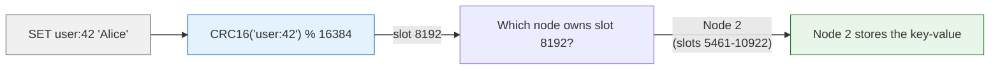
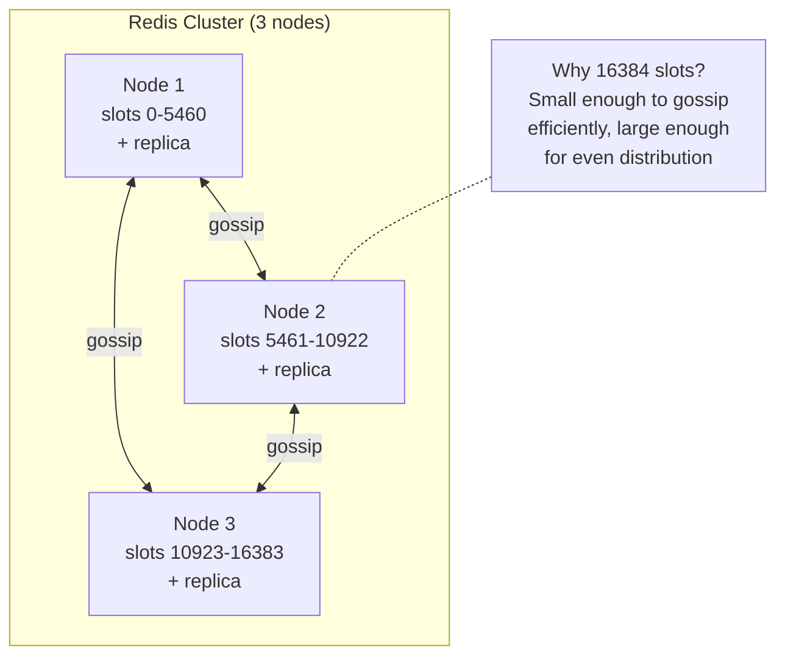

# Redis — Architecture

> For the underlying mechanics of B-Trees, LSM-Trees, and WAL,
> see [Storage Engines](../storage-engines.md) and [Database Algorithms](../algorithms.md).

## What Makes It Unique

- **Speed above all else** — everything in RAM; sub-millisecond latency is the design goal, not a nice-to-have
- **Data structures as a service** — lists, sets, sorted sets, streams, hyperloglogs, bitmaps — not just strings and tables
- **Simplest clustering model of any distributed store** — 16384 hash slots, no central metadata, no master election protocol for slot assignment
- **Durability is optional** — cache-first philosophy; persistence (RDB/AOF) is a configurable feature, not a requirement

## Storage Model

Redis is an **in-memory data structure store** with optional persistence. All data lives in RAM,
backed by two persistence mechanisms:

- **RDB** — point-in-time snapshots. `BGSAVE` forks a child process; the child writes a compact binary
  snapshot while the parent continues serving. Interval-triggered (e.g., save if N keys changed in M seconds).
  Fast restart (load RDB into memory), but may lose the last N minutes.

- **AOF** — append-only command log. Every write operation is appended in Redis protocol format.
  `appendfsync everysec` (default) balances durability and performance. `BGREWRITEAOF` forks a child
  to reconstruct the AOF from current memory state, removing redundant commands.

- **Hybrid** (4.0+) — RDB base + AOF delta: fast restart (load RDB) + durability (replay AOF).

Redis is not an index. It's an O(1) hash lookup by key. Each data type (String, List, Hash, Set,
Sorted Set, Stream) uses internal encodings optimized for different sizes:

| Type | Small encoding | Large encoding | Switch at |
|------|---------------|----------------|-----------|
| Hash | ziplist (compact sequential) | hashtable | >512 entries or >64B values |
| Set | intset (sorted int array) | hashtable | >512 entries or non-integer |
| Sorted Set | ziplist | skiplist + hashtable | >128 elements |
| List | quicklist (linked ziplists) | — | Always |

## Cluster & Sharding

Keyspace is partitioned into **16384 hash slots**. `CRC16(key) % 16384` determines the slot.
Each node owns a range of slots. Clients cache the slot map; `MOVED` redirects on wrong node,
`ASK` redirects during resharding. Failover is voted by a majority of master nodes.

(For eviction policy details, see Redis docs)
