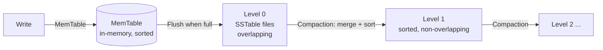
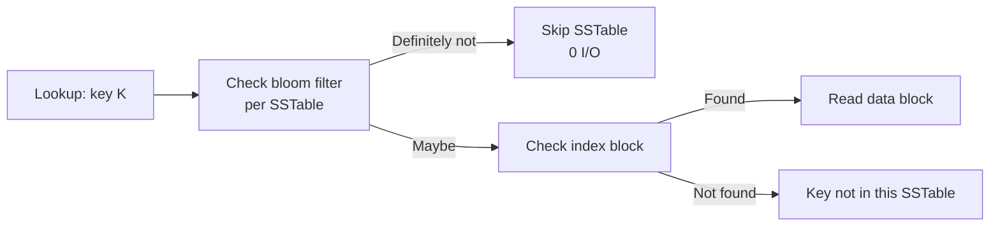

# RocksDB Internals

## Storage Engine: LSM-Tree

RocksDB is an embeddable LSM-tree engine, forked from Google's LevelDB with Facebook's optimizations. It is **not a standalone database** — it's a C++ library used by MySQL (MyRocks), CockroachDB (Pebble, a Go rewrite), Kafka Streams, TiKV, and others.



### Core Components

| Component | Description |
|---|---|
| **MemTable** | In-memory sorted structure (skip list). Active + immutable (flushing). |
| **SSTable** | Immutable, sorted file on disk. Contains data blocks, index blocks, bloom filter, footer. |
| **WAL (Write-Ahead Log)** | Sequential append for durability. Optional — can disable for write batches that are bulk-loaded. |
| **MANIFEST** | Tracks the live set of SSTable files, their key ranges, and the current compaction state. |
| **CURRENT** | Points to the active MANIFEST file (atomic switch). |
| **Compaction** | Background merging of SSTables to maintain read performance and reclaim space. |

### SSTable Format

```
┌──────────────────────────────────┐
│  Data Block 1                    │  ← sorted key-value pairs
├──────────────────────────────────┤
│  Data Block 2                    │
├──────────────────────────────────┤
│  ...                             │
├──────────────────────────────────┤
│  Meta Block (bloom filter)       │  ← optional per-file bloom
├──────────────────────────────────┤
│  Metaindex Block                 │  ← pointers to meta blocks
├──────────────────────────────────┤
│  Index Block                     │  ← key → offset in data blocks
├──────────────────────────────────┤
│  Footer                          │  ← pointer to metaindex + index
└──────────────────────────────────┘
```

**Block size**: Configurable (default 4KB). Larger blocks are better for scans, smaller for point lookups.

**Prefix encoding**: Keys within a block share common prefixes. Only the suffix of each key after the shared prefix is stored, reducing size.

## Write Path

```mermaid
flowchart LR
    Write[Write/Delete] -->|1. Append to WAL| WAL[(WAL)]
    WAL -->|2. Insert into MemTable| MT[(Active MemTable)]
    MT -->|3. MemTable full| IMF[Immutable MemTable<br/>(read-only)]
    IMF -->|4. Flush to L0| SST[(SSTable File)]
```

1. Write to WAL (sequential append, configurable sync)
2. Insert into active MemTable (skip list, O(log n))
3. When MemTable reaches `write_buffer_size`, it becomes immutable
4. A background flush thread writes the immutable MemTable to an L0 SSTable

**Write batch**: `WriteBatch` groups multiple mutations into a single log entry and MemTable insert. Atomic, serialized.

**Write stall**: If L0 file count exceeds `level0_stop_writes_trigger`, writes are stalled until compaction catches up. To avoid stalls, tune compaction speed and write rate.

## Compaction

### Leveled Compaction (default)

Files organized into levels. L0 files overlap; deeper levels are non-overlapping and sorted:

| Level | Size | Files | Overlap |
|---|---|---|---|
| L0 | Small | N (flushed MemTables) | Overlapping |
| L1 | `max_bytes_for_level_base` (default 256MB) | Non-overlapping | No |
| L2 | 10x L1 | Non-overlapping | No |
| L3... | 10x each level | Non-overlapping | No |

**Compaction trigger**: When L0 reaches `level0_file_num_compaction_trigger` (default 4), all L0 files are merged into L1. Deeper levels merge when their total size exceeds 10x the previous level.

**Penetrating (penultimate) level**: RocksDB picks one file at level N and merges it with all overlapping files at level N+1. The resulting sorted run replaces both inputs.

### Universal Compaction

Simpler model — all levels are L0 (overlapping). Sorted runs are merged when:
- Number of runs exceeds `level0_file_num_compaction_trigger`
- Size ratio between adjacent runs exceeds threshold

**Use case**: Write-heavy, small working set, or when you want to minimize write amplification.

### FIFO Compaction

Drops the oldest SSTable when total size exceeds `max_table_files_size`. Essentially a circular buffer. Used for ephemeral caching workloads.

### Compaction Prioritization

| Priority | Condition |
|---|---|
| **By compensated file size** | Largest files in deepest levels first — reduces total work |
| **Oldest in L0** | Ensures L0 files age out to lower levels |
| **By deletion ratio** | Files with many tombstones are compacted early to reclaim space |

## Bloom Filters

Per-SSTable probabilistic filter: "Does key K exist in this file?"



- **Memory**: ~1-2% of SSTable size at 1% false positive rate.
- **Configurable**: `bloom_locality` (cache-friendly layout), `whole_key_filtering` (full key filter) vs `prefix_filtering`.
- **Ribbon filters** (RocksDB 6.10+): More space-efficient than classic bloom, especially at low FP rates.

## Read Path

```mermaid
flowchart LR
    Read[Read] -->|1. Check active MemTable| AM[(Active MemTable)]
    AM -->|2. Not found| UIM[Check immutable MemTables]
    UIM -->|3. Not found| L0S[Check L0 SSTables<br/>newest→oldest]
    L0S -->|4. Not found| LN[Check L1..LN<br/>(binary search level)]
```

**Complexity**:
- MemTable: O(log n)
- L0: O(N × log M) — check N files each with bloom filter
- L1+: O(log levels) — binary search by key range per level

**Merge operators**: Custom logic that merges multiple values for the same key. More efficient than read-modify-write for counters, sets, etc.

## Iteration (Range Scans)

RocksDB supports efficient range scans (internal `Iterator` API):

1. Create iterator at level 0
2. Merge across all levels (heap of iterators, one per file/level)
3. Yield the next smallest key each step

Each SSTable has a **data block index** that enables seeking to a specific key without scanning the entire file.

## Write Amplification Factors

| Operation | Amplification |
|---|---|
| MemTable flush to L0 | 1x (sequential write) |
| L0 → L1 compaction | ~2-3x (read L0 + L1 files, write new L1) |
| L1 → L2 compaction | ~10-20x (L1 file + overlapping L2 files) |
| Heavy write workload | 10-50x total (compaction cascades) |

**Subcompactions**: A single compaction job can be split into `max_subcompactions` threads, each processing a disjoint key range in parallel.

## Column Families

A RocksDB database contains one or more **column families**, each with:

- Separate MemTable, SSTable set, and compaction strategy
- Shared WAL (atomic writes across CFs)
- Independent configuration (write buffer, compression, compaction style)

```cpp
// Example: hot/cold data separation
rocksdb::DB* db;
db->CreateColumnFamily({}, "hot", &hot_handle);
db->CreateColumnFamily({}, "cold", &cold_handle);
```

## Compression

| Algorithm | Speed | Ratio | Default level |
|---|---|---|---|
| Snappy | Very fast | ~1.5-2x | Bottommost |
| Zstd | Fast | ~2-4x | — |
| LZ4 | Fastest | ~1.5-2x | — |
| Zlib | Slow | ~3-5x | — |

Configured per level: `compression_per_level`. Typically use faster compression for upper levels (L0-L2) and stronger compression for bottommost level.

## Performance Characteristics

| Operation | Latency | Notes |
|---|---|---|
| Point lookup (cached) | 1-10μs | MemTable or cached SSTable block |
| Point lookup (uncached, bloom hit) | 100μs-1ms | One data block read |
| Point lookup (uncached, bloom miss) | 10-100μs | No I/O — bloom says "not here" |
| Range scan (1000 rows) | 100μs-5ms | Sequential from SSTable blocks |
| Write (batched, sync=false) | 1-10μs | MemTable insert only |
| Write (sync=true) | 100μs-1ms | WAL fsync |
| Compaction (L0→L1) | 100ms-sec | Background, tunable rate |

**Key tuning parameters**:

| Parameter | Default | Effect |
|---|---|---|
| `write_buffer_size` | 64MB | MemTable size before flush |
| `max_write_buffer_number` | 2 | Number of MemTables (active + immutable) |
| `level0_file_num_compaction_trigger` | 4 | Files in L0 before compaction |
| `level0_slowdown_writes_trigger` | 20 | Stall writes if L0 exceeds this |
| `level0_stop_writes_trigger` | 36 | Stop writes if L0 exceeds this |
| `max_bytes_for_level_base` | 256MB | Target L1 size |
| `max_bytes_for_level_multiplier` | 10 | Multiplier per level |
| `target_file_size_base` | 64MB | Target SSTable file size |
| `bloom_bits_per_key` | 10 | ~1% false positive rate |

## Differences from LevelDB

| Feature | LevelDB | RocksDB |
|---|---|---|
| Compaction | Only leveled | Leveled, Universal, FIFO |
| Bloom filters | Optional | Optional, + Ribbon |
| Merge operators | No | Yes |
| Column families | No | Yes |
| Transactions | No | Optimistic + Pessimistic |
| Backup | No | Checkpoint + BackupEngine |
| Prefix scanning | No | Prefix bloom filter |
| Rate limiter | No | Yes (I/O throttling) |
| Concurrent MemTable | No | Yes (SkipList, inline skiplist) |
