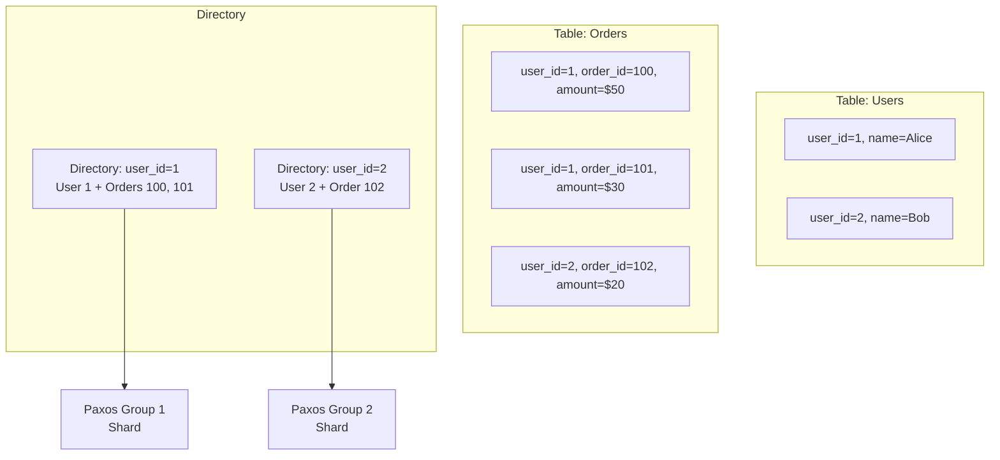
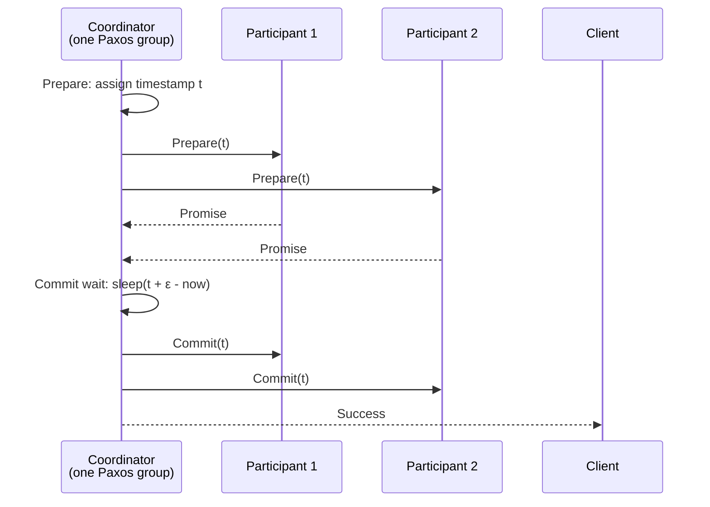

# Google Spanner Internals

## Overview

Google Spanner is a **globally distributed, strongly consistent, SQL database** that combines the horizontal scalability of NoSQL with full ACID transactions and SQL semantics. It achieves **external consistency** (linearizability) across data centers using **TrueTime**, a time service backed by GPS receivers and atomic clocks.

## TrueTime

TrueTime is the foundation of Spanner's consistency guarantees:

```mermaid
graph TD
    GPS[GPS Receivers<br/>per data center] --> TM[TimeMaster<br/>machine]
    AC[Atomic Clocks<br/>per data center] --> TM
    TM -->|TT.now() returns [earliest, latest]| Client
    Client -->|commit wait: t = TT.now().latest<br/>sleep until t + ε| Commit
```

**TT.now()** returns an interval `[earliest, latest]`. The actual time is guaranteed to be within this interval. The uncertainty ε is typically 1-7ms.

**Key invariant**: If transaction A commits before transaction B starts (in real time), then A's commit timestamp < B's commit timestamp.

Spanner achieves this by:
1. Assigning a commit timestamp based on `TT.now().latest` at the start of commit
2. **Commit wait**: The leader waits until `TT.now().earliest > commit_timestamp` (i.e., waits ε) before making the result visible
3. This ensures no transaction can observe a commit before its assigned timestamp is in the past

**External consistency**: A read at time `t` sees all transactions that committed before `t` (linearizability).

## Storage Architecture

### Directory-Based Sharding



- **Directory**: A contiguous key range. The unit of data placement and replication.
- Multiple directories can be colocated in the same **Paxos group** (shard).
- Directories can be split or merged based on load.
- Related data (e.g., a user and their orders) is placed in the same directory for single-Paxos transactions.

### Interleaved Tables

Spanner allows parent-child tables to be **interleaved** — physically colocated on disk:

```sql
CREATE TABLE users (
  user_id INT64 NOT NULL, name STRING(MAX)
) PRIMARY KEY (user_id);

CREATE TABLE orders (
  user_id INT64 NOT NULL, order_id INT64 NOT NULL, amount FLOAT64
) PRIMARY KEY (user_id, order_id),
  INTERLEAVE IN PARENT users ON DELETE CASCADE;
```

Physical layout:
```
/user/42 → [name: Alice]
/user/42/order/100 → [amount: 50]
/user/42/order/101 → [amount: 30]
```

This eliminates the need for distributed transactions when querying a user with their orders — all data is in the same Paxos group. Local reads and writes are much faster than cross-shard operations.

## Replication: Paxos Per Shard

Each shard (Paxos group) has a leader and followers across data centers:

```mermaid
graph TD
    subgraph "Paxos Group: Shard 1"
        L[Leader<br/>us-east1<br/>TT.now() → t₀]
        F1[Follower<br/>us-west1<br/>TT.now() → t₁]
        F2[Follower<br/>eu-west1<br/>TT.now() → t₂]
    end
    Client -->|write| L
    L -->|Paxos prepare/accept| F1
    L -->|Paxos prepare/accept| F2
    F1 -->|ack| L
    F2 -->|ack| L
    L -->|commit wait ε| Client
```

**Write path**:
1. Client sends write to the leader of the appropriate Paxos group
2. Leader acquires a timestamp from TrueTime
3. Leader runs Paxos to replicate the write to followers
4. Leader waits for a majority acknowledgment
5. Leader performs commit wait (ε)
6. Leader returns success to client

**Read path**:
- **Read-write transaction**: Reads go through Paxos (reads at the leader, sees latest writes)
- **Read-only transaction**: Reads from any replica that is sufficiently up-to-date (no Paxos overhead)
- **Snapshot read**: Reads at a historical timestamp (consistent view of the past, no locking)

## Transaction Types

| Type | Latency | Consistency | Paxos | Use Case |
|---|---|---|---|---|
| Read-write | ~10-50ms | External consistency | Yes (leader) | Mutations, linearizable reads |
| Read-only | ~1-10ms | External consistency | No (any replica) | Fresh reads, no writes |
| Snapshot read | ~1-5ms | Snapshot isolation | No (any replica) | Historical reads, stale reads |

**Read-write transactions** use **Pessimistic locking** and **wound-wait deadlock prevention**. The leader acquires locks on the involved key ranges. If a transaction is waiting too long, older transactions are aborted (wound-wait).

**Read-only transactions** are lock-free. They use the TrueTime timestamp to read from a consistent snapshot. If the replica is not sufficiently up-to-date, it waits until it is.

## Distributed Transactions (2PC)

When a transaction spans multiple directories (Paxos groups), Spanner uses **Two-Phase Commit** (2PC):



Each participant is a Paxos group, so the 2PC coordinator failure is handled by the group's consensus — the new leader knows the outcome of the transaction.

## Schema Changes

Spanner supports schema changes **without downtime** through a multi-phase process:

1. **Start**: Schema is submitted, Spanner validates it
2. **Prepare**: Directories are notified of the upcoming schema change
3. **Apply**: Schema change is applied to all directories
4. **Broadcast**: Final notification that the schema change is complete

**Non-blocking**: Reads and writes continue during schema changes. Adding a column is instant (metadata only). Adding an index or dropping a column takes longer (data must be written).

## F1 Hybrid SQL Layer

Spanner is paired with **F1**, a distributed SQL query layer:

- **SQL interface**: Standard SQL with extensions for Spanner
- **Distributed execution**: Queries are pushed down to Paxos groups for parallel execution
- **Join strategies**: Broadcast join, hash join, merge join — optimized based on data distribution
- **Stored procedures**: Not supported directly — use client-side logic

## Performance Characteristics

| Operation | Latency | Notes |
|---|---|---|
| Point read (read-only, local) | 1-5ms | Single Paxos group, no Paxos |
| Point read (read-write) | 5-15ms | Paxos read at leader |
| Point write (local) | 10-50ms | Paxos write + commit wait |
| Cross-shard transaction | 20-100ms | 2PC overhead |
| Schema change (add column) | seconds | Metadata only |
| Schema change (add secondary index) | hours | Backfill entire table |

**Key factors**:
- **Commit wait ε**: Adds 1-7ms to every write (the uncertainty of TrueTime)
- **Cross-shard**: Minimize cross-shard transactions by designing interleaved tables
- **Read-only transactions**: Use them when possible to avoid Paxos overhead

## Comparison to CockroachDB

| Feature | Spanner | CockroachDB |
|---|---|---|
| Clock | TrueTime (GPS + atomic clocks) | HLC (Hybrid Logical Clock) |
| Consensus | Paxos per shard | Raft per range |
| Isolation | Serializable (external consistency) | Serializable Snapshot Isolation |
| Sharding | Directory-based | Range-based (auto-split) |
| Storage | Colossus (GFS successor) | Pebble (LSM-tree) |
| 2PC | Yes (cross-Paxos) | Transaction coordinator |
| Commit wait | Real-time (ε) | HLC propagation delay |
| Clock skew tolerance | None (TrueTime guarantees) | 500ms max |
| Availability | N/A (Google-managed) | Unavailable during clock skew > 500ms |
