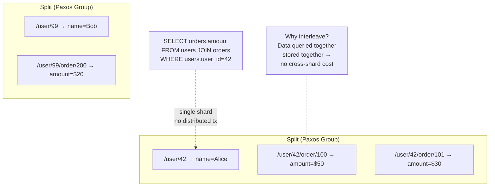
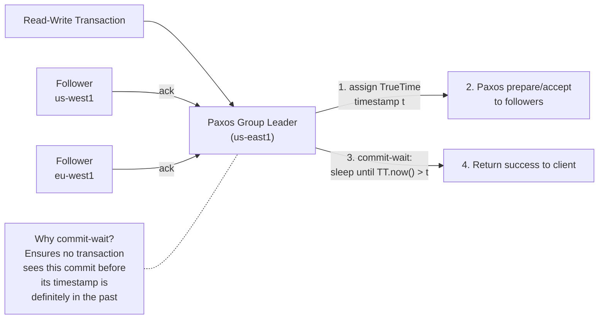
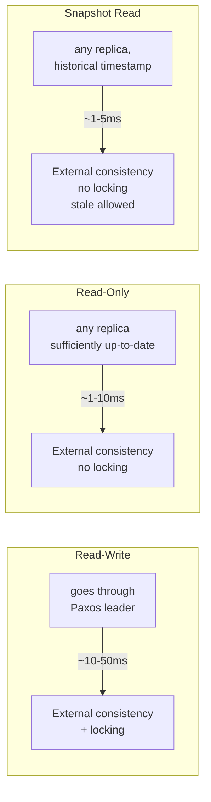

# Google Spanner — Architecture

> For the underlying mechanics of database algorithms,
> see [Storage Engines](../storage-engines.md) and [Database Algorithms](../algorithms.md).

## What Makes It Unique

- **Global-scale SQL with strong consistency** — the first database to offer ACID transactions across continents without relaxing consistency
- **Google's internal database exposed as a cloud service** — built on technologies proven at Google scale (Colossus, TrueTime, Paxos)
- **SQL semantics at NoSQL scale** — full SQL, joins, secondary indexes, and transactions with horizontal scalability that rivals any NoSQL system
- **No compromise between consistency and scale** — external consistency at planetary scale; you don't trade correctness for distribution

## Storage Model

Spanner is a **SQL database** whose data is partitioned into **splits** — contiguous key ranges.
Each split is replicated via its own **Paxos group** (leader + followers across datacenters).
Splits can be split or merged based on load. Data is stored on Colossus (Google's distributed filesystem).

**Interleaved tables** allow parent-child data to be physically colocated within the same split:



```sql
CREATE TABLE users (...) PRIMARY KEY (user_id);
CREATE TABLE orders (...)
  PRIMARY KEY (user_id, order_id),
  INTERLEAVE IN PARENT users ON DELETE CASCADE;
```

This produces a physical layout like `/user/42` → `[name]`, `/user/42/order/100` → `[amount]`,
`/user/42/order/101` → `[amount]`. Queries joining users and orders for a single user are
single-shard — no distributed transaction needed.

**Primary key design** is critical: monotonically increasing keys (auto-increment) create hot spots
(all writes hit one tablet). Hash-based or reverse keys spread writes across tablets.

## Indexing Model

Secondary indexes are themselves tables — distributed across Paxos groups — with a primary key of
`(indexed_columns, base_table_PK)`. Index backfill is online and non-blocking.

- **Standard secondary**: global, distributed. Lookup hits the index's Paxos group(s), then the base table's.
- **Interleaved index** (`INTERLEAVE IN PARENT`): colocated with the base table in the same Paxos group.
  Single-shard reads, no cross-shard lookup.
- **STORING clause**: non-key columns added to the index leaf for covering queries — avoids a second lookup.
- **NULL-filtered index** (`WHERE col IS NOT NULL`): smaller index, skips rows with NULL keys.

## Transactions & Replication

Spanner uses **Paxos** for intra-shard replication and **2PC** for cross-shard transactions.



**Write path**: Client → leader → TrueTime timestamp → Paxos replicate → majority ack → commit-wait ε → success.

**Transaction path comparison**:



- **Read-write**: external consistency, goes through Paxos leader, pessimistic locking + wound-wait
- **Read-only**: external consistency, reads from any sufficiently up-to-date replica — no Paxos, no locking
- **Snapshot read**: reads at a historical timestamp, any replica, no locking

The commit-wait is the key: after a majority acks, the leader sleeps until `TT.now().earliest > commit_timestamp`.
This guarantees that no transaction can read a commit before its assigned timestamp is in the past — achieving
global ordering without a single global clock or centralized timestamp oracle.
