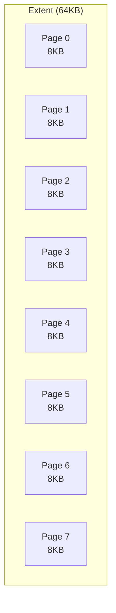
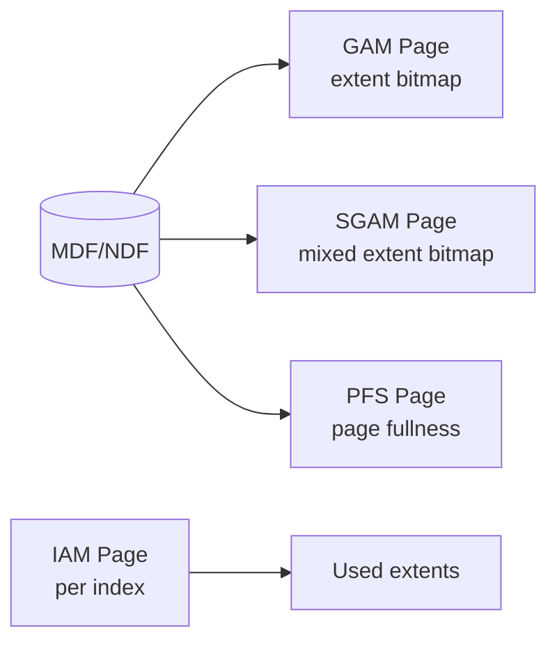
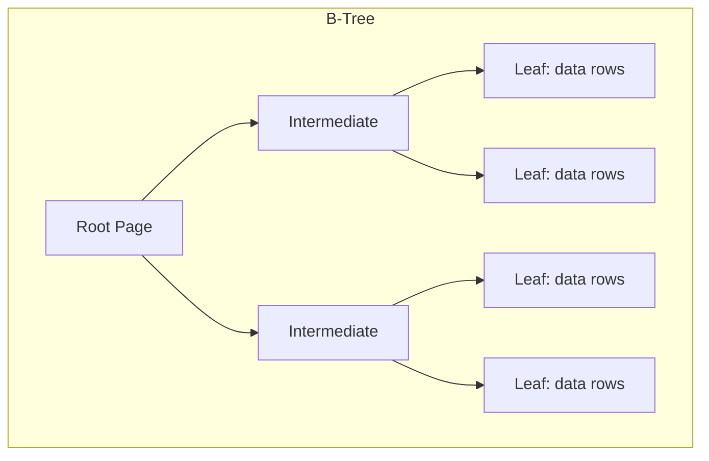
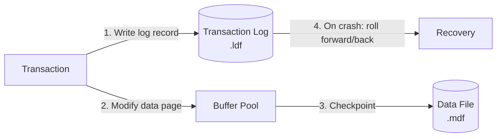
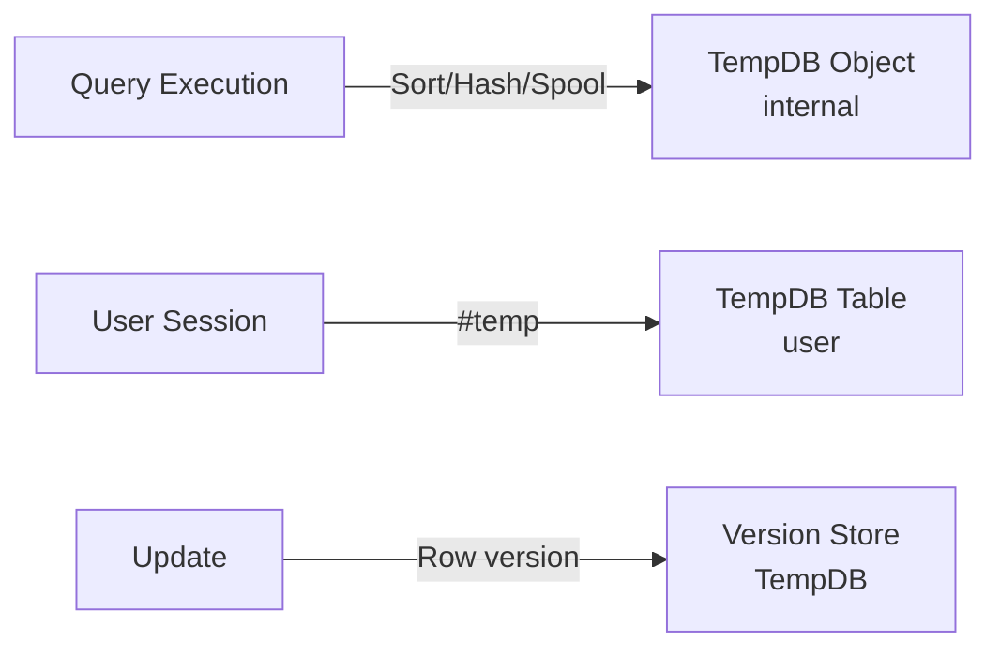
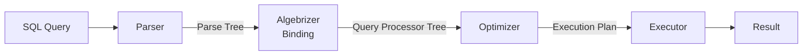
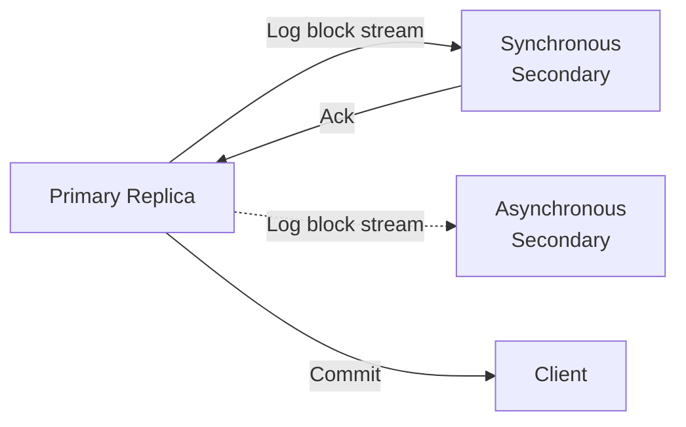

# SQL Server Storage Engine

## Page and Extent Architecture

SQL Server stores data in **pages** (8KB) grouped into **extents** (8 contiguous pages = 64KB).



### Page Layout

```
┌─────────────────────────────────┐
│  Page Header (96 bytes)         │  ← page ID, LSN, type, slot count
├─────────────────────────────────┤
│  Row Offset Array               │  ← 2-byte slot entries (grows down)
├─────────────────────────────────┤
│                                 │
│  Free Space                     │
│                                 │
├─────────────────────────────────┤
│  Row Data                       │  ← grows up from bottom
└─────────────────────────────────┘
```

**Page types**: Data, Index, Text/Image, GAM, SGAM, PFS, IAM, BCM, DCM, etc.

## Allocation Bitmap Pages

| Page type | Purpose | Coverage |
|---|---|---|
| **GAM** (Global Allocation Map) | Tracks allocated extents (1 = free, 0 = allocated) | ~64K extents per GAM (4GB) |
| **SGAM** (Shared Global Allocation Map) | Tracks mixed extents with free pages | Same coverage |
| **PFS** (Page Free Space) | Tracks free space per page ( ≈ empty, 1-50%, 51-80%, 81-95%, >95%) | 8088 pages per PFS (~64MB) |
| **IAM** (Index Allocation Map) | Tracks which extents belong to an index/heap | Per index/heap |



## Storage Structures

### Clustered Index

Data rows stored in B-Tree leaf pages, ordered by the clustering key:



- Leaf pages contain the full data row (not a pointer).
- The clustering key is included in every non-clustered index (as the row locator).
- Clustering key choice matters: narrow, static, monotonically increasing (like an IDENTITY) avoids fragmentation and excessive non-clustered index size.

### Heap

A table without a clustered index. Data is not stored in any particular order:

- **Row ID (RID)**: `(FileID:PageID:SlotNumber)` — the physical location of the row.
- **IAM pages**: Track which extents belong to the heap. SQL Server uses IAM chains to scan the heap, avoiding index fragmentation.
- **Forwarding pointers**: When a heap row is updated and no longer fits in its page, the row moves to a new page and leaves a forwarding pointer. Excessive forwarding is a sign to rebuild or create a clustered index.

### Non-Clustered Index

A separate B-Tree with leaf pages storing index keys plus the row locator:

| Row locator | For clustered index | For heap |
|---|---|---|
| Pointer | Clustering key | RID (FileID:PageID:Slot) |

- **Covering index**: Include non-key columns in the leaf (`INCLUDE` clause) to avoid key lookups.
- **Filtered index**: `CREATE INDEX ... WHERE condition` — smaller index for subset of rows.
- **Columnstore index**: Column-oriented storage as rowgroups and column segments (plus a delta rowgroup using B-trees). Not traditional 8KB page extents.

## Index System

| Index type | Description |
|---|---|
| **Clustered** | Data rows stored in B-Tree leaf pages. One per table. |
| **Non-clustered** | Separate B-Tree with index keys + row locator. Up to 999 per table. |
| **Columnstore** | Column-oriented, compressed batch-mode storage. For analytics / DSS workloads. |
| **Filtered** | `CREATE INDEX ... WHERE condition`. Smaller subset of rows. |
| **Full-text** | Inverted index for text search (word-level). |
| **Spatial** | B-tree index with hierarchical grid decomposition (tessellation) for geometry/geography data. |
| **XML** | Index on XML column for XPath/XQuery. |
| **Memory-optimized** | Non-clustered hash + range indexes for in-memory OLTP (Hekaton). |

**B-Tree structure**: Root → intermediate → leaf. Non-leaf pages store key values + page pointers. Leaf pages store key values + row locator (clustering key or RID). Pages are linked at the leaf level in a doubly-linked list for range scans.

**Fill factor**: Percentage of each leaf page filled on index build/rebuild. Default 0 (100% full). Lower fill factor (70-80%) reduces page splits for tables with random inserts.

**Index statistics**: Histogram on the leading column + density on all column combinations. Stored as blob in `sys.stats`. Updated manually via `UPDATE STATISTICS` or automatically via `auto_update_stats`.

**Index maintenance**:
- **Rebuild**: Drops and recreates the index. Offline (blocking) or online (mostly non-blocking, but acquires a brief schema-modification (Sch-M) lock at the end for clustered index rebuilds, Enterprise edition).
- **Reorganize**: Defragments leaf pages by reordering. Online, but less effective than rebuild.

**Key lookup (bookmark lookup)**: When a non-clustered index does not cover the query, SQL Server must fetch the full row from the clustered index or heap using the row locator. For many rows, this becomes expensive — a scan may be cheaper than many individual lookups.

## Transaction Log (.ldf)

A write-ahead log recording all modifications:



**VLF (Virtual Log File)** segments: The log file is divided into VLF segments of varying size. Key states:

- **Active**: Contains log records needed for recovery or rollback
- **Inactive**: All transactions committed, log can be truncated
- **Reusable**: In SIMPLE recovery model, truncated VLFs are overwritten

**Recovery models**:
| Model | Log behavior | Use case |
|---|---|---|
| **SIMPLE** | Log truncated at checkpoints | Dev/test, no point-in-time recovery |
| **FULL** | Log grows until backup | Production, point-in-time recovery |
| **BULK_LOGGED** | Minimal logging for bulk ops | ETL, index rebuilds |

**Log structure**: Each log record has LSN, transaction ID, page ID, operation type, and before/after image data.

## TempDB

A global temporary database used for:

- **Internal objects**: Sort runs, hash joins, spools, work tables for cursors
- **User objects**: `#temp` tables, `##global` temp tables, table variables
- **Version store**: Row versions for snapshot isolation (READ COMMITTED SNAPSHOT, SNAPSHOT isolation)



**TempDB contention**: High concurrency on system pages (PFS, GAM, SGAM) can cause latch contention. Mitigations:

- Add multiple TempDB data files: if logical processors ≤ 8, use the same number; if > 8, use 8 files (increase by multiples of 4 only if contention persists)
- Use `SET TF 1118` (uniform extent allocation)
- Memory-optimized TempDB metadata (SQL Server 2019+)

## Buffer Pool

- Stores 8KB data pages in memory.
- Uses a standard algorithm for page eviction (not documented as pure LRU or clock).
- **Lazy writer**: Background process that frees buffer pages based on memory pressure.
- **Read-ahead**: Extent-level prefetch for sequential scans.
- **Buffer Pool Extension**: Allows SSD to be used as a second-level cache (SQL Server 2014+).

## Query Execution

SQL Server uses a **cost-based optimizer** with a four-stage pipeline:



**Parser**: Converts SQL text to a parse tree. Validates syntax, tokenizes identifiers.

**Algebrizer (Binding)**: Resolves names, validates types, checks permissions, builds a **query processor tree** (a logical representation of the query). This is where view expansion and CTE binding happen.

**Optimizer**: Cost-based, explores plan alternatives using transformation rules:
- **Trivial plan optimization**: If the query is simple enough (single-table, trivial predicates), the optimizer returns immediately without cost-based search.
- **Full optimization**: Explores join orders, index choices, and parallelization. Uses a top-down search with pruning.
- **Parallel optimization**: Considers exchange operators (Distribute Streams, Repartition Streams, Gather Streams).

**Access methods**:

| Access method | Description |
|---|---|
| **Index Seek** | B-Tree traversal to a specific key range. Most efficient for selective queries. |
| **Index Scan** | Full or partial scan of index leaf pages. |
| **Table Scan** | Scan all pages of a heap or clustered index. |
| **Key Lookup** | Fetch full row from clustered index using a non-clustered index row locator. |
| **RID Lookup** | Fetch full row from a heap using the RID from a non-clustered index. |

**Join strategies**: Nested Loop (small outer, indexed inner), Hash Match (medium tables, equi-join), Merge Join (sorted inputs, large tables). The optimizer uses a **memo-based search** with cost estimates from index statistics.

**Execution modes**:
- **Row mode**: Traditional — one row at a time through the query plan. Used for B-Tree indexes, most OLTP queries.
- **Batch mode**: Processes multiple rows together. Used for columnstore indexes. Drastically reduces CPU for analytic queries.
- **Batch mode on rowstore** (SQL Server 2019+): Batch mode can be applied to queries that reference only B-Tree indexes, extending benefits to analytic queries on rowstore tables.

**Query plan caching**: Plans are cached in memory and reused. Parameter-sensitive plans (parameter sniffing) can be problematic — a plan optimized for one parameter value may be suboptimal for another. Mitigations: `OPTIMIZE FOR`, `RECOMPILE`, Query Store.

**Query Store** (SQL Server 2016+): Persists query plans and runtime statistics. Enables plan forcing, regression detection, and A/B comparison of plan variants.

## Locking and Versioning

| Lock granularity | Description |
|---|---|
| Row-level | Single row (RID or key) |
| Page-level | 8KB page |
| Extent-level | 64KB (8 pages) |
| Table-level | Entire table |
| Database-level | Entire database |

**Lock escalation**: Escalation happens when a single statement acquires > 5,000 locks on a single reference of a table. The instance-level threshold is based on memory pressure (24% of Database Engine memory when `locks` is at its default of 0). Escalation can go directly to table/HoBT and does not require a mandatory row → page → table progression.

**Lock modes**: Shared (S), Update (U), Exclusive (X), Intention-Shared (IS), Intention-Exclusive (IX), Shared-Intention-Exclusive (SIX), Schema, Bulk Update (BU).

**Row versioning**:

| Isolation level | Implementation |
|---|---|
| READ COMMITTED (default) | On on-premises SQL Server and Azure SQL Managed Instance: no row versioning (readers block writers). On Azure SQL Database: uses row versioning by default (`READ_COMMITTED_SNAPSHOT` defaults to `ON`). |
| READ COMMITTED SNAPSHOT (RCSI) | Statement-level consistent read using version store |
| SNAPSHOT | Transaction-level consistent read using version store |

## Replication

SQL Server offers multiple replication technologies:

| Technology | Description | Use case |
|---|---|---|
| **Snapshot replication** | Point-in-time copy of entire publication. Simple, high overhead. | Reporting, reference data. |
| **Transactional replication** | Log reader agent reads transaction log and applies changes to subscribers. Near real-time. | Scale-out reads, data warehouse staging. |
| **Merge replication** | Both publisher and subscribers can make changes. Conflict resolution built-in. | Disconnected/mobile scenarios. |

**Always On Availability Groups** (SQL Server 2012+): The primary HA/DR technology. Maintains one or more **readable secondary replicas** via **synchronous** (commit waits for secondary, RPO=0) or **asynchronous** (no wait, RPO>0) log transport.



- **Failover**: Automatic (synchronous with cluster quorum) or manual (any mode).
- **Readable secondaries**: Secondary replicas can serve read-only queries, backup, and DBCC operations.
- **Listener**: Virtual network name that routes connections to the current primary.
- **Distributed Availability Group**: Span across datacenters — primary AG replicates to a secondary AG.

**Log Shipping**: Periodic transaction log backup → copy → restore to a standby server. Simpler than AG, supports limited read-only access to secondary databases when restored with `STANDBY`, manual failover.

**Database Mirroring** (legacy, deprecated in SQL Server 2022): Single secondary with witness for automatic failover. Replaced by Always On AG.

**Key factors**:
- **Page split rates**: High fragmentation = wasted space + more I/O. Keep fill factor appropriate.
- **Wait stats**: Primary diagnostic tool — `PAGEIOLATCH_SH` (disk I/O), `LCK_M_X` (blocking), `PAGELATCH_UP` (page contention).
- **MAXDOP**: Degree of parallelism for queries. High values can cause CXPACKET waits.

---

*Last verified against official Microsoft SQL Server documentation: 2026-06-13*
