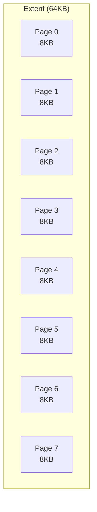
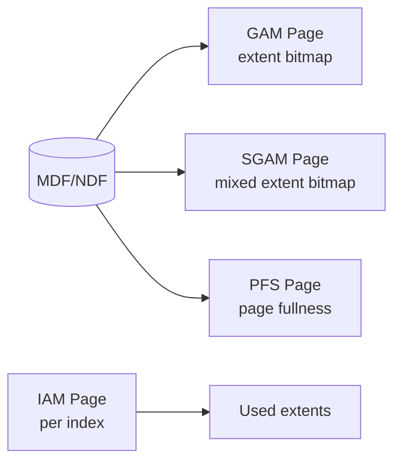
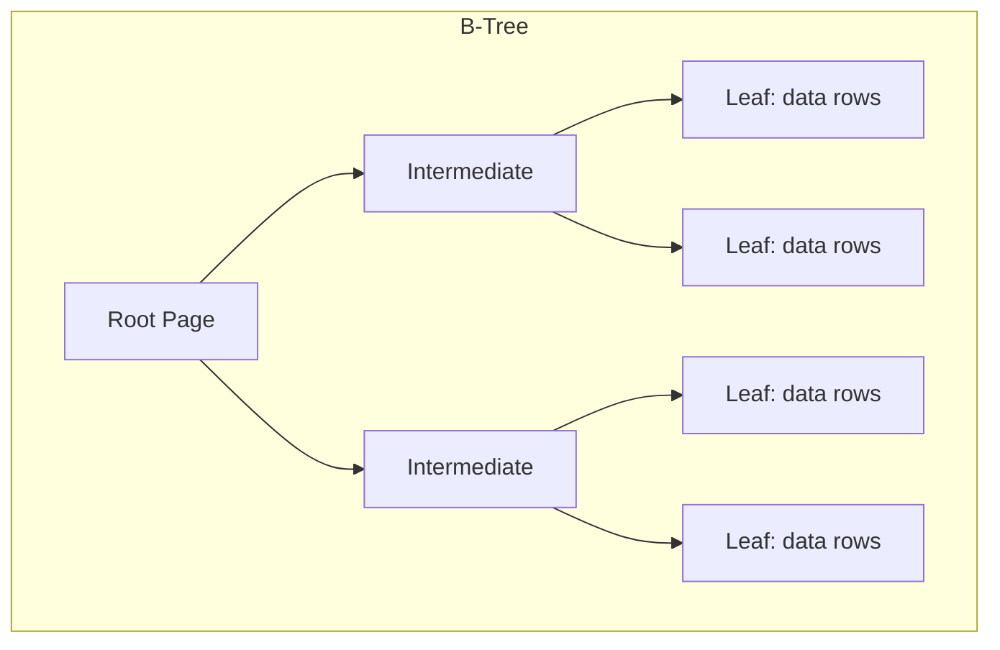
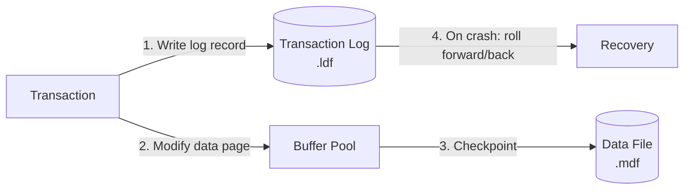
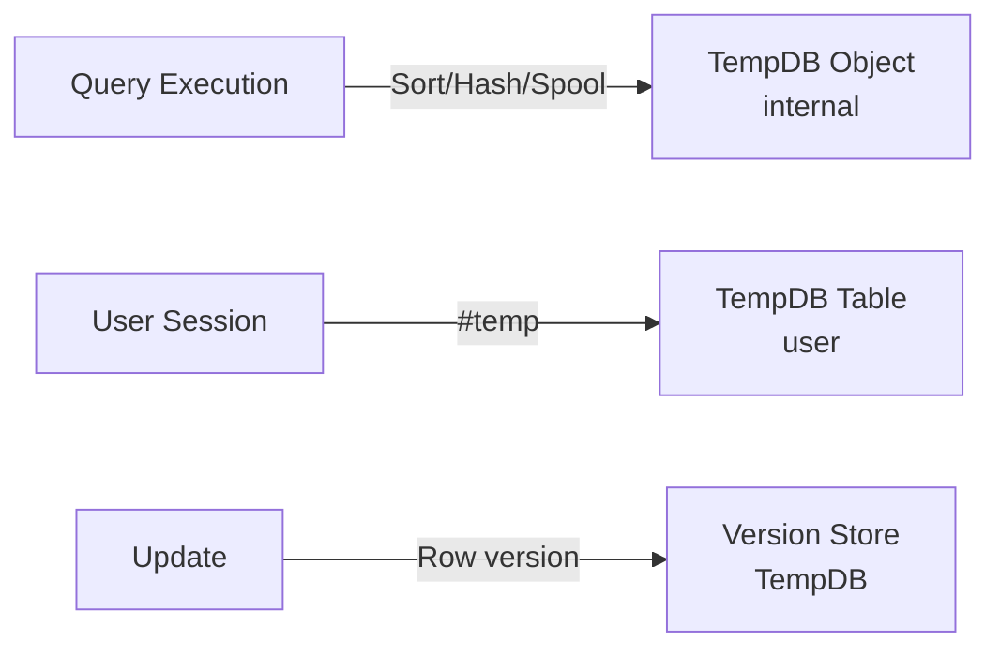

# SQL Server Storage Engine

## Page and Extent Architecture

SQL Server stores data in **pages** (8KB) grouped into **extents** (8 contiguous pages = 64KB).



**Extent types**:
| Type | Description |
|---|---|
| **Uniform** | Owned entirely by one object (table or index) |
| **Mixed** | Shared by up to 8 objects — used for small tables (< 8 pages) |

### Page Layout

```
┌─────────────────────────────────┐
│  Page Header (96 bytes)         │  ← page ID, LSN, type, slot count
├─────────────────────────────────┤
│  Row Offset Array               │  ← 2-byte slot entries (grows down)
├─────────────────────────────────┤
│                                 │
│  Free Space                     │
│                                 │
├─────────────────────────────────┤
│  Row Data                       │  ← grows up from bottom
└─────────────────────────────────┘
```

**Page types**: Data, Index, Text/Image, GAM, SGAM, PFS, IAM, BCM, DCM, etc.

## Allocation Bitmap Pages

| Page type | Purpose | Coverage |
|---|---|---|
| **GAM** (Global Allocation Map) | Tracks allocated extents (1 = free, 0 = allocated) | ~64K extents per GAM (4GB) |
| **SGAM** (Shared Global Allocation Map) | Tracks mixed extents with free pages | Same coverage |
| **PFS** (Page Free Space) | Tracks free space per page ( ≈ empty, 1-50%, 51-80%, 81-95%, >95%) | 8088 pages per PFS (~64MB) |
| **IAM** (Index Allocation Map) | Tracks which extents belong to an index/heap | Per index/heap |



## Storage Structures

### Clustered Index

Data rows stored in B-Tree leaf pages, ordered by the clustering key:



- Leaf pages contain the full data row (not a pointer).
- The clustering key is included in every non-clustered index (as the row locator).
- Clustering key choice matters: narrow, static, monotonically increasing (like an IDENTITY) avoids fragmentation and excessive non-clustered index size.

### Heap

A table without a clustered index. Data is not stored in any particular order:

- **Row ID (RID)**: `(FileID:PageID:SlotNumber)` — the physical location of the row.
- **IAM pages**: Track which extents belong to the heap. SQL Server uses IAM chains to scan the heap, avoiding index fragmentation.
- **Forwarding pointers**: When a heap row is updated and no longer fits in its page, the row moves to a new page and leaves a forwarding pointer. Excessive forwarding is a sign to rebuild or create a clustered index.

### Non-Clustered Index

A separate B-Tree with leaf pages storing index keys plus the row locator:

| Row locator | For clustered index | For heap |
|---|---|---|
| Pointer | Clustering key | RID (FileID:PageID:Slot) |

- **Covering index**: Include non-key columns in the leaf (`INCLUDE` clause) to avoid key lookups.
- **Filtered index**: `CREATE INDEX ... WHERE condition` — smaller index for subset of rows.
- **Columnstore index**: Column-oriented storage for analytics (not B-Tree, but stored in page extents).

## Transaction Log (.ldf)

A write-ahead log recording all modifications:



**VLF (Virtual Log File)** segments: The log file is divided into VLF segments of varying size. Key states:

- **Active**: Contains log records needed for recovery or rollback
- **Inactive**: All transactions committed, log can be truncated
- **Reusable**: In SIMPLE recovery model, truncated VLFs are overwritten

**Recovery models**:
| Model | Log behavior | Use case |
|---|---|---|
| **SIMPLE** | Log truncated at checkpoints | Dev/test, no point-in-time recovery |
| **FULL** | Log grows until backup | Production, point-in-time recovery |
| **BULK_LOGGED** | Minimal logging for bulk ops | ETL, index rebuilds |

**Log structure**: Each log record has LSN, transaction ID, page ID, operation type, and before/after image data.

## TempDB

A global temporary database used for:

- **Internal objects**: Sort runs, hash joins, spools, work tables for cursors
- **User objects**: `#temp` tables, `##global` temp tables, table variables
- **Version store**: Row versions for snapshot isolation (READ COMMITTED SNAPSHOT, SNAPSHOT isolation)



**TempDB contention**: High concurrency on system pages (PFS, GAM, SGAM) can cause latch contention. Mitigations:

- Add multiple TempDB data files (one per CPU core, equal size)
- Use `SET TF 1118` (uniform extent allocation)
- Memory-optimized TempDB metadata (SQL Server 2019+)

## Buffer Pool

- Stores 8KB data pages in memory.
- **Clock algorithm** (not pure LRU) for page eviction.
- **Lazy writer**: Background process that frees buffer pages based on memory pressure.
- **Read-ahead**: Extent-level prefetch for sequential scans.
- **Buffer Pool Extension**: Allows SSD to be used as a second-level cache (SQL Server 2014+).

## Locking and Versioning

| Lock granularity | Description |
|---|---|
| Row-level | Single row (RID or key) |
| Page-level | 8KB page |
| Extent-level | 64KB (8 pages) |
| Table-level | Entire table |
| Database-level | Entire database |

**Lock escalation**: From row → page → table (when > 5000 locks on a single query or > 5000 locks total).

**Lock modes**: Shared (S), Update (U), Exclusive (X), Intention-Shared (IS), Intention-Exclusive (IX), Shared-Intention-Exclusive (SIX), Schema, Bulk Update (BU).

**Row versioning**:

| Isolation level | Implementation |
|---|---|
| READ COMMITTED (default) | No row versioning — readers block writers |
| READ COMMITTED SNAPSHOT (RCSI) | Statement-level consistent read using version store |
| SNAPSHOT | Transaction-level consistent read using version store |

## Performance Characteristics

| Operation | Latency | Notes |
|---|---|---|
| Point lookup (clustered, cached) | 10-200μs | B-Tree traversal in buffer pool |
| Point lookup (non-clustered + key lookup) | 50-500μs | Two B-Tree traversals |
| Range scan | 100μs-10ms | Sequential per extent |
| Write (single row, SIMPLE) | 100μs-1ms | Log buffer + page in buffer pool |
| Write (FULL recovery) | 1-10ms | Log flush on commit |
| Index rebuild (online) | minutes-hours | Non-blocking with row versioning |

**Key factors**:
- **Page split rates**: High fragmentation = wasted space + more I/O. Keep fill factor appropriate.
- **Wait stats**: Primary diagnostic tool — `PAGEIOLATCH_SH` (disk I/O), `LCK_M_X` (blocking), `PAGELATCH_UP` (page contention).
- **MAXDOP**: Degree of parallelism for queries. High values can cause CXPACKET waits.
