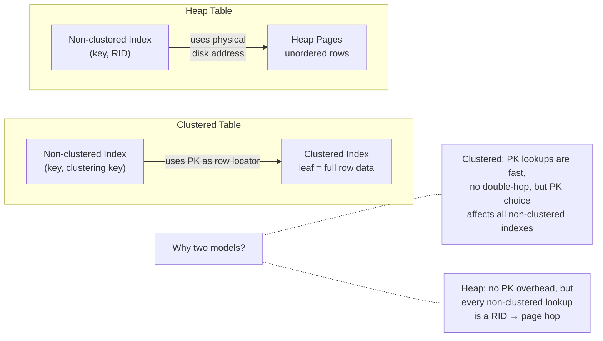
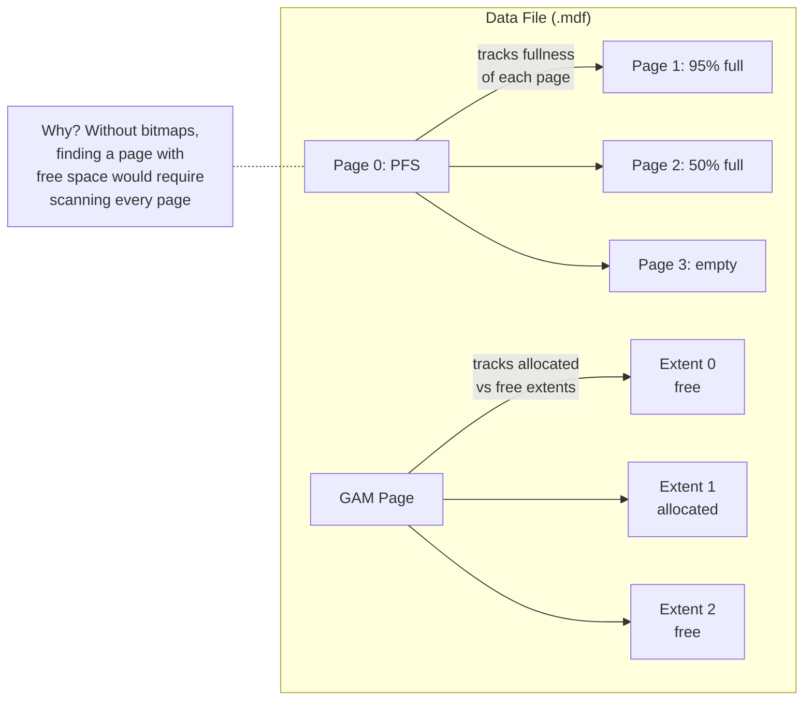

# SQL Server — Architecture

> For the underlying mechanics of B-Trees, heap storage, WAL, and related algorithms,
> see [Storage Engines](../storage-engines.md) and [Database Algorithms](../algorithms.md).

## What Makes It Unique

- **Deep Microsoft ecosystem integration** — first-class Active Directory, .NET, SSIS, SSRS, and Azure pipelines integration
- **HA with readable secondaries** — Always On Availability Groups let replicas serve read traffic while staying in sync
- **Columnstore and rowstore in one engine** — OLTP and analytics workloads coexist without separate infrastructure
- **Managed introspection** — Query Store, Dynamic Management Views, and built-in tuning advisor provide deep observability out of the box

## Storage Model

SQL Server stores data in 8KB **pages** grouped into **extents** (8 contiguous pages = 64KB). A single extent
can belong to one object (uniform) or be shared by up to 8 objects (mixed, for small tables).

Two storage structures:
- **Clustered index** — the table IS a B-Tree. Leaf pages contain full rows ordered by the clustering key.
  The clustering key is included in every non-clustered index. Narrow, static, monotonically increasing
  keys (IDENTITY) minimize fragmentation.
- **Heap** — a table without a clustered index. Rows are identified by `RID = (FileID:PageID:Slot)`.
  Non-clustered indexes store the RID. Updates that grow rows create **forwarding pointers** if the
  row no longer fits on its page.

(For B-Tree and heap page mechanics, see [B-Tree](../storage-engines.md#b-tree) and [Heap](../storage-engines.md#heap))

## Indexing Model

Non-clustered indexes are separate B-Trees storing `(key, row_locator)`. The row locator is either the
clustering key (clustered table) or the RID (heap). The `INCLUDE` clause stores non-key columns in the leaf
to create covering indexes.

When a non-clustered index doesn't cover the query, SQL Server performs a **Key Lookup** (clustered)
or **RID Lookup** (heap) to fetch the full row. For many rows, a full scan may be cheaper than many
individual lookups.

**Columnstore indexes** are a separate storage model: column-oriented, compressed, with batch-mode
execution for analytics. Not traditional 8KB pages.

**Allocation bitmaps** track every page without scanning:

**TempDB**: Internal work tables (sorts, hash joins, spools) and the row-versioning **version store**
(for READ COMMITTED SNAPSHOT and SNAPSHOT isolation) all live in TempDB. High-concurrency TempDB
contention on PFS/GAM/SGAM pages is a classic performance bottleneck mitigated by multiple data files.
