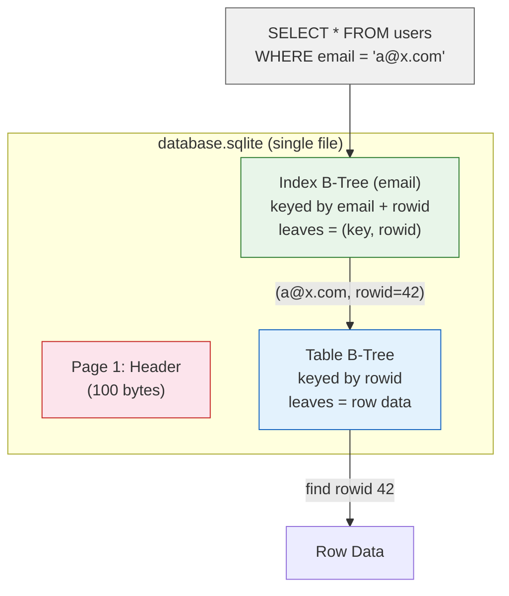

# SQLite — Architecture

> For the underlying mechanics of B-Trees, WAL, and related algorithms,
> see [Storage Engines](../storage-engines.md) and [Database Algorithms](../algorithms.md).

## What Makes It Unique

- **Zero-install, zero-config** — a library you link into your application, not a server to manage
- **Single-file database** — the entire database is a single disk file; copy it, email it, version it
- **The most deployed database engine on the planet** — every smartphone, browser, embedded device, and desktop app ships with it
- **Backward-compatible file format since 2004** — a database file from SQLite 3.0 opens in the latest version with no migration

## Storage Model

SQLite stores the entire database in a **single file** using a B-Tree structure. The file begins with a
header page (100-byte magic + metadata), followed by B-Tree pages (4KB default, configurable to 64KB).

Each table is a B-Tree keyed by **rowid** (a 64-bit signed integer, accessible as `rowid`, `_rowid_`, or `oid`).
Row data is stored as a record in the leaf page. `WITHOUT ROWID` tables use the primary key as the B-Tree
key directly — rows are ordered by PK, like InnoDB's clustered index, but without the PK update cascade problem
(since there is no separate rowid to maintain in secondary indexes).

Values too large for a page are split across **overflow pages** — a linked list of pages storing the excess.
Deleted pages go on a **freelist** for reuse.

(For B-Tree mechanics, see [B-Tree](../storage-engines.md#b-tree))

## Indexing Model

Indexes are separate B-Trees stored in the same database file. Each index leaf stores `(key, rowid)`.
A secondary lookup follows: index → rowid → table B-Tree. No clustered indexes (except `WITHOUT ROWID` —
which is the table itself, not a separate index).

SQLite supports **partial indexes** (`WHERE` clause), **expression indexes** (`LOWER(col)`),
and **automatic indexes** — transient indexes built during a query for an unindexed join, discarded afterward.

Schema is stored in the `sqlite_schema` table (always at root page 1), read once at database open.
