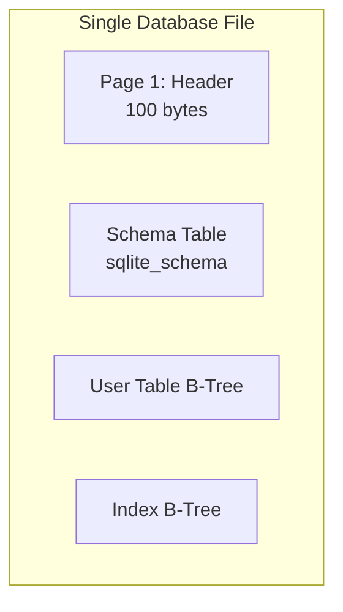
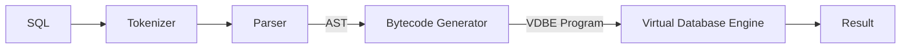
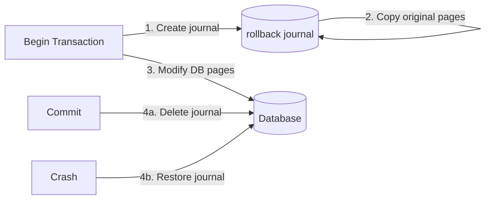
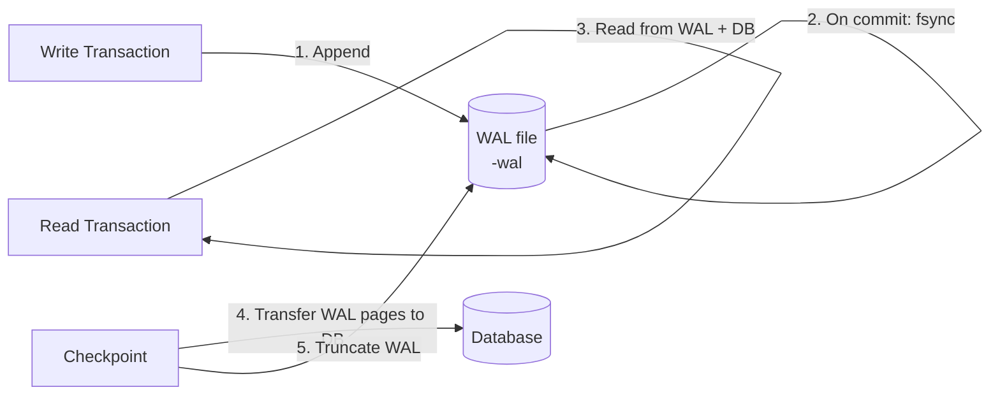
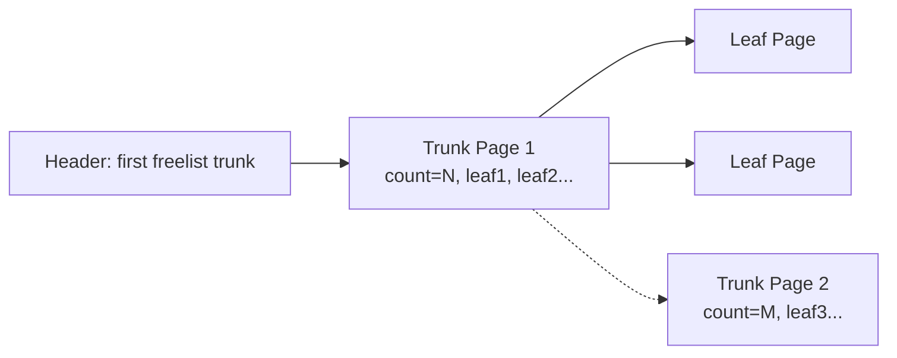

# SQLite Internals

## Data Model

SQLite uses **manifest typing** — the type is stored with the value, not enforced by the column. This makes it dynamically typed despite having a SQL schema.

| Concept | Detail |
|---|---|
| **Type affinity** | Each column has an affinity (`TEXT`, `NUMERIC`, `INTEGER`, `REAL`, `BLOB`) that determines how inserted values are coerced. The affinity does NOT reject mismatched types — it just guides conversion. |
| **Rowid** | Every row has a unique 64-bit signed integer `rowid`. Accessible via `rowid`, `_rowid_`, or `oid`. Tables created without `WITHOUT ROWID` use the rowid as the B-Tree key. |
| **WITHOUT ROWID tables** | Use the primary key as the B-Tree key (like InnoDB). No separate rowid column. Requires an explicit `PRIMARY KEY`. |
| **Allowed types per value** | `NULL`, `INTEGER` (1-8 bytes), `REAL` (8-byte IEEE), `TEXT` (UTF), `BLOB` (raw bytes). No `BOOLEAN` — stored as INTEGER 0/1. No `DATE` — stored as TEXT/INTEGER/REAL. |
| **Schema enforcement** | Looser than other SQL databases. `CREATE TABLE t (a INT)` does not prevent inserting `'hello'` into `a`. The column affinity tries to convert, but if conversion fails, the value is stored as-is. |
| **Constraints** | Supports `PRIMARY KEY`, `FOREIGN KEY` (enforced only with `PRAGMA foreign_keys = ON`), `UNIQUE`, `CHECK`, `NOT NULL`. |
| **Generated columns** | `GENERATED ALWAYS AS (...) [STORED | VIRTUAL]` (SQLite 3.31+). Virtual computed on read, stored persisted. |

## Storage Engine: B-Tree in a Single File

SQLite stores the entire database in a **single file** using a B-Tree structure. Pages are 4KB by default (configurable up to 64KB).



## Page Types

| Page Type | Description |
|---|---|
| **Header page** | Page 1 — database header (100 bytes) |
| **Lock-byte page** | Page spanning byte offset 1,073,741,824 — reserved lock byte for concurrency (only in files > 1 GB) |
| **Table B-Tree leaf** | Contains actual table row data |
| **Table B-Tree interior** | Contains key + pointer to child page |
| **Index B-Tree leaf** | Contains index key + rowid |
| **Index B-Tree interior** | Contains key + pointer to child page |
| **Overflow page** | Stores portion of a value too large for the row |
| **Pointer map page** | Tracks child pages of a page (for incremental vacuum) |
| **Free list page** | Unused page, linked to other free pages |

### Database Header (Page 1, first 100 bytes)

| Offset | Size | Field | Value |
|---|---|---|---|
| 0 | 16 | Header string | `SQLite format 3\0` |
| 16 | 2 | Page size | 512-65536 (power of 2) |
| 18 | 1 | Write version | 1 (legacy) or 2 (WAL) |
| 19 | 1 | Read version | 1 (legacy) or 2 (WAL) |
| 20 | 1 | Reserved space per page | Usually 0 |
| 21 | 1 | Max embedded payload fraction | 64 (fixed) |
| 22 | 1 | Min embedded payload fraction | 32 (fixed) |
| 23 | 1 | Leaf payload fraction | 32 (fixed) |
| 24 | 4 | File change counter | Increments on each modification |
| 28 | 4 | Database size in pages | 0 = unknown |
| 32 | 4 | First freelist trunk page | 0 = no free pages |
| 36 | 4 | Total free pages | Count for freelist |
| 40 | 4 | Schema cookie | Increments when schema changes |
| 44 | 4 | Schema format number | 1-4 |
| 48 | 4 | Default page cache size | Hint |
| 52 | 4 | Largest root B-Tree page number | Auto-vacuum mode |
| 56 | 4 | Text encoding | 1=UTF-8, 2=UTF-16le, 3=UTF-16be |
| 60 | 4 | User version | Application-defined |
| 64 | 4 | Incremental vacuum mode | 0 = no, 1 = yes |
| 68 | 4 | Application ID | Magic for file type detection |
| 72 | 20 | Reserved | Zeroes |
| 92 | 4 | Version-valid-for number | Must match file change counter |
| 96 | 4 | SQLITE_VERSION_NUMBER | SQLite version |

## B-Tree Cell Structure

### Table B-Tree Leaf Cell

```
┌──────────────────────────────────────────┐
│  Varint: payload length                   │
│  Varint: rowid                            │
│  Payload: actual row data (header + body) │
└──────────────────────────────────────────┘
```

### Table B-Tree Interior Cell

```
┌───────────────────────────────────┐
│  4-byte integer: left child page  │
│  Varint: rowid of separator key   │
└───────────────────────────────────┘
```

### Index B-Tree Leaf Cell

```
┌──────────────────────────────────────────┐
│  Varint: payload length                   │
│  Payload: key data (including rowid)      │
│  Optional: 4-byte overflow page pointer   │
└──────────────────────────────────────────┘
```

## Index System

SQLite uses **B-Tree indexes** stored as separate B-Tree pages within the same database file:

| Index type | Description |
|---|---|
| **Standard** | `CREATE INDEX idx ON t(col)`. B-Tree with key + rowid at leaf. |
| **Unique** | `CREATE UNIQUE INDEX`. Prevents duplicate keys. |
| **Partial** | `CREATE INDEX idx ON t(col) WHERE condition`. Smaller index, subset of rows. |
| **Expression** | `CREATE INDEX idx ON t(LOWER(col))`. Index on computed expression (SQLite 3.9+). |

**Index B-Tree leaf cell** stores key data (not the full row). The rowid of the table row is the last column of the key record stored in the payload. An optional 4-byte overflow page pointer follows the payload if the key does not fit on the page.

**No clustered indexes**: The only clustered structure is a `WITHOUT ROWID` table, where the primary key IS the B-Tree key. Standard tables always have a rowid-based B-Tree, and indexes point to rowids.

**Automatic index**: SQLite may create a transient automatic index for joins when no suitable index exists. The index is built during query execution and discarded afterwards. Visible in `EXPLAIN QUERY PLAN` as `AUTOMATIC`.

**Index usage**: The query planner uses indexes for:
- WHERE clause filtering (equality, range, `IN`)
- ORDER BY (if index provides sorted order)
- Joins (indexed inner table)
- Covering queries (if index includes all queried columns)

## Record Format

Each row is stored as a **record** with a header and body:

```
┌──────────────────────────────────────┐
│  Header size (varint)                 │
│  Type 1 (varint)                      │  ← one per column
│  Type 2 (varint)                      │
│  ...                                  │
│  Data 1                               │  ← actual column values
│  Data 2                               │
│  ...                                  │
└──────────────────────────────────────┘
```

**Serial type codes**:

| Code | Value | Storage |
|---|---|---|
| 0 | NULL | 0 bytes |
| 1 | 8-bit signed int | 1 byte |
| 2 | 16-bit signed int | 2 bytes |
| 3 | 24-bit signed int | 3 bytes |
| 4 | 32-bit signed int | 4 bytes |
| 5 | 48-bit signed int | 6 bytes |
| 6 | 64-bit signed int | 8 bytes |
| 7 | 64-bit float | 8 bytes |
| 8 | 0 (integer zero) | 0 bytes |
| 9 | 1 (integer one) | 0 bytes |
| 10,11 | Reserved | Internal use |
| N ≥ 12 | If even: BLOB of (N-12)/2 bytes; if odd: TEXT of (N-13)/2 bytes |

## Query Execution

SQLite has a **simple but effective query planner**. Unlike PostgreSQL or MySQL, it uses a combination of loop-based heuristics and (since 3.8.0) cost-based optimization:



**Tokenizer + Parser**: Converts SQL into an AST (abstract syntax tree). SQLite uses a hand-coded tokenizer and a Lemon-generated LALR(1) parser.

**Bytecode Generator**: Translates the AST into a program for the **VDBE** (Virtual Database Engine). The VDBE is a register-based virtual machine that executes bytecode instructions.

**VDBE**: The execution engine. Each instruction operates on registers and B-Tree cursors:
- `OpenRead`, `OpenWrite` — Open a B-Tree cursor
- `SeekGE`, `SeekGT`, `SeekLE`, `SeekLT` — Position cursor using index
- `Column` — Read a column from the current row
- `Next`, `Prev` — Advance/retreat cursor
- `ResultRow` — Emit a result row
- `AggStep`, `AggFinal` — Aggregate operations

**Query planner decisions**:

| Strategy | When chosen |
|---|---|
| **Table scan** | No usable index, or table too small to justify index overhead |
| **Index scan** | WHERE clause on indexed column; range conditions |
| **Covering index scan** | All needed columns in the index (faster — no table B-Tree access) |
| **Automatic index** | Join on unindexed column — transient index built during query |

**Join strategies**: Only **Nested Loop Join** is supported. No hash join or merge join. The planner reorders tables heuristically to put the smallest table first.

**EXPLAIN and EXPLAIN QUERY PLAN**:
- `EXPLAIN` outputs the raw VDBE bytecode instructions (low-level).
- `EXPLAIN QUERY PLAN` outputs a human-readable summary of the planner's strategy:

```
SCAN t1 USING INDEX idx_t1_a
SEARCH t2 USING AUTOMATIC COVERING INDEX (b=?)
```

**Optimization limitations**:
- No parallel query execution (single-threaded)
- No hash join or merge join (nested loop only)
- No bitmap scans
- Subqueries in FROM clauses may be executed as co-routines that stream rows to the outer query, avoiding full materialization
- `EXISTS`, `IN`, and scalar subqueries may be flattened into joins when safe

## Schema Storage

The schema is stored in the `sqlite_schema` table (historically `sqlite_master`):

| Column | Type | Content |
|---|---|---|
| `type` | TEXT | `table`, `index`, `view`, `trigger` |
| `name` | TEXT | Object name |
| `tbl_name` | TEXT | Associated table name |
| `rootpage` | INT | Root B-Tree page number |
| `sql` | TEXT | CREATE statement that defines the object |

The schema table is **always** at root page 1 and is read once at database open.

## Transaction Control

SQLite uses a **rollback journal** or **WAL** (Write-Ahead Log) for atomic commit.

### Rollback Journal Mode



- **DELETE**: Journal is deleted after commit (default)
- **TRUNCATE**: Journal is truncated (avoids directory I/O)
- **PERSIST**: Journal header is zeroed but file is retained (reduces fragmentation)
- **MEMORY**: Journal stored in memory (fast, no crash recovery)

### WAL Mode



- **Advantage**: Readers don't block writers, writers don't block readers.
- **WAL file**: Separate file (`database.sqlite-wal`). Grows until checkpoint.
- **Shared memory**: `database.sqlite-shm` for concurrent reader synchronization.
- **Checkpoint modes**: `PASSIVE` (don't block), `FULL` (block writers), `RESTART` (block + rotate WAL).

## CONCURRENCY

| Mode | Readers | Writers |
|---|---|---|
| Rollback journal | Multiple (shared lock) | One (reserved lock) |
| WAL | Multiple (snapshot isolation) | One (WAL append) |

**Lock states**:


- **SHARED**: Read lock — multiple concurrent readers.
- **RESERVED**: Writer intends to write — reads still allowed.
- **PENDING**: Writer waiting for readers to drain.
- **EXCLUSIVE**: Exclusive write lock — no other access.

## Overflow Pages

When a value exceeds the **local payload limit** for a B-Tree page, the excess is stored in **overflow pages**:

- First part of the value stays in the B-Tree cell (up to the local payload limit)
- Remaining data is stored as a linked list of overflow pages (same size as the database page)
- Each overflow page has a 4-byte pointer to the next overflow page

The local payload limit is calculated from the usable page size (page size minus reserved bytes) using a formula that depends on the page type (table leaf vs. index). The fraction bytes in the header are fixed at 64, 32, and 32 and do not influence the limit.

## Free List

Deleted pages form a linked list of **freelist trunk pages**, each pointing to leaf pages:



Free pages are reused when new data is inserted, avoiding file growth.

## Vacuum

- `VACUUM` rebuilds the entire database file, packing pages tightly and reclaiming free list space.
- Creates a temporary file, copies all B-Tree pages, then swaps files.
- `PRAGMA auto_vacuum = 1 | 2` enables incremental vacuum (1 = FULL, 2 = INCREMENTAL).

**Key factors**:
- **Page cache**: `PRAGMA cache_size = -64000` (64MB). Larger cache = fewer disk reads.
- **Synchronous mode**: `FULL` (safe, slow), `NORMAL` (safe at OS level), `OFF` (fast, corruption risk on crash).
- **Journal mode**: WAL is best for concurrent reads + writes.
- **mmap**: `PRAGMA mmap_size` enables memory-mapped I/O for large databases.
- **Prepared statements**: Avoid parsing overhead by reusing compiled statements.

---

*Last verified against official SQLite documentation: 2026-06-13*
