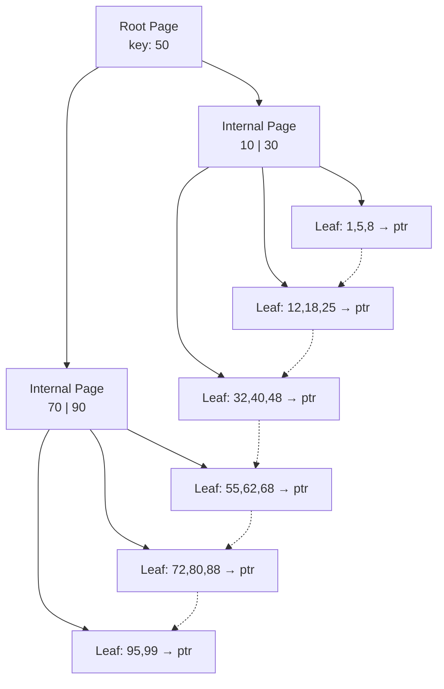
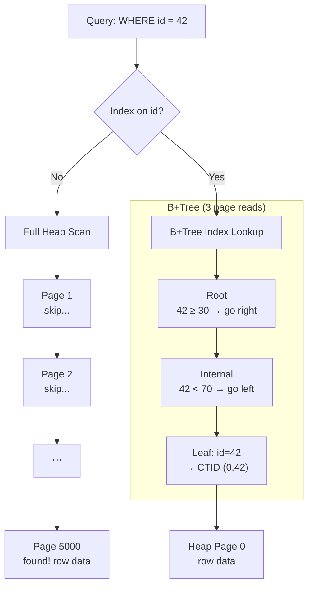
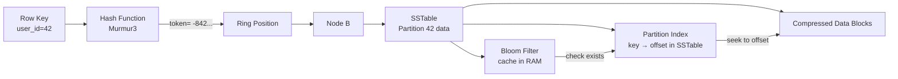

# Indexing

## Index Fundamentals

**Cardinality** refers to the number of unique values in a column relative to the total row count. It is the primary metric the query optimizer uses to decide whether to use an index.

- **High Cardinality** (e.g., `User_ID`, `Email`): Indexes are extremely effective. The B+Tree can rapidly narrow millions of rows to a single match.
- **Low Cardinality** (e.g., `Gender`, `Status`): Indexes are often ignored. Querying for 90% of rows via an index means jumping back and forth (random I/O) — slower than a full sequential table scan.

**Clustered vs Non-Clustered**: A clustered index stores the actual row data in the index leaf pages (table is the index). A non-clustered index stores pointers to the row data — either the row ID (heap) or the clustered key.

---

## Composite Index & Leftmost Prefix Rule

A Composite Index is a single index on multiple columns, ordered by the definition sequence (e.g., `CREATE INDEX idx ON T (A, B, C)`). The database sorts by A first, then by B within equal A values, then by C within equal A+B.

**Leftmost Prefix Rule**: The index can only be used if queries filter on columns starting from the left without skipping:

- `WHERE A = ?` — uses index
- `WHERE A = ? AND B = ?` — uses index
- `WHERE B = ?` — does NOT use index (skipped A)
- `WHERE A = ? AND C = ?` — uses A but cannot use C for filtering (skipped B)

This is critical for index design: order columns by selectivity (most selective first) and align with query patterns.

---

## B+Tree Index



The B+Tree is the dominant index structure in relational databases:

- **Internal nodes** store only keys (not data) to maximize fan-out — a single 16KB page can hold hundreds of keys.
- **Leaf nodes** store the actual row pointer — either the full row (clustered) or a pointer.
- **Leaf nodes are linked** — a linked list connects them left-to-right, enabling efficient range scans (`BETWEEN`, `>`).
- **Height is typically 3-4** for billions of rows. Every lookup is 3-4 I/O operations.

**Concrete example — 1M rows with an index on an INT column (PostgreSQL, 8KB pages):**

PostgreSQL uses 8KB (8,192 bytes) per page. Some space is reserved for headers and metadata:

- Page header: 24 bytes
- Line pointer array: 4 bytes per entry
- Special space (B-Tree specific): 20 bytes

Available for data: ~8,148 bytes. An index entry has:

| Level | Entry contents | Size per entry | Max entries per page |
|---|---|---|---|---|
| Leaf | IndexTupleData (8B, incl. CTID) + INT key (4B) + line pointer (4B) = 20B | 20 bytes | 8,148 / 20 ≈ **407** |
| Internal | IndexTupleData (8B, incl. child ptr) + INT key (4B) + line pointer (4B) = 20B | 20 bytes | 8,148 / 20 ≈ **407** |

The actual usable count is slightly lower due to alignment and fillfactor (default 90%, leaves room for inserts without immediate page splits). So realistic **fan-out ≈ 366 for both leaves and internal pages**.

Building a B+Tree for 1M rows:

| Level    | Fan-out           | Pages needed for 1M rows      |
| -------- | ----------------- | ----------------------------- |
| Leaf     | 366 entries/page  | 1,000,000 / 366 = 2,732 pages |
| Internal | 366 pointers/page | 2,732 / 366 ≈ 8 pages         |
| Root     | 366 pointers/page | 8 / 366 ≈ 1 page              |

Total tree height = **3**. Every `WHERE id = ?` lookup reads exactly 3 pages — root, internal, leaf — regardless of which row is queried.

With larger keys (TEXT, UUID) the entries are bigger, fan-out drops, and the tree may need an extra level at the same row count. For example, a UUID (16 bytes) roughly halves the fan-out.



**SQL Server**: Supports both clustered and non-clustered indexes. In a clustered index, the leaf level is the data page. In a non-clustered index, the leaf contains either the clustered key (if the table has a clustered index) or a Row ID (RID, if the table is a heap). SQL Server also supports **included columns** — non-key columns stored at the leaf level to cover queries without touching the table.

### B-Tree Index File Layout

An index is stored as its own file on disk — a flat array of fixed-size blocks. The logical tree structure is encoded through block indices (page numbers):

```
PostgreSQL B-Tree index file (8KB blocks)

Index  Type       Contents
────── ─────────  ─────────────────────────────────
[0]    Meta       Page 0 (metadata)
[1]    Root       sep=50 → children [2, 3]
[2]    Internal   sep=[10, 30] → children [4, 5]
[3]    Internal   sep=[70, 90] → children [6, 7]
[4]    Leaf       (1, (0,1)), (2, (0,2)), (3, (0,3)), ...
[5]    Leaf       (11, (1,1)), (12, (1,2)), ...
[6]    Leaf       (51, (2,1)), (52, (2,2)), ...
[7]    Leaf       (71, (3,1)), (72, (3,2)), ...
```

Each leaf stores `(key, CTID)` where `CTID = (heap_page, tuple_offset)` — the physical location of the row in the heap file.

**Logical tree:**

```
                    [1] Root (sep=50)
                   /                \
            [2] Internal(10,30) [3] Internal(70,90)
            /         \          /         \
         [4]Leaf    [5]Leaf    [6]Leaf    [7]Leaf
      (keys 1-9) (keys 11-29) (51-69)   (71-99)
```

**Trace: read key=25**: Tree: `[1]` → sep 50 > 25 → go to `[2]` → sep 30 > 25 → go to `[5]` → scan leaf for key=25 → get CTID `(1,1)` → read heap file at page 1, slot 1. File offset for any block: `offset = index × page_size` (`block [5]` = `5 × 8192` = 40960).

The per-page layout (header, slot array, row data) is identical to the B-Tree page format described in [storage-engines.md](./storage-engines.md#1-pages-how-data-is-organized-on-disk).

---

## PostgreSQL Specialized Indexes

Beyond B-Tree, PostgreSQL offers advanced index types:

- **GiST** (Generalized Search Tree): For full-text search, geometric data, range types. Used by PostGIS for spatial queries.
- **GIN** (Generalized Inverted Index): For arrays, JSONB, full-text search (tsvector). Stores a mapping from values to rows — efficient for finding rows containing a specific array element.
- **BRIN** (Block Range Index): For large tables where data is naturally ordered (time-series). Stores min/max values per block range. 100-1000x smaller than B-Tree but slower on random lookups.
- **SP-GiST**: For k-d trees, quad-trees — good for point data and network addresses.
- **Hash**: Equality-only lookups. Rarely used because B-Tree handles both equality and range.

---

## SQL Server Specialized Indexes

- **Filtered Index**: `CREATE INDEX ... WHERE status = 'active'` — indexes only a subset of rows. Smaller and faster than a full-table index.
- **Columnstore Index**: Stores data column-wise instead of row-wise. Used for analytics/data warehousing. High compression and vectorized execution.
- **Full-Text Index**: Inverted index for text search, maintained by the Full-Text Engine.

---

## MongoDB Indexing

MongoDB uses **WiredTiger** as the default storage engine:

- **Primary Index**: Always on `_id` — a B-Tree. Documents are not stored in index order (heap-based).
- **Secondary Indexes**: B-Tree or LSM depending on WiredTiger configuration. Default is B-Tree.
- **Compound Indexes**: Same leftmost prefix rules as SQL.
- **Multikey Index**: For array fields — creates an index entry for each array element.
- **Text Index**: Tokenizes and stems text fields, builds an inverted index.
- **TTL Index**: Automatically deletes documents after a configurable time.
- **Geospatial Index**: 2dsphere for GeoJSON data (uses a grid-based index).

---

## Cassandra Indexing

Cassandra uses a **partitioned row store** with a distributed hash table:

**Primary Index**: The partition key is hashed to determine the node and SSTable. Within a partition, clustering columns define sort order.



- **Bloom Filter**: Memory-resident, probabilistic check "does this partition exist in this SSTable?" — avoids unnecessary SSTable reads.
- **Partition Index**: Maps partition keys to byte offsets within the SSTable. Loaded into memory lazily.
- **SSTable Offset Map**: For range scans within a partition, the clustering columns are sorted on disk.
- **Secondary Indexes**: Local indexes built on each node. Good for low-cardinality columns only. For high-cardinality, use materialized views or a separate table (SASI index).

---

## Redis Indexing

Redis is an in-memory data structure store. Its "indexes" are the data structures themselves:

- **Hash Table**: The primary store for all key lookups — O(1) average.
- **Skiplist**: Used by `ZSET` (sorted set) — O(log n) for insert/delete/range. A probabilistic balanced tree.
- **Hash**: Field lookups within a `HASH` key are O(1) via hash table.
- **Secondary indexing is manual**: Maintain a `ZSET` mapping a field value to key names, or use the RedisJSON module with array indexing.
