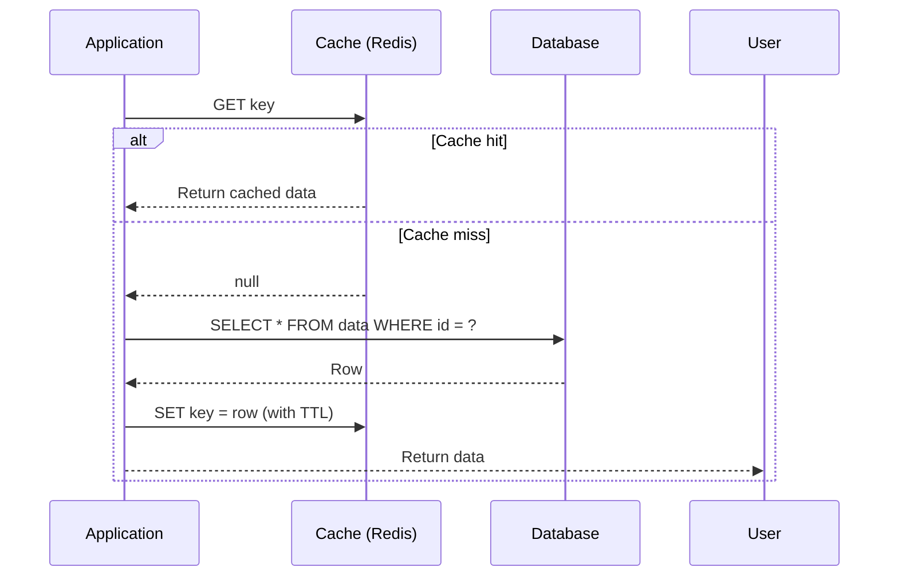
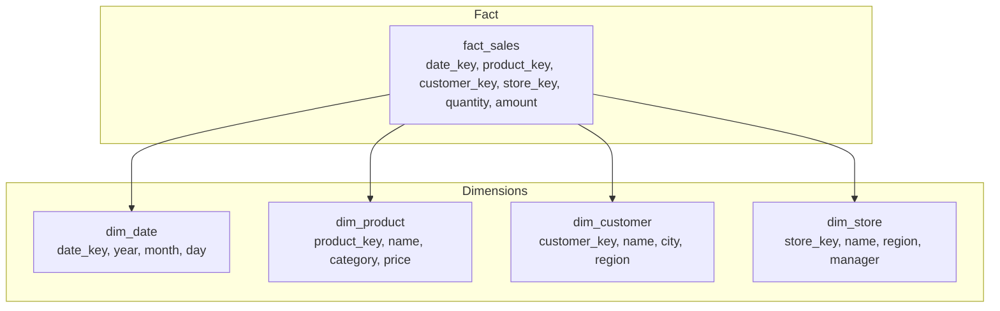
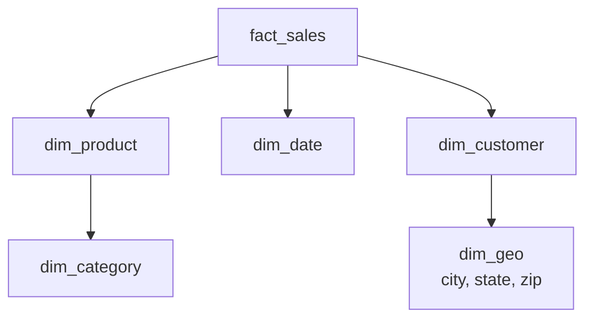

# Operations, Caching & Data Patterns

## Caching Strategies

### Cache-Aside (Lazy Loading)



**Pros**: Only caches what is requested, resilient to cache failures (app falls back to DB).
**Cons**: Cache stampede on first request (thundering herd), stale data until TTL expires.

**Best for**: Read-heavy workloads with moderate data volatility.

### Read-Through

Cache sits between app and database as a proxy. On miss, the cache itself loads from DB:

```
app → cache → (on miss) → cache loads from DB → caches it → returns to app
```

**Pros**: Simplifies application code (no explicit cache load logic).
**Cons**: Requires cache-side data loader (e.g., Redis with RedisJSON + Lua).

### Write-Through

Data is written to cache first, then synchronously to DB:

```
app → write to cache → cache writes to DB → ack
```

**Pros**: Cache is always fresh (no stale reads).
**Cons**: Higher write latency, cache failure = write failure.

### Write-Behind (Write-Back)

```
app → write to cache (instant) → cache asynchronously batches writes to DB
```

**Pros**: Very fast writes, can batch writes for efficiency.
**Cons**: Risk of data loss if cache fails before DB write.

| Strategy | Read Latency | Write Latency | Data Freshness | Risk |
|---|---|---|---|---|
| Cache-Aside | Low (hit) / High (miss) | Low | Stale (TTL) | Cache miss spike |
| Read-Through | Low (hit) / Moderate (miss) | Low | Stale (TTL) | Cache loading overhead |
| Write-Through | Low | High | Always fresh | Cache failure = write failure |
| Write-Behind | Low | Very low | Eventually fresh | Data loss |

### Cache Invalidation

| Strategy | Mechanism | Problem |
|---|---|---|
| **TTL-based** | Set expiry time | Stale data until TTL expires |
| **Write-invalidate** | On write, delete cache key | Next read = cache miss |
| **Write-update** | On write, update cache key | Cache thrash if writes > reads |
| **Version-based** | Key includes version (e.g., `user:42:v3`) | Version management complexity |

**Thundering herd**: When many concurrent requests hit a cache miss simultaneously, all query the DB. Mitigate with:
- **Mutex/locking**: One request fetches from DB, others wait
- **Early recompute**: Refresh cache before TTL expires
- **Probabilistic early expiration**: Randomize TTL refresh

## Backup & Recovery

### Backup Types

| Type | Description | Size | Recovery Time | Data Loss |
|---|---|---|---|---|
| **Full** | Complete copy of all data | Full dataset | Longest | Point of backup |
| **Incremental** | Changes since last backup (any type) | Small | Medium + chain | Point of last backup |
| **Differential** | Changes since last full backup | Growing | Medium | Point of last full |
| **Log/Archive** | WAL/transaction log since last full | Small files | Long (replay) | Point of failure |

### Database-Specific Backup

**PostgreSQL**:
- `pg_dump`: Logical backup (SQL), slow for large databases
- `pg_basebackup`: Physical backup (file-level), fast, used for PITR
- **WAL archiving**: `archive_command` copies WAL segments to safe storage. Enables PITR: restore base backup + replay WAL to any point in time.
- **pgBackRest**, **pg_probackup**: Advanced backup managers (parallel, incremental, encrypted)

**MySQL**:
- `mysqldump`: Logical backup (SQL)
- `XtraBackup` (Percona): Physical hot backup (no downtime), supports incremental
- **Binary log**: MySQL's equivalent of WAL for PITR
- MySQL Enterprise Backup: Commercial backup solution

**MongoDB**:
- `mongodump`: Logical backup (BSON), slow
- File-system snapshot: For use with EBS/snapshot systems
- **MongoDB Atlas**: Automated continuous backups with PITR

**Cassandra**:
- `nodetool snapshot`: Creates hard-link snapshots of SSTable directories
- Incremental backups: Enabled per-table
- **Commit log archive**: For PITR

### Recovery Objectives

| Metric | Description | Typical Target |
|---|---|---|
| **RPO** (Recovery Point Objective) | Maximum acceptable data loss | Seconds (WAL archive) to hours (daily backup) |
| **RTO** (Recovery Time Objective) | Maximum acceptable downtime | Minutes to hours |

## Data Warehousing

### OLTP vs OLAP

| | OLTP (Transactional) | OLAP (Analytical) |
|---|---|---|
| Workload | Many small transactions | Complex aggregations |
| Reads/Writes | Balanced | Read-heavy |
| Data | Current state | Historical |
| Query pattern | Point lookups, small ranges | Full scans, large aggregations |
| Storage | Row-oriented (B-Tree) | Column-oriented |
| Indexes | Many indexes | Few indexes, sort keys |

### Star Schema

Fact table + dimension tables (denormalized):



- **Fact table**: Measures (numeric) + foreign keys to dimensions. Can be billions of rows.
- **Dimension tables**: Descriptive attributes. Smaller, denormalized (no 3NF).

### Snowflake Schema

Like star but dimensions are normalized (split into sub-dimensions):



**Pros**: Less data redundancy, easier dimension updates.
**Cons**: More joins, slower analytical queries.

### Columnar Storage

Instead of storing all columns of a row together, columnar DBs store each column separately:

| Row Store | Column Store |
|---|---|
| `[1, Alice, NY, 100]` | `id: [1, 2, 3]` |
| `[2, Bob, LA, 200]` | `name: [Alice, Bob, Carol]` |
| `[3, Carol, SF, 150]` | `city: [NY, LA, SF]` |
| | `amount: [100, 200, 150]` |

**Advantages for analytics**:
- Only read columns needed by the query (skip irrelevant columns)
- Better compression (same data type per column) — run-length encoding, dictionary, bit packing
- Vectorized / SIMD processing on column batches
- **Late materialization**: Defer row reconstruction until necessary

**Examples**: DuckDB, ClickHouse, Redshift, Snowflake, BigQuery.

## Database Migration Strategies

| Strategy | Downtime | Complexity | Risk |
|---|---|---|---|
| **Offline migration** | High | Low | Application must be down |
| **Online migration** | Low | High | Dual writes, sync logic |
| **Blue-green** | Minimal | Medium | Two databases running |
| **Parallel run** | None | Very high | Full dual runtime |

### Online Schema Change

**pt-online-schema-change** (Percona Toolkit):
1. Create an empty copy of the table
2. Apply the schema change to the copy
3. Add triggers to sync writes from original to copy
4. Copy existing data in batches
5. Swap table names (RENAME)

**gh-ost** (GitHub):
1. Creates a shadow table
2. Replicates writes via binary log (not triggers)
3. Copy data in chunks
4. Cutover: rename tables

### Application-Level Migration

For zero-downtime schema changes:

1. **Expand**: Add new schema elements alongside old ones
2. **Dual-write**: Write to both old and new structures
3. **Backfill**: Migrate existing data to new structure
4. **Read-new**: Switch reads to new structure
5. **Contract**: Remove old structure

## Connection Pooling Parameters

| Parameter | What it controls | Typical Value |
|---|---|---|
| `max_pool_size` | Maximum connections in pool | 10-50 per application instance |
| `min_idle` | Minimum idle connections | 2-5 |
| `connection_timeout` | Max wait for a connection | 5-30 seconds |
| `idle_timeout` | Max idle time before close | 10-60 minutes |
| `max_lifetime` | Max connection age | 30-60 minutes |
| `leak_detection_threshold` | Log connections held too long | 5-30 seconds |

**Rule of thumb**: `pool_size = (num_cores * 2) + effective_spindle_count`. Stay below database's `max_connections`.
