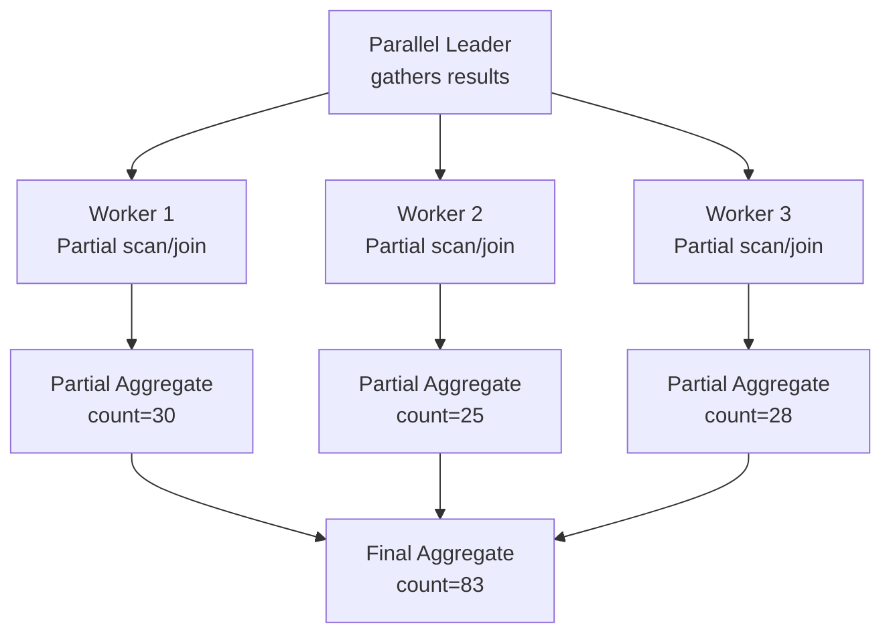

# Query Execution & Optimization

## Query Pipeline

Every SQL query passes through these stages:


**1. Parser**: Converts SQL text to an AST (parse tree). Validates syntax, resolves table/column names, checks permissions.

**2. Rewriter**: Applies semantic transformations — expands views, unfolds nested queries, simplifies expressions, applies rules (PostgreSQL rules system).

**3. Planner (Optimizer)**: The most complex stage. Generates multiple execution plans and picks the cheapest (cost-based optimization).

**4. Executor**: Executes the chosen plan. Pulls tuples through the plan tree (Volcano-style iterator model).

## Scan Methods

| Scan Type | Description | When Used |
|---|---|---|
| **Sequential Scan** | Read all rows sequentially | No index, large portion of table needed |
| **Index Scan** | Walk B-Tree → fetch heap tuple | Highly selective queries |
| **Index-Only Scan** | Read from index alone, no heap fetch | Index covers all needed columns |
| **Bitmap Scan** | Multiple index scans → bitmap → heap fetch | Combination of conditions, moderate selectivity |
| **TID Scan** | Direct row access by CTID | From subquery or WITH (known row location) |

Each scan method has a cost formula that multiplies the number of pages read by a cost factor (sequential vs random I/O). The optimizer picks the cheapest based on table statistics.

## Join Algorithms

### Nested Loop Join

```
for each row in outer (smaller) relation:
    for each row in inner (larger) relation:
        if match: emit joined row
```

| Variant | Complexity | When Used |
|---|---|---|
| Plain | O(n*m) | Small outer, no index on inner |
| Indexed | O(n * log m) | Small outer, index on inner join key |
| Materialized | O(n*m) | Small outer, inner materialized in memory |

**Best for**: Small outer relation (<1000 rows), especially with an index on the inner relation.

### Hash Join

```
1. Build: Scan inner relation, build hash table on join key
2. Probe: Scan outer relation, probe hash table for matches
```

| Phase | Memory | Complexity |
|---|---|---|
| Build | O(min(n,m)) hash table size | O(m) |
| Probe | Ongoing | O(n) |
| Grace Hash Join (disk) | When exceeds work_mem | O(n+m) writes/reads to disk |

**Best for**: Equi-joins on unsorted data where one side can fit in memory.

### Merge Join

```
1. Sort both relations on join key (or use existing order)
2. Iterate both sorted streams in parallel, emitting matches
```

| Phase | Memory | Complexity |
|---|---|---|
| Sort | O(n+m) if not pre-sorted | O(n log n + m log m) |
| Merge | O(1) | O(n+m) |

**Best for**: Large tables already sorted on join key (e.g., from index order, or when ORDER BY matches join key).

## Parallel Query Execution

Modern databases distribute query execution across multiple CPU cores:



| Operator | Parallelism | Notes |
|---|---|---|
| Seq Scan | Multiple workers scan page ranges | Each worker reads a portion of the table |
| Index Scan | Multiple workers scan index ranges | Range-based partitioning |
| Hash Join | Build hash in parallel, probe in parallel | Shared hash or partitioned hash |
| Aggregate | Partial → gather → final | Two-phase aggregation |
| Sort | Merge sort: each worker sorts a chunk | GATHER MERGE sorts final output |

**Limitations**:
- Only sequential scans, index scans, joins, and aggregates can be parallelized
- CTEs (WITH) are optimization fences in some databases
- Small tables or queries with LIMIT often don't use parallel plans (overhead > benefit)

## Cost Estimation

Databases use table and column statistics to estimate the cost of each plan. The optimizer computes a cost for each possible plan node based on estimated row counts, I/O costs (sequential vs random), and CPU costs. Each database engine has its own cost model and system catalogs for statistics.

## Common Query Optimizations

| Problem | Symptom | Fix |
|---|---|---|---|
| Missing index | Table scan on large table | Add index on WHERE/JOIN columns |
| Wrong join order | Nested loop on large tables | Update statistics, check join column indexes |
| Stale statistics | Suboptimal plan choice | Refresh table statistics (`ANALYZE`-equivalent) |
| Subquery repeated | Same subquery executed N times | Rewrite as join or use CTE |

### Index Design Heuristics

1. **Prefix equality columns** in compound indexes: `WHERE a = 1 AND b > 5` → index on `(a, b)`
2. **Covering indexes**: Include all queried columns to enable index-only scans
3. **Partial indexes**: `CREATE INDEX ... WHERE status = 'active'` — smaller and faster
4. **Included columns** (SQL Server, PostgreSQL 11+): Non-key columns in index for covering
