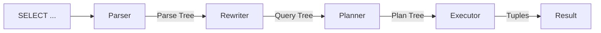
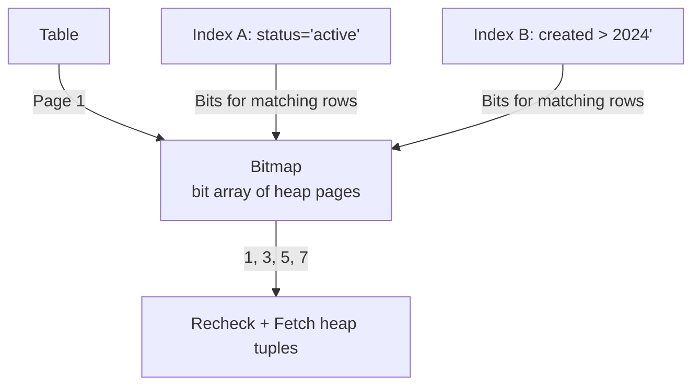
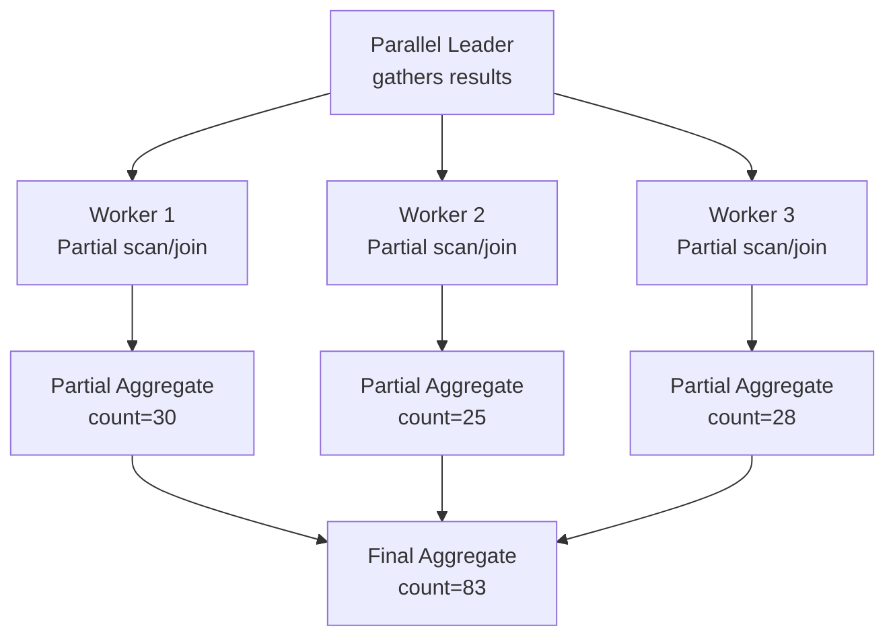

# Query Execution & Optimization

## Query Pipeline

Every SQL query passes through these stages:



**1. Parser**: Converts SQL text to an AST (parse tree). Validates syntax, resolves table/column names, checks permissions.

**2. Rewriter**: Applies semantic transformations — expands views, unfolds nested queries, simplifies expressions, applies rules (PostgreSQL rules system).

**3. Planner (Optimizer)**: The most complex stage. Generates multiple execution plans and picks the cheapest (cost-based optimization).

**4. Executor**: Executes the chosen plan. Pulls tuples through the plan tree (Volcano-style iterator model).

## Scan Methods

| Scan Type | Description | When Used |
|---|---|---|
| **Sequential Scan** | Read all rows sequentially | No index, large portion of table needed |
| **Index Scan** | Walk B-Tree → fetch heap tuple | Highly selective queries |
| **Index-Only Scan** | Read from index alone, no heap fetch | Index covers all needed columns |
| **Bitmap Scan** | Multiple index scans → bitmap → heap fetch | Combination of conditions, moderate selectivity |
| **TID Scan** | Direct row access by CTID | From subquery or WITH (known row location) |

### Sequential Scan

Reads all pages sequentially. Efficient for large tables when querying >10-20% of rows. Sequential I/O is faster than random I/O.

**Cost**: `seq_page_cost * num_pages`

### Index Scan

Traverses the B-Tree to find matching tuples, then fetches each tuple from the heap. Each heap access is random I/O (≈4x more expensive than sequential).

**Cost**: `(index height + matching_pages) * random_page_cost`

### Index-Only Scan

If all required columns exist in the index and the visibility check passes (using the Visibility Map), the heap fetch is skipped. Much faster than a regular index scan.

**Key requirement**: The Visibility Map must show the page as all-visible (otherwise need heap check).

### Bitmap Scan



1. Multiple indexes are scanned independently
2. Each produces a bitmap of candidate heap pages
3. Bitmaps are merged (AND/OR) based on the query
4. Only the needed pages are fetched

Best for complex `WHERE` clauses with multiple indexed conditions.

## Join Algorithms

### Nested Loop Join

```
for each row in outer (smaller) relation:
    for each row in inner (larger) relation:
        if match: emit joined row
```

| Variant | Complexity | When Used |
|---|---|---|
| Plain | O(n*m) | Small outer, no index on inner |
| Indexed | O(n * log m) | Small outer, index on inner join key |
| Materialized | O(n*m) | Small outer, inner materialized in memory |

**Best for**: Small outer relation (<1000 rows), especially with an index on the inner relation.

### Hash Join

```
1. Build: Scan inner relation, build hash table on join key
2. Probe: Scan outer relation, probe hash table for matches
```

| Phase | Memory | Complexity |
|---|---|---|
| Build | O(min(n,m)) hash table size | O(m) |
| Probe | Ongoing | O(n) |
| Grace Hash Join (disk) | When exceeds work_mem | O(n+m) writes/reads to disk |

**Best for**: Equi-joins on unsorted data where one side can fit in memory.

### Merge Join

```
1. Sort both relations on join key (or use existing order)
2. Iterate both sorted streams in parallel, emitting matches
```

| Phase | Memory | Complexity |
|---|---|---|
| Sort | O(n+m) if not pre-sorted | O(n log n + m log m) |
| Merge | O(1) | O(n+m) |

**Best for**: Large tables already sorted on join key (e.g., from index order, or when ORDER BY matches join key).

## Parallel Query Execution

Modern databases distribute query execution across multiple CPU cores:



| Operator | Parallelism | Notes |
|---|---|---|
| Seq Scan | Multiple workers scan page ranges | Each worker reads a portion of the table |
| Index Scan | Multiple workers scan index ranges | Range-based partitioning |
| Hash Join | Build hash in parallel, probe in parallel | Shared hash or partitioned hash |
| Aggregate | Partial → gather → final | Two-phase aggregation |
| Sort | Merge sort: each worker sorts a chunk | GATHER MERGE sorts final output |

**Limitations**:
- Only sequential scans, index scans, joins, and aggregates can be parallelized
- CTEs (WITH) are optimization fences in some databases
- Small tables or queries with LIMIT often don't use parallel plans (overhead > benefit)

## Cost Estimation

Databases use statistics to estimate the cost of each plan:

```sql
-- PostgreSQL: statistics for table 'orders'
SELECT reltuples, relpages FROM pg_class WHERE relname = 'orders';
-- reltuples = 1,000,000 rows
-- relpages = 100,000 pages

-- Column-level statistics
SELECT * FROM pg_stats WHERE tablename = 'orders' AND attname = 'status';
-- n_distinct = 3  (active, pending, completed)
-- most_common_vals = {completed, active, pending}
-- most_common_freqs = {0.60, 0.30, 0.10}
```

**Selectivity estimation**:
- Equality on unique column: `1/reltuples` (~0.0001%)
- Equality on low-cardinality column: `most_common_freqs[i]` (e.g., 30% for 'active')
- Range query: Based on histogram bounds
- `LIKE` / pattern: Based on correlation and string length

**Cost parameters**:

| Parameter | Default | Description |
|---|---|---|
| `seq_page_cost` | 1.0 | Cost of reading one page sequentially |
| `random_page_cost` | 4.0 | Cost of reading one page randomly |
| `cpu_tuple_cost` | 0.01 | CPU cost per row |
| `cpu_index_tuple_cost` | 0.005 | CPU cost per index row |
| `cpu_operator_cost` | 0.0025 | CPU cost per expression evaluation |

## Common Query Optimizations

| Problem | Symptom | Fix |
|---|---|---|
| Missing index | Seq scan on large table | Add index on WHERE/JOIN columns |
| Wrong join order | Slow query, nested loop on large tables | Increase statistics target, `ANALYZE` |
| Overestimated selectivity | Index scan when seq scan is better | Update statistics, adjust parameters |
| Underestimated selectivity | Seq scan when index is better | Increase `default_statistics_target` |
| Subquery repeated | Same subquery executed N times | Use CTE (materialized) or lateral join |

### Index Design Heuristics

1. **Prefix equality columns** in compound indexes: `WHERE a = 1 AND b > 5` → index on `(a, b)`
2. **Covering indexes**: Include all queried columns to enable index-only scans
3. **Partial indexes**: `CREATE INDEX ... WHERE status = 'active'` — smaller and faster
4. **Included columns** (SQL Server, PostgreSQL 11+): Non-key columns in index for covering

### Query Plan Reading

Key signs in an execution plan:
- **Seq Scan on large table + filter**: Missing an index
- **Nested Loop with many rows**: Wrong join order (should use hash join)
- **Sort with large memory**: Missing index on ORDER BY column
- **Bitmap Heap Scan with many rows**: Might be cheaper as a seq scan
- **Subquery Scan on CTE**: CTE is a materialization fence
