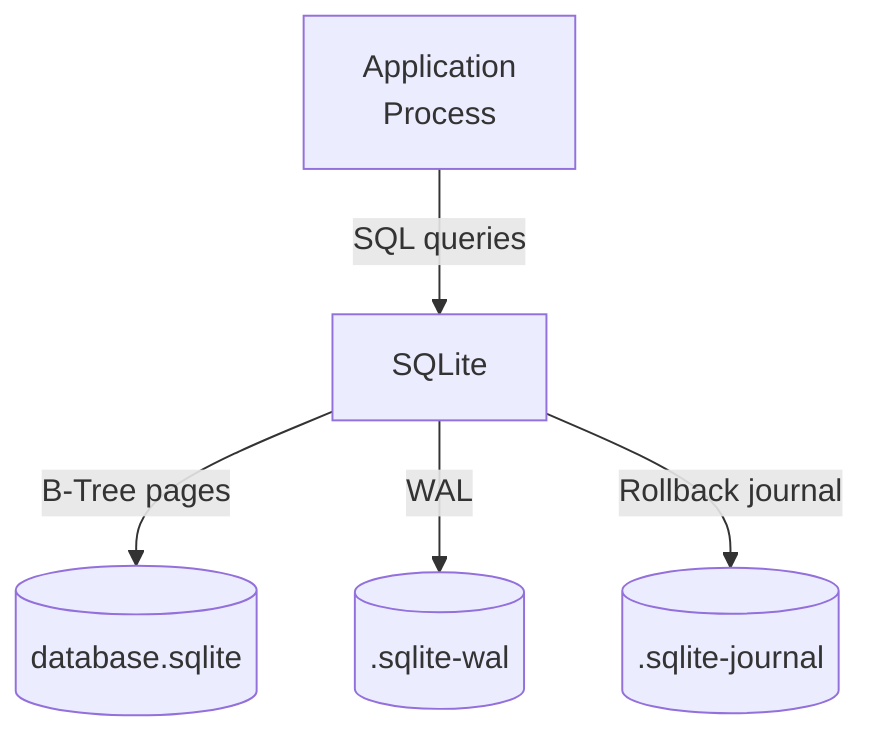

# Specialized Databases

## Vector Databases

Vector databases are optimized for storing and querying **embeddings** — dense vector representations of data (text, images, audio). They enable **approximate nearest neighbor (ANN)** search for AI/ML applications.

### Core Algorithm: ANN Search

Exact nearest neighbor search is O(n*d) — too slow for millions of vectors. ANN sacrifices a small amount of accuracy for massive speed gains:

| Algorithm | Type | Build Time | Search Time | Memory | Accuracy |
|---|---|---|---|---|---|
| **HNSW** | Hierarchical navigable small world graph | O(n log n) | O(log n) | O(n) | 95-99% |
| **IVF** | Inverted file index | O(n) | O(sqrt(n)) | O(n) | 90-95% |
| **IVF + PQ** | IVF with product quantization | O(n) | O(sqrt(n)) | Compressed | 85-95% |
| **DiskANN** | Vamana graph on disk | O(n log n) | O(log n) | 10GB/TB on disk | 95-99% |

**HNSW**: The most popular algorithm. Builds a multi-layer graph:
- Layer 0: All vectors (dense connections)
- Layer 1: Random subset (sparser)
- Higher layers: Progressively sparser
- Search traverses from top layer down, refining at each level

### Database Comparison

| Database | Algorithm | Cloud-Native | Features |
|---|---|---|---|
| **pgvector** (PostgreSQL extension) | IVFFlat, HNSW | Yes (via RDS) | SQL interface, ACID, 2000 dims max |
| **Pinecone** | Custom (HNSW-based) | Yes (SaaS) | Serverless, metadata filtering, namespaces |
| **Milvus** | HNSW, IVF, DiskANN | Yes (K8s) | Multi-modal, hybrid search, GPU acceleration |
| **Weaviate** | Custom (HNSW-based) | Yes (K8s) | GraphQL, hybrid search, modules |
| **Qdrant** | Custom (HNSW-based) | Yes (SaaS, self-hosted) | Payload filtering, snapshots |

**Use cases**: RAG (Retrieval-Augmented Generation), semantic search, recommendation systems, anomaly detection, image similarity.

### Key Metrics

| Metric | Description |
|---|---|
| **Recall** | Fraction of true nearest neighbors found |
| **QPS** | Queries per second |
| **Indexing time** | Time to build the index |
| **Memory usage** | RAM needed to serve queries |

## Search Engines

Search engines provide full-text search with relevance scoring, faceted aggregation, and near-real-time indexing.

### Inverted Index

The core data structure for full-text search:

```
Document 1: "the quick brown fox"
Document 2: "the lazy dog"
Document 3: "quick fox jumps"

Inverted Index:
brown  → {1}
dog    → {2}
fox    → {1, 3}
jumps  → {3}
lazy   → {2}
quick  → {1, 3}
the    → {1, 2}
```

Behind the scenes: Term dictionary → posting list (document IDs + positions + offsets). Compressed using delta encoding, bit packing, and skip lists.

### Lucene / Elasticsearch Architecture

```mermaid
graph TD
    subgraph "Lucene Index"
        D1[Segment 1<br/>in-memory]
        D2[Segment 2<br/>on disk]
        D3[Segment 3<br/>on disk]
    end
    Write[Document] -->|1. Buffer| D1
    D1 -->|2. Flush<br/>(commit)| D2
    D1 & D2 & D3 -->|3. Merge| Merged[(Merged Segment)]
    Query -->|4. Search all segments| Searcher
```

**Near-real-time**: Documents are searchable almost immediately after indexing (refresh interval, default 1s in Elasticsearch).

**Scoring (BM25)**: The default relevance algorithm:

```
score(D, Q) = Σ (IDF(t) * TF(t, D) * (k1 + 1)) / (TF(t, D) + k1 * (1 - b + b * |D| / avgdl))
```

Where:
- `IDF(t)`: Inverse document frequency of term t
- `TF(t, D)`: Term frequency in document D
- `k1`, `b`: Tunable parameters (defaults: k1=1.2, b=0.75)
- `|D|`: Document length
- `avgdl`: Average document length

| Database | Engine | Strengths |
|---|---|---|
| **Elasticsearch** | Lucene | Full-text, analytics, aggregation, monitoring |
| **Meilisearch** | Custom (Rust) | Developer-friendly, typo-tolerant, instant |
| **Typesense** | Custom (C++) | Low-latency, simple deployment, geo-search |

**Use cases**: Site search, log analytics (ELK stack), product search, e-commerce filtering.

## Embedded Databases

Embedded databases run in-process with the application (no separate server). They sacrifice scalability for simplicity and speed.

### SQLite

The most widely deployed database engine in the world (every smartphone, browser, many embedded systems).



**Page structure**: 4KB pages (default), B-Tree for tables (leaf = data), B+Tree for indexes.

**Journal modes**:

| Mode | Durability | Performance |
|---|---|---|
| `DELETE` (default) | Safe (crash = rollback) | Slower (delete journal at end) |
| `TRUNCATE` | Safe | Faster (truncate journal) |
| `PERSIST` | Safe | Same as TRUNCATE |
| `WAL` (Write-Ahead Log) | Safe | Much faster (concurrent reads + write) |
| `MEMORY` | Not durable (lost on crash) | Fastest |
| `OFF` | Not durable | Fastest |

**WAL mode**: The write-ahead log allows concurrent readers and a single writer. Readers don't block the writer. The WAL is periodically checkpointed into the main database file.

**Concurrency**: Limited — only one writer at a time (table-level locking). MVCC via WAL allows concurrent reads during writes.

**Best for**: Mobile apps, desktop apps, small servers, embedded systems, prototyping.

### DuckDB

DuckDB is an **in-process columnar OLAP database** — the SQLite equivalent for analytical workloads.

**Columnar storage**: Data is stored by column, not by row. Enables:
- Only read relevant columns (skip others)
- Better compression (same datatype per column)
- Vectorized execution (SIMD-friendly)

**Vectorized execution**: Operates on batches of 2048 values at a time (vectors), not individual rows. Minimizes function call overhead and exploits CPU cache / SIMD instructions.

**Performance**:
- Analytical queries: 10-100x faster than SQLite for aggregations
- Data loading: Millions of rows per second
- Memory: Efficient compression (run-length, dictionary, constant encoding)

**Use cases**: Data science, analytics, ETL, ad-hoc queries on parquet/CSV files.

## Streaming Databases

Streaming databases process **real-time data streams** with SQL semantics.

| Database | Model | Storage | Consistency |
|---|---|---|---|
| **Materialize** | SQL materialized views | Persistent (Kafka-backed) | Eventually consistent |
| **RisingWave** | SQL streaming, ETL | Object storage (S3) | Exactly-once |
| **ksqlDB** | Kafka-native streaming | Kafka topics | Exactly-once |

**Key concept**: A materialized view that is continuously updated as new data arrives, rather than recomputed on query.

## Time-Series Databases

While time-series is covered in the taxonomy, key implementation details:

| Database | Storage Engine | Compression | Query Language |
|---|---|---|---|
| **InfluxDB** | TSM (Time-Structured Merge Tree) | 10-100x (float64 → XOR, timestamps → delta-of-delta) | Flux, InfluxQL |
| **TimescaleDB** | PostgreSQL (hypertables) | Native compression (per chunk) | SQL |
| **VictoriaMetrics** | LSM with custom merge | 10-100x (integer delta, string dictionary) | PromQL, MetricsQL |

**InfluxDB TSM**: An LSM-tree variant optimized for time-series:
- WAL for recent writes
- MemTable (in-memory, sorted by time + tag)
- Flush to TSM files (compressed, read-only)
- Merge / compaction

**TimescaleDB hypertables**: Automatic partitioning by time into chunks. SQL interface with full PostgreSQL compatibility.

| Feature | InfluxDB | TimescaleDB | VictoriaMetrics |
|---|---|---|---|
| SQL? | No (Flux) | Yes (PostgreSQL) | No (PromQL) |
| Joins | Limited | Full SQL joins | None |
| High-availability | InfluxDB Clustered | Patroni, streaming rep | VictoriaMetrics cluster |
| Compression ratio | 10x-100x | 6x-10x | 10x-100x |
