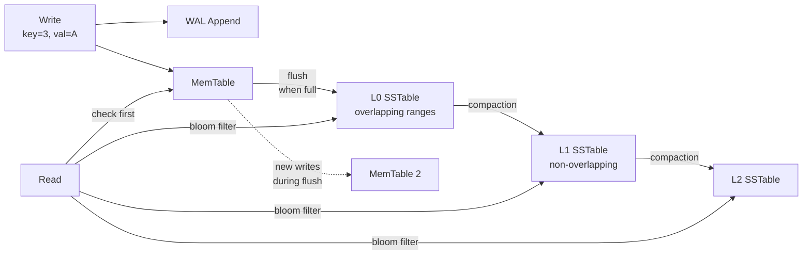
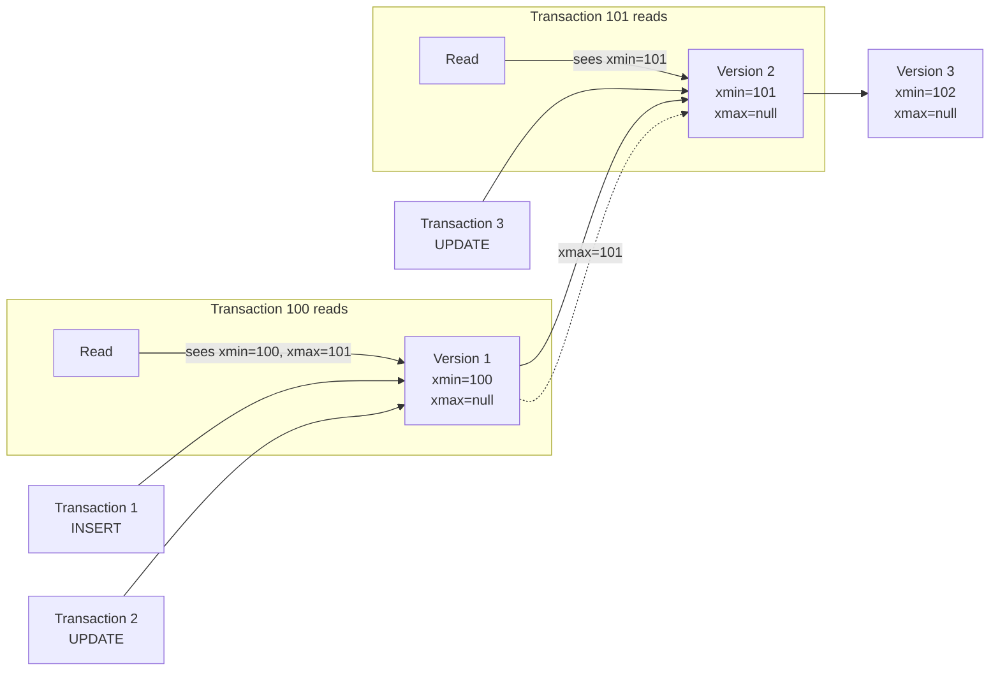
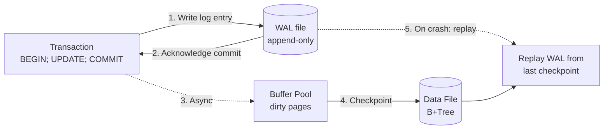
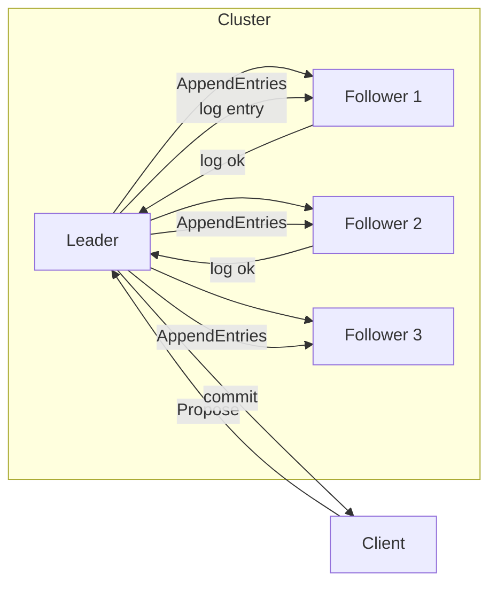
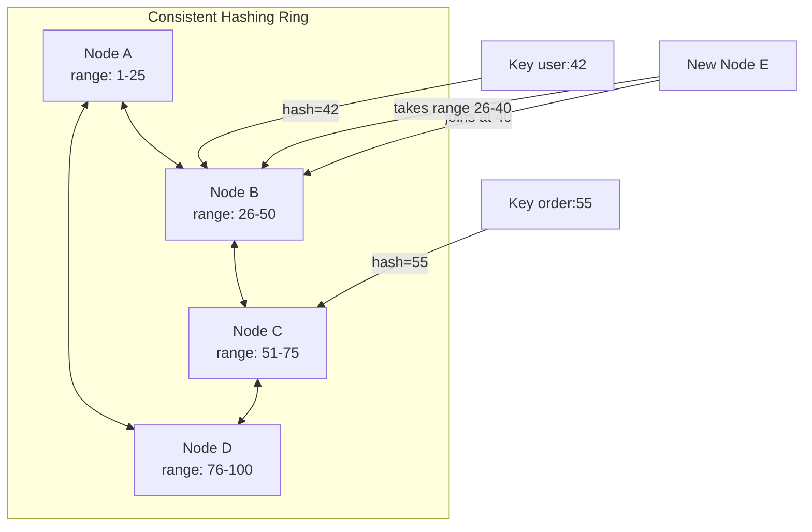

# Database Storage & Algorithms

## Storage Engines

### B-Tree vs LSM-Tree

The two dominant storage engine architectures:

| Property | B-Tree (InnoDB, SQL Server, Oracle) | LSM-Tree (Cassandra, RocksDB, LevelDB) |
|---|---|---|
| Read speed | Fast — single path to leaf | Slower — check multiple SSTables + MemTable |
| Write speed | Slower — random I/O, page splits | Fast — sequential append |
| Space amplification | Low — in-place updates | High — obsolete versions until compaction |
| Write amplification | Moderate | High (compaction merges) |
| Concurrency | Page-level locking | Append-only, no in-place overwrite |

**B-Tree** (used by MySQL/InnoDB, PostgreSQL): Optimized for read-heavy workloads. Data in fixed-size pages in a balanced tree. Updates find the page and modify in place. Page full = split, causing write amplification and random I/O. Fast reads (consistent O(log n) lookup), slower under massive concurrent writes.

**LSM-Tree** (used by Cassandra, RocksDB, LevelDB): Optimized for high-throughput writes. Append-only — new data goes to MemTable (RAM), flushed to immutable SSTable on disk (sequential I/O). A record may exist in multiple files. Background compaction merges files, discarding obsolete versions. Writes are fast, reads are slower (check MemTable, then SSTables newest→oldest).

### InnoDB (MySQL)

- **Clustered primary key**: The table *is* the index. Data rows are stored in the leaf pages of the primary key B+Tree.
- **Secondary indexes**: Store the primary key value as a pointer. Requires two lookups (secondary index → PK → data).
- **Buffer Pool**: Caches index and data pages in memory (LRU). Page size = 16KB.
- **Change Buffer**: Merges secondary index changes into the buffer pool for deferred writes.
- **Redo Log**: Circular write-ahead log for crash recovery (ib_logfile). Records physical page-level changes.
- **Undo Log**: Stores old row versions for MVCC and rollback.

### PostgreSQL Heap Engine

- **Heap storage**: Rows are stored in heap pages (8KB), not in any index order. Each row has a `CTID = (page, offset)`.
- **No clustered index**: The heap is always a heap. `CLUSTER` physically reorders the heap once but is not maintained.
- **TOAST**: Large values (>2KB) are compressed and stored in a separate TOAST table, with a pointer in the main tuple.
- **Visibility Map**: Tracks which pages have all-visible tuples — enables index-only scans and efficient vacuum.
- **Free Space Map**: Tracks available space in each heap page for new tuple placement.
- **VACUUM**: Removes dead tuples, updates visibility map, prevents transaction ID wraparound.

### SQL Server Storage Engine

- **Page**: 8KB. Extent = 8 contiguous pages (64KB). Allocation is extent-based.
- **Clustered index**: Data rows stored in leaf pages of the B-Tree (like InnoDB).
- **Heap**: No clustered index — data unordered, uses Index Allocation Map (IAM) for page tracking.
- **Non-clustered index**: Leaf pages store either clustering key or RID (for heaps).
- **Transaction Log** (.ldf): Write-ahead log, records logical operations. Uses VLF (Virtual Log File) segments.
- **TempDB**: Global temporary storage for sorts, hash joins, temporary tables, version store.
- **Buffer Pool Extension**: Allows using SSD as an extension of the buffer pool.

### WiredTiger (MongoDB)

- **Dual engine**: Supports both B-Tree (default for most workloads) and LSM (for write-heavy workloads). Configurable per collection.
- **Snapshot isolation**: Uses MVCC with multi-version concurrency. Readers do not block writers.
- **Block compression**: Snappy, Zlib, or Zstd compression. Pages are compressed on disk, decompressed into cache.
- **Checkpoints**: Periodic consistent snapshots of the data store. Recovery replays the WAL since the last checkpoint.

### RocksDB / LevelDB

- **Pure LSM**: Log-structured merge-tree from Google LevelDB, forked and optimized by Facebook (RocksDB).
- **Dynamic tiered compaction**: Level-based (L0 → L1 → L2 → ...) or size-tiered. L0 is overlapping SSTables from MemTable flushes. Deeper levels are non-overlapping, sorted, and merged.
- **Bloom filters per SSTable**: Speed up point lookups by skipping files that cannot contain the key.
- **Prefix encoding**: Keys are compressed by sharing common prefixes within an SSTable.
- **Write rate limiter**: Throttles compaction to avoid impacting foreground writes.
- **Used by**: CockroachDB (Pebble is a Go rewrite), MySQL MyRocks, Kafka Streams, TiKV.

***

## Core Database Algorithms

### B+Tree

The foundational data structure for relational database indexes:

```mermaid
graph TD
    Root[Root Node<br/>[10, 25, 45]] --> N1[Internal Node<br/>[1, 5, 8]]
    Root --> N2[Internal Node<br/>[12, 18]]
    Root --> N3[Internal Node<br/>[30, 40]]
    N1 --> L1[Leaf<br/>[1,2,3] → data]
    N1 --> L2[Leaf<br/>[5,6,8] → data]
    N1 --> L3[Leaf<br/>[8,9,10] → data]
    N2 --> L4[Leaf<br/>[12,15] → data]
    N2 --> L5[Leaf<br/>[18,22] → data]
    N3 --> L6[Leaf<br/>[30,35] → data]
    N3 --> L7[Leaf<br/>[40,42,45] → data]
    L1 -.-> L2 -.-> L3 -.-> L4 -.-> L5 -.-> L6 -.-> L7
```

Key properties:
- **Fan-out**: Each internal node has hundreds of keys (limited by page size / key size). A 16KB page with 8-byte keys holds ~2000 keys. With a 3-level tree: 2000³ = 8 billion keys.
- **Page splits**: When a page is full, it splits into two pages. This is the primary cost of writes — the split propagates upward.
- **Leaf linked list**: Enables efficient range scans without backtracking up the tree.
- **Self-balancing**: Guarantees all leaves are at the same depth (log_{fanout}(n) levels).

### LSM-Tree



Write path:
1. Write is appended to the WAL (sequential disk write).
2. Key-value is inserted into the MemTable (sorted, in-memory skip list).
3. When the MemTable is full, it becomes immutable and a new MemTable takes over.
4. The immutable MemTable is flushed to disk as an SSTable (sequential write).
5. Background compaction merges SSTables, discarding old versions and tombstones.

Read path:
1. Check MemTable first.
2. Check each SSTable from newest to oldest (bloom filters skip irrelevant SSTables).
3. Merge results → return the latest version.

Compaction strategies:
- **Size-Tiered (STCS)**: When N SSTables of similar size exist, merge them into one larger SSTable. Simple but causes write amplification spikes.
- **Leveled (LCS)**: L0 has overlapping SSTables. Deeper levels are non-overlapping with exponentially increasing size. Minimizes space amplification but increases write amplification.
- **Time-Window (TWCS)**: For time-series data. SSTables within the same time window are compacted together. Old windows are dropped.

### MVCC (Multi-Version Concurrency Control)

MVCC allows concurrent readers and writers without blocking by maintaining multiple versions of each row:



Each row has hidden metadata:
- **xmin**: Transaction ID that created this version.
- **xmax**: Transaction ID that deleted/updated this version (or null if live).
- A transaction sees a row version if `xmin ≤ tx_id` and `xmax > tx_id OR xmax = null`.

**PostgreSQL**: Versions stored in heap (same page). Dead tuples are cleaned by `VACUUM`. Hot Standby uses a snapshot conflict mechanism.

**MySQL (InnoDB)**: Versions stored in the undo log. The current version is in the clustered index; older versions are reconstructed from undo records. Purge thread cleans obsolete undo entries.

**Cassandra**: Uses `tombstones` for deletes and a timestamp per cell. Compaction reconciles versions — the highest timestamp wins. No VACUUM needed; compaction handles cleanup.

### Write-Ahead Log (WAL)

The WAL is an append-only file where every change is recorded *before* it reaches the data files. This guarantees durability without flushing data pages on every transaction:



A `COMMIT` is not durable until the WAL flush completes. On crash recovery, the database:
1. Finds the last checkpoint (a consistent state).
2. Replays all committed transactions from the WAL since that checkpoint.
3. Rolls back uncommitted transactions using undo logs.

- **MySQL (InnoDB)**: Redo log (`ib_logfile`). Circular, fixed-size. Handles redo (replay). Undo log handles rollback and MVCC.
- **PostgreSQL**: WAL in `pg_wal/`. Supports full recovery, point-in-time recovery (PITR), and replication streaming.
- **SQL Server**: Transaction log (`.ldf`). Log records contain the logical operation. Supports point-in-time restore and log shipping.

### Consensus Protocols (Paxos, Raft, VSR)

Distributed consensus ensures multiple nodes agree on a single value, even when some fail. This is the foundation for fault-tolerant replicated state machines in distributed databases.

**Raft** (CockroachDB, TiDB, etcd): Designed for understandability.



- One leader per term, elected by majority vote.
- Leader replicates log entries to followers.
- An entry is committed when the leader receives acknowledgments from a majority.
- Term = epoch. Timeout-based leader election (150-300ms random).
- Safety: At most one leader per term. A candidate only wins if it has the most up-to-date log.

**Paxos** (Spanner, Cassandra): More complex but proven in production. Multi-Paxos optimizes the basic protocol by pre-electing a leader (similar to Raft's stable leader). Spanner uses Paxos for replica group consensus.

**VSR** (TigerBeetle): Virtual Synchrony Replication. Combines view change protocol with synchronous replication. Has only 3 types of messages, making it simpler to reason about and test deterministically.

### Gossip Protocol

Nodes periodically exchange membership and state information with a small set of peers. Used by Cassandra, Consul, and Redis Cluster:

- Each node tracks heartbeats for all other nodes.
- A node gossips with 1-3 random peers every second.
- After a configurable timeout, a node is marked as suspicious (and later dead) if no heartbeat received.
- Propagation is exponential — a membership change spreads to all nodes in O(log n) rounds.

### Consistent Hashing



Distributes keys across nodes so that adding or removing a node only affects a fraction of the keys (1/n). Used by Cassandra, DynamoDB, and consistent cache rings.

**Virtual nodes (vnodes)**: Each physical node is represented by 100+ virtual nodes on the ring. This improves load distribution and speeds up recovery — a failed node's load is spread across all other nodes, not just its successor.

### Merkle Trees

Used by Cassandra, DynamoDB, and Git for **anti-entropy** (detecting out-of-sync data between replicas):

- Each partition's data is hashed into a Merkle tree (a binary hash tree).
- The root hash summarizes all data in that partition.
- Nodes exchange root hashes. If they match, the data is consistent.
- If they differ, they recursively compare child hashes to pinpoint the exact range that diverges.
- Only the divergent sub-range needs to be repaired (incremental repair).

### Bloom Filters

A probabilistic data structure used to answer "has this key been seen before?" with no false negatives and configurable false positive rate:

- A bit array of size `m` with `k` hash functions.
- On insert: set bits `h1(key)`, `h2(key)`, ..., `hk(key)` to 1.
- On lookup: if any of those bits is 0, the key is definitely not present.
- If all bits are 1, the key *might* be present (false positive possible).
- Cassandra stores a Bloom filter per SSTable in memory. Before reading an SSTable, check the Bloom filter — skip it if the key is definitely not present. This avoids unnecessary disk I/O.
