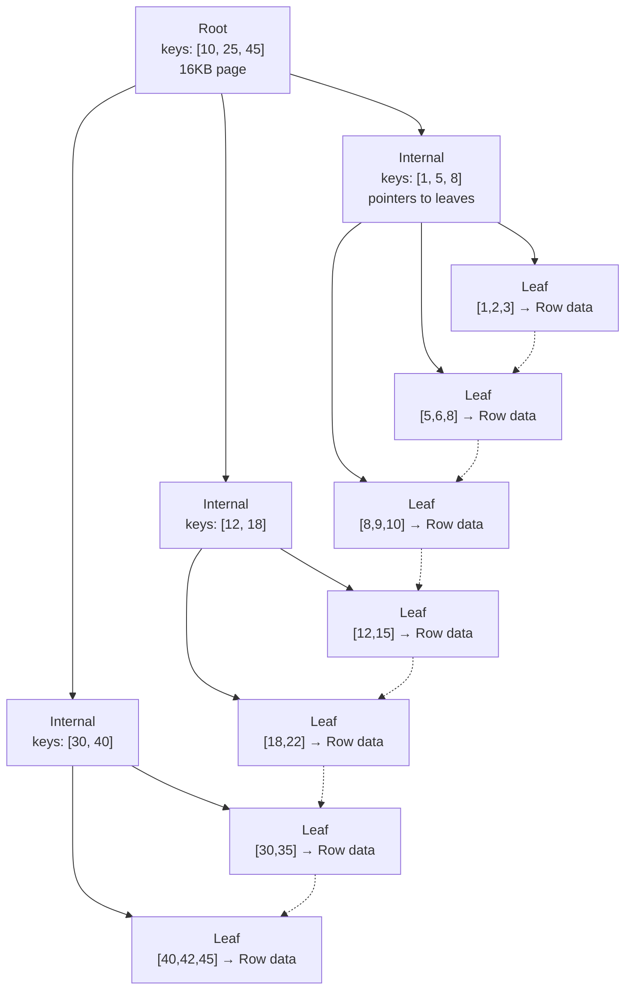
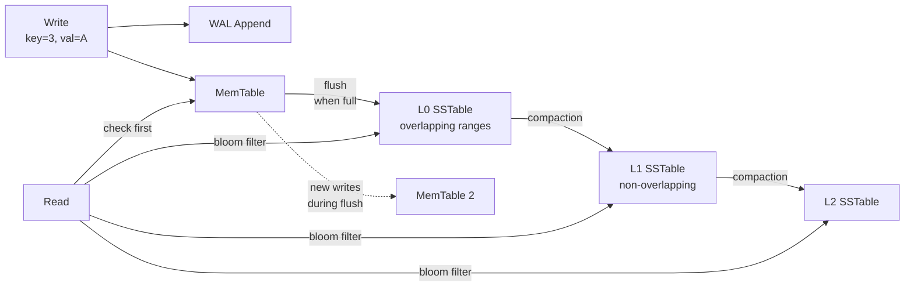

# DB  Storage  Engines
## B-Tree vs LSM-Tree vs Heap

The three fundamental storage engine data structures:

| Property            | B-Tree (PostgreSQL, SQL Server, Oracle) | LSM-Tree (Cassandra, RocksDB, LevelDB)      | Heap (PostgreSQL)                   |
| ------------------- | --------------------------------------- | ------------------------------------------- | ----------------------------------- |
| Read speed          | Fast — single path to leaf              | Slower — check multiple SSTables + MemTable | Depends on indexes                  |
| Write speed         | Slower — random I/O, page splits        | Fast — sequential append                    | Moderate — append to heap page      |
| Space amplification | Low — in-place updates                  | High — obsolete versions until compaction   | Moderate — dead tuples until VACUUM |
| Write amplification | Moderate                                | High (compaction merges)                    | Low                                 |
| Concurrency         | Page-level locking                      | Append-only, no in-place overwrite          | Row-level + MVCC                    |

### B-Tree

A balanced tree of fixed-size pages. Internal pages contain separator keys and child page pointers. Leaf pages contain the stored data (rows in a clustered index, or `(key, pointer)` pairs in a non-clustered index). Reads traverse root → internal → leaf in O(log n) page accesses. Writes modify a page in-place; a full page triggers a 50/50 split.

#### Anatomy

Each node = one disk page (8KB–16KB). Two node types:

```
Internal node:  [ key1 | ptr1 | key2 | ptr2 | key3 | ptr3 | ... ]
Leaf node:      [ key1 | data1 | key2 | data2 | key3 | data3 | ... ]
                ─────────────────────────────────────────────────────
                Leaf nodes also have a "next leaf" pointer
```

- **Internal nodes** contain keys + child pointers. Key `K` at position `i` means: all values in child `i` are ≤ K, all values in child `i+1` are > K.
- **Leaf nodes** contain keys + actual data (or a pointer to it, like a CTID in PostgreSQL).
- Leaf nodes form a **linked list** so range scans (`WHERE key BETWEEN 10 AND 50`) walk left→right without backtracking up the tree.

#### Search: trace for key = 22

```
Root page:     [10, 25, 45]         → 22 < 25, go left
  ↓
Internal page: [12, 18]             → 22 > 18, go right
  ↓
Leaf page:     [18, 22, 30] → data  → found at position 1
```

At each level: binary search within the page to decide which child to follow. Only as many page reads as tree height.



#### Insert with split

Insert key = 6 into leaf [5,6,8] that has space → just insert in sorted position. Simple.

Insert key = 7 into a *full* leaf (page holds max 4 keys for illustration):

```
Before:     Leaf: [1, 2, 5, 8]   Parent: [10, 25]
            Insert 7 → overflow!

Step 1 — Split:     Left  = [1, 2, 5]   Right = [7, 8]
                    Middle key = 5 (promoted to parent)

Step 2 — Promote:   Parent before: [10, 25]
                    Parent after:  [5, 10, 25]
                    Children become: [left, right] → parent now has 3 children

Step 3 — If parent is now full → split parent too (propagate upward).
                    (Here parent has room, so done.)
```

Result: the tree grows wider, not deeper. All leaves stay at the same depth forever.

#### Key properties

- **Fan-out**: ~2000 keys per 16KB page (with 8-byte keys). A 3-level tree: 2000³ = 8B keys.
- **Height**: log_{fanout}(n). 1B rows → height 3 (root + 1 internal + leaf = 3 seeks worst case).
- **Self-balancing**: All leaves always at the same depth. Splits propagate up, never change depth of existing leaves.
- **Leaf linked list**: Range scan = sequential page reads, not tree traversal.
- **Buffer pool friendly**: Hot internal pages (root, top levels) stay cached — most reads hit only the leaf page on disk.

#### Pseudocode

```pseudocode
function BTreeSearch(root, target_key)
    node ← root
    while not IsLeaf(node)
        i ← BinarySearch(node.keys, target_key)
        node ← node.children[i]
    return BinarySearch(node.keys, target_key)

function BTreeInsert(tree, key, value)
    leaf ← FindLeaf(tree.root, key)
    InsertEntry(leaf, key, value)
    if IsFull(leaf)
        SplitAndPropagate(leaf)

function SplitAndPropagate(node)
    left, right, middle_key ← SplitHalf(node)
    if IsRoot(node)
        tree.root ← NewInternalNode([middle_key], [left, right])
    else
        parent ← node.parent
        InsertKey(parent, middle_key)
        ReplaceChild(parent, old = node, new_children = [left, right])
        if IsFull(parent)
            SplitAndPropagate(parent)

function SplitHalf(node)
    mid ← floor(NumKeys(node) / 2)
    left  ← NewNode(keys = node.keys[0:mid],    children = node.children[0:mid+1])
    right ← NewNode(keys = node.keys[mid+1:],   children = node.children[mid+1:])
    return (left, right, middle_key = node.keys[mid])
```

**Used by**: [SQL Server](deep-dives/sql-server.md) (clustered/non-clustered B-Tree), [SQLite](deep-dives/sqlite.md), Oracle, [MongoDB/WiredTiger](deep-dives/mongodb.md) (B-Tree mode, configurable).

### LSM-Tree

Optimized for high-throughput writes. Append-only — new data goes to MemTable (RAM), flushed to immutable SSTable on disk (sequential I/O). A record may exist in multiple files. Background compaction merges files, discarding obsolete versions. Writes are fast, reads are slower (check MemTable, then SSTables newest→oldest).



Write path:
1. Write is appended to the WAL (sequential disk write).
2. Key-value is inserted into the MemTable (sorted, in-memory skip list).
3. When the MemTable is full, it becomes immutable and a new MemTable takes over.
4. The immutable MemTable is flushed to disk as an SSTable (sequential write).
5. Background compaction merges SSTables, discarding old versions and tombstones.

Read path:
1. Check MemTable first.
2. Check each SSTable from newest to oldest (bloom filters skip irrelevant SSTables).
3. Merge results → return the latest version.

Compaction strategies:
- **Size-Tiered (STCS)**: When N SSTables of similar size exist, merge them into one larger SSTable. Simple but causes write amplification spikes.
- **Leveled (LCS)**: L0 has overlapping SSTables. Deeper levels are non-overlapping with exponentially increasing size. Minimizes space amplification but increases write amplification.
- **Time-Window (TWCS)**: For time-series data. SSTables within the same time window are compacted together. Old windows are dropped.

```pseudocode
function Compact(sstables)
    iterators ← [NewIterator(s) for s in sstables]
    writer ← NewSSTableWriter()

    while not AllExhausted(iterators)
        candidate ← min(iterators, by = CurrentKey)
        (key, value, timestamp, tombstone) ← Next(candidate)

        if tombstone and key not in any later file
            continue

        WriteEntry(writer, key, value, timestamp)

    writer.Close()
```

**Used by**: [Cassandra](deep-dives/cassandra.md), [RocksDB](deep-dives/rocksdb.md), LevelDB, [MongoDB/WiredTiger](deep-dives/mongodb.md) (LSM mode), Bigtable.

### Heap

Rows stored in unordered pages with no inherent order. Each row has a physical identifier (CTID in PostgreSQL, RID in SQL Server). Writes append to the next available slot — no in-place reordering. Unlike B-Tree pages, heap pages have no separator keys, no internal/leaf distinction — each page is just a bag of tuples. Dead tuples accumulate until garbage collection (VACUUM in PG).

**Used by**: PostgreSQL (always heap, indexes are separate B-Trees), SQL Server (optionally, when no clustered index is defined).

## On-Disk File Layout

All databases store data as files on disk. Each engine defines its own binary format — page layout, checksums, compression, naming.

### Generic Page Layout

```
┌─────────────────────────────────────┐
│  Page Header (checksum, LSN, type)  │  ← every page has metadata
├─────────────────────────────────────┤
│  Slot Array (offset ptrs to rows)   │  ← grows downward from header
├─────────────────────────────────────┤
│                                     │
│  Free Space                         │  ← between slot array and rows
│                                     │
├─────────────────────────────────────┤
│  Row Data / Keys & Pointers         │  ← grows upward from bottom
└─────────────────────────────────────┘
```

The page header contains at minimum: a checksum (detect corruption), an LSN (tells crash recovery if this page is newer than the checkpoint), and the page type (leaf, internal, meta, etc.). The slot array is how the engine finds individual rows within the page — each slot is a `(offset, length)` pair into the row data area.

All engines do some form of this layout. The differences are in page size, checksum algorithm, compression, and what metadata lives in the header.