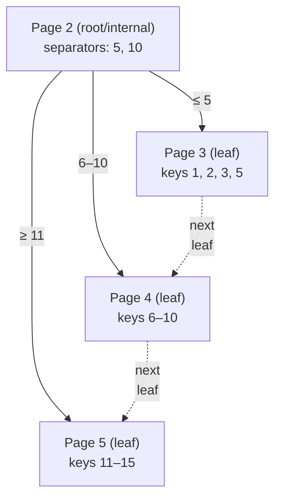
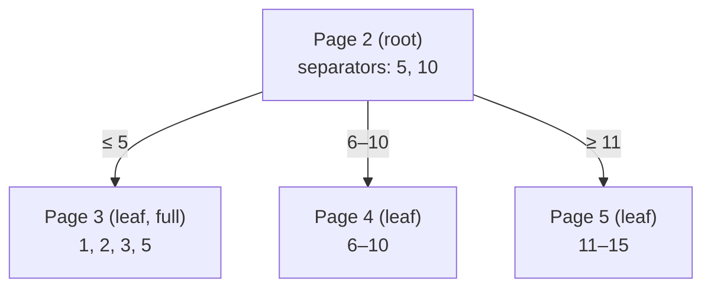
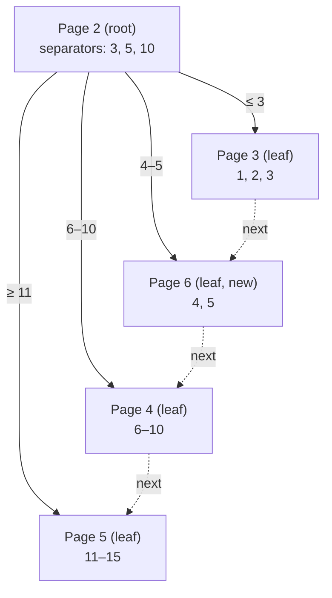
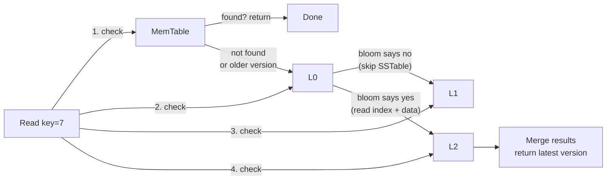

# DB  Storage  Engines
## B-Tree vs LSM-Tree vs Heap

The three fundamental storage engine data structures:

| Property            | B-Tree (PostgreSQL, SQL Server, Oracle) | LSM-Tree (Cassandra, RocksDB, LevelDB)      | Heap (PostgreSQL)                   |
| ------------------- | --------------------------------------- | ------------------------------------------- | ----------------------------------- |
| Read speed          | Fast — single path to leaf              | Slower — check multiple SSTables + MemTable | Depends on indexes                  |
| Write speed         | Slower — random I/O, page splits        | Fast — sequential append                    | Moderate — append to heap page      |
| Space amplification | Low — in-place updates                  | High — obsolete versions until compaction   | Moderate — dead tuples until VACUUM |
| Write amplification | Moderate                                | High (compaction merges)                    | Low                                 |
| Concurrency         | Page-level locking                      | Append-only, no in-place overwrite          | Row-level + MVCC                    |

## B-Tree

#### 1. Pages, How Data Is Organized on Disk

A database stores data in **pages** (aka blocks), typically 8KB–16KB. Every page has the same regions:

```
┌──────────────────────────────┐
│ Page Header                  │  type, checksum, LSN, free-space pointers
├──────────────────────────────┤
│ Cell Pointer Array           │  grows downward; each entry points to a cell
├──────────────────────────────┤
│ Free Space                   │
├──────────────────────────────┤
│ Cell Data                    │  grows upward; keys + values or child refs
├──────────────────────────────┤
│ Special Area (8–20 bytes)    │  rightmost child (internal) or next-leaf ptr
└──────────────────────────────┘
```

When the engine reads a row, it loads the entire page into the **buffer pool**. Writes modify the page in memory and flush it to disk later. The file is just pages in sequence: to read page N, seek to `N × page_size`.

#### 2. How Pages Form a Tree

Not all pages are the same. **Leaf pages** store the actual data cells (key + row pointer or full row). **Internal pages** store separators that guide the search. The file header records which page is the root.



Each arrow out of the root shows the key range that maps to that child. Leaves are linked by a **next-leaf** pointer — a range scan reads page 3, follows `next` → page 4, `next` → page 5, without touching the tree.

#### 3. Search

To find a key `k`:

1. Read the root page number from the file header.
2. Read the root page: `offset = root_page_no × page_size`.
3. Binary-search the cell pointer array to find the matching separator.
4. Follow the arrow to the child page. If internal, repeat. If leaf, binary-search the cells for the data.

**Trace: find key 12:**
```
Root page 2: separators [5, 10]. 12 > 10 → follow "≥ 11" arrow → page 5
Page 5 (leaf): binary-search cells → found
```

**Trace: find key 2:**
```
Root page 2: separators [5, 10]. 2 < 5 → follow "≤ 5" arrow → page 3
Page 3 (leaf): binary-search cells → found at position 0
```

Each level is one page read. The root stays cached in the buffer pool, so most searches hit only the leaf page on disk.

#### 4. Insert

1. **Find leaf** — same search path as reading.
2. **Insert the cell** in the leaf page: shift slot array entries right to make room, write cell data at the top of free space. Update header: increment cell count, move free-space pointers.
3. **If the leaf is full** (no room for another cell): split it.
   - Allocate a new page (from freelist or by appending to file).
   - Distribute cells 50/50 between the old page and the new page.
   - Promote the middle key as a separator to the parent.
   - Wire the next-leaf pointer: old leaf → new leaf.
4. **Propagate splits upward**: if the parent is now full, split it too. If the root splits, allocate a new root and the tree grows one level taller.

**Split example** (page holds max 4 cells for illustration):

Before inserting key 4:



Page 3 is full with [1, 2, 3, 5]. Inserting key 4 triggers a split. Cells are split 50/50, middle key (3) is promoted to the root:



Root now has 4 children instead of 3. The tree grew wider, not deeper — all leaves stay at the same depth.

#### 5. File Growth & Free Space

As pages fill and split, the engine needs new pages:
- **Freelist**: a linked list of unused pages within the file. The engine reuses these before extending the file.
- **Extend**: append new pages at the end. The file grows by one page at a time, or in extent-sized batches (InnoDB: 1MB extents, SQL Server: 64KB extents of 8 pages).
- How engines track free pages: PostgreSQL uses a Free Space Map (FSM) — a separate file tracking per-page free space. InnoDB uses extent descriptor pages (bitmaps within the tablespace). SQLite uses a freelist trunk-page chain.

#### 6. Key Properties

- **Fan-out**: ~200 keys per 8KB page. A 3-level tree holds 200³ = 8M keys; with 16KB pages (~500 keys) it holds 125M keys.
- **Height**: log_{fanout}(n). 1B rows → height 3–4 (root + 1–2 internal + leaf).
- **log n vs log_fanout(n)**: A binary tree needs ~27 levels to index 125M rows. A B-Tree with 16KB pages (~500 keys per page) needs 3. That's 27 disk seeks vs 3 for any single-key lookup — the difference between 270ms and 30ms at 10ms per seek.
- **Self-balancing**: all leaves at the same depth. Splits propagate up, never deepen the tree.
- **Leaf linked list**: range scans are sequential page reads, not repeated tree traversals.
- **Buffer-pool friendly**: root and internal levels stay cached — most read I/O hits only the leaf page.

**Used by**: [SQL Server](deep-dives/sql-server.md) (clustered/non-clustered B-Tree), [SQLite](deep-dives/sqlite.md), Oracle, [MongoDB/WiredTiger](deep-dives/mongodb.md) (B-Tree mode, configurable).

#### 7. Practical Implications

**Sequential PK (auto-increment) vs UUID**: Inserting into a sequential PK always fills the rightmost leaf page. Pages split only at the right edge, keeping the tree compact. A UUID PK scatters inserts across all leaf pages, causing 50/50 splits everywhere, more write amplification, and worse cache behavior.

**Row width affects fanout**: Wide rows (many columns, large TEXT/BLOBs) mean fewer cells per leaf page, so the tree is deeper and reads need more page accesses.

---
## LSM-Tree

#### 1. WAL & MemTable — Before Data Hits Disk

A write goes through two in-memory structures before it touches a permanent file:

- **WAL (Write-Ahead Log)**: Not LSM-specific — B-Tree engines use it too (InnoDB's redo log, PG's WAL). Every write is appended to the WAL sequentially on disk. On crash, the engine replays the WAL to recover lost writes.
- **MemTable**: LSM-specific. A sorted in-memory data structure (skip list in RocksDB/Cassandra, B-Tree in WiredTiger). The engine inserts the key-value into the MemTable immediately after appending the WAL.

The WAL is the durability guarantee. The MemTable is the speed — writes never block on random disk I/O.

When the MemTable exceeds its size threshold, it becomes **immutable** (read-only) and a fresh MemTable takes over. The immutable MemTable is flushed to disk as an SSTable.

#### 2. SSTable — The On-Disk File

An SSTable (Sorted String Table) is an immutable, sorted file on disk. Once written, it's never modified:

```
┌──────────────────────────────┐
│ Data Blocks (key-value data) │  ← compressed variable-size blocks
├──────────────────────────────┤
│ Meta Block (Bloom filter)    │  ← optional, one per file
├──────────────────────────────┤
│ Index Block                  │  ← (last_key, offset) per data block
├──────────────────────────────┤
│ Metaindex Block              │  ← offset + size of each meta block
├──────────────────────────────┤
│ Footer                       │  ← pointer to index + metaindex blocks
└──────────────────────────────┘
```

Key properties:
- **Immutable**: never modified after creation. No in-place writes, corruption is impossible once written. Background compaction merges old SSTables into new ones.
- **Sequential I/O**: flushing a MemTable writes one big sorted file in one sequential pass. Compaction merges files using sequential reads + sequential writes.
- **Self-indexing**: the index block maps key ranges to data block offsets. Find a key by binary-searching the index, then reading one data block.
- **Bloom filter**: a probabilistic "not-in-file" test. If the bloom says "no", the engine skips the entire SSTable without reading it. If "maybe", it reads the index + data block. Saves I/O on files that don't contain the target key.

A record may exist in multiple SSTables (with different timestamps). The newest version wins. Deletes are written as **tombstones** — a delete marker that outranks older values during compaction.

(Immutable on-disk format is what gives LSM-Trees their write performance and simple crash recovery — at the cost of more reads to find data spread across files.)

#### 3. Read Path — The Cost of Append-Only

A single write touches one MemTable. But a read may need to check many places:



Step by step:
1. **MemTable** — check the active (and any immutable) MemTable. Fastest hit.
2. **L0 SSTables** — the newest files on disk. Their key ranges overlap, so you must check each one. Bloom filters skip irrelevant files.
3. **L1+ SSTables** — deeper levels are non-overlapping. Only one file per level can contain the key. Bloom filter tells you which (or none).
4. **Merge** — collect all versions found, return the one with the highest timestamp.

This is why LSM reads are slower than B-Tree reads. A B-Tree has one path to the leaf. An LSM-Tree may check 10+ SSTables for a single point lookup. Bloom filters reduce the brute force, but they don't eliminate it — a "yes" from the bloom means the file might contain the key, and you still need to read it.

(LSM writes are fast because they're sequential. LSM reads are slow because data is spread across generations. Compaction moves data into deeper levels to keep the read path tight, but it's a constant background battle against write volume.)

#### 4. Compaction — Merging Generations

Compaction is the background process that merges SSTables, discarding old versions and tombstones. Without it, the file count grows unbounded and reads become impossibly slow.

**Why it's needed** — three problems compaction solves:
1. **Space amplification**: old versions of records take up space until merged away
2. **Read amplification**: too many files to check per read
3. **Tombstone cleanup**: delete markers must outlive the data they delete

**Three compaction strategies:**

| Strategy | How it works | Write amp | Space amp | Best for |
|----------|-------------|-----------|-----------|----------|
| **Size-Tiered (STCS)** | Merge N files of similar size into one larger file. Levels are not maintained — files live alongside each other. | Moderate | High | Write-heavy, disk-not-a-concern |
| **Leveled (LCS)** | L0 is overlapping. Deeper levels (L1, L2, …) are non-overlapping with exponentially increasing size (×10 per level). Merge L0 into L1, L1 into L2, etc. | High | Low | Read-mixed, want predictable latency |
| **Time-Window (TWCS)** | SSTables within the same time window are compacted together. Old windows are dropped entirely (no merge needed). | Low | None | Time-series, metrics, logs |

**Write amplification** is the key tradeoff: leveled compaction rewrites each record ~10–20× over its lifetime (moving L0→L1→L2…). Size-tiered rewrites less but uses more disk space. Time-window is for data that expires.

#### 5. Key Properties & Practical Implications

| Property           | LSM-Tree                                                     | B-Tree                                                                      |
| ------------------ | ------------------------------------------------------------ | --------------------------------------------------------------------------- |
| **Write I/O**      | Sequential (WAL append + SSTable flush)                      | Random (page-modified in buffer pool, flushed anywhere)                     |
| **Read I/O**       | Multiple SSTable probes (bloom filters help)                 | Single path to leaf (log_fanout(n) pages)                                   |
| **Space amp**      | High without compaction; moderate with leveled               | Low (in-place updates, no old versions)                                     |
| **Write amp**      | High (compaction rewrites data)                              | Low to moderate (page splits only)                                          |
| **Range scan**     | Efficient within one SSTable, but spans require merging      | Efficient — leaf linked list                                                |
| **Crash recovery** | Fast — replay WAL, rebuild MemTable. No page recovery needed | Slow — need to replay redo log, may need to recover partially-written pages |

**When to choose LSM over B-Tree:**
- **Write-heavy workloads**: logging, metrics, IoT sensor data, clickstreams
- **Time-series with TTL**: data is inserted once, read for a short window, then dropped
- **You can tolerate slower reads** for much faster writes
- **Flash storage**: sequential writes are still faster than random writes even on SSDs (though the gap narrows)

**When to choose B-Tree over LSM:**
- **Read-heavy workloads**: user-facing apps, point lookups by primary key
- **Low-latency reads required**: consistent 1–3 page reads vs variable multi-SSTable probes
- **Range scans on primary key**: B-Tree leaf linked list is simpler than merging LSM levels
- **You want predictable P99 latency**: compaction spikes in LSM can cause latency jitter

**Bloom filter sizing**: more memory → fewer false positives → fewer pointless SSTable reads. Rule of thumb: ~10 bits per key gives ~1% false positive rate. RocksDB default: one bloom per SSTable, configurable per level.

---
## Heap

#### 1. What Is a Heap

A heap is an unordered collection of rows stored in pages. Unlike B-Tree pages, heap pages have **no separator keys**, **no internal/leaf distinction** — each page is just a bag of tuples. New rows are appended to any page with free space.

Same generic page layout as B-Tree pages:

```
┌──────────────────────────────┐
│ Page Header                  │  type, checksum, LSN, free-space pointers
├──────────────────────────────┤
│ Slot Array                   │  grows downward; each entry = (offset, length)
├──────────────────────────────┤
│ Free Space                   │
├──────────────────────────────┤
│ Row Data                     │  grows upward; tuples with MVCC headers
└──────────────────────────────┘
```

Each row has a physical identifier — **CTID** in PostgreSQL `(page_no, slot_index)` or **RID** in SQL Server `(file_id:page_no:slot)`. This is the direct disk address of the row.

Because rows are unordered, locating a specific row **requires an index**. The heap itself has no structure for finding data — it's designed for full scans and as the backing store for secondary indexes.

#### 2. Index + Heap Interaction

An index on a heap table stores `(key, CTID)` pairs — see [indexing.md](./indexing.md) for how B+Tree indexes work. When the index returns a CTID, the engine reads the corresponding heap page to fetch the row:

```
Index scan → CTID(42,7) → read heap page 42, slot 7 → row data
```

This is the **double lookup**: one I/O for the index leaf, one for the heap row.

Contrast with a **clustered index** where the index leaf IS the row data (InnoDB, SQL Server default):

| | Clustered index | Heap (PostgreSQL, SQL Server without clustered) |
|---|---|---|
| Row locator | Primary key — secondary indexes store PK, not physical address | CTID / RID — direct physical pointer |
| Lookup path | Index walk → data in leaf | Index walk → CTID → heap page read |
| UPDATE | Modify B-Tree in place (may split page) | Mark old dead, insert new tuple |

#### 3. Dead Tuples & Bloat

Heap storage interacts with MVCC in a specific way. An UPDATE doesn't modify the row in place  it marks the old tuple as **dead** and inserts a **new** tuple:

```
Before:  Page 3: [Alice, age=30] (live)
UPDATE age=31:
         Page 3: [Alice, age=30] (dead)  [Alice, age=31] (live)
```

Dead tuples accumulate until garbage collection reclaims them:

- **VACUUM** (PostgreSQL): scans pages, removes dead tuples, compacts remaining rows, updates the Free Space Map (tracks per-page free space) and Visibility Map (tracks all-visible pages for index-only scans).
- **Autovacuum**: background process that triggers based on dead tuple count and fraction thresholds.
- **Bloat**: when dead tuples accumulate faster than VACUUM can clean — table size grows beyond actual data. Monitored via `pg_stat_user_tables.n_dead_tup` and table size vs row count.
- **Index bloat**: index entries pointing to dead tuples also waste space. VACUUM cleans these too — a full-table vacuum is the only way to reclaim index bloat fully.

(InnoDB avoids heap bloat differently: its undo log stores old versions separately, and the clustered index page is compacted during normal B-Tree operations.)

**Used by**: PostgreSQL (always heap, indexes are separate B-Trees), SQL Server (optionally, when no clustered index is defined).

---

## Columnar Storage

Instead of storing all columns of a row together, columnar DBs store each column separately:

| Row Store | Column Store |
|---|---|
| `[1, Alice, NY, 100]` | `id: [1, 2, 3]` |
| `[2, Bob, LA, 200]` | `name: [Alice, Bob, Carol]` |
| `[3, Carol, SF, 150]` | `city: [NY, LA, SF]` |
| | `amount: [100, 200, 150]` |

**Advantages for analytics**:
- Only read columns needed by the query (skip irrelevant columns)
- Better compression (same data type per column) — run-length encoding, dictionary, bit packing
- Vectorized / SIMD processing on column batches
- **Late materialization**: Defer row reconstruction until necessary

**Examples**: DuckDB, ClickHouse, Redshift, Snowflake, BigQuery.