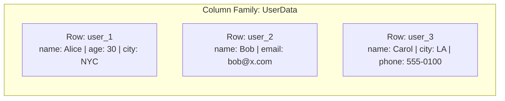
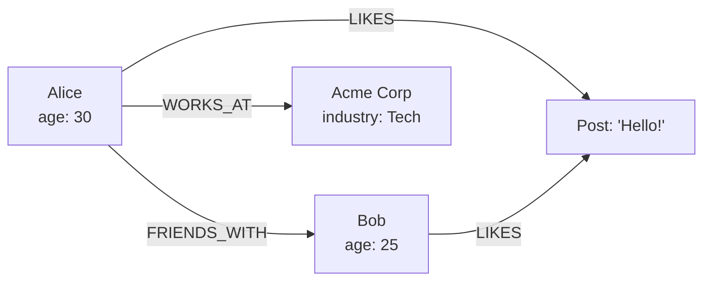
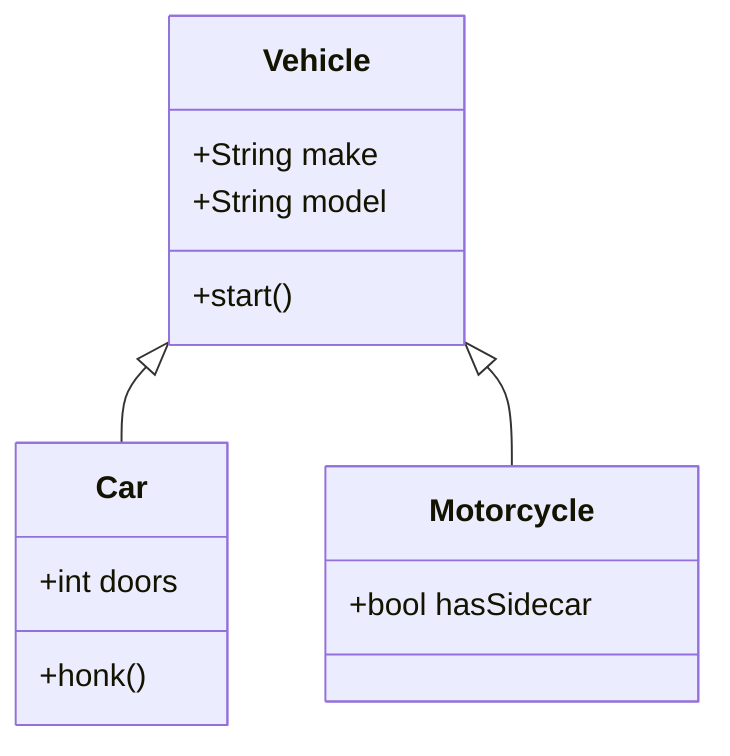
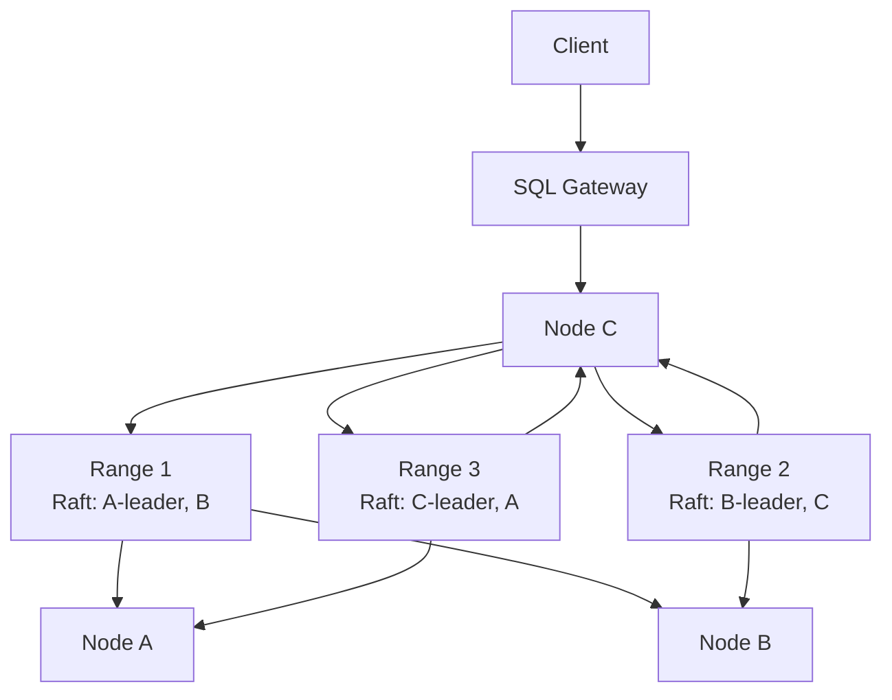
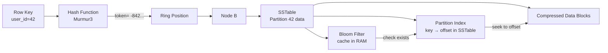

# Database Taxonomy & Indexing

## Database Taxonomy

### Relational (SQL)

**Model**: Tables with rows and columns, strict schema, relationships via foreign keys. Data is normalized to reduce redundancy.

**Query Language**: SQL (Structured Query Language) — `SELECT`, `JOIN`, `GROUP BY`, transactions.

**Consistency**: ACID transactions, strong consistency by default. Isolation levels can be relaxed for performance.

**Use Case**: Banking, ERP, CRM, order management — any system where data integrity and complex relationships matter.

| Database | Engine | Default Isolation | Key Strength |
|---|---|---|---|
| MySQL | InnoDB (B+Tree clustered) | Repeatable Read | Read-heavy OLTP, wide ecosystem |
| PostgreSQL | Heap + B-Tree | Read Committed | Extensibility, advanced indexing, standards compliance |
| SQL Server | B+Tree (clustered/non-clustered) | Read Committed | Enterprise features, SQL Server Agent, SSIS |
| Oracle | B+Tree + undo segments | Read Committed | High-end enterprise, RAC clustering |

> **Deep Dive**: [PostgreSQL Internals](./deep-dives/postgresql.md)

---

### Document

**Model**: Semi-structured JSON/BSON documents with nested objects and arrays. Schema is flexible — different documents in the same collection can have different fields.

**Query Language**: JSON-based queries, optional SQL-like (MongoDB Aggregation, Couchbase N1QL).

**Consistency**: Tunable — MongoDB defaults to strong consistency per document (primary reads), Couchbase offers eventual consistency.

**Use Case**: Content management, catalogs, gaming, rapid prototyping.

**Indexing**: MongoDB uses WiredTiger (B-Tree or LSM). Supports compound, multikey, text, geospatial, and TTL indexes.

> **Deep Dive**: [MongoDB Internals](./deep-dives/mongodb.md)

---

### Key-Value

**Model**: Opaque blob stored by a unique key. No schema, no relationships. The simplest data model possible.

**Query Language**: `GET`, `SET`, `DEL` — often via simple binary protocol or REST.

**Consistency**: Varies — Redis is strongly consistent (single-threaded), DynamoDB is eventually consistent by default with optional strong consistency.

**Use Case**: Caching, session store, real-time leaderboards, shopping carts.

**Indexing**: Primary key only (hash table or tree). Secondary indexes are not native — DynamoDB offers Global Secondary Indexes (GSI) as separate tables maintained asynchronously. Redis sorted sets use a skip list for range queries.

> **Deep Dive**: [Redis Internals](./deep-dives/redis.md)

---

### Wide-Column

**Model**: Rows with a dynamic set of columns grouped into column families. Schema is flexible within a family. Each row can have millions of columns.

**Query Language**: CQL (Cassandra Query Language) — SQL-like but limited to partition-key-based queries.

**Consistency**: Tunable — Cassandra defaults to eventual consistency with configurable consistency levels (`ONE`, `QUORUM`, `ALL`).

**Use Case**: Time-series data, IoT, recommendation engines, messaging systems.

**Example**:


**Indexing**: Primary index is the partition key (hash). Clustering columns sort within a partition. Secondary indexes exist but are discouraged (use materialized views). SSTable offset maps + Bloom filters for fast lookup.

> **Deep Dive**: [Cassandra Internals](./deep-dives/cassandra.md)

---

### Graph

**Model**: Nodes (entities) and edges (relationships). Both nodes and edges can have properties. Relationships are first-class citizens.

**Query Language**: Cypher (Neo4j), Gremlin (JanusGraph), SPARQL (RDF).

**Consistency**: Typically ACID per transaction (Neo4j is fully ACID).

**Use Case**: Social networks, recommendation engines, fraud detection, knowledge graphs.

**Example**:


**Indexing**: B-Tree on node labels and properties (Neo4j uses Lucene-based indexes). Relationship traversal is pointer-based — no index needed for traversing edges.

---

### Object

**Model**: Objects stored and retrieved directly, closely mapping to programming language constructs. Supports inheritance, polymorphism, and complex object graphs.

**Query Language**: Object-oriented query APIs — often language-native (e.g., Java `Query` API for db4o, C# LINQ for Versant).

**Consistency**: ACID per database. Often used in embedded mode.

**Use Case**: CAD/CAM systems, telecommunications, embedded systems — niche usage.

**Example**:


---

### Time-Series

**Model**: Data points indexed by timestamp. Optimized for append-heavy workloads and range scans over time windows.

**Query Language**: Custom query languages (InfluxQL, Flux) or SQL with time functions (TimescaleDB).

**Consistency**: Varies — InfluxDB is eventually consistent in clustered mode; TimescaleDB inherits PostgreSQL's ACID guarantees.

**Use Case**: Monitoring, observability, IoT sensor data, financial tick data.

**Example**:
```
Measurement: cpu_usage
Tags: host=server01, region=us-east
┌─────────────────────┬───────┐
│ Timestamp           │ Value │
├─────────────────────┼───────┤
│ 2024-01-01T00:00:00 │ 45.2  │
│ 2024-01-01T00:01:00 │ 47.8  │
│ 2024-01-01T00:02:00 │ 52.1  │
└─────────────────────┴───────┘
```

---

### NewSQL / Distributed SQL

**Model**: SQL interface with ACID transactions distributed across multiple nodes. Combines the horizontal scalability of NoSQL with the consistency of relational databases.

**Query Language**: SQL — standard SQL with distributed execution.

**Consistency**: ACID with strong consistency (Serializable or external consistency).

**Use Case**: Global-scale applications that need ACID: banking, booking systems, multi-region deployments.

**Example**:


| Database | Consensus | Sharding | Clock |
|---|---|---|---|
| CockroachDB | Raft per range | Range-based (auto-split) | HLC (Hybrid Logical Clock) |
| Spanner | Paxos per shard | Directory-based | TrueTime (GPS + atomic clocks) |
| TiDB | Raft (multi-raft) | Range-based (region) | PD timestamp oracle |

> **Deep Dive**: [Google Spanner Internals](./deep-dives/spanner.md)

***

## Indexing Mechanisms

---

### Index Fundamentals

**Cardinality** refers to the number of unique values in a column relative to the total row count. It is the primary metric the query optimizer uses to decide whether to use an index.

- **High Cardinality** (e.g., `User_ID`, `Email`): Indexes are extremely effective. The B+Tree can rapidly narrow millions of rows to a single match.
- **Low Cardinality** (e.g., `Gender`, `Status`): Indexes are often ignored. Querying for 90% of rows via an index means jumping back and forth (random I/O) — slower than a full sequential table scan.

**Clustered vs Non-Clustered**: A clustered index stores the actual row data in the index leaf pages (table is the index). A non-clustered index stores pointers to the row data — either the row ID (heap) or the clustered key.

---

### Composite Index & Leftmost Prefix Rule

A Composite Index is a single index on multiple columns, ordered by the definition sequence (e.g., `CREATE INDEX idx ON T (A, B, C)`). The database sorts by A first, then by B within equal A values, then by C within equal A+B.

**Leftmost Prefix Rule**: The index can only be used if queries filter on columns starting from the left without skipping:

- `WHERE A = ?` — uses index
- `WHERE A = ? AND B = ?` — uses index
- `WHERE B = ?` — does NOT use index (skipped A)
- `WHERE A = ? AND C = ?` — uses A but cannot use C for filtering (skipped B)

This is critical for index design: order columns by selectivity (most selective first) and align with query patterns.

---

### B+Tree Index (MySQL, PostgreSQL, SQL Server)

```mermaid
graph TD
    Root[Root Page<br/>key: 50] --> I1[Internal Page<br/>10 | 30]
    Root --> I2[Internal Page<br/>70 | 90]
    I1 --> L1[Leaf: 1,5,8 → ptr]
    I1 --> L2[Leaf: 12,18,25 → ptr]
    I1 --> L3[Leaf: 32,40,48 → ptr]
    I2 --> L4[Leaf: 55,62,68 → ptr]
    I2 --> L5[Leaf: 72,80,88 → ptr]
    I2 --> L6[Leaf: 95,99 → ptr]
    L1 -.-> L2 -.-> L3 -.-> L4 -.-> L5 -.-> L6
```

The B+Tree is the dominant index structure in relational databases:

- **Internal nodes** store only keys (not data) to maximize fan-out — a single 16KB page can hold hundreds of keys.
- **Leaf nodes** store the actual row pointer — either the full row (clustered) or a pointer.
- **Leaf nodes are linked** — a linked list connects them left-to-right, enabling efficient range scans (`BETWEEN`, `>`).
- **Height is typically 3-4** for billions of rows. Every lookup is 3-4 I/O operations.

**MySQL (InnoDB)**: Primary key is a clustered B+Tree — the leaf pages store the entire row. Secondary indexes store the PK value as the pointer (not a physical address). This means a secondary index lookup requires two B+Tree traversals: first the secondary index, then the PK (clustered) index. This is called a "double lookup" or "bookmark lookup."

```mermaid
graph LR
    subgraph PK[B+Tree Clustered<br/>Primary Key]
        PKL[Leaf: id=1,<br/>row data...]
        PKL2[Leaf: id=25,<br/>row data...]
    end
    subgraph SK[B+Tree Non-Clustered<br/>Secondary Index (email)]
        SKL[Leaf: email@ → id=25]
        SKL2[Leaf: user@ → id=1]
    end
    SKL --> PKL2
    SKL2 --> PKL
```

**PostgreSQL**: Uses a heap-based storage model. The B-Tree index stores `(key, CTID)` where `CTID = (page_number, tuple_index)` points directly to the heap tuple. No double lookup — the index directly locates the row. However, MVCC means older row versions exist in the heap, and the index may point to a dead tuple, requiring a visibility check.

```mermaid
graph TD
    Index[B-Tree Index<br/>key → CTID] --> I1[Internal: 1-100]
    Index --> I2[Internal: 101-200]
    I1 --> L1[Leaf: a@ → (0,1)]
    I1 --> L2[Leaf: b@ → (1,2)]
    L1 --> Heap[Heap Page 0<br/>---]
    L2 --> Heap2[Heap Page 1<br/>---]
    Heap --> T1[Tuple 1<br/>xmin=100, xmax=null]
    Heap --> T2[Tuple 2<br/>xmin=101, xmax=200<br/>dead?]
```

**SQL Server**: Supports both clustered and non-clustered indexes. In a clustered index, the leaf level is the data page. In a non-clustered index, the leaf contains either the clustered key (if the table has a clustered index) or a Row ID (RID, if the table is a heap). SQL Server also supports **included columns** — non-key columns stored at the leaf level to cover queries without touching the table.

---

### PostgreSQL Specialized Indexes

Beyond B-Tree, PostgreSQL offers advanced index types:

- **GiST** (Generalized Search Tree): For full-text search, geometric data, range types. Used by PostGIS for spatial queries.
- **GIN** (Generalized Inverted Index): For arrays, JSONB, full-text search (tsvector). Stores a mapping from values to rows — efficient for finding rows containing a specific array element.
- **BRIN** (Block Range Index): For large tables where data is naturally ordered (time-series). Stores min/max values per block range. 100-1000x smaller than B-Tree but slower on random lookups.
- **SP-GiST**: For k-d trees, quad-trees — good for point data and network addresses.
- **Hash**: Equality-only lookups. Rarely used because B-Tree handles both equality and range.

---

### SQL Server Specialized Indexes

- **Filtered Index**: `CREATE INDEX ... WHERE status = 'active'` — indexes only a subset of rows. Smaller and faster than a full-table index.
- **Columnstore Index**: Stores data column-wise instead of row-wise. Used for analytics/data warehousing. High compression and vectorized execution.
- **Full-Text Index**: Inverted index for text search, maintained by the Full-Text Engine.

---

### MongoDB Indexing

MongoDB uses **WiredTiger** as the default storage engine:

- **Primary Index**: Always on `_id` — a B-Tree. Documents are not stored in index order (heap-based).
- **Secondary Indexes**: B-Tree or LSM depending on WiredTiger configuration. Default is B-Tree.
- **Compound Indexes**: Same leftmost prefix rules as SQL.
- **Multikey Index**: For array fields — creates an index entry for each array element.
- **Text Index**: Tokenizes and stems text fields, builds an inverted index.
- **TTL Index**: Automatically deletes documents after a configurable time.
- **Geospatial Index**: 2dsphere for GeoJSON data (uses a grid-based index).

---

### Cassandra Indexing

Cassandra uses a **partitioned row store** with a distributed hash table:

**Primary Index**: The partition key is hashed to determine the node and SSTable. Within a partition, clustering columns define sort order.



- **Bloom Filter**: Memory-resident, probabilistic check "does this partition exist in this SSTable?" — avoids unnecessary SSTable reads.
- **Partition Index**: Maps partition keys to byte offsets within the SSTable. Loaded into memory lazily.
- **SSTable Offset Map**: For range scans within a partition, the clustering columns are sorted on disk.
- **Secondary Indexes**: Local indexes built on each node. Good for low-cardinality columns only. For high-cardinality, use materialized views or a separate table (SASI index).

---

### Redis Indexing

Redis is an in-memory data structure store. Its "indexes" are the data structures themselves:

- **Hash Table**: The primary store for all key lookups — O(1) average.
- **Skiplist**: Used by `ZSET` (sorted set) — O(log n) for insert/delete/range. A probabilistic balanced tree.
- **Hash**: Field lookups within a `HASH` key are O(1) via hash table.
- **Secondary indexing is manual**: Maintain a `ZSET` mapping a field value to key names, or use the RedisJSON module with array indexing.
