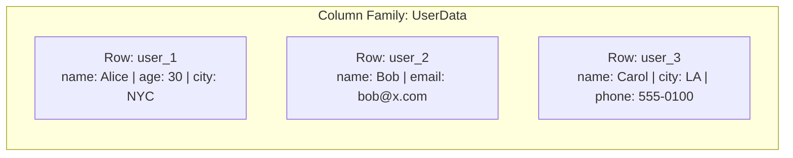
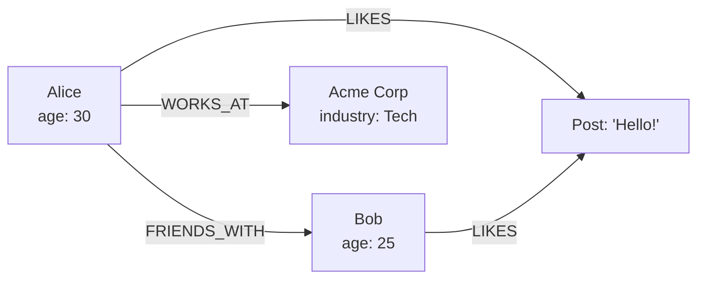
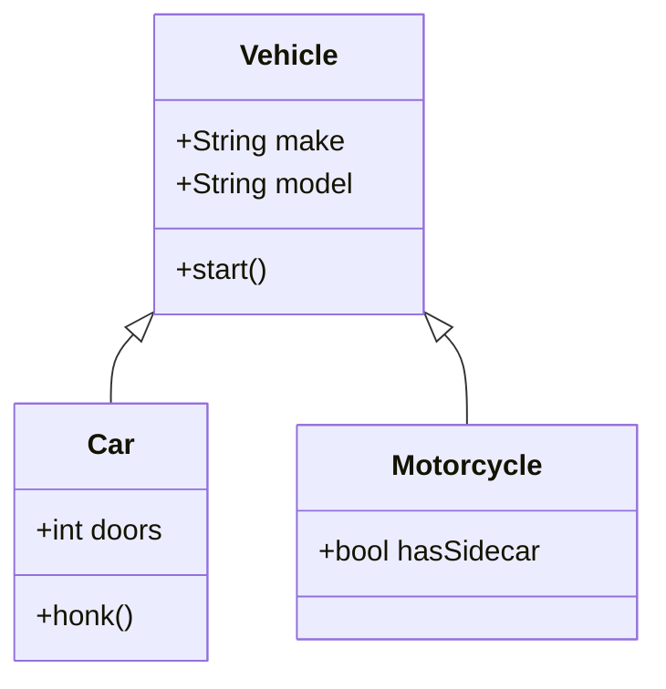
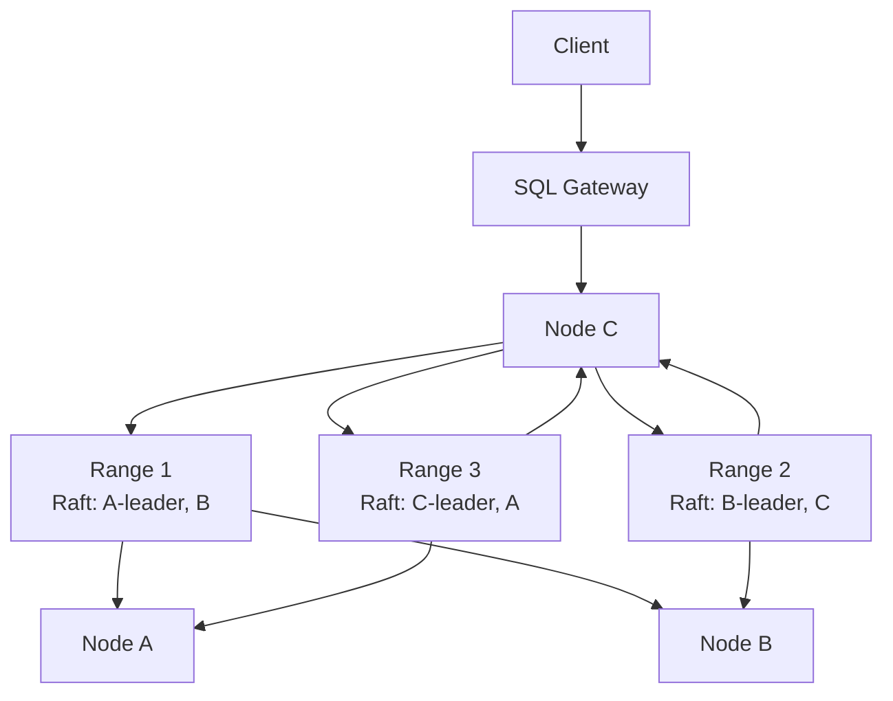

# Database Taxonomy

## Relational (SQL)

**Model**: Tables with rows and columns, strict schema, relationships via foreign keys. Data is normalized to reduce redundancy.

**Query Language**: SQL (Structured Query Language) — `SELECT`, `JOIN`, `GROUP BY`, transactions.

**Consistency**: ACID transactions, strong consistency by default. Isolation levels can be relaxed for performance.

**Use Case**: Banking, ERP, CRM, order management any system where data integrity and complex relationships matter.

| Database | Engine | Default Isolation | Key Strength |
|---|---|---|---|
| MySQL | InnoDB (B+Tree clustered) | Repeatable Read | Read-heavy OLTP, wide ecosystem |
| PostgreSQL | Heap + B-Tree | Read Committed | Extensibility, advanced indexing, standards compliance |
| SQL Server | B+Tree (clustered/non-clustered) | Read Committed | Enterprise features, SQL Server Agent, SSIS |
| Oracle | B+Tree + undo segments | Read Committed | High-end enterprise, RAC clustering |

> **Deep Dive**: [PostgreSQL Internals](./deep-dives/postgresql.md)

---

## Document

**Model**: Semi-structured JSON/BSON documents with nested objects and arrays. Schema is flexible — different documents in the same collection can have different fields.

**Query Language**: JSON-based queries, optional SQL-like (MongoDB Aggregation, Couchbase N1QL).

**Consistency**: Tunable — MongoDB defaults to strong consistency per document (primary reads), Couchbase offers eventual consistency.

**Use Case**: Content management, catalogs, gaming, rapid prototyping.

> **Deep Dive**: [MongoDB Internals](./deep-dives/mongodb.md)

---

## Key-Value

**Model**: Opaque blob stored by a unique key. No schema, no relationships. The simplest data model possible.

**Query Language**: `GET`, `SET`, `DEL` — often via simple binary protocol or REST.

**Consistency**: Varies — Redis is strongly consistent (single-threaded), DynamoDB is eventually consistent by default with optional strong consistency.

**Use Case**: Caching, session store, real-time leaderboards, shopping carts.

> **Deep Dive**: [Redis Internals](./deep-dives/redis.md)

---

## Wide-Column

**Model**: Rows with a dynamic set of columns grouped into column families. Schema is flexible within a family. Each row can have millions of columns.

**Query Language**: CQL (Cassandra Query Language) — SQL-like but limited to partition-key-based queries.

**Consistency**: Tunable — Cassandra defaults to eventual consistency with configurable consistency levels (`ONE`, `QUORUM`, `ALL`).

**Use Case**: Time-series data, IoT, recommendation engines, messaging systems.

**Example**:


> **Deep Dive**: [Cassandra Internals](./deep-dives/cassandra.md)

---

## Graph

**Model**: Nodes (entities) and edges (relationships). Both nodes and edges can have properties. Relationships are first-class citizens.

**Query Language**: Cypher (Neo4j), Gremlin (JanusGraph), SPARQL (RDF).

**Consistency**: Typically ACID per transaction (Neo4j is fully ACID).

**Use Case**: Social networks, recommendation engines, fraud detection, knowledge graphs.

**Example**:


---

## Object

**Model**: Objects stored and retrieved directly, closely mapping to programming language constructs. Supports inheritance, polymorphism, and complex object graphs.

**Query Language**: Object-oriented query APIs — often language-native (e.g., Java `Query` API for db4o, C# LINQ for Versant).

**Consistency**: ACID per database. Often used in embedded mode.

**Use Case**: CAD/CAM systems, telecommunications, embedded systems — niche usage.

**Example**:


---

## Time-Series

**Model**: Data points indexed by timestamp. Optimized for append-heavy workloads and range scans over time windows.

**Query Language**: Custom query languages (InfluxQL, Flux) or SQL with time functions (TimescaleDB).

**Consistency**: Varies — InfluxDB is eventually consistent in clustered mode; TimescaleDB inherits PostgreSQL's ACID guarantees.

**Use Case**: Monitoring, observability, IoT sensor data, financial tick data.

**Example**:
```
Measurement: cpu_usage
Tags: host=server01, region=us-east
┌─────────────────────┬───────┐
│ Timestamp           │ Value │
├─────────────────────┼───────┤
│ 2024-01-01T00:00:00 │ 45.2  │
│ 2024-01-01T00:01:00 │ 47.8  │
│ 2024-01-01T00:02:00 │ 52.1  │
└─────────────────────┴───────┘
```

---

## NewSQL / Distributed SQL

**Model**: SQL interface with ACID transactions distributed across multiple nodes. Combines the horizontal scalability of NoSQL with the consistency of relational databases.

**Query Language**: SQL — standard SQL with distributed execution.

**Consistency**: ACID with strong consistency (Serializable or external consistency).

**Use Case**: Global-scale applications that need ACID: banking, booking systems, multi-region deployments.

**Example**:


| Database | Consensus | Sharding | Clock |
|---|---|---|---|
| CockroachDB | Raft per range | Range-based (auto-split) | HLC (Hybrid Logical Clock) |
| Spanner | Paxos per shard | Directory-based | TrueTime (GPS + atomic clocks) |
| TiDB | Raft (multi-raft) | Range-based (region) | PD timestamp oracle |

> **Deep Dive**: [Google Spanner Internals](./deep-dives/spanner.md)
