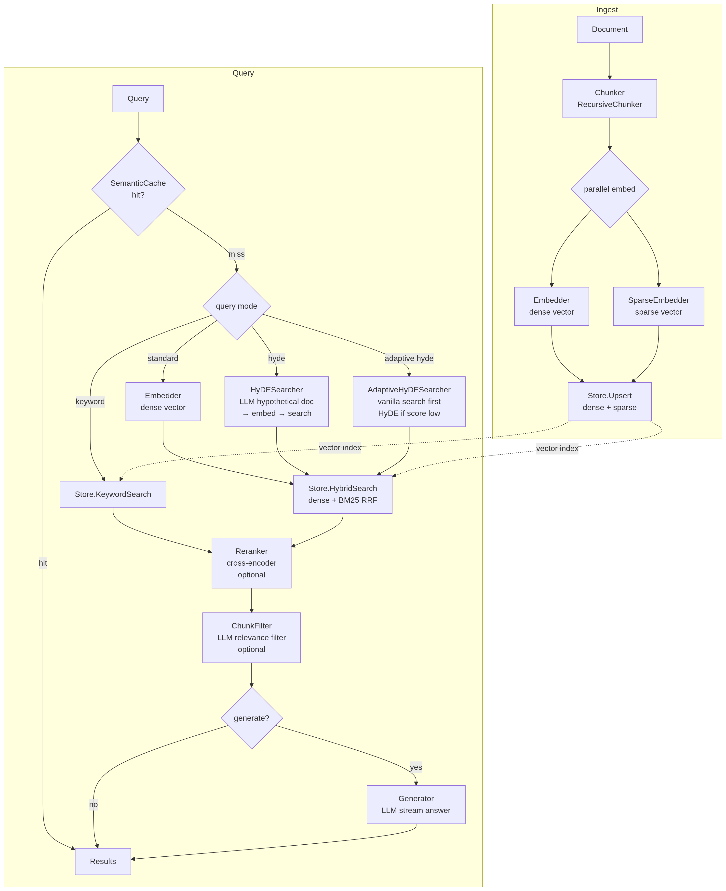

# E2E Production RAG

End to end rag sysyem from data ingestion -> chunking -> embed -> retrieval -> generation -> evaluation -> testing

<figure><figcaption></figcaption></figure>

## Ingestion

Markdown -> process using Docling -> final output mardkown

* Deduplication: Hash Tracking to compare file SHAs, ensuring only new or modified files are processed.
* Performs Targeted Deletions for modified files and uses Deterministic UUIDs to prevent duplicate entries during re-ingestion.
* The system self-heals by auto-configuring Qdrant collections, distance metrics, and required indices (Full-Text & Keyword) on startup.

`IngestService` runs the full loop: list → bulk SHA dedup → concurrent fetch+pipeline.

* Calls `GetAllFileSHAs` once per run (single paginated Qdrant scroll) instead of N point lookups
* 8 concurrent workers for fetch+pipeline
* Returns `IngestResult{Processed, Skipped, Failed}` counters

**Contextual Embedding:** Before embedding, each chunk is prefixed with `filePath > header\n` (Anthropic 2024). This anchors chunk semantics to document structure, improving dense retrieval accuracy without changing stored text.

***

## Chunking Strategies

Abstraction for chunking so we can swap it depends on configuration:

1. **Recursive**, It first extracts sections by heading, then splits oversized sections by paragraph, then by sentence, preserving overlap between adjacent chunks.
2. **Sentence Window**, indexes at sentence granularity but stores a surrounding window as retrieval context

**Chunk sizes** 128, 256, 512 tokens (configurable), **Chunk overlap:** configurable

***

## Embedding & Storage

Needed both Sparse and Dense to be able to use RRF, configurable: dimensions.

```yaml
embedder:
  provider: "ollama"
  model: "nomic-embed-text"
  ollama_addr: "http://localhost:11434"
  dimensions: 768
  
sparse_scorer:
  provider: "prithivida/Splade_PP_en_v1"
  addr: "http://localhost:5001"
```

Qdrant for storage. store Sparse and Dense vector, example payload to store:

```json
{
  "header": "1.3 Weighted A* Search",
  "window_text": "",
  "file_path": "week 3 informed search and heuristic function.md",
  "line_start": 122,
  "chunk_index": 2,
  "source_sha": "b2f71659eee1eb2a3a377ecc1327bd9ead16552ec6c8cc101f040d187e8b8e6d",
  "text": "finds a solution in [ C ∗ , WC ∗ ], but usually closer to C ∗ .\nTo modify A* algorithm to Weighted A*, just change line 14 in Algorithm 2 to Equation 3."
}
```

**Indexing**

* **Text indexing:** Ensure full-text index on `text` field for BM25 hybrid search
* **Keyword indexing:** `file_path` payload field, eliminates full-collection scan

***

## Retrieval

```
Query
  │
  ▼
Semantic Cache ──── hit (score ≥ threshold) ──► return cached result
  │ miss
  ▼
Query Transformation (HyDE) [Optional]
  └── LLM generates hypothetical doc → embed → avg vector
  │
  ▼
Hybrid Search
  ├── Dense: Qdrant ANN (nomic-embed-text vec)
  └── Sparse: SPLADE or TF fallback
        └── RRF fusion (k=60): score = Σ 1/(60 + rank)
  │
  ▼
Reranker
  └── cross-encoder/ms-marco-MiniLM-L-6-v2
  │
  ▼
Results: []{ file_path, header, line_start, score, text }
```

### Semantic Cache

Caches search results keyed by query embedding similarity. A query hitting the cache at score >= threshold returns the cached result directly, skipping embedder + store + reranker round-trips. Example vector:

```json
{
  "cached_at": "2026-04-26T15:23:38Z",
  "results_json": "{Variants\",\"LineStart\":327,\"ChunkIndex\":0,\"Vector\":null,\"SparseIndices\":null}",
  "query": "In Monte Carlo Tree Search, how do we calculate UCB?"
}
```

Search and if result top-1 score ≥ threshold → return immediately, if not: run full pipeline, write result async (fire-and-forget)

* Set TTL
* Threshold:
  * `0.85–0.90`: high recall, allows paraphrased queries
  * `0.90–0.95`: balanced (default `0.90`)
  * `>0.95`: near-identical only

### Query Transformation (HyDE)

Produces a hypothetical document for a query. Generated text is embedded and used as search vector instead of raw query. Three variants: standard, Adaptive (confidence-gated), Multi (diverse prompts). Full details in HyDE Variants section below.

Ref: "Precise Zero-Shot Dense Retrieval without Relevance Labels" (Gao et al., ACL 2023).

### **Hybrid Search**

fetches dense + text-filtered candidates, reranks sparse leg client-side, fuses via RRF.

**Server-side**

Offloading the heavy lifting to Qdrant, to reduce network latency and memory overhead. It utilizes a single round-trip to execute both dense and sparse queries.

* It uses Qdrant native RRF (Native Qdrant implementation)
* Dense search: Vector Similarity (Bi-Encoder)
* Sparse Vector Index (Inverted Index)
* Only final Top-K results sent to app

**Client-side**

Use it when you need a level of customization that a standard database engine can't provide. For example using `BM25` search and `Splade` as scorer before fusing the results. While this introduces more "noise" and latency due to the extra data transfer and manual sorting loops, it is usable for fine-tuning relevance in niche domains.

### **Custom Search**

While Hybrid search is good its using high compute process/heavy process, i think we should consider the type of query like is the query complex, easier to understand? if using dense/keyword search resulting in good result we dont need Hybrid Search

* **Dense-Only Search** (`Search`): A standard vector similarity search without the sparse/BM25 overhead. Ideal for purely semantic queries.
* **Keyword-Only Search** (`KeywordSearch`): Bypasses vectors entirely to perform a pure text-match search using Qdrant's Scroll API. Useful for exact phrasing or when embedding models are unnecessary.

### **Payload Filtering**

All search methods (Hybrid, Dense, and Keyword) support strict pre-filtering. This guarantees that similarity scores are only calculated against relevant documents, improving both speed and accuracy. You can filter by:

* `file_path`: Restrict searches to a specific file.
* `header`: Restrict searches to a specific section or markdown header.
* `source_sha`: Restrict searches to a specific version of a document.

### Reranking

Use a high-precision model to verify the "rough" results from the vector search.

* **Oversampling**: The retrieval stage fetches a larger set of candidates (e.g., 10x the requested amount) to ensure the reranker has enough high-quality options to choose from.
* **Contextual Scoring**: The system passes the Window Text (the chunk plus its surrounding context) to a Cross-Encoder.
* **Final Sorting**: The candidates are re-scored based on deep semantic relevance and sorted, ensuring the absolute best matches are promoted to the top for the LLM.

***

## Post-Retrieval Filtering

After reranking, an optional LLM chunk filter drops irrelevant results before generation. Ref: arxiv 2410.19572 (+10pp PopQA accuracy).

* Batches all retrieved chunks into one prompt, asks model to score each 0–1
* Drops chunks below configurable threshold (default 0.5)
* Order of surviving chunks is preserved
* Falls through on LLM error (returns all chunks rather than drop everything)

```yaml
chunk_filter:
  enabled: false
  model: "gemma3:1b"
  threshold: 0.5
```

***

## Generator

`OllamaGenerator` streams an answer grounded in retrieved chunks via Ollama `/api/chat`.

**Prompt construction:**

* Chunks reordered using "Lost in the Middle" principle (Liu et al. 2023): highest-scored chunk at position \[1], lowest in middle, second-highest at end — reduces LLM degradation on long context
* Token budget enforced by truncating chunks (rough estimate: 1 token ≈ 4 chars, default 2800 tokens ≈ 70% of 4k context)
* System prompt requires citation inline as `[1]`, `[2]`, etc.

**Usage:** POST `/search` with `"generate": true`. Response is `text/plain` chunked transfer encoding (streaming).

```yaml
generator:
  enabled: true
  model: "phi4-mini:latest"
  max_context_tokens: 2800
```

***

## Evaluation & Testing

### Methodology

Offline IR eval using pre-computed ground truth (qrels). Run against multiple retrieval profiles to compare chunk size, sparse scorer, reranker, and HyDE variants. Results appended to `eval_history.jsonl` for trend analysis.

**Store modes**

* `live` — connects to running Qdrant; assumes data already ingested; fast for iterating profiles
* `container` — spins up ephemeral `testcontainers-go` Qdrant; ingests `gitbook/` once shared across all profiles; useful for CI

### Ground Truth Format (Qrels)

Supports TREC 4-point graded relevance (`grade` field). Legacy binary `relevant` field maps to `grade=1`. Example:

```json
{
  "query": "How does the Go GPM scheduler work with goroutines and OS threads?",
  "chunk_id": "golang/goroutine.md:3",
  "file_path": "golang/goroutine.md",
  "relevant": true,
  "grade": 2
}
```

### Metrics

| Metric              | Description                                                      |
| ------------------- | ---------------------------------------------------------------- |
| MRR                 | Mean Reciprocal Rank — rewards finding relevant result early     |
| HitRate (Success@K) | Fraction of queries with ≥1 relevant result in top-K             |
| NDCG@K              | Normalized Discounted Cumulative Gain — graded relevance         |
| Precision@K         | Relevant results / K                                             |
| Recall@K            | Relevant results retrieved / total relevant (needs qrels counts) |
| MAP                 | Mean Average Precision — AUC over precision-recall curve         |
| ContextRelevance    | RAGAS-style avg chunk relevance score 0–1 (LLM judge only)       |

### Eval Profiles

Defined in `testdata/eval_profiles.jsonl`. Each profile specifies one retrieval config to benchmark. Fields not set inherit config.yaml defaults.

```json
{"name": "tf-recursive256-baseline", "tags": ["tf","baseline"], "sparse_scorer": "tf", "chunk_size": 256, "chunk_overlap": 32}
{"name": "tf-recursive256-hyde1", "tags": ["tf","hyde"], "sparse_scorer": "tf", "chunk_size": 256, "chunk_overlap": 32, "hyde": true, "hyde_num_docs": 1}
{"name": "tf-recursive256-multi-hyde3", "`tags": ["tf","hyde","multi-hyde"], "sparse_scorer": "tf", "chunk_size": 256, "chunk_overlap": 32, "multi_hyde": true, "hyde_num_docs": 3}
{"name": "tf-recursive256-adaptive-hyde", "tags": ["tf","hyde","adaptive"], "sparse_scorer": "tf", "chunk_size": 256, "chunk_overlap": 32, "adaptive_hyde": true, "adaptive_thresh": 0.50}
{"name": "splade-recursive256-adaptive-hyde", "tags": ["splade","hyde","adaptive"], "sparse_scorer": "splade", "chunk_size": 256, "chunk_overlap": 32, "adaptive_hyde": true, "adaptive_thresh": 0.50}
```

### Eval History

Every run appends one JSON line to `eval_history.jsonl`. Fields include timestamp, profile, model, embedder dims, topK, docs ingested, vector count, qrels totals, and all metrics. Use for regression tracking and comparing configurations over time.

### Judges

Two judge backends, selected via `EVAL_JUDGE`:

* **qrels** (default) — offline lookup against `testdata/qrels.jsonl`; fast, deterministic, no LLM required
* **llm** — calls `LLMJudge` against any OpenAI-compatible endpoint; supports `IsRelevant` (YES/NO) and `ScoreContext` (LOW/MEDIUM/HIGH → 0.25/0.5/1.0)

***

## HyDE Variants

Three variants, all swappable via config and eval profiles:

**Standard HyDE** — generates N hypothetical documents in parallel, averages their L2-normalized embeddings, runs hybrid search with averaged vector.

**Adaptive HyDE** — runs vanilla hybrid search first; fires HyDE only when top-1 cosine score < threshold (default 0.50). Ref: arxiv 2507.16754. Skip LLM cost when dense retrieval is already confident.

**Multi-HyDE** — cycles through 5 diverse prompt templates (factual passage, key facts, expert explanation, contextual definition, example-driven) round-robin per document generation. Maximizes embedding diversity. Ref: arxiv 2509.16369. Use with `num_docs >= 3` for benefit.

```yaml
hyde:
  enabled: true
  adaptive: true
  adaptive_thresh: 0.50
  multi_hyde: false
  model: "gemma3:1b"
  num_docs: 1
```

***

## Continuous Evaluation (EvalOps)

Async production monitoring: samples live search calls, judges context relevance, persists traces, detects metric drift. Ref: RAGOps arxiv 2506.03401, ARES arxiv 2311.09476.

```
Live query
  │
  ▼
Monitor.RecordAsync (probabilistic sampler, e.g. 5%)
  │ sampled
  ▼
Background goroutine (pool-limited, drops if pool full)
  ├── LLMContextJudge.ScoreContext per chunk (LOW/MED/HIGH → 0.25/0.5/1.0)
  ├── TraceStore.Append → evalops_traces.jsonl
  └── DriftDetector.Add(context_relevance) → log alert if mean drops > 10%
```

* Zero hot-path cost when not sampled (atomic counter + float compare)
* Goroutine pool (default 4) prevents unbounded background work
* `DriftDetector` uses rolling window; baseline set from first full window; alert if relative drop ≥ threshold

```yaml
evalops:
  enabled: false
  sample_rate: 0.05
  trace_file: "evalops_traces.jsonl"
  drift_window: 50
  drift_thresh: 0.10
  model: "gemma3:1b"
  max_workers: 4
```

**Trace record format:**

```json
{
  "ts": "2026-05-01T10:00:00Z",
  "query": "How does Go's GC work?",
  "chunks": [{"file_path": "golang/gc.md", "header": "GC Phases", "line_start": 45, "score": 0.87, "relevant": true}],
  "context_relevance": 0.75
}
```

***

## Observability

<table><thead><tr><th width="374">Metric</th><th>Source</th></tr></thead><tbody><tr><td>Latency (p50/p95/p99)</td><td>Prometheus histograms</td></tr><tr><td>Cache hit rate</td><td>Prometheus counter</td></tr><tr><td>Rerank score before/after</td><td>Prometheus histogram</td></tr><tr><td>Ingest file status</td><td>Prometheus counter (processed/skipped/failed)</td></tr><tr><td>Embed latency + batch size</td><td>Prometheus histogram</td></tr><tr><td>Retrieval quality (MRR, nDCG)</td><td>Eval harness (<code>eval_runner.go</code>)</td></tr><tr><td>Context relevance drift</td><td>EvalOps monitor (log alert)</td></tr></tbody></table>

### Benchmark Results

> Full details: docs/TEST\_RESULTS.md. Date: 2026-05-02. Embedder: `nomic-embed-text` (768-dim). Store: Qdrant `pkb_chunks` (554 vectors). topK: 5.

#### IR Evaluation

50 queries, 7 categories. 5 profiles run (SPLADE skipped — sidecar not running).

| Profile                         | MRR        | HitRate    | NDCG       | P@5        | Time |
| ------------------------------- | ---------- | ---------- | ---------- | ---------- | ---- |
| `tf-recursive256-baseline`      | **0.9183** | **1.0000** | **0.9407** | **0.8400** | 6s   |
| `tf-recursive256-multi-hyde3`   | 0.9200     | 0.9800     | 0.9212     | 0.7120     | 447s |
| `tf-recursive256-multi-hyde5`   | 0.9067     | 0.9600     | 0.9037     | 0.7040     | 451s |
| `tf-recursive256-adaptive-hyde` | 0.8813     | 0.9800     | 0.8915     | 0.6520     | 441s |
| `tf-recursive256-hyde1`         | 0.8483     | 0.9400     | 0.8604     | 0.6560     | 437s |

**Key findings:**

* Baseline (no HyDE) wins all metrics. Direct query embed + TF hybrid sufficient when KB vocab matches queries.
* HyDE adds 7–8 min latency with worse results on this corpus. Multi-HyDE-3 best HyDE variant (1 miss).
* `math/hard` (QR decomposition, SVD) and niche system-design terms (OAuth2 vs OIDC, architecture quantum) are recurring misses — likely content gap, not retrieval failure.

***

## EvalOps (Continuous Evaluation)

Disabled in current config (`enabled: false`). Architecture wired: 5% sampler → LLM judge → JSONL trace → drift alert at 10% relative drop. Zero hot-path cost when not sampled.

Enable: set `evalops.enabled: true` + `judge_base_url` pointing at Ollama `/v1`.

***

## Load & Throughput (k6)

| Test                           | Result  | Key Metric                                            |
| ------------------------------ | ------- | ----------------------------------------------------- |
| smoke (1 VU, 30s)              | PASS    | p(95)=290ms, 0% error                                 |
| cache hit rate (10 VU, 90s)    | PASS    | **96.21% hits**, 270 req/s, cache -40% median latency |
| keyword vs hybrid (5 VU, 60s)  | PASS    | hybrid p(95)=49ms vs keyword 59ms                     |
| embed throughput (1–8 VU ramp) | PASS    | **182 req/s**, p(95)=25ms, 0% error                   |
| load ramp (10→50 VU)           | NOT RUN | requires warm full stack                              |

**Key findings:**

* Semantic cache saturates fast on repeated query pool: 96.21% hit rate, median 35ms vs 58ms uncached (\~1.7× speedup).
* `nomic-embed-text` stable under 8 parallel requests: p(95) ≤ 25ms, no errors. Embed contributes \~17ms per uncached request.
* Hybrid search faster than keyword-only at p(95) (49ms vs 59ms). Keyword has higher p(99) tail (311ms vs 78ms) under load.
