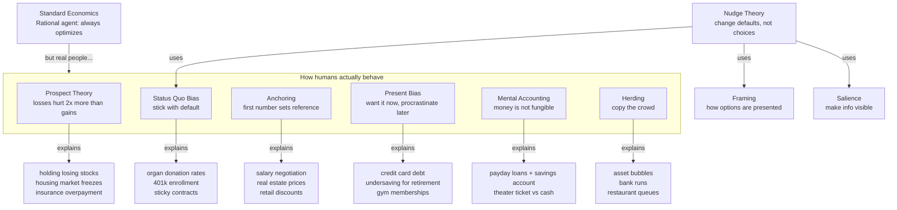

# Behavioral Economics

Challenges the rational-agent assumption in standard economics. People aren't Econs (rational, patient, consistent) — they're Humans (emotional, impatient, easily influenced).



## Prospect Theory (Kahneman & Tversky 1979, Nobel 2002)

### The experiment

Pick A or B:
- A: Guaranteed \$500
- B: 50% chance of \$1,000, 50% chance of \$0

Most pick A (safe, sure thing for gains).

Pick C or D:
- C: Guaranteed -$500
- D: 50% chance of -$1,000, 50% chance of \$0

Most pick D (gamble to avoid a sure loss).

**Standard economics**: \$500 is \$500 regardless of sign. People should be consistent. They aren't.

### The S-curve

```
Value (subjective)
     ^
     |      /  (gains — concave, risk-averse)
     |     /
     |    /
     |   /
 ----+-------> Outcome
     |   \
     |    \
     |     \   (losses — convex, risk-seeking)
     |      \
```

- **Loss aversion**: losing \$100 hurts ~2x more than gaining \$100 feels good
- **Diminishing sensitivity**: difference between \$0 and \$100 feels bigger than between \$1,000 and \$1,100
- **Reference point**: you judge outcomes relative to where you started, not the final total

### Real-world applications

| Behavior | Explanation |
|---|---|
| **Holding losing stocks** | Sell = realize loss (pain). Hold = hope it recovers. "Disposition effect" |
| **Refusing to sell house at market price** | Bought for \$500K, now worth \$400K. "I'll wait for a better offer" — discounting is admitting loss |
| **Buying overpriced insurance** | Loss aversion makes small certain cost (premium) feel better than small chance of large loss |
| **Panic selling in crashes** | Losses exceed pain threshold → "get me out" → sell at the bottom |

## Anchoring

### The experiment

Spin a wheel of fortune (rigged to stop at 10 or 65). Then ask: "What percentage of UN countries are African?"

- People who saw **10** → guessed ~25%
- People who saw **65** → guessed ~45%

The random number anchored their estimate. Even though they knew the wheel was random, their brain started from that number and adjusted — but never adjusted enough.

### Why it works

The brain doesn't estimate from scratch. It picks the first available number (anchor) and adjusts up or down. The adjustment is almost always **insufficient** — you don't move far enough from the starting point.

Crucially: **anchors work even when they're completely irrelevant**. The UN question had nothing to do with a 10 or 65, but those numbers still biased the answer.

### Real-world applications

| Situation | How anchoring works |
|---|---|
| **Real estate** | Asking price anchors appraisals and offers. List at \$500K vs \$550K → same house sells differently. High anchor: buyer adjusts down but not enough. Low anchor: creates bidding war (buyers anchor on each other) |
| **Salary negotiation** | Whoever says a number first loses. Offer \$100K → you anchor toward \$105K. If you state \$120K first → negotiation starts higher |
| **Retail discounts** | "Was \$200, now \$150." Was it ever \$200? Doesn't matter. The \$200 anchor makes \$150 feel cheap |
| **Stock investing** | Bought at \$100, now \$60. The \$100 purchase price becomes the anchor. "I'll sell when it gets back to \$100" — even if \$60 is a fair price |

### Connection to Prospect Theory

Both involve **reference points**:
- Prospect Theory: reference point is where you *start* (gains vs losses)
- Anchoring: reference point is the *first number you see*

Together they explain the disposition effect fully: you anchor on the purchase price AND you're loss-averse relative to that anchor. Result: you won't sell until the stock returns to your anchor, even if fundamentals say you should.

## Present Bias / Hyperbolic Discounting

### The experiment

- "Would you rather \$100 today or \$110 in a week?" → most pick today
- "Would you rather \$100 in 52 weeks or \$110 in 53 weeks?" → most wait for the \$10

Same trade-off (wait 1 week for \$10 extra), different time horizon. The discount rate between *now* and *next week* is huge. Between *two future dates* it's small.

**Standard economics**: discount rate should be constant. Real people have a **present bias** — today is special.

### Why this matters

| Situation | What happens |
|---|---|
| **Credit cards** | Spend now, "I'll pay it off next month" → next month same bias → debt snowballs |
| **Retirement saving** | "I'll start saving at 30" → 30 becomes 35 → 35 becomes 40 → nothing saved |
| **Gym memberships** | Sign up for annual, convinced you'll go 3x/week. Go 3x first month, then 1x, then 0x |
| **New Year's resolutions** | Future self is idealized (disciplined, motivated). Current self is lazy |

### Commitment devices

The only fix: **lock yourself in** before temptation arrives.
- Automatic 401k deduction (can't spend what you never see)
- "Save More Tomorrow" (Thaler): commit future raises to savings before you feel richer
- Ketchup (or other apps): bet money you'll lose if you don't achieve a goal

## Mental Accounting (Thaler, Nobel 2017)

### The experiment

- Lost a \$50 theater ticket. Buy another? Most say no.
- Lost \$50 cash. Still buy the ticket? Most say yes.

Same \$50 loss. Same net result (you're down \$50 plus pay \$50 for the ticket either way). But one feels like "entertainment budget already spent" and the other feels like "extra cash."

**Standard economics**: money is fungible. \$1 = \$1. Brains don't work that way.

### Real-world examples

| Behavior | Mental accounts |
|---|---|
| **Payday loan + savings account** | "Emergency fund" is off-limits. "Borrowing money" is different. Both are cash |
| **Tax refund spent on luxuries** | "That's free money, not my salary" — even though it was your salary all year |
| **Lost investment vs lost cash** | Stock loss = "paper loss, not real." Losing cash = "real loss." Same money |
| **Sunk cost fallacy** | "I already paid for the movie ticket, so I'll stay even though it's boring." The money is gone. Staying doesn't get it back |

## Herding & Information Cascades

### The restaurant street

You're in a new city. Three restaurants:

- A: empty
- B: 5 people
- C: 20 people

You pick C. Not because the food is good — you're using other people as a signal. But they picked C for the same reason. The crowd is just copying the crowd.

This is an **information cascade**: after the first few people choose, everyone after them ignores their own information and copies.

### Cascade dynamics

1. First person has a signal (good food?)
2. Second person has an independent signal
3. Third person: hears two choices, ignores own signal → copies the crowd
4. Everyone after copies too

Now the whole crowd is wrong. The first few people might have been delivery drivers waiting for orders, not actual customers.

### Anti-herding / contrarians

You see C packed, choose empty A. Now others see you in A → they follow → A fills up.

Contrarians exist but are rare because it's psychologically hard to go against the crowd. Your gut says "20 people can't all be wrong."

| Successful contrarians | Why it worked |
|---|---|
| **Buffett buying during 2008** | Real analysis, not just being different |
| **Market mean reversion** | Crowd overshoots, then price snaps back |

### Bubble mechanics

```
Prices up → "everyone is buying" → more people buy → prices up more
→ eventually last buyer runs out of money
→ prices down → "everyone is selling" → more people sell → prices down more
→ overshoot below fair value → cycle repeats
```

Housing 2006, crypto 2021, tulips 1637 — same cascade in both directions.

## Nudge / Choice Architecture

**Nudge ≠ mandate**. No options banned, no prices changed. Just change how choices are presented.

### The organ donation split

Two neighboring countries, similar culture:

| Country | Default | Consent rate |
|---|---|---|
| Germany | Opt-in (check box to be donor) | 15% |
| Austria | Opt-out (check box to refuse) | 90% |

Same people, same values, same religion. Just the default direction flipped.

### Why defaults work

1. **Status quo bias**: doing nothing is easier than doing something
2. **Procrastination**: "I'll sign up later" → never
3. **Implicit endorsement**: "The default must be the recommended option"

### Key nudges

| Nudge | What changes | Effect |
|---|---|---|
| **Auto-enroll 401k** | Default: opt-out instead of opt-in | 50% → 90% participation |
| **Calorie labels on menus** | Information becomes visible | People order fewer calories |
| **Cafeteria layout** | Put healthy food at eye level | Sales of healthy items up |
| **Save More Tomorrow** | Commit future raises to savings | Savings rate 3x |
| **Credit card minimum shown** | Show minimum payment on statement | People pay more than minimum |

### Criticism

- **Paternalistic**: who decides what the "right" default is?
- **Transparency**: should people know they're being nudged?
- **Fragile**: works in one context, flops in another

## Summary: Econ vs Human

| Dimension | Standard Econ (Econ) | Behavioral Economics (Human) |
|---|---|---|
| Preferences | Stable, consistent | Context-dependent, malleable |
| Discounting | Constant rate | Present-biased |
| Risk | Consistent risk profile | Risk-averse for gains, risk-seeking for losses |
| Information | Perfectly processed | Limited attention, biases |
| Money | Fungible | Mental accounts |
| Others | Independent | Herding, social norms |

## Related

- [Supply & Demand](../micro/supply-demand.md) — the rational consumer this challenges
- [Welfare & Efficiency](../micro/welfare-efficiency.md) — consumer surplus assumes rational choice
- [Market Intervention](../micro/market-intervention.md) — nudge as third way between tax and ban
