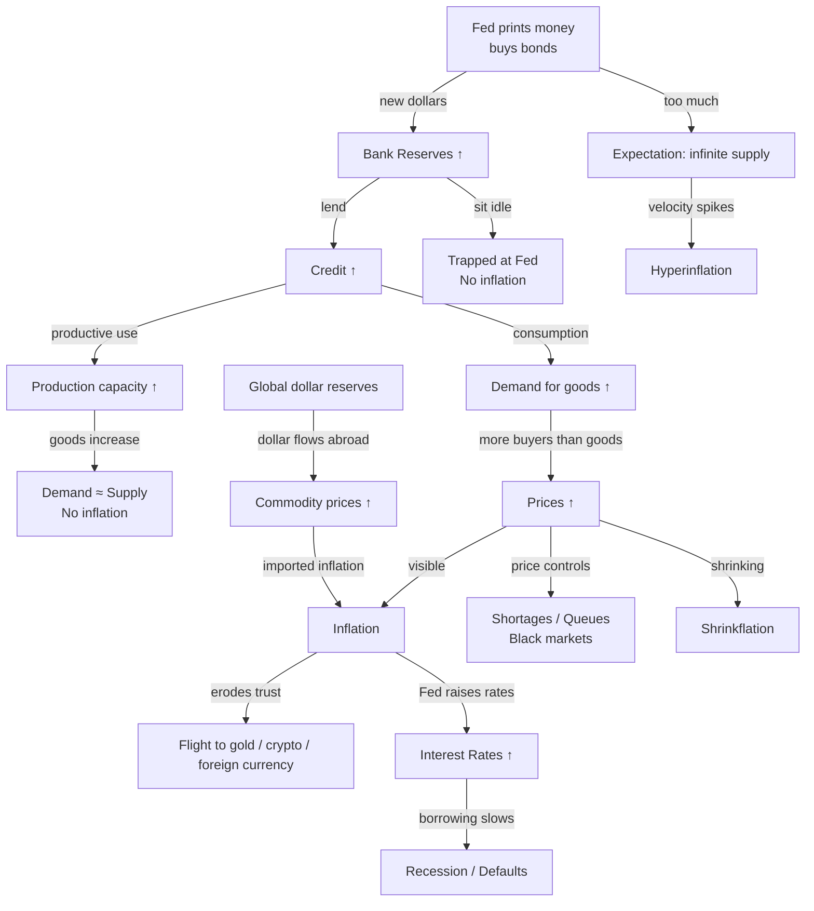

# The Dollar System

## The Global Anchor (Oil, Gold, and the Dollar)

This is the physical foundation of the system. For decades, the "Petro-dollar" system has meant that if you want to buy oil, you need U.S. Dollars. This keeps the dollar in high demand globally. Oil prices are the "speed limit" for the economy; when oil prices spike, shipping and production become so expensive that it often triggers a recession.

Gold sits on the sidelines as the "emergency backup." Gold competes with bonds because bonds pay interest, while gold is just a physical store of value. When people lose trust in the government's ability to manage interest rates or inflation, they ditch bonds and buy gold.

If gold were "revalued" (priced much higher) or used to back the system again, it could theoretically stabilize the price of oil and other goods, but it would take away the government's power to print money freely.

***

## The Chain Reaction: What happens when Interest Rates Rise?

To see the "interconnectedness" in action, look at what happens when the Fed raises interest rates to fight inflation:

1. **The Mortgage Hit:** Immediately, mortgage loans become more expensive. People stop buying houses, and the real estate market chills.
2. **The Private Credit Squeeze:** Private companies that borrowed money now have to pay higher interest. Since they aren't transparent, we don't know who is about to go bust until they suddenly "lock" withdrawals.
3. **The Bond vs. Gold Shift:** Higher rates usually make bonds look better than gold. However, if the government's "Spending Problem" is too big, people might fear the government can't pay its debts, causing them to run to Gold anyway.
4. **The Oil/Recession Connection:** High rates slow down business. Less business means less demand for oil. If oil prices stay high while the economy is slowing down due to high rates, you get a "Recession" where everyone is squeezed from both sides (high costs and no jobs).

---

## Why the Dollar Is the Reserve Currency

Nobody decides the reserve currency. It **emerges** from market choices. There is no UN vote or treaty.

### How It Happened

1. **Bretton Woods (1944):** After WWII, the US had ~50% of global GDP and most of the world's gold. Countries pegged their currencies to the dollar, which was convertible to gold at $35/oz. The conference created the **IMF** (to monitor exchange rates and lend to countries with balance-of-payments crises) and the **World Bank** (to finance reconstruction and development). The IMF's lending came with **conditionality** — policy reforms in exchange for funds — a source of controversy ever since.
2. **Nixon Shock (1971):** US ended dollar-to-gold convertibility (too many dollars had been printed for Vietnam War). But by then, everyone already used dollars for trade. The system had **network effects** — too costly to switch.
3. **Petro-dollar Deal (1970s):** US + Saudi Arabia agreed — Saudi prices oil in dollars, invests profits in US Treasuries, US guarantees Saudi military protection. Other OPEC countries followed. Now *everyone* needs dollars to buy oil.

### What Makes a Currency Reserve-Worthy

| Factor | Why | Dollar | Yuan |
|--------|-----|--------|------|
| **Trust & stability** | Will the currency hold value? | Stable institutions, predictable policy | Capital controls, state intervention |
| **Deep liquid markets** | Can I buy/sell billions without moving the price? | US Treasury market: $26T, deepest in world | China's bond market is small, restricted |
| **Open capital account** | Can money flow freely in/out? | Yes | No — closed capital account |

Yuan is ~3% of global reserves vs. dollar's ~58%. China's closed capital account makes yuan not freely convertible — no central bank wants a currency it can't sell when needed.

### The Triffin Dilemma

The **Triffin dilemma** (Robert Triffin, 1960) identified an inherent tension in a national currency serving as the global reserve currency:

- The world needs a steady supply of dollars to conduct trade and hold as reserves → the US must run **current account deficits** to supply dollars
- But persistent deficits erode confidence in the dollar's value → foreign holders question whether the dollar will hold its purchasing power

In short: the US must supply liquidity, but supplying too much undermines confidence. The dilemma was the fatal flaw in the Bretton Woods system — US gold reserves were being drained by rising foreign dollar claims, leading directly to the Nixon Shock of 1971. The tension persists today: US deficits supply the world with dollars, but every deficit deepens long-run concerns about dollar stability.

### Exorbitant Privilege

The US enjoys the **exorbitant privilege** — a term coined by Valéry Giscard d'Estaing (1960s) — of being able to borrow in its own currency. This means:

- The US can run large deficits without facing the "sudden stop" risk that would trigger a crisis in an emerging market
- US assets held by foreigners pay relatively low returns (Treasury yields), while US foreign investments earn higher returns — a positive **excess return** or "dark matter"
- The US imposes financial sanctions with global reach because dollar clearing is unavoidable

The privilege is not unconditional. It depends on continued confidence in US institutions, fiscal discipline, and the absence of a credible alternative.

## Historical Exchange Rate Coordination

### Plaza Accord (1985)

The US dollar had appreciated ~50% against major currencies between 1980 and 1985, driven by high real interest rates (Volcker disinflation). The G5 (US, Japan, Germany, UK, France) met at the Plaza Hotel in New York and agreed to coordinate a dollar depreciation. Central banks sold dollars, and within two years the dollar fell by roughly 50% against the yen and mark.

The Plaza Accord is the most successful example of coordinated exchange rate management in history.

### Louvre Accord (1987)

By 1987, the dollar had fallen too far. The G6 met at the Louvre and agreed to **stabilize** exchange rates around prevailing levels, with each country committing to intervene if their currency moved outside target zones. The Louvre Accord was less successful than the Plaza — the 1987 stock market crash (Black Monday) disrupted the coordination, and the target zones were eventually abandoned.

## Sanctions & Freezing Assets

Because most international transactions clear in dollars, most assets flow through **US-controlled pipes** at some point. This gives the US extraordinary power.

### Russia (2022)

After Russia invaded Ukraine, the US/EU froze ~$300B of Russian central bank reserves. How?

| Asset type | Location | What happened |
|------------|----------|--------------|
| US Treasury bonds (held at NY Fed) | New York | US froze the accounts |
| Euros held at Euroclear | Belgium | EU froze them |
| Gold physically in Russia | Moscow | Couldn't freeze, but hard to use for trade |
| Yuan held in Chinese banks | China | China didn't freeze, but didn't help access either |

The key: Russia's dollars and euros sat in Western financial institutions. The US simply said "locked" — and they were locked.

### Why Not Print to Avoid US Control?

Countries want a payment system outside US reach. BRICS has discussed alternatives, but:
- No deep bond market in any other currency
- Network effects — everyone uses dollars because everyone uses dollars
- The yuan is not freely convertible

## How Money Printing Actually Works

The Fed does not print cash and hand it to the government. It follows a multi-step process.

### The Chain

1. **Government spends more than it taxes** → needs money
2. **Treasury issues bonds** (IOUs) — sells them to the public (pension funds, foreign central banks, anyone)
3. **If the public buys enough** → money comes from savings, not new printing → no inflation
4. **If the public won't buy enough** → Fed steps in as **buyer of last resort** → creates new dollars to buy bonds → **this is printing**

### Why Not Just Print Cash Directly?

| Method | Problem |
|--------|---------|
| Print cash, give to Treasury | **Direct financing** — government knows it can ask for free money, zero discipline on spending. Leads to hyperinflation (Zimbabwe, Venezuela, Weimar Germany) |
| Deposit directly into bank accounts | **Helicopter money** — goes to everyone including those who don't need it. Politically impossible to reverse |
| Bond buying | Creates **distance** between government and printing press. Amount is controlled. **Reversible** — Fed can sell bonds back to banks to remove cash (tightening) |

### The Fed Already Returns Money

The Fed holds ~$7T in bonds. It earns ~$200B/year in interest. After expenses, it **returns the profit to the US Treasury** (seigniorage). This happens every year — governments get free money, no inflation problem because it just reduces the deficit by a small amount, not injected as new spending.

## Where Inflation Comes From

### Printing Alone Isn't Enough

Printing money only causes inflation when the new money **enters the real economy** — someone spends it on goods and services.

| Scenario | Money goes to... | Inflation? |
|----------|-----------------|------------|
| Fed buys bonds → banks hold excess reserves | Stays at the Fed (idle) | **No** — trapped |
| Banks lend → companies borrow → build factories | Enters economy slowly | **Mild** — matched by new production |
| Government prints → pays salaries → people buy goods | Enters economy immediately | **Yes** |
| Foreign central bank gets dollars → buys more US Treasuries | Returns to US, never spent | **No** — recycled |

### Global Inflation

When the US prints, dollars don't stay in the US — they flow **everywhere** because global trade is in dollars:

- **Commodities** (oil, wheat, copper) are priced in dollars. More dollars → higher commodity prices → instantly affects every country
- **Capital flows** — cheap dollars flood emerging markets (Turkey, Argentina, Indonesia), create asset bubbles
- **Exchange rates** — dollar weakens → other currencies strengthen → their exports become expensive

### Can You Stop Inflation by Freezing Prices?

If demand rises (more money printed, lent, or spent) but sellers refuse to raise prices, the price stays **fixed** — but the market doesn't clear. Inflation just shows up somewhere else:

| Outcome | What happens |
|---------|-------------|
| **Shortages** | More buyers than goods at that price. Shelves empty. First in line gets it, others go home empty-handed |
| **Queues & waiting** | Time becomes the hidden price. People waste hours standing in line (Soviet Union, Venezuela) |
| **Black markets** | Someone buys at official price, resells at the real market price under the table. Inflation happens — just not in the official price |
| **Shrinkflation** | Same price but smaller package, cheaper ingredients, or reduced service |

**You cannot suppress inflation permanently.** If the money is out there, it *always* shows up somewhere — visible price rises, quality cuts, or empty shelves. The choice is where you want to see it, not whether it happens.

### The Real Limit on Printing

**It's credibility, not physics.** The Fed can print unlimitedly. The question is whether markets *trust* that the Fed will stop. The moment markets believe the US has lost discipline:

- Foreign holders dump Treasuries
- Dollar crashes
- Import prices spike
- Inflation becomes self-fulfilling

That's why the Fed talks carefully, raises rates when inflation rises, and acts like printing hurts. It's theater — but necessary theater.

## Hyperinflation: What Happens If You Print Unlimitedly

### The Chain

1. Everyone knows supply is infinite → everyone expects prices to rise
2. No one wants to hold the currency → they spend it the *instant* they get it
3. Sellers raise prices daily (or hourly) to keep up
4. **Velocity of money spikes** — money changes hands faster and faster
5. The currency becomes worthless

### Examples

| Country | Peak inflation | What happened |
|---------|---------------|--------------|
| Zimbabwe (2008) | ~80 billion % per month | Printed to pay war vets and land reform → people used USD instead |
| Weimar Germany (1923) | ~30,000 % per month | Printed to pay WWI reparations → wheelbarrows of cash to buy bread |
| Venezuela (2018) | ~1,700,000 % | Printed to cover budget deficits when oil collapsed |

### Why the US Is Different

- The US borrows in **its own currency** — it can always print to pay local debts (Zimbabwe borrowed in USD, couldn't print dollars)
- The US has **productive capacity** — goods and services to absorb the money
- Global **demand for dollars** is still enormous
- But if the Fed truly printed unlimitedly, **the same physics applies** — just slower

## Related

- [Trade & Tariffs](trade.md) — how dollar sanctions enable US trade policy
- [Exchange Rates](exchange-rates.md) — managed float and capital controls that shield China from dollar dominance
- [Shadow Banking](shadow-banking.md) — how dollar flows fuel private credit markets

## References

1. Atlantic Council. (2026). [Dollar Dominance Monitor](https://www.atlanticcouncil.org/programs/geoeconomics-center/dollar-dominance-monitor/). — Tracks dollar share of global reserves (58%), yuan share (3%), sanctions impact, and BRICS de-dollarization efforts.

2. IMF. [Currency Composition of Official Foreign Exchange Reserves (COFER)](https://data.imf.org/en/datasets/IMF.STA:COFER). — Quarterly data on global reserve composition by currency.

3. Federal Reserve History. (2013). [Creation of the Bretton Woods System](https://www.federalreservehistory.org/essays/bretton-woods-created). — Historical overview of the 1944 Bretton Woods conference, creation of the IMF and World Bank, and the system's collapse in 1971.

4. Federal Reserve. [Federal Open Market Committee: Statements and Minutes](https://www.federalreserve.gov/monetarypolicy/fomccalendars.htm). — Primary source for QE announcements, rate decisions, and balance sheet policy.

5. US Treasury. [Office of Foreign Assets Control (OFAC) — Russia/Ukraine Sanctions](https://ofac.treasury.gov/sanctions-programs-and-country-information/ukraine-russia-related-sanctions). — Official record of sanctions and asset freezes against Russia's central bank reserves.
