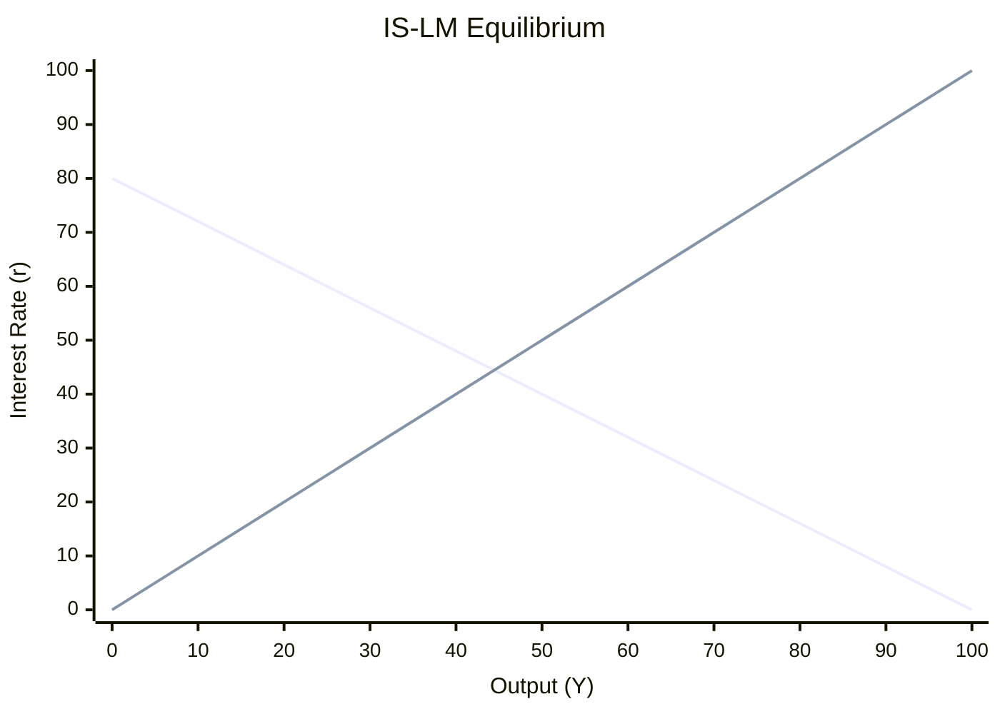

# Aggregate Demand & Supply

## The IS-LM Model

The IS-LM model shows how the goods market and money market jointly determine the interest rate and output in the short run, holding the price level fixed.

### The IS Curve (Goods Market)

The IS curve represents equilibrium in the goods market. Total output (Y) equals aggregate expenditure: consumption, investment, government spending, and net exports.

$$Y = C(Y - T) + I(r) + G + NX(\varepsilon)$$

Investment depends negatively on the real interest rate (r). When r rises, borrowing costs increase and investment falls, reducing output. This makes the IS curve downward-sloping in (Y, r) space.

- **Expansionary fiscal policy** (↑G or ↓T) shifts IS right → higher Y at every r
- **Contractionary fiscal policy** (↓G or ↑T) shifts IS left

### The LM Curve (Money Market)

The LM curve represents equilibrium in the money market. The real money supply (M/P) must equal real money demand L(Y, i), which rises with output and falls with the nominal interest rate.

$$\frac{M}{P} = L(Y, i)$$

Higher output increases money demand, pushing up the interest rate. This makes the LM curve upward-sloping in (Y, i) space.

- **Expansionary monetary policy** (↑M) shifts LM right → lower r at every Y
- **Contractionary monetary policy** (↓M) shifts LM left

The intersection of IS and LM gives the short-run equilibrium (Y*, r*) for a given price level. Fiscal policy shifts IS; monetary policy shifts LM.

### Limitations

The basic IS-LM model assumes a fixed price level, no inflation expectations, and a closed economy. The Mundell-Fleming model (see [open-economy.md](open-economy.md)) extends it to open economies, and the AD-AS framework below relaxes the fixed-price assumption.

## From IS-LM to Aggregate Demand

The **aggregate-demand (AD) curve** shows the total quantity of goods and services demanded at each price level. It is derived by varying P in the IS-LM model:

1. An increase in P reduces the real money supply M/P
2. The LM curve shifts left
3. Equilibrium Y falls
4. Tracing (P, Y) pairs yields the downward-sloping AD curve

Three mechanisms reinforce the negative relationship between P and Y:

- **Wealth effect** (Pigou effect): higher P reduces the real value of wealth → consumption falls
- **Interest-rate effect** (Keynes effect): higher P raises money demand → interest rates rise → investment falls
- **Exchange-rate effect** (Mundell-Fleming): higher P raises domestic interest rates → currency appreciates → net exports fall

## Aggregate Supply

### Long-Run Aggregate Supply

The long-run aggregate-supply (LRAS) curve is **vertical** at potential output (Y*). In the long run, the classical dichotomy holds: nominal variables (price level, money supply) do not affect real variables (output, employment). Output is determined by real factors: labor, capital, natural resources, and technology.

### Short-Run Aggregate Supply

The short-run aggregate-supply (SRAS) curve slopes **upward**. Three theories explain why output deviates from potential in the short run:

- **Sticky-wage theory**: nominal wages adjust slowly. A higher price level lowers real wages → firms hire more → output rises
- **Sticky-price theory** (menu costs): firms are slow to adjust prices. A higher price level raises firms' relative prices → they increase output
- **Worker-misperception theory**: workers confuse nominal wage changes with real wage changes. A higher price level leads them to supply more labor

All three theories imply that the SRAS equation can be written as:

$$Y = Y^* + \alpha (P - P^e)$$

When the actual price level exceeds the expected price level, output rises above potential.

## Shocks and Adjustment

### Supply Shocks

A negative supply shock (e.g., oil price spike, pandemic) shifts SRAS left: output falls and the price level rises — **stagflation**. A positive supply shock (e.g., technological breakthrough) shifts SRAS right: output rises and prices fall.

### Demand Shocks

A negative demand shock (e.g., drop in consumer confidence) shifts AD left, creating a **recessionary gap** (Y < Y*). A positive demand shock creates an **inflationary gap** (Y > Y*). Over time, if no policy response occurs, expectations adjust and the economy self-corrects back to potential output.

## Fiscal and Monetary Policy

### Multiplier Effect and Crowding-Out

An increase in government spending has two competing effects on AD:

- **Multiplier effect**: each dollar of government spending raises income, which raises consumption, further raising income — amplifying the initial impact
- **Crowding-out effect**: higher government spending raises money demand and interest rates, reducing private investment — dampening the initial impact

The net effect depends on the slope of the LM curve and the sensitivity of investment to interest rates.

### Automatic Stabilizers vs. Discretionary Policy

- **Automatic stabilizers**: tax and transfer systems that automatically smooth the business cycle (progressive income tax, unemployment insurance) — no legislative delay
- **Discretionary policy**: deliberate changes in spending or taxes — subject to recognition, implementation, and impact lags

### Supply-Side Economics

Supply-side policies aim to shift LRAS right by improving incentives to work, save, and invest. The **Laffer curve** illustrates the relationship between tax rates and tax revenue: beyond a certain rate, further increases reduce revenue by discouraging economic activity.
