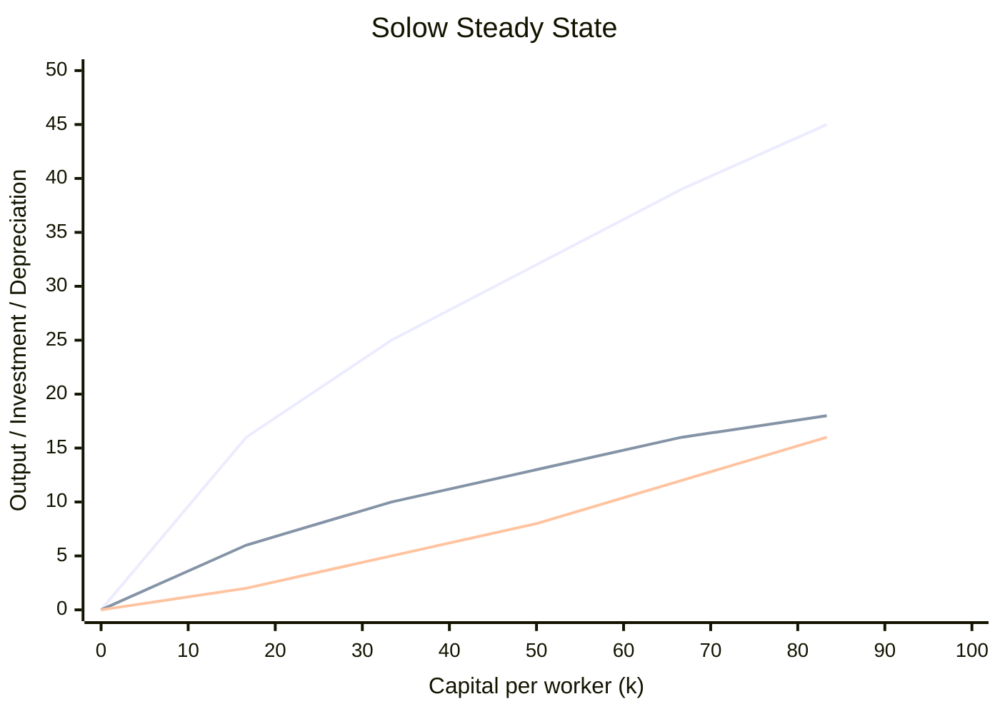

# Solow Growth Model

## Aggregate Production Function

The economy's total output depends on its stock of capital, labor, human capital, natural resources, and the efficiency with which they are combined:

$$Y = A \cdot F(K, L, H, N)$$

- **K**: physical capital (machinery, buildings, infrastructure)
- **L**: labor (number of workers)
- **H**: human capital (education, skills, training)
- **N**: natural resources (land, oil, minerals)
- **A**: total factor productivity (technology, institutions)

A common simplification uses the Cobb-Douglas form with constant returns to scale:

$$Y = A K^\alpha L^{1-\alpha}$$

Dividing by L gives output per worker:

$$y = A k^\alpha \quad \text{where} \quad y = Y/L,\; k = K/L$$

## Capital Accumulation

The Solow model focuses on capital accumulation as the driver of growth in the transition to the steady state. The change in capital per worker is:

$$\Delta k = s f(k) - \delta k$$

- **s**: saving rate (fraction of income saved and invested)
- **f(k)**: output per worker
- **s · f(k)**: actual investment per worker
- **δ**: depreciation rate (capital wears out at rate δ per period)
- **δ · k**: break-even investment (investment needed to keep k constant)

When actual investment exceeds break-even investment, k rises; when it falls short, k falls.

## Steady State

The steady state is reached when capital per worker stops changing:

$$\Delta k = 0 \quad \Rightarrow \quad s f(k^*) = \delta k^*$$

At the steady state:
- Capital per worker k* is constant
- Output per worker y* = f(k*) is constant
- Total output Y grows at the rate of population growth
- No further growth in output per worker occurs without technological progress

### Convergence (Catch-Up Effect)

Countries with lower k relative to their steady state grow faster than countries nearer the steady state, because diminishing returns to capital are stronger at low k. This is the **catch-up effect**: a dollar of new capital raises output more in a capital-poor country than in a capital-rich one.

## Golden Rule Level of Capital

The **golden rule** steady state maximizes consumption per worker. Consumption is output minus investment:

$$c^* = f(k^*) - \delta k^*$$

The golden rule capital stock k*gold satisfies:

$$MPK = \delta \quad \text{or} \quad f'(k^*_{gold}) = \delta$$

At this point, the marginal product of capital equals the depreciation rate, and consumption per worker is maximized. A country can be at a steady state that is below or above the golden rule; if above, reducing the saving rate would increase consumption immediately and in the long run.

## Technological Progress

With labor-augmenting technological progress at rate g, the production function becomes:

$$Y = F(K, A \cdot L)$$

where A·L is effective labor. In the steady state with technological progress:
- Capital per effective worker is constant
- Output per effective worker is constant
- Output per worker (Y/L) grows at rate g
- Total output (Y) grows at rate n + g (population growth + tech progress)

Technological progress is the **only source of sustained long-run growth** in per capita income in the Solow model.

## Endogenous vs. Exogenous Growth

- **Solow (exogenous)**: technological progress is exogenous — it arrives from outside the model. The model explains convergence and the transition but does not explain the source of technological change.
- **Romer (endogenous)**: technological progress is driven by intentional investment in research and development. Knowledge is non-rival (one person's use does not reduce another's) and partially excludable (patents, copyrights). This can generate increasing returns to scale and sustained growth without relying on an outside force.

The key distinction: in Solow, policy cannot affect the long-run growth rate; in Romer, policies that encourage R&D and human capital accumulation can raise the long-run growth rate.

## Growth Accounting

Growth accounting decomposes observed output growth into contributions from capital, labor, and technological progress:

$$\frac{\Delta Y}{Y} = \alpha \frac{\Delta K}{K} + (1 - \alpha) \frac{\Delta L}{L} + \frac{\Delta A}{A}$$

- **α**: capital's share of output (typically ~1/3)
- **1 − α**: labor's share (typically ~2/3)
- **ΔA/A**: Solow residual (total factor productivity growth) — the portion of growth not explained by factor accumulation, attributed to technological progress and institutional improvements.

The Solow residual is calculated as what remains after subtracting the contributions of capital and labor from actual output growth.
