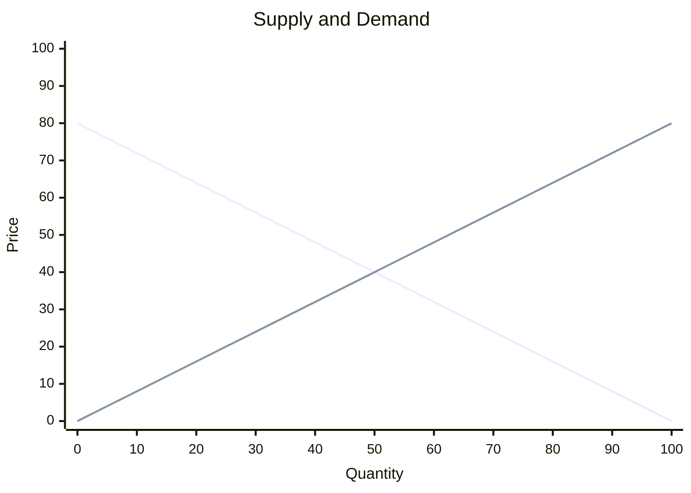

# Supply & Demand

## The Demand Curve

The law of demand states that, holding all else equal, the quantity demanded of a good falls when its price rises. This inverse relationship produces a downward-sloping demand curve.

$$Q_d = f(P) \quad \text{where} \quad \frac{\partial Q_d}{\partial P} < 0$$

A change in the good's own price causes a **movement along** the demand curve. A change in any other factor causes the entire curve to **shift**.

Determinants of demand:
- **Income**: normal goods (demand rises with income) vs. inferior goods (demand falls with income)
- **Preferences**: tastes, advertising, and trends shift demand
- **Prices of related goods**: substitutes (positive cross-price effect) and complements (negative cross-price effect)
- **Expectations**: future price or income expectations affect current demand
- **Number of buyers**: population growth shifts demand right

## The Supply Curve

The law of supply states that, holding all else equal, the quantity supplied of a good rises when its price rises. This direct relationship produces an upward-sloping supply curve.

$$Q_s = f(P) \quad \text{where} \quad \frac{\partial Q_s}{\partial P} > 0$$

As with demand, a change in price causes a movement along the supply curve; a change in a determinant shifts the curve.

Determinants of supply:
- **Input prices**: higher input costs reduce supply (shift left)
- **Technology**: improvements increase supply (shift right)
- **Expectations**: expected future prices affect current supply decisions
- **Number of sellers**: entry of new firms shifts supply right
- **Natural factors**: weather, disasters, and regulations

## Shifts vs. Movements Along the Curves

- **Change in price** → movement along the curve (change in quantity demanded/supplied)
- **Change in a determinant** → shift of the curve (change in demand/supply)

This distinction is the most common source of error in economic analysis. When the price of a good rises, demand does not "decrease" — quantity demanded decreases along the same demand curve.

## Market Equilibrium

Equilibrium occurs where quantity demanded equals quantity supplied. At this point, the market clears with no surplus or shortage.

$$Q_d(P^*) = Q_s(P^*)$$

- **Excess supply (surplus)**: price is above equilibrium → sellers cut prices to attract buyers
- **Excess demand (shortage)**: price is below equilibrium → buyers bid prices up
- The market naturally converges toward equilibrium through price adjustments

## Comparative Statics

To analyze how a market event changes equilibrium, follow three steps:

1. Does the event shift the demand curve or the supply curve?
2. Does it shift the curve left or right?
3. How do the new equilibrium price and quantity compare to the old?

The diagram above shows the basic supply-demand framework. Equilibrium $$(P^*, Q^*)$$ occurs at the intersection of the two curves. A rightward shift of demand (e.g., from rising income for a normal good) raises both equilibrium price and quantity. A rightward shift of supply (e.g., from technological improvement) lowers equilibrium price and raises quantity.

## Elasticity

### Price Elasticity of Demand

Price elasticity of demand measures the responsiveness of quantity demanded to a change in price.

$$E_d = \frac{\% \Delta Q_d}{\% \Delta P} = \frac{(Q_2 - Q_1) / ((Q_2 + Q_1) / 2)}{(P_2 - P_1) / ((P_2 + P_1) / 2)}$$

The midpoint formula ensures the elasticity measure is symmetric regardless of direction.

- **Elastic** ($$\|E_d\| > 1$$): quantity responds strongly to price changes (luxuries, many substitutes)
- **Inelastic** ($$\|E_d\| < 1$$): quantity responds weakly (necessities like insulin, few substitutes)
- **Unit elastic** ($$\|E_d\| = 1$$): total revenue is unchanged by a price change

Determinants of elasticity: availability of close substitutes, necessity vs. luxury, definition of the market, time horizon, and share of the consumer's budget.

### Income Elasticity and Cross-Price Elasticity

**Income elasticity of demand** measures how quantity demanded responds to a change in consumer income:

$$E_Y = \frac{\% \Delta Q_d}{\% \Delta Y}$$

- Normal goods: $$E_Y > 0$$ (luxuries have high income elasticity)
- Inferior goods: $$E_Y < 0$$ (e.g., bus travel, generic brands)

**Cross-price elasticity of demand** measures how quantity demanded of good A responds to a change in the price of good B:

$$E_{AB} = \frac{\% \Delta Q_d^A}{\% \Delta P_B}$$

- Substitutes: $$E_{AB} > 0$$ (coffee and tea)
- Complements: $$E_{AB} < 0$$ (cars and gasoline)

### Price Elasticity of Supply

Price elasticity of supply measures how quantity supplied responds to a change in price:

$$E_s = \frac{\% \Delta Q_s}{\% \Delta P}$$

Supply is more elastic over longer time horizons because firms can adjust production capacity, enter, or exit the market. In the short run, supply may be nearly inelastic for goods requiring specialized inputs or fixed capacity.

## Consumer and Producer Surplus

**Consumer surplus** is the difference between what a buyer is willing to pay and what they actually pay — the area below the demand curve and above the market price.

**Producer surplus** is the difference between the price a seller receives and their willingness to accept (marginal cost) — the area above the supply curve and below the market price.

Total surplus (consumer surplus + producer surplus) measures the net benefit to society from a market transaction and is the foundation of welfare analysis. For a full treatment, see [welfare-efficiency.md](welfare-efficiency.md).
