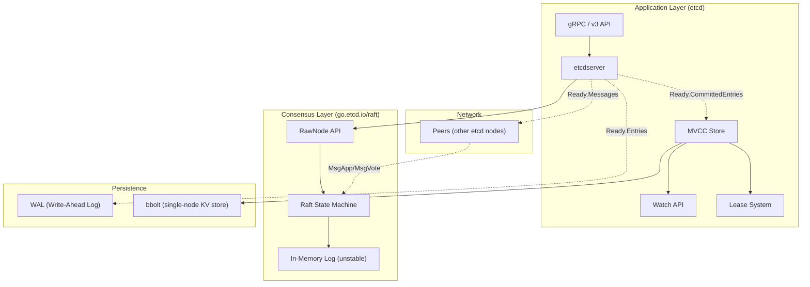
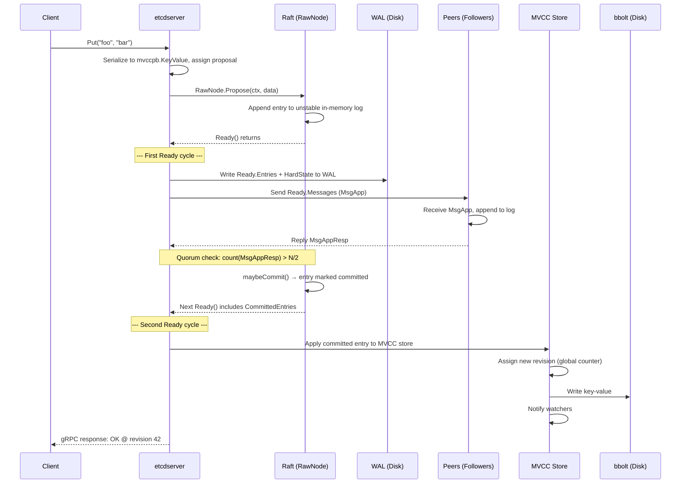
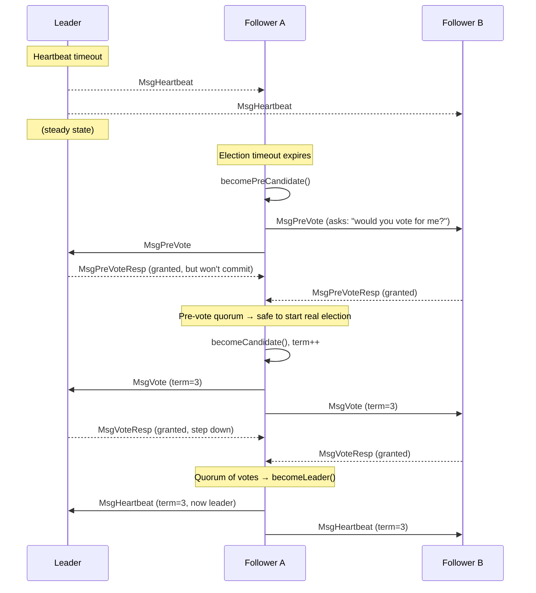
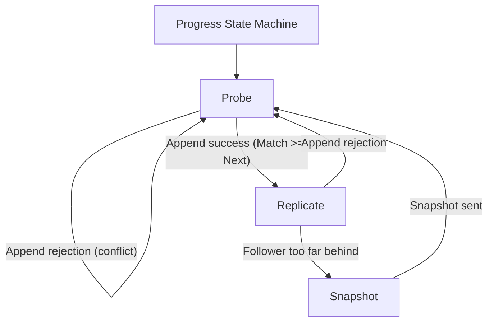
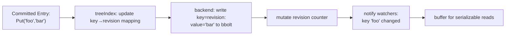

# etcd & Raft




## System Model

| Attribute | Value |
|-----------|-------|
| **CAP Position** | CP (Consistency + Partition Tolerance) — available sacrificed under partition |
| **Consistency** | Linearizable writes, configurable reads (linearizable / serializable / consistent) |
| **Failure Model** | Crash-recovery (not Byzantine) |
| **Replication** | Full state machine replication — every node applies every command |
| **Sharding** | None — each node holds all keys |

## Architecture

Layered from inside out: Raft decides *what is safe*, etcdserver decides *what to do about it*.



**Key insight**: Raft is a pure in-memory state machine. It never touches disk. Its output is instructions to the application:
- `Entries` → write these to your WAL
- `Messages` → send these over the network
- `CommittedEntries` → apply these to your state machine

### Component Roles

| Component | Role | Doesn't do |
|-----------|------|------------|
| **Raft state machine** | Decide ordering, safety, leadership | Know what a KV pair is |
| **RawNode/Node** | Sync API / async channel wrapper | Persist anything |
| **etcdserver** | Orchestrate: propose, persist WAL, send msgs, apply | Make consensus decisions |
| **WAL** | Durability: entries survive crash | Index or query data |
| **bbolt** | State: store key-values by revision | Consensus / ordering |
| **MVCC store** | Multi-version: track revisions, buffer reads, notify watchers | Leadership |

## Why Raft? Why not just "go through quorum" directly?

The naive idea: on every write, ask all nodes "do you agree?" and proceed if a majority says yes.

This fails because **consensus requires ordering, not just agreement**. If two concurrent puts arrive:

```
Client A: Put("x", 1)   →  Node 1 hears it first
Client B: Put("x", 2)   →  Node 2 hears it first
```

Without a total order, Node 1 might apply `x=1` then `x=2` while Node 2 applies `x=2` then `x=1` — ending in different states. A simple quorum vote ("do you accept value?") doesn't assign sequence numbers.

Raft provides:

1. **Total order** — a gapless, indexed log (`index 1, 2, 3...`) that every node agrees on
2. **Leader election** — exactly one node assigns the index numbers
3. **Safety** — once an entry is committed at index `N`, no future leader can overwrite it
4. **Replication** — followers accept the leader's log, filling gaps via consistency checks

There is no way to "skip" Raft for a multi-node consistent KV store. Consensus *is* the protocol that makes it work.

## Full Write Path (Put Request)



### Stage 1: Propose

The client issues a `Put("foo", "bar")` via gRPC. etcdserver serializes it into a protobuf `mvccpb.KeyValue` and calls `s.r.Propose(ctx, encodedData)`.

Inside Raft's `RawNode.Propose()`, the data is wrapped in a `Message` of type `MsgProp`, tagged with the current term, and appended to the leader's in-memory unstable log. No disk I/O happens yet.

### Stage 2: Ready (First Cycle)

`RawNode.Ready()` compiles the state machine output:

```go
type Ready struct {
    SoftState         *SoftState           // leader ID, raft state
    HardState         pb.HardState         // term, vote, commit index → persist
    Entries           []pb.Entry           // new entries → write to WAL
    CommittedEntries  []pb.Entry           // ready to apply to state machine
    Messages          []pb.Message         // outbound RPCs → send to peers
    Snapshot          pb.Snapshot          // snapshot to apply
    MustSync          bool                 // must fsync before advance
}
```

etcdserver takes the `Ready` and does two things in parallel:
1. Writes `Entries` + `HardState` to the WAL (with fsync for durability)
2. Sends `Messages` (MsgApp) to follower peers over the network

### Stage 3: Replication + Quorum

Followers receive `MsgApp` and check for log consistency:

```go
func (r *raft) handleAppendEntries(m *pb.Message) {
    if r.raftLog.maybeAppend(a) {
        r.send(MsgAppResp{Index: newLastIndex})
        return
    }
    // REJECT — provide a hint for backtrack
    hintIndex := min(m.GetIndex(), r.raftLog.lastIndex())
    hintIndex, hintTerm := r.raftLog.findConflictByTerm(hintIndex, m.GetLogTerm())
    r.send(MsgAppResp{Reject: true, RejectHint: hintIndex, LogTerm: hintTerm})
}
```

The leader tracks every follower's progress via `tracker.Progress`:

| Field | Purpose |
|-------|---------|
| `Match` | Highest log index known to match this follower |
| `Next` | Next index to send on next append |
| `State` | `StateProbe` / `StateReplicate` / `StateSnapshot` |
| `Inflights` | Sliding window of in-flight append requests (flow control) |

### Leader Backtrack (When Follower Rejects)

When a follower's log doesn't match at `prevLogIndex`, it rejects with a hint — a linear backward scan (`findConflictByTerm`) finds the highest index where its term matches the leader's:

```
Leader's log:      [1:1] [2:1] [3:1] [4:2] [5:2] [6:2]
Follower's log:    [1:1] [2:1] [3:1] [4:3] [5:3]
                                       ↑ divergent (different leader wrote this)

Leader sends: MsgApp{prevLogIndex=5, prevLogTerm=2, entries=[E6]}
Follower rejects: findConflictByTerm(5, 2)
  index=5: term=3 > 2 → skip
  index=4: term=3 > 2 → skip
  index=3: term=1 ≤ 2 → FOUND! Return hintIndex=3, hintTerm=1
Follower sends: MsgAppResp{Reject: true, RejectHint: 3, LogTerm: 1}
```

The leader receives the rejection and refines the hint by scanning its own log:

```go
case pb.MsgAppResp:
    if m.GetReject() {
        nextProbeIdx, _ = r.raftLog.findConflictByTerm(
            m.GetRejectHint(), m.GetLogTerm())
        if pr.MaybeDecrTo(m.GetIndex(), nextProbeIdx) {
            pr.BecomeProbe()               // Replicate → Probe mode
            r.sendAppend(m.GetFrom())       // Send corrected append immediately
        }
    }
```

`MaybeDecrTo()` adjusts the follower's `Next` index:

```go
func (pr *Progress) MaybeDecrTo(rejected, matchHint uint64) bool {
    if pr.State == StateReplicate {
        if rejected <= pr.Match { return false }      // stale rejection
        pr.Next = pr.Match + 1                         // restart from known match
        return true
    }
    // StateProbe: rejection must be for expected index
    if pr.Next-1 != rejected { return false }
    pr.Next = max(min(rejected, matchHint+1), pr.Match+1)
    return true
}
```

This is **not binary search** — it's two one-sided linear scans (leader + follower each run `findConflictByTerm`). But the follower's hint skips the entire divergent section in one response, avoiding per-index probing.

The `Progress` state machine acts as the monitoring/recovery mechanism:

```
StateProbe (one at a time, waiting for ack)
  → append succeeds → StateReplicate (pipelining, fast)
  → append fails → StateProbe again
  → follower too far behind → StateSnapshot (send full snapshot)
```

### Commitment

When the leader receives enough `MsgAppResp` acknowledgements to form a quorum (`> N/2`), `maybeCommit()` advances the commit index:

```go
func (l *raftLog) maybeCommit(maxMatchIdx, term uint64) bool {
    if maxMatchIdx > l.committed && l.zeroTermOnErrCompacted(l.term(maxMatchIdx)) == term {
        l.committed = maxMatchIdx
        return true
    }
    return false
}
```

### Stage 4: Apply (Second Ready)

The entry is now committed. The next `Ready()` call includes it in `CommittedEntries`. etcdserver deserializes the entry and applies it to the MVCC store.

The MVCC store:
- Assigns a new monotonically increasing revision (global counter)
- Writes the key-value pair to the bbolt backend at the new revision
- Updates the in-memory read buffer (tree index) for fast reads
- Notifies watchers that this key changed

### Stage 5: Response

etcdserver sends the gRPC response back to the client with the revision at which the write took effect.

## Raft Leader Election



### When an election starts

A follower starts an election when its election timeout fires (no heartbeat from leader within `N` ticks). The default in etcd: `HeartbeatTick=1`, `ElectionTick=10` — so 10 missed ticks trigger an election.

Key flow in `raft.go`:

```go
func (r *raft) Step(m pb.Message) error {
    switch m.Type {
    case pb.MsgHup:        // local tick → election
        r.campaign(r.preVote)
    case pb.MsgVote:       // incoming vote request
        r.handleVoteRequest(m)
    case pb.MsgVoteResp:   // vote response
        r.handleVoteResponse(m)
    ...
    }
}
```

### The campaign function

```go
func (r *raft) campaign(t CampaignType) {
    r.becomeCandidate()  // term++, vote for self
    vs := r.votes
    // send vote requests to all peers
    for _, id := range r.trk.VoterNodes() {
        if id == r.id { continue }
        r.send(pb.Message{To: id, Type: pb.MsgVote, ...})
    }
    // check if we win immediately (single-node cluster)
    r.poll(r.id, pb.VoteRespMsgType(pb.MsgVoteResp), true)
}
```

Votes are tallied in `tracker.ProgressTracker.RecordVote()`. When `TallyVotes()` returns true (majority), `becomeLeader()` is called.

### Pre-vote

**The problem pre-vote solves:**

```
Without pre-vote:
1. Node A gets network-partitioned
2. A's election timeout fires → becomes candidate
3. A increments term to 20 (can't reach quorum, keeps timing out)
4. Partition heals
5. A broadcasts MsgVote{term=20} to the cluster
6. Leader B receives request → "20 > my term 5 → I must step down"
7. B becomes follower, new election starts
8. Cluster was working fine, now disrupted unnecessarily
```

The rejoining node's **high term forces the stable leader to abdicate**, even though the rejoining node has no chance of winning (it's behind on logs).

**How pre-vote fixes it:** The candidate first asks "would you vote for me?" **without incrementing its term**:

```go
func (r *raft) becomePreCandidate() {
    // NOTE: does NOT increment r.Term or change r.Vote
    r.state = StatePreCandidate
}
```

The pre-vote is sent with `term = currentTerm + 1` as a hypothetical signal, but the sender's actual term stays unchanged. If the cluster responds "no, you're behind" (or ignores the request because the leader is active), the candidate backs off silently. No term increase, no disruption.

When pre-vote wins a quorum, the candidate transitions to a real election:

```go
case quorum.VoteWon:
    if r.state == StatePreCandidate {
        r.campaign(campaignElection)  // Win pre-vote → start real election
    }
```

## The Raft Log

The log is the heart of Raft. It's not stored by Raft — Raft keeps an in-memory reference to it via the `Storage` interface:

```go
type Storage interface {
    InitialState() (pb.HardState, pb.ConfState, error)
    Entries(lo, hi, maxSize uint64) ([]pb.Entry, error)
    Term(i uint64) (uint64, error)
    LastIndex() (uint64, error)
    FirstIndex() (uint64, error)
    Snapshot() (pb.Snapshot, error)
}
```

Raft's `raftLog` tracks four pointers:

```
    snapshot
       │          applied   committed   unstable
       ▼             ▼          ▼          ▼
────┬────┬────┬────┬────┬────┬────┬────┬────┬────┬────
    │    │    │    │    │    │    │    │    │    │
────┴────┴────┴────┴────┴────┴────┴────┴────┴────┴────
  Storage (stable) │   unstable (in-memory)
                   │
            committed - applied = ready to apply
            unstable - committed = not yet safe
```

- **applied**: applied to state machine (bbolt)
- **committed**: safe (on majority), but maybe not applied yet
- **unstable**: not yet written to WAL by the application

## WAL (Write-Ahead Log)

The WAL is the source of truth for Raft state on disk. Every entry that Raft decides must be persisted goes here first. On restart, the WAL is replayed to rebuild the Raft log and state machine.

### What the WAL Stores

Raft's `HardState` + `Entry` array appear in every `Ready`. These are what the WAL persists:

```go
// raftpb.HardState — persisted after every Ready cycle
HardState:
  Term   uint64  // current leader era (increments on each election)
  Vote   uint64  // who this node voted for in this term (0 = none)
  Commit uint64  // highest log index known committed

// raftpb.Entry — the actual commands in the log
Entry:
  Term  uint64  // term when this entry was created
  Index uint64  // position in the log (1, 2, 3...)
  Type  EntryType
  Data  []byte  // the command: Put("foo","bar")
```

**Term** is a generation counter for leader authority. Every election bumps it by 1:

```
Node A is leader (term=1) → network partition → Node B elected (term=2)
→ network heals → Node A sends "I'm leader, append entry 5"
→ followers check: A's term (1) < my term (2) → REJECT
```

Without term, a stale leader's commands corrupt the log — no way to tell whose "entry 5" is the real one. Higher term = more recent = wins conflicts. Term is the **authority check** baked into every message.

**Vote** prevents double-voting after crash. If a node voted for A in term 3, crashes, restarts, and gets a vote request from B also in term 3, it checks `Vote` and rejects.

**Commit** is the safety watermark. Entries at or below commit are durable on a quorum and safe to apply. The apply loop won't touch anything past commit.

**Index** is the position in the ordered log. `index=5` on every node must be the same command. This is the total order Raft guarantees.

### WAL Segment Files

The WAL is not one file — it's a sequence of segment files, each up to 64 MB:

```
0000000000000000-0000000000000001.wal
0000000000000001-0000000000000015.wal
0000000000000002-0000000000000032.wal
```

Naming: `{sequence}-{first_raft_index}.wal`. The sequence increments on each rotation. The index is the first Raft log entry expected in that file.

**Lifecycle:**

- **Write**: always appends to the latest (highest seq) segment
- **Rotate**: when current segment hits 64 MB, `cut()` creates a new one
- **Read (recovery)**: `ReadAll()` opens ALL segments from earliest to latest, reads sequentially
- **Delete**: after a snapshot, segments before the snapshot index are deleted — sliding window from the left

```
Time 1 (no compaction yet):
┌──────┐ ┌──────┐ ┌──────┐
│seq=0 │ │seq=1 │ │seq=2 │ ← appending here
└──────┘ └──────┘ └──────┘

Time 2 (after snapshot at index 10):
        ┌──────┐ ┌──────┐ ┌──────┐
        │seq=1 │ │seq=2 │ │seq=3 │ ← appended
        └──────┘ └──────┘ └──────┘
        (seq=0 deleted — all its entries ≤ snapshot index)
```

### Record Framing (On-Disk Format)

Every WAL record is written to disk in this format:

```
┌──────────────────────────────────────────────┐
│ 8 bytes: Length field (uint64 LE)             │
│   bits 0-55  = protobuf Record size           │
│   bit 63     = 1 if padding present (0x80)    │
│   bits 56-58 = padding byte count (0-7)       │
├──────────────────────────────────────────────┤
│ N bytes: Protobuf-serialized walpb.Record     │
│   {type: EntryType, crc: 0xABCD,             │
│    data: <protobuf raftpb.Entry>}            │
├──────────────────────────────────────────────┤
│ 0-7 bytes: Zero-padding to 8-byte alignment   │
└──────────────────────────────────────────────┘
```

**Why 8-byte fixed length:** A varint would use 1-10 bytes. If the varint spans a sector boundary and a crash happens mid-write, the length field itself gets torn — you can't even determine where the record starts. A fixed 8 bytes is atomically writable on any storage with sector size ≥ 8 bytes (all real hardware), so the length field is never torn.

**Why 0-7 byte zero-padding:** Without it, records end at arbitrary byte offsets. The next record's 8-byte length field would start at a misaligned offset, potentially straddling an 8-byte boundary. The padding ensures every 8-byte length field starts at an 8-byte aligned offset — atomic-write safe.

**Record types:**

| Type | Value | Payload | When Written |
|------|-------|---------|--------------|
| `MetadataType` | 1 | nodeID + clusterID | Start of every segment |
| `EntryType` | 2 | `raftpb.Entry` (term, index, data) | Each `Save()` call |
| `StateType` | 3 | `raftpb.HardState` (term, vote, commit) | End of each `Save()` |
| `CrcType` | 4 | none (CRC in the Record.Crc field, not Data) | Start of every segment — resets CRC chain |
| `SnapshotType` | 5 | snapshot metadata (index, term, conf state) | On snapshot |

### CRC (Chained Checksum)

CRC-32/Castagnoli is computed incrementally across all records:

```go
// encoder.go
e.crc.Write(rec.Data)          // accumulate this record's data into running CRC
rec.Crc = new(e.crc.Sum32())   // store the running CRC (pointer; all data so far)
```

Every record stores the CRC of **all records written before it + its own data**. On read:

```go
// decoder.go
d.crc.Write(rec.Data)          // accumulate running CRC on read side
rec.Validate(d.crc.Sum32())    // does it match the stored CRC?
```

This means a corrupted bit in an early record is detected by every subsequent record. A `CrcType` record at the start of each segment resets the CRC chain — without it, corruption detection would span multi-GB segments.

### Write Path (Data → Segment File)

When etcdserver receives a `Ready`, this is the exact path for each byte:

```
raftNode.start() calls r.storage.Save(&rd.HardState, rd.Entries)
    │
    ▼
w.Save(st, ents)   ← WAL.Save()
    │
    ├── for each entry: w.saveEntry(e)
    │       │
    │       ▼
    │   encoder.encode(rec)
    │       1. e.crc.Write(rec.Data)           ← update running CRC
    │       2. rec.Crc = e.crc.Sum32()         ← store checksum
    │       3. data = proto.Marshal(rec)        ← serialize walpb.Record
    │       4. lenField = encodeFrameSize(len(data))
    │       5. e.bw.Write(uint64buf[:8])        ← 8-byte length
    │       6. e.bw.Write(data)                ← protobuf bytes
    │       7. e.bw.Write(padding)             ← zero pad to 8 bytes
    │
    ├── w.saveState(st)                        ← same process, StateType
    │
    └── w.sync()
            │
            ▼
        e.bw.Flush()      ← PageWriter flushes buffer
        fileutil.Fdatasync()  ← fsync data to disk
```

### Two Layers of Padding

The WAL uses two independent padding mechanisms for different purposes:

**Layer 1: 8-byte record alignment (encodeFrameSize).** Every record is zero-padded to an 8-byte boundary so the next record's 8-byte length field is always at an 8-byte-aligned offset — guaranteed atomic write for the length field.

**Layer 2: 4096-byte page alignment (PageWriter).** Accumulated records are flushed at 4096-byte boundaries so no record is ever split across a disk page — prevents torn writes.

```
On disk, the two layers nest:

8-byte aligned:       8-byte aligned:          8-byte aligned:
┌──────────────┐      ┌──────────────┐         ┌──────────────┐
│ [8 len][rec] │ pad  │ [8 len][rec] │ pad ... │ [8 len][rec] │
└──────────────┘      └──────────────┘         └──────────────┘
├──────────── 4096 byte page ──────────────────┤
                    ↑
              PageWriter ensures
              pages start here
              (may include trailing
               zero-padding from
               previous page)

[8 len][rec][pad][8 len][rec][pad]...[zero-pad to 4096]
←─── fully written atomically ──→              ↑
                                          zeros guarantee
                                          crash detects torn write
```

### PageWriter

PageWriter is a buffered writer that solves **torn writes across OS page boundaries** (page = 4096 bytes = 8 sectors × 512 bytes).

**The problem:** Even with 8-byte record alignment, records can still straddle a 4096-byte disk page. If the OS crashes after writing page 0 but before page 1:

```
Page 0 (bytes 0-4095)    Page 1 (bytes 4096-8191)
┌──────────────────────┐ ┌──────────────────────┐
│ ...[record starts]    ││   [record ends]...    │
└──────────────────────┘ └──────────────────────┘
  ✓ written               ✗ crash before written
```

Half a record on disk — corruption undetectable because the CRC is in the unwritten half.

**How PageWriter fixes it:** It buffers writes and flushes at 4096-byte boundaries. A record never crosses a page:

```
Without PageWriter (record spans pages):
[rec A ][rec B starts at byte 4048]
         ^^^^^^^^^^^^^^^^^^^^^^^^^^
         page boundary → torn write risk

With PageWriter (padded to page boundary):
[rec A][zero-pad to 4096][rec B starts at byte 4096]
                          ^^^^^^^^^
                          fully in one page → atomic write
```

Implementation:

```go
type PageWriter struct {
    buf    bytes.Buffer
    offset int64
    page   int           // 4096
}

// Flush() pads the buffer to the next page boundary before writing:
func (w *PageWriter) Flush() {
    data := w.buf.Bytes()
    if pad := (w.page - (w.offset+len(data)) % w.page) % w.page; pad > 0 {
        data = append(data, make([]byte, pad)...)
    }
    w.file.WriteAt(data, w.offset)   // write whole page(s) at once
    w.offset += len(data)
    w.buf.Reset()
}
```

Small writes (< 128 KB watermark) are buffered. Large records (> 4096 bytes) write directly — they're already larger than a page, so they'd fill at least one full page anyway. Overhead: ~64 KB of padding per 64 MB segment (0.1%).

### How the Two Layers Work Together for Crash Survival

```
Crash happens mid-write at PageWriter's flush:
┌──────────────────────────────────────────────┐
│ [8 len][rec][pad][zero-padding to align]...   │
│ ←── fully written ──→←── unwritten (zeros) → │
└──────────────────────────────────────────────┘
```

**What survives the crash:**

1. **Records before the crash point** are complete — every 8-byte length field was atomically written, every record is fully present. The CRC chain validates them.

2. **The partially written record** has trailing zeros (from the pre-allocated file). `isTornEntry()` detects these in 512-byte sector chunks:

```go
func (d *decoder) isTornEntry(data []byte) bool {
    for i := 0; i < len(data); i += 512 {
        if allZeros(data[i : i+512]) {
            return true   // ← crash detected here
        }
    }
    return false
}
```

3. **The zero-padding is harmless** — it's trailing zeros after the CRC-verified record data. The decoder lands on a CrcType record at the next segment start or a valid record. The last record before corruption is fully recovered.

4. **CRC detects non-zero corruption** within a fully-written record (e.g., bit rot on disk). The chained CRC propagates errors — a flipped bit in record 5 is detected by record 5, 6, 7, 8, etc.

**Without 8-byte padding**: the length field gets torn → can't determine record boundaries → entire WAL is unrecoverable.

**Without 4096-byte padding**: a record across page boundary gets split → CRC in the unwritten half → corruption goes undetected.

**With both**: every record boundary is atomic, no record spans a page, and partial writes are detected as zeros.

### Write Failure Handling (No Retry)

If `r.storage.Save()` fails (disk full, I/O error), etcd does **not retry**. The caller in the raft loop (`server/etcdserver/raft.go`) calls:

```go
if err := r.storage.Save(&rd.HardState, ptrEntries); err != nil {
    r.lg.Fatal("failed to save Raft hard state and entries", zap.Error(err))
    // ← os.Exit(1)
}
```

`zap.Logger.Fatal` logs the error then calls `os.Exit(1)` immediately. This is **intentional** — Raft's correctness depends on durable persistence. A node that can't persist cannot safely acknowledge entries. It must remove itself from the cluster.

The same fatal pattern applies to `SaveSnap()`, `Sync()`, and `Release()`. Recovery is external: systemd/Kubernetes restarts the process, and the operator fixes the underlying issue (free disk, replace disk).

### Segment Rotation (cut)

When the current segment exceeds 64 MB, `cut()` creates a new segment. `Save()` holds `w.mu.Lock()` the entire time — no concurrent writes:

```
1. Truncate current file to exact write offset     (drop preallocation slack)
2. Sync current file
3. Grab pre-allocated 64 MB temp file              (from filePipeline)
4. Seed new encoder with previous file's CRC        (chain the checksum)
5. Write CrcType record                            (reset CRC chain)
6. Write MetadataType record                       (nodeID + clusterID)
7. Write StateType record                          (current HardState)
8. Sync new file
9. Rename {N}.tmp → {seq+1}-{next_index}.wal       (proper name)
10. Fsync directory                                (rename must survive crash)
11. Close temp fd, reopen new file with flock
12. Replace encoder to point at new file
```

**File descriptor lifecycle:**

```
Before cut:    [seq=2.wal fd=5]         ← w.tail(), w.encoder writes here
During cut:    [seq=2.wal fd=5] [3.tmp fd=7]
After rename:  [seq=2.wal fd=5] [seq=3-42.wal fd=8]  (reopened with flock)
```

Old file descriptors stay open in `w.locks` until `ReleaseLockTo()` removes them after snapshot compaction.

**Pre-allocation:** A background goroutine round-robins between `0.tmp` and `1.tmp`, pre-allocating 64 MB files so `cut()` never blocks on disk allocation.

### Recovery (ReadAll)

On restart, ReadAll():

```
1. List all .wal files in the WAL directory
2. Sort by sequence number
3. Find starting segment via searchIndex()        (match against last snapshot)
4. Open all segments from that point forward
5. For each record:
     - EntryType  → append to []*raftpb.Entry at (index - startIndex - 1)
                    (newer overwrites older at same index — handles Figure 7)
     - StateType  → set HardState
     - MetadataType → verify consistency
     - CrcType    → reset decoder CRC to match stored value
     - SnapshotType → verify matches requested snapshot
6. On io.ErrUnexpectedEOF:
     - Repair(): truncate file at last valid offset
     - Backup corrupted tail as {filename}.broken
     - Retry
7. Seed new encoder with decoder's final CRC       (append mode)
```

The entry-at-offset trick is subtle: entries are stored in a slice indexed by `(entry.Index - startIndex - 1)`. If the same index appears twice (because the leader appended uncommitted entries that got overwritten), the later one replaces the earlier. This is Raft's Figure 7 — the leader may have sent uncommitted entries that are superseded.

### Torn Write Detection

After reading a record, the decoder checks for torn writes:

```go
func (d *decoder) isTornEntry(data []byte) bool {
    for i := 0; i < len(data); i += 512 {      // 512-byte sector chunks
        chunk := data[i : i+512]
        if allZeros(chunk) { return true }      // crash mid-write left zeros
    }
    return false
}
```

If a crash happened during the write, the trailing bytes of the record will be zero (from the pre-allocated file). The decoder detects this sector-by-sector and returns `io.ErrUnexpectedEOF`, triggering repair.

## Raft Progress Tracking

The leader maintains a `Progress` for every follower, tracking how far behind each one is:



- **StateProbe**: Optimistic — send one entry, wait for confirmation. On success, transition to Replicate.
- **StateReplicate**: Pipeline — stream entries using a sliding window (inflight tracker), up to `MaxInflightMsgs` or `MaxInflightBytes`. This is the fast path.
- **StateSnapshot**: Follower is too far behind — send a snapshot instead of individual log entries.

## etcdserver Raft Loop + Apply Loop

The connection between Raft and the state machine uses **two separate goroutines** communicating via a channel:

### Raft Loop (`server/etcdserver/raft.go`)

```go
// raft.go — goroutine started by raftNode.start()
for {
    select {
    case rd := <-r.Ready():
        // Send committed entries to the apply loop via channel
        r.applyc <- toApply{entries: committedEntries, snapshot: &rd.Snapshot, ...}

        // Leader sends messages to followers
        if islead {
            r.transport.Send(r.processMessages(ptrMsgs))
        }

        // Write entries + HardState to WAL (fsync)
        if err := r.storage.Save(&rd.HardState, ptrEntries); err != nil {
            r.lg.Fatal("failed to save Raft hard state and entries", ...)
        }

        // Append entries to raft storage, handle snapshots
        r.raftStorage.Append(rd.Entries)
        r.Advance()
    }
}
```

### Apply Loop (`server/etcdserver/server.go`)

```go
// server.go — inside EtcdServer.run()
for {
    select {
    case ap := <-s.r.apply():                           // receive committed entries
        s.applyAll(&ep, &ap)                            // → s.applyEntries(ep, apply)
    case leases := <-expiredLeaseC:
        s.revokeExpiredLeases(leases)
    ...
    }
}
```

**Key insight**: The raft loop handles `Ready()` → WAL + transport + `Advance()`. The apply loop reads committed entries from `r.applyc` and applies them to the MVCC store. They run concurrently, decoupling durability/replication from state machine application.

## The MVCC Store

Each committed `Put` entry is applied through the MVCC store:



Key MVCC properties:
- **Revision**: monotonic global counter. Every write creates a new version.
- **Tree index**: in-memory B-tree mapping keys to the current revision. Reads hit the tree index + buffer, not bbolt directly (unless serializable isolation is requested).
- **Compaction**: old revisions must be periodically compacted, or the history grows unbounded.

## Key Principles

| # | Principle | Implementation |
|---|-----------|----------------|
| 1 | **Separation of consensus and application** | Raft library knows nothing about KV; etcdserver knows nothing about consensus math |
| 2 | **Raft is pure in-memory** | No disk I/O in the raft library — output is instructions: write these entries, send these messages |
| 3 | **Asynchronous persistence** | Raft returns `Ready`; app writes WAL, sends messages, then calls `Advance()` |
| 4 | **Quorum-based safety** | No entry is committed until > N/2 peers confirm durable storage |
| 5 | **Leader is sole orderer** | Only the leader assigns log indices; followers append, never initiate |
| 6 | **ReadIndex for linearizable reads** | Leader confirms its still leader via quorum heartbeat before serving reads |
| 7 | **Flow control via progress tracking** | Probe → Replicate → Snapshot state machine per follower, with inflight sliding window |
| 8 | **Pre-vote prevents disruption** | Dry-run election before real election avoids term increases from partitioned nodes |
| 9 | **MVCC enables consistent reads** | Reads see a point-in-time snapshot via revision tracking |
| 10 | **WAL is the source of truth** | On restart, WAL is replayed; bbolt is rebuilt from it |

## Source Citations

| Component | Repository | File | Key Functions |
|---|---|---|---|
| Raft state machine | `go.etcd.io/raft/v3` | `raft.go` | `Step()`, `campaign()`, `becomeLeader()`, `becomeCandidate()`, `stepLeader()`, `bcastAppend()` |
| Raft log | `go.etcd.io/raft/v3` | `log.go` | `maybeCommit()`, `findConflict()`, `append()`, `nextCommittedEnts()` |
| RawNode API | `go.etcd.io/raft/v3` | `rawnode.go` | `Ready()`, `Advance()`, `Propose()`, `Step()` |
| Node API (channel) | `go.etcd.io/raft/v3` | `node.go` | `StartNode()`, `run()`, `Ready()` (channel), `Propose()` |
| Progress tracking | `go.etcd.io/raft/v3` | `tracker/progress.go` | `MaybeUpdate()`, `MaybeDecrTo()`, `BecomeProbe/Replicate/Snapshot()` |
| Progress tracker | `go.etcd.io/raft/v3` | `tracker/tracker.go` | `RecordVote()`, `TallyVotes()`, `Committed()` |
| Quorum math | `go.etcd.io/raft/v3` | `quorum/majority.go` | `MajorityConfig.VoteResult()`, `MajorityConfig.CommittedIndex()` |
| Storage interface | `go.etcd.io/raft/v3` | `storage.go` | `Storage`, `MemoryStorage` |
| etcdserver orchestrator | `go.etcd.io/etcd/server/v3` | `server/etcdserver/server.go` | `run()`, `apply()`, `applyAll()`, `applyEntries()` |
| etcdserver propose | `go.etcd.io/etcd/server/v3` | `server/etcdserver/v3_server.go` | `processInternalRaftRequestOnce()` |
| MVCC store | `go.etcd.io/etcd/server/v3` | `server/storage/mvcc/kvstore.go` (`store` struct), `kvstore_txn.go` (`Put()`, `Read()`) | revision assignment, tree index |
| Watcher | `go.etcd.io/etcd/server/v3` | `server/storage/mvcc/watcher.go` | `Watch()`, synced/unsynced event channels |
| Lease system | `go.etcd.io/etcd/server/v3` | `server/lease/lessor.go` | `Grant()`, `Revoke()`, `Promote()`, expiry check |
| WAL persistence | `go.etcd.io/etcd/server/v3` | `server/storage/wal/wal.go` | `Save()`, `ReadAll()`, entry serialization |

**Two separate repositories.** The raft consensus library (`go.etcd.io/raft/v3`) is a standalone Go module. Historically it was part of etcd but was extracted into its own repo at `github.com/etcd-io/raft`. etcd imports it as a Go module dependency — there is no `raft/` directory inside the etcd repository.

---

*Part of Phase 1: System Design Deep-Dive.* Next: Raft implementation (~300 lines Go) + ADR extract expansion.
