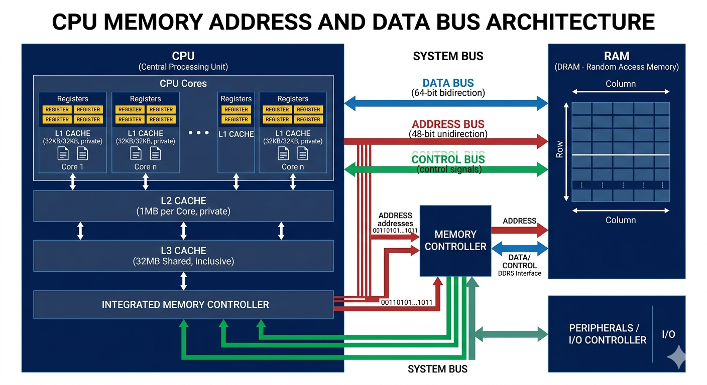

# Computing

### Physical Hardware

To interact with RAM, the CPU uses a specific set of hardware components to locate and move data.

1. **Address Bus (The "Where"):** The CPU sends a specific location number to RAM. The bus width determines the maximum number of "slots" the CPU is capable of seeing.
2. **Data Bus (The "What"):** The highway that carries the actual bits. Its width determines how much data can be moved in a single "trip," regardless of how big the address was.
3. **Memory Controller (The "Gatekeeper"):** The intermediate manager. It takes the CPU's request, finds the physical electrical row in the RAM, and handles the timing of the data transfer.

### Physical Memory Layout

Physical RAM is organized into a hierarchy of structures that determine how addresses map to actual hardware cells.

* **Memory Banks & Ranks:** RAM modules are divided into banks (sets of cells) and ranks (independent sets of chips on a DIMM). The memory controller interleaves accesses across banks to hide latency.
* **Channels & Interleaving:** Modern CPUs use multiple memory channels (e.g., dual‑channel, quad‑channel). Adjacent addresses are spread across channels to increase bandwidth. For example, address `0x1000` may go to channel 0, `0x1008` to channel 1.
* **Row, Column, and CAS Latency:** Physically, each bank is a 2D grid of rows and columns. The memory controller first activates a row (RAS – Row Address Strobe), then reads a column (CAS – Column Address Strobe). The time between these steps is the CAS latency.
* **Physical Address Range:** The number of physical address lines defines the **theoretical maximum** RAM the CPU can address, but actual limits depend on motherboard chipset, BIOS-reserved addresses (PCIe, MMIO), and memory interleaving configuration

### On-Chip Memory

Before reaching out to the relatively "slow" RAM, the CPU utilizes memory located directly on its own chip.

**CPU Cache (L1, L2, L3)**

High-speed buffers that store copies of frequently accessed data from RAM. The CPU checks these first to avoid the time-consuming trip across the Address Bus.

**Registers**

The fastest memory locations in existence, located inside the CPU core.

* **General Purpose:** Holds immediate data being processed (e.g., operands for addition).
* **Program Counter (PC):** Holds the address of the _next_ instruction to be executed.
* **Stack Pointer (SP):** Holds the memory address of the "top" of the stack to manage function calls.

### The Execution Cycle (Fetch-Execute)

This is the continuous loop the CPU performs to run a program.

1. **Fetch:** The CPU looks at the **Program Counter**, goes to that address in memory via the Address Bus, and grabs the instruction.
2. **Decode:** The Control Unit determines what the instruction means (e.g., a `MOV` or `ADD` command).
3. **Execute:** The ALU (Arithmetic Logic Unit) performs the operation, or data is moved between registers.
4. **Store (Write-Back):** The result is written back to a register or a specific memory address via the Data Bus.

### Virtual Memory and Addressing

The Operating System and CPU work together to provide a simplified view of memory to programs.

* **Virtual Address Space:** Every program is given its own continuous range of addresses (from 0 to Max). It doesn't know where its data is physically stored in the RAM chips; the MMU handles that translation.
* **Segmentation and Offsets:** The CPU often calculates addresses using a **Base Address** (start of a region) + an **Offset** (distance into that region).
  * _Example:_ If a data block starts at `1000` and you need the 5th item, the CPU accesses `1000 + 5`.
* **Memory Width:** A 64-bit CPU has a **theoretical** address space of 2^64 bytes, but current x86-64 implementations use **48-bit addresses** (256 TB) or 57-bit with 5-level paging. 32-bit CPUs are limited to 2^32 bytes (4 GB).

### Virtual Memory Layout (OS Dependent)

The way the OS organizes the virtual address space varies significantly between operating systems. Each process sees its own private layout, but the structure is defined by the OS kernel.

**Common Segments (present on all OSes)**

| Segment   | Contents                                            | Growth                                  |
| --------- | --------------------------------------------------- | --------------------------------------- |
| **Text**  | Executable code (read‑only)                         | Fixed size                              |
| **Data**  | Initialized global/static variables                 | Fixed size                              |
| **BSS**   | Uninitialized global/static variables (zero‑filled) | Fixed size                              |
| **Heap**  | Dynamic allocations (malloc/Box)                    | Grows upward (toward higher addresses)  |
| **Stack** | Local variables, call frames                        | Grows downward (toward lower addresses) |
| **MMIO**  | Memory‑mapped I/O regions                           | Fixed                                   |

### Memory Regions

The OS divides a program's virtual memory into specific "territories" to prevent data corruption.

| Feature        | The Stack                                    | The Heap                                  |
| -------------- | -------------------------------------------- | ----------------------------------------- |
| **Purpose**    | Short-term local variables & function calls. | Long-term data & large objects.           |
| **Management** | Automatic (LIFO - Last In, First Out).       | Manual (Programmer) or Garbage Collector. |

> **Note on "Collision Prevention":** By having the Stack grow down and the Heap grow up from opposite ends of the memory space, the system ensures they have the maximum possible room to expand before crashing into each other.

### VRAM vs Physical RAM

**VRAM** (Video RAM) is memory physically located on a graphics card (GPU). **Physical RAM** (system RAM) is attached to the CPU. They serve different purposes and have distinct characteristics.

| Aspect               | Physical RAM (DDR4/DDR5)         | VRAM (GDDR6 / HBM)                                          |
| -------------------- | -------------------------------- | ----------------------------------------------------------- |
| **Primary user**     | CPU                              | GPU                                                         |
| **Latency**          | Lower (\~70‑100 ns)              | Higher (\~150‑300 ns)                                       |
| **Bandwidth**        | Moderate (\~50‑100 GB/s)         | Very high (\~500‑2000 GB/s)                                 |
| **Capacity**         | Larger (up to 2 TB on servers)   | Smaller (typically 4‑24 GB for gaming, up to 80 GB for HPC) |
| **Error correction** | ECC optional (common in servers) | ECC rarely used (except in professional cards)              |
| **Access pattern**   | Random (caches hide latency)     | Sequential / streaming (optimised for throughput)           |
| **Voltage**          | 1.1‑1.2 V (DDR4)                 | 1.35‑1.5 V (GDDR6)                                          |

**How CPU and GPU share data**

* **Discrete GPU (dedicated card):** The CPU cannot directly access VRAM. Data must be copied over the PCIe bus using DMA. This copy is slow (≈16‑32 GB/s for PCIe 4.0). Example: game textures are loaded from system RAM → VRAM before rendering.
* **Integrated GPU (iGPU):** The GPU shares system RAM (no separate VRAM). This reduces cost but severely limits bandwidth (system RAM is slower than dedicated VRAM).
* **Unified Memory (Apple M‑series, AMD APU):** Physical RAM is accessible by both CPU and GPU without copying. Hardware cache coherence ensures consistency. This eliminates the PCIe bottleneck.

**When to care about VRAM vs System RAM**

* **Game / 3D rendering:** VRAM capacity and bandwidth determine maximum texture resolution and frame rate.
* **Machine learning (training):** Large models (e.g., LLaMA 70B) require VRAM to hold weights and activations. If VRAM overflows, data spills to system RAM (very slow).
* **Compute (CUDA / OpenCL):** Data resides in VRAM while GPU kernels run. Moving data back and forth should be minimised.

### Bits & Bytes

A **bit** is the smallest unit of information in computer — **0 or 1**.

* 1 bit → 2 possibilities → `0`, `1`
* 2 bits → 2² = 4 possibilities → `00`, `01`, `10`, `11`
* 3 bits → 2³ = 8 possibilities
* 8 bits → 2⁸ = 256 possibilities → **1 byte**

if you have **n bits**, you can represent **2ⁿ unique values**.

| Encoding         | Bits per symbol      | Example characters  |
| ---------------- | -------------------- | ------------------- |
| **Base2**        | 1                    | 0,1                 |
| **Base16 (hex)** | 4 bits per char      | 0–9, A–F            |
| **Base32**       | 5 bits per char      | A–Z, 2–7            |
| **Base58**       | \~5.86 bits per char | Bitcoin addresses   |
| **Base62**       | \~5.95 bits per char | 0–9, A–Z, a–z       |
| **Base64**       | 6 bits per char      | A–Z, a–z, 0–9, +, / |

**Example**:

generate unique code 10.000/day using base64 with max length code 8.
