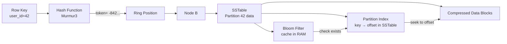
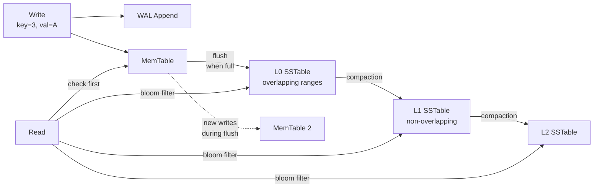
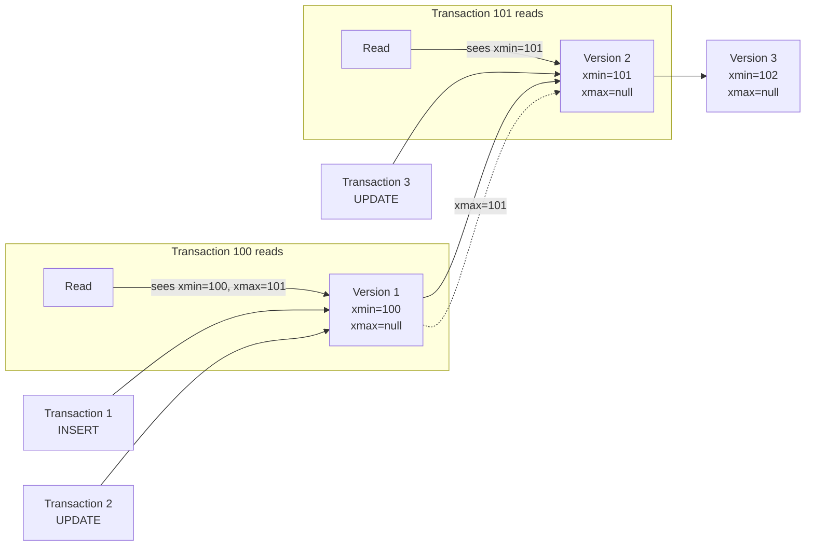
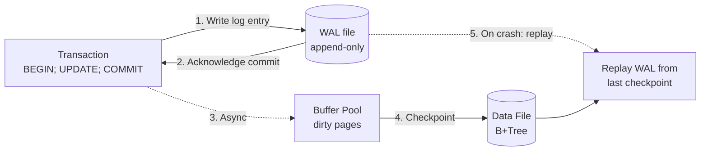
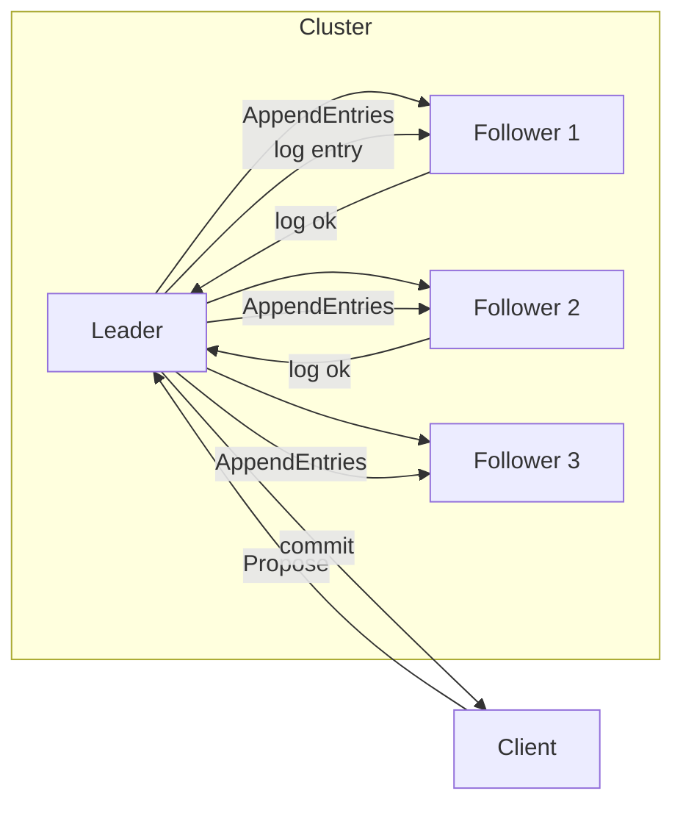
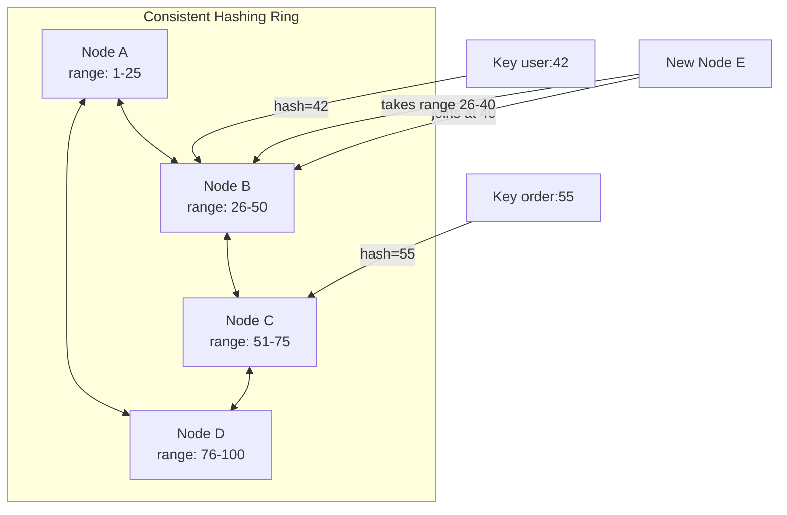
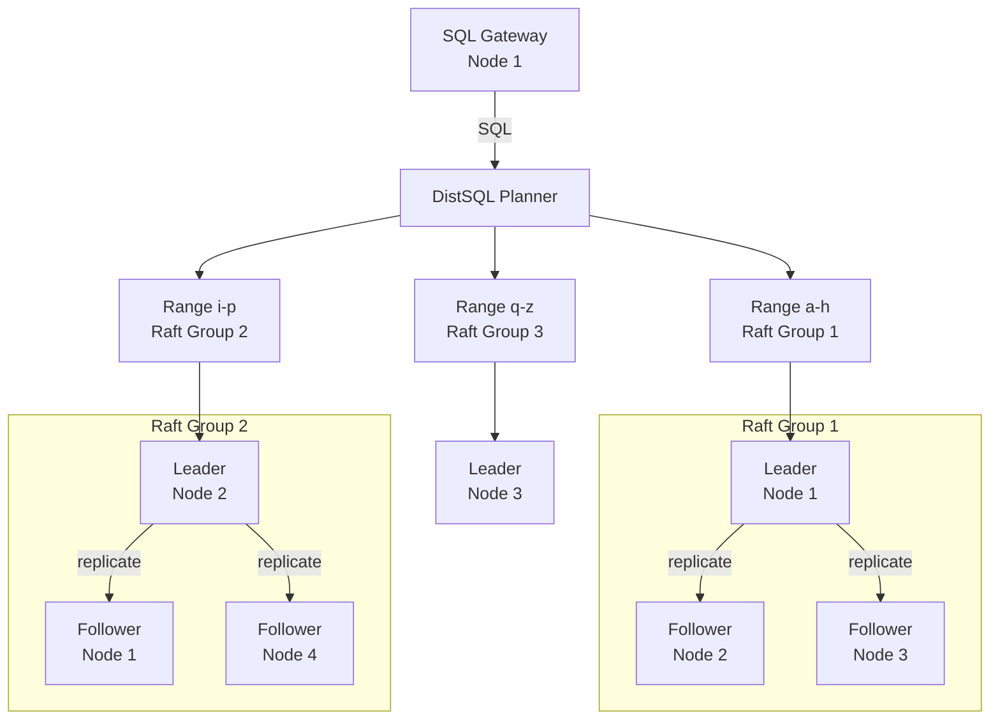
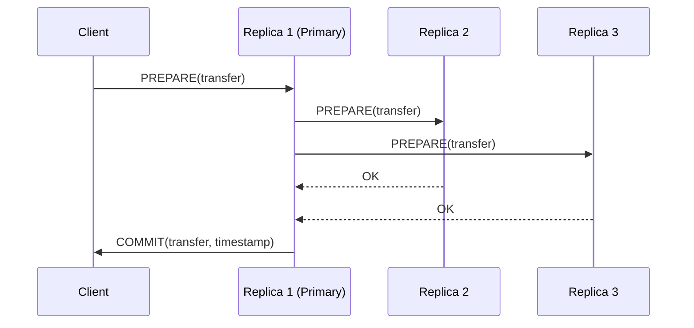

# Database

## Database Taxonomy

### Relational (SQL)

**Model**: Tables with rows and columns, strict schema, relationships via foreign keys. Data is normalized to reduce redundancy.

**Query Language**: SQL (Structured Query Language) — `SELECT`, `JOIN`, `GROUP BY`, transactions.

**Consistency**: ACID transactions, strong consistency by default. Isolation levels can be relaxed for performance.

**Use Case**: Banking, ERP, CRM, order management — any system where data integrity and complex relationships matter.

| Database | Engine | Default Isolation | Key Strength |
|---|---|---|---|
| MySQL | InnoDB (B+Tree clustered) | Repeatable Read | Read-heavy OLTP, wide ecosystem |
| PostgreSQL | Heap + B-Tree | Read Committed | Extensibility, advanced indexing, standards compliance |
| SQL Server | B+Tree (clustered/non-clustered) | Read Committed | Enterprise features, SQL Server Agent, SSIS |
| Oracle | B+Tree + undo segments | Read Committed | High-end enterprise, RAC clustering |

### Document

**Model**: Semi-structured JSON/BSON documents with nested objects and arrays. Schema is flexible — different documents in the same collection can have different fields.

**Query Language**: JSON-based queries, optional SQL-like (MongoDB Aggregation, Couchbase N1QL).

**Consistency**: Tunable — MongoDB defaults to strong consistency per document (primary reads), Couchbase offers eventual consistency.

**Use Case**: Content management, catalogs, gaming, rapid prototyping.

**Indexing**: MongoDB uses WiredTiger (B-Tree or LSM). Supports compound, multikey, text, geospatial, and TTL indexes.

### Key-Value

**Model**: Opaque blob stored by a unique key. No schema, no relationships. The simplest data model possible.

**Query Language**: `GET`, `SET`, `DEL` — often via simple binary protocol or REST.

**Consistency**: Varies — Redis is strongly consistent (single-threaded), DynamoDB is eventually consistent by default with optional strong consistency.

**Use Case**: Caching, session store, real-time leaderboards, shopping carts.

**Indexing**: Primary key only (hash table or tree). Secondary indexes are not native — DynamoDB offers Global Secondary Indexes (GSI) as separate tables maintained asynchronously. Redis sorted sets use a skip list for range queries.

### Wide-Column

**Model**: Rows with a dynamic set of columns grouped into column families. Schema is flexible within a family. Each row can have millions of columns.

**Query Language**: CQL (Cassandra Query Language) — SQL-like but limited to partition-key-based queries.

**Consistency**: Tunable — Cassandra defaults to eventual consistency with configurable consistency levels (`ONE`, `QUORUM`, `ALL`).

**Use Case**: Time-series data, IoT, recommendation engines, messaging systems.

**Indexing**: Primary index is the partition key (hash). Clustering columns sort within a partition. Secondary indexes exist but are discouraged (use materialized views). SSTable offset maps + Bloom filters for fast lookup.

### Graph

**Model**: Nodes (entities) and edges (relationships). Both nodes and edges can have properties. Relationships are first-class citizens.

**Query Language**: Cypher (Neo4j), Gremlin (JanusGraph), SPARQL (RDF).

**Consistency**: Typically ACID per transaction (Neo4j is fully ACID).

**Use Case**: Social networks, recommendation engines, fraud detection, knowledge graphs.

**Indexing**: B-Tree on node labels and properties (Neo4j uses Lucene-based indexes). Relationship traversal is pointer-based — no index needed for traversing edges.

### Object

**Model**: Objects stored and retrieved directly, closely mapping to programming language constructs. Supports inheritance, polymorphism, and complex object graphs.

**Query Language**: Object-oriented query APIs — often language-native (e.g., Java `Query` API for db4o, C# LINQ for Versant).

**Consistency**: ACID per database. Often used in embedded mode.

**Use Case**: CAD/CAM systems, telecommunications, embedded systems — niche usage.

### Time-Series

**Model**: Data points indexed by timestamp. Optimized for append-heavy workloads and range scans over time windows.

**Query Language**: Custom query languages (InfluxQL, Flux) or SQL with time functions (TimescaleDB).

**Consistency**: Varies — InfluxDB is eventually consistent in clustered mode; TimescaleDB inherits PostgreSQL's ACID guarantees.

**Use Case**: Monitoring, observability, IoT sensor data, financial tick data.

### NewSQL / Distributed SQL

**Model**: SQL interface with ACID transactions distributed across multiple nodes. Combines the horizontal scalability of NoSQL with the consistency of relational databases.

**Query Language**: SQL — standard SQL with distributed execution.

**Consistency**: ACID with strong consistency (Serializable or external consistency).

**Use Case**: Global-scale applications that need ACID: banking, booking systems, multi-region deployments.

| Database | Consensus | Sharding | Clock |
|---|---|---|---|
| CockroachDB | Raft per range | Range-based (auto-split) | HLC (Hybrid Logical Clock) |
| Spanner | Paxos per shard | Directory-based | TrueTime (GPS + atomic clocks) |
| TiDB | Raft (multi-raft) | Range-based (region) | PD timestamp oracle |

***

## Indexing Mechanisms

### Index Fundamentals

**Cardinality** refers to the number of unique values in a column relative to the total row count. It is the primary metric the query optimizer uses to decide whether to use an index.

- **High Cardinality** (e.g., `User_ID`, `Email`): Indexes are extremely effective. The B+Tree can rapidly narrow millions of rows to a single match.
- **Low Cardinality** (e.g., `Gender`, `Status`): Indexes are often ignored. Querying for 90% of rows via an index means jumping back and forth (random I/O) — slower than a full sequential table scan.

**Clustered vs Non-Clustered**: A clustered index stores the actual row data in the index leaf pages (table is the index). A non-clustered index stores pointers to the row data — either the row ID (heap) or the clustered key.

### Composite Index & Leftmost Prefix Rule

A Composite Index is a single index on multiple columns, ordered by the definition sequence (e.g., `CREATE INDEX idx ON T (A, B, C)`). The database sorts by A first, then by B within equal A values, then by C within equal A+B.

**Leftmost Prefix Rule**: The index can only be used if queries filter on columns starting from the left without skipping:

- `WHERE A = ?` — uses index
- `WHERE A = ? AND B = ?` — uses index
- `WHERE B = ?` — does NOT use index (skipped A)
- `WHERE A = ? AND C = ?` — uses A but cannot use C for filtering (skipped B)

This is critical for index design: order columns by selectivity (most selective first) and align with query patterns.

### B+Tree Index (MySQL, PostgreSQL, SQL Server)

```mermaid
graph TD
    Root[Root Page<br/>key: 50] --> I1[Internal Page<br/>10 | 30]
    Root --> I2[Internal Page<br/>70 | 90]
    I1 --> L1[Leaf: 1,5,8 → ptr]
    I1 --> L2[Leaf: 12,18,25 → ptr]
    I1 --> L3[Leaf: 32,40,48 → ptr]
    I2 --> L4[Leaf: 55,62,68 → ptr]
    I2 --> L5[Leaf: 72,80,88 → ptr]
    I2 --> L6[Leaf: 95,99 → ptr]
    L1 -.-> L2 -.-> L3 -.-> L4 -.-> L5 -.-> L6
```

The B+Tree is the dominant index structure in relational databases:

- **Internal nodes** store only keys (not data) to maximize fan-out — a single 16KB page can hold hundreds of keys.
- **Leaf nodes** store the actual row pointer — either the full row (clustered) or a pointer.
- **Leaf nodes are linked** — a linked list connects them left-to-right, enabling efficient range scans (`BETWEEN`, `>`).
- **Height is typically 3-4** for billions of rows. Every lookup is 3-4 I/O operations.

**MySQL (InnoDB)**: Primary key is a clustered B+Tree — the leaf pages store the entire row. Secondary indexes store the PK value as the pointer (not a physical address). This means a secondary index lookup requires two B+Tree traversals: first the secondary index, then the PK (clustered) index. This is called a "double lookup" or "bookmark lookup."

```mermaid
graph LR
    subgraph PK[B+Tree Clustered<br/>Primary Key]
        PKL[Leaf: id=1,<br/>row data...]
        PKL2[Leaf: id=25,<br/>row data...]
    end
    subgraph SK[B+Tree Non-Clustered<br/>Secondary Index (email)]
        SKL[Leaf: email@ → id=25]
        SKL2[Leaf: user@ → id=1]
    end
    SKL --> PKL2
    SKL2 --> PKL
```

**PostgreSQL**: Uses a heap-based storage model. The B-Tree index stores `(key, CTID)` where `CTID = (page_number, tuple_index)` points directly to the heap tuple. No double lookup — the index directly locates the row. However, MVCC means older row versions exist in the heap, and the index may point to a dead tuple, requiring a visibility check.

```mermaid
graph TD
    Index[B-Tree Index<br/>key → CTID] --> I1[Internal: 1-100]
    Index --> I2[Internal: 101-200]
    I1 --> L1[Leaf: a@ → (0,1)]
    I1 --> L2[Leaf: b@ → (1,2)]
    L1 --> Heap[Heap Page 0<br/>---]
    L2 --> Heap2[Heap Page 1<br/>---]
    Heap --> T1[Tuple 1<br/>xmin=100, xmax=null]
    Heap --> T2[Tuple 2<br/>xmin=101, xmax=200<br/>dead?]
```

**SQL Server**: Supports both clustered and non-clustered indexes. In a clustered index, the leaf level is the data page. In a non-clustered index, the leaf contains either the clustered key (if the table has a clustered index) or a Row ID (RID, if the table is a heap). SQL Server also supports **included columns** — non-key columns stored at the leaf level to cover queries without touching the table.

### PostgreSQL Specialized Indexes

Beyond B-Tree, PostgreSQL offers advanced index types:

- **GiST** (Generalized Search Tree): For full-text search, geometric data, range types. Used by PostGIS for spatial queries.
- **GIN** (Generalized Inverted Index): For arrays, JSONB, full-text search (tsvector). Stores a mapping from values to rows — efficient for finding rows containing a specific array element.
- **BRIN** (Block Range Index): For large tables where data is naturally ordered (time-series). Stores min/max values per block range. 100-1000x smaller than B-Tree but slower on random lookups.
- **SP-GiST**: For k-d trees, quad-trees — good for point data and network addresses.
- **Hash**: Equality-only lookups. Rarely used because B-Tree handles both equality and range.

### SQL Server Specialized Indexes

- **Filtered Index**: `CREATE INDEX ... WHERE status = 'active'` — indexes only a subset of rows. Smaller and faster than a full-table index.
- **Columnstore Index**: Stores data column-wise instead of row-wise. Used for analytics/data warehousing. High compression and vectorized execution.
- **Full-Text Index**: Inverted index for text search, maintained by the Full-Text Engine.

### MongoDB Indexing

MongoDB uses **WiredTiger** as the default storage engine:

- **Primary Index**: Always on `_id` — a B-Tree. Documents are not stored in index order (heap-based).
- **Secondary Indexes**: B-Tree or LSM depending on WiredTiger configuration. Default is B-Tree.
- **Compound Indexes**: Same leftmost prefix rules as SQL.
- **Multikey Index**: For array fields — creates an index entry for each array element.
- **Text Index**: Tokenizes and stems text fields, builds an inverted index.
- **TTL Index**: Automatically deletes documents after a configurable time.
- **Geospatial Index**: 2dsphere for GeoJSON data (uses a grid-based index).

### Cassandra Indexing

Cassandra uses a **partitioned row store** with a distributed hash table:

**Primary Index**: The partition key is hashed to determine the node and SSTable. Within a partition, clustering columns define sort order.



- **Bloom Filter**: Memory-resident, probabilistic check "does this partition exist in this SSTable?" — avoids unnecessary SSTable reads.
- **Partition Index**: Maps partition keys to byte offsets within the SSTable. Loaded into memory lazily.
- **SSTable Offset Map**: For range scans within a partition, the clustering columns are sorted on disk.
- **Secondary Indexes**: Local indexes built on each node. Good for low-cardinality columns only. For high-cardinality, use materialized views or a separate table (SASI index).

### Redis Indexing

Redis is an in-memory data structure store. Its "indexes" are the data structures themselves:

- **Hash Table**: The primary store for all key lookups — O(1) average.
- **Skiplist**: Used by `ZSET` (sorted set) — O(log n) for insert/delete/range. A probabilistic balanced tree.
- **Hash**: Field lookups within a `HASH` key are O(1) via hash table.
- **Secondary indexing is manual**: Maintain a `ZSET` mapping a field value to key names, or use the RedisJSON module with array indexing.

***

## Storage Engines

### B-Tree vs LSM-Tree

The two dominant storage engine architectures:

| Property | B-Tree (InnoDB, SQL Server, Oracle) | LSM-Tree (Cassandra, RocksDB, LevelDB) |
|---|---|---|
| Read speed | Fast — single path to leaf | Slower — check multiple SSTables + MemTable |
| Write speed | Slower — random I/O, page splits | Fast — sequential append |
| Space amplification | Low — in-place updates | High — obsolete versions until compaction |
| Write amplification | Moderate | High (compaction merges) |
| Concurrency | Page-level locking | Append-only, no in-place overwrite |

**B-Tree** (used by MySQL/InnoDB, PostgreSQL): Optimized for read-heavy workloads. Data in fixed-size pages in a balanced tree. Updates find the page and modify in place. Page full = split, causing write amplification and random I/O. Fast reads (consistent O(log n) lookup), slower under massive concurrent writes.

**LSM-Tree** (used by Cassandra, RocksDB, LevelDB): Optimized for high-throughput writes. Append-only — new data goes to MemTable (RAM), flushed to immutable SSTable on disk (sequential I/O). A record may exist in multiple files. Background compaction merges files, discarding obsolete versions. Writes are fast, reads are slower (check MemTable, then SSTables newest→oldest).

### InnoDB (MySQL)

- **Clustered primary key**: The table *is* the index. Data rows are stored in the leaf pages of the primary key B+Tree.
- **Secondary indexes**: Store the primary key value as a pointer. Requires two lookups (secondary index → PK → data).
- **Buffer Pool**: Caches index and data pages in memory (LRU). Page size = 16KB.
- **Change Buffer**: Merges secondary index changes into the buffer pool for deferred writes.
- **Redo Log**: Circular write-ahead log for crash recovery (ib_logfile). Records physical page-level changes.
- **Undo Log**: Stores old row versions for MVCC and rollback.

### PostgreSQL Heap Engine

- **Heap storage**: Rows are stored in heap pages (8KB), not in any index order. Each row has a `CTID = (page, offset)`.
- **No clustered index**: The heap is always a heap. `CLUSTER` physically reorders the heap once but is not maintained.
- **TOAST**: Large values (>2KB) are compressed and stored in a separate TOAST table, with a pointer in the main tuple.
- **Visibility Map**: Tracks which pages have all-visible tuples — enables index-only scans and efficient vacuum.
- **Free Space Map**: Tracks available space in each heap page for new tuple placement.
- **VACUUM**: Removes dead tuples, updates visibility map, prevents transaction ID wraparound.

### SQL Server Storage Engine

- **Page**: 8KB. Extent = 8 contiguous pages (64KB). Allocation is extent-based.
- **Clustered index**: Data rows stored in leaf pages of the B-Tree (like InnoDB).
- **Heap**: No clustered index — data unordered, uses Index Allocation Map (IAM) for page tracking.
- **Non-clustered index**: Leaf pages store either clustering key or RID (for heaps).
- **Transaction Log** (.ldf): Write-ahead log, records logical operations. Uses VLF (Virtual Log File) segments.
- **TempDB**: Global temporary storage for sorts, hash joins, temporary tables, version store.
- **Buffer Pool Extension**: Allows using SSD as an extension of the buffer pool.

### WiredTiger (MongoDB)

- **Dual engine**: Supports both B-Tree (default for most workloads) and LSM (for write-heavy workloads). Configurable per collection.
- **Snapshot isolation**: Uses MVCC with multi-version concurrency. Readers do not block writers.
- **Block compression**: Snappy, Zlib, or Zstd compression. Pages are compressed on disk, decompressed into cache.
- **Checkpoints**: Periodic consistent snapshots of the data store. Recovery replays the WAL since the last checkpoint.

### RocksDB / LevelDB

- **Pure LSM**: Log-structured merge-tree from Google LevelDB, forked and optimized by Facebook (RocksDB).
- **Dynamic tiered compaction**: Level-based (L0 → L1 → L2 → ...) or size-tiered. L0 is overlapping SSTables from MemTable flushes. Deeper levels are non-overlapping, sorted, and merged.
- **Bloom filters per SSTable**: Speed up point lookups by skipping files that cannot contain the key.
- **Prefix encoding**: Keys are compressed by sharing common prefixes within an SSTable.
- **Write rate limiter**: Throttles compaction to avoid impacting foreground writes.
- **Used by**: CockroachDB (Pebble is a Go rewrite), MySQL MyRocks, Kafka Streams, TiKV.

***

## Core Database Algorithms

### B+Tree

The foundational data structure for relational database indexes:

```mermaid
graph TD
    Root[Root Node<br/>[10, 25, 45]] --> N1[Internal Node<br/>[1, 5, 8]]
    Root --> N2[Internal Node<br/>[12, 18]]
    Root --> N3[Internal Node<br/>[30, 40]]
    N1 --> L1[Leaf<br/>[1,2,3] → data]
    N1 --> L2[Leaf<br/>[5,6,8] → data]
    N1 --> L3[Leaf<br/>[8,9,10] → data]
    N2 --> L4[Leaf<br/>[12,15] → data]
    N2 --> L5[Leaf<br/>[18,22] → data]
    N3 --> L6[Leaf<br/>[30,35] → data]
    N3 --> L7[Leaf<br/>[40,42,45] → data]
    L1 -.-> L2 -.-> L3 -.-> L4 -.-> L5 -.-> L6 -.-> L7
```

Key properties:
- **Fan-out**: Each internal node has hundreds of keys (limited by page size / key size). A 16KB page with 8-byte keys holds ~2000 keys. With a 3-level tree: 2000³ = 8 billion keys.
- **Page splits**: When a page is full, it splits into two pages. This is the primary cost of writes — the split propagates upward.
- **Leaf linked list**: Enables efficient range scans without backtracking up the tree.
- **Self-balancing**: Guarantees all leaves are at the same depth (log_{fanout}(n) levels).

### LSM-Tree



Write path:
1. Write is appended to the WAL (sequential disk write).
2. Key-value is inserted into the MemTable (sorted, in-memory skip list).
3. When the MemTable is full, it becomes immutable and a new MemTable takes over.
4. The immutable MemTable is flushed to disk as an SSTable (sequential write).
5. Background compaction merges SSTables, discarding old versions and tombstones.

Read path:
1. Check MemTable first.
2. Check each SSTable from newest to oldest (bloom filters skip irrelevant SSTables).
3. Merge results → return the latest version.

Compaction strategies:
- **Size-Tiered (STCS)**: When N SSTables of similar size exist, merge them into one larger SSTable. Simple but causes write amplification spikes.
- **Leveled (LCS)**: L0 has overlapping SSTables. Deeper levels are non-overlapping with exponentially increasing size. Minimizes space amplification but increases write amplification.
- **Time-Window (TWCS)**: For time-series data. SSTables within the same time window are compacted together. Old windows are dropped.

### MVCC (Multi-Version Concurrency Control)

MVCC allows concurrent readers and writers without blocking by maintaining multiple versions of each row:



Each row has hidden metadata:
- **xmin**: Transaction ID that created this version.
- **xmax**: Transaction ID that deleted/updated this version (or null if live).
- A transaction sees a row version if `xmin ≤ tx_id` and `xmax > tx_id OR xmax = null`.

**PostgreSQL**: Versions stored in heap (same page). Dead tuples are cleaned by `VACUUM`. Hot Standby uses a snapshot conflict mechanism.

**MySQL (InnoDB)**: Versions stored in the undo log. The current version is in the clustered index; older versions are reconstructed from undo records. Purge thread cleans obsolete undo entries.

**Cassandra**: Uses `tombstones` for deletes and a timestamp per cell. Compaction reconciles versions — the highest timestamp wins. No VACUUM needed; compaction handles cleanup.

### Write-Ahead Log (WAL)

The WAL is an append-only file where every change is recorded *before* it reaches the data files. This guarantees durability without flushing data pages on every transaction:



A `COMMIT` is not durable until the WAL flush completes. On crash recovery, the database:
1. Finds the last checkpoint (a consistent state).
2. Replays all committed transactions from the WAL since that checkpoint.
3. Rolls back uncommitted transactions using undo logs.

- **MySQL (InnoDB)**: Redo log (`ib_logfile`). Circular, fixed-size. Handles redo (replay). Undo log handles rollback and MVCC.
- **PostgreSQL**: WAL in `pg_wal/`. Supports full recovery, point-in-time recovery (PITR), and replication streaming.
- **SQL Server**: Transaction log (`.ldf`). Log records contain the logical operation. Supports point-in-time restore and log shipping.

### Consensus Protocols (Paxos, Raft, VSR)

Distributed consensus ensures multiple nodes agree on a single value, even when some fail. This is the foundation for fault-tolerant replicated state machines in distributed databases.

**Raft** (CockroachDB, TiDB, etcd): Designed for understandability.



- One leader per term, elected by majority vote.
- Leader replicates log entries to followers.
- An entry is committed when the leader receives acknowledgments from a majority.
- Term = epoch. Timeout-based leader election (150-300ms random).
- Safety: At most one leader per term. A candidate only wins if it has the most up-to-date log.

**Paxos** (Spanner, Cassandra): More complex but proven in production. Multi-Paxos optimizes the basic protocol by pre-electing a leader (similar to Raft's stable leader). Spanner uses Paxos for replica group consensus.

**VSR** (TigerBeetle): Virtual Synchrony Replication. Combines view change protocol with synchronous replication. Has only 3 types of messages, making it simpler to reason about and test deterministically.

### Gossip Protocol

Nodes periodically exchange membership and state information with a small set of peers. Used by Cassandra, Consul, and Redis Cluster:

- Each node tracks heartbeats for all other nodes.
- A node gossips with 1-3 random peers every second.
- After a configurable timeout, a node is marked as suspicious (and later dead) if no heartbeat received.
- Propagation is exponential — a membership change spreads to all nodes in O(log n) rounds.

### Consistent Hashing



Distributes keys across nodes so that adding or removing a node only affects a fraction of the keys (1/n). Used by Cassandra, DynamoDB, and consistent cache rings.

**Virtual nodes (vnodes)**: Each physical node is represented by 100+ virtual nodes on the ring. This improves load distribution and speeds up recovery — a failed node's load is spread across all other nodes, not just its successor.

### Merkle Trees

Used by Cassandra, DynamoDB, and Git for **anti-entropy** (detecting out-of-sync data between replicas):

- Each partition's data is hashed into a Merkle tree (a binary hash tree).
- The root hash summarizes all data in that partition.
- Nodes exchange root hashes. If they match, the data is consistent.
- If they differ, they recursively compare child hashes to pinpoint the exact range that diverges.
- Only the divergent sub-range needs to be repaired (incremental repair).

### Bloom Filters

A probabilistic data structure used to answer "has this key been seen before?" with no false negatives and configurable false positive rate:

- A bit array of size `m` with `k` hash functions.
- On insert: set bits `h1(key)`, `h2(key)`, ..., `hk(key)` to 1.
- On lookup: if any of those bits is 0, the key is definitely not present.
- If all bits are 1, the key *might* be present (false positive possible).
- Cassandra stores a Bloom filter per SSTable in memory. Before reading an SSTable, check the Bloom filter — skip it if the key is definitely not present. This avoids unnecessary disk I/O.

***

## Transaction & Concurrency

### ACID Properties

ACID stands for Atomicity (all-or-nothing execution), Consistency (data always follows rules/constraints), Isolation (concurrent transactions don't interfere with each other), Durability (saved data survives power loss).

In a high-throughput environment, Isolation is mostly relaxed because perfect isolation (Serializability) is incredibly expensive. To guarantee that every transaction appears to happen one after another, the database must employ aggressive locking or validation, which forces transactions to wait in line. This creates a massive bottleneck that kills performance. Therefore, engineers often choose weaker isolation levels (like *Read Committed* or *Repeatable Read*) to allow higher concurrency and speed, accepting the risk of specific data anomalies (like Phantom Reads) as the "price" for scale.

### Transaction Isolation Levels

**Read Uncommitted** is the lowest level, where a transaction can read data modified by another transaction but not yet committed. This allows "dirty reads" — if the other transaction rolls back, your transaction has processed invalid data. Use only for non-critical logging or analytics where absolute accuracy is less important than raw speed.

**Read Committed** is the most common default (PostgreSQL, Oracle, SQL Server). Guarantees a transaction can only read committed data. Prevents dirty reads but allows "non-repeatable reads" — querying the same row twice in one transaction may return different data if another transaction commits an update in between. Use for most standard web applications — balances concurrency and data integrity.

**Repeatable Read** ensures that reading a row twice within a transaction returns the same data, effectively locking that version for your session. Prevents non-repeatable reads but can still allow "phantom reads" — new rows added by others may appear in range queries. Use for reporting dashboards or financial calculations where numbers must remain consistent throughout the operation.

**Serializable** is the strictest level. Forces transactions to run as if they happened one after another, preventing all anomalies (dirty reads, non-repeatable reads, phantoms). Massive performance cost due to heavy locking or frequent transaction retries. Use only for critical operations — preventing double-booking in reservations or sensitive banking transfers.

| Isolation Level | Dirty Read | Non-Repeatable Read | Phantom Read |
|---|---|---|---|
| Read Uncommitted | Possible | Possible | Possible |
| Read Committed | Prevented | Possible | Possible |
| Repeatable Read | Prevented | Prevented | Possible |
| Serializable | Prevented | Prevented | Prevented |

### Race Condition

A Race Condition occurs when the final outcome of a process depends on the uncontrollable timing or ordering of concurrent events. Example: two users withdrawing $10 from a shared wallet of $100:

1. User A reads balance: $100.
2. User B reads balance: $100 (before A saves).
3. User A calculates $100 - $10 = $90 and saves.
4. User B calculates $100 - $10 = $90 and saves. Final balance is $90, but should be $80. The second update "raced" the first and overwrote it — a Lost Update anomaly.

### Optimistic vs Pessimistic Locking

Isolation levels handle locks implicitly, but sometimes explicit control is needed:

**Pessimistic Locking** (`SELECT ... FOR UPDATE`): Assumes a conflict *will* happen. Locks the row immediately on read. No one else can touch it until commit. Use for high-contention data (e.g., a central generic wallet).

**Optimistic Locking**: Assumes a conflict *probably won't* happen. Does not lock the row on read. Instead, reads a version number (e.g., `version: 1`). On update, checks if the version is still 1. If someone else changed it to 2, the update fails and the application retries. Use for lower contention to avoid blocking database connections.

```sql
-- Optimistic locking: read version first
SELECT balance, version FROM accounts WHERE id = 1;
-- balance = 100, version = 1

-- User A's update (succeeds)
UPDATE accounts
SET balance = 120, version = 2
WHERE id = 1 AND version = 1;
-- Affected rows = 1 → SUCCESS

-- User B's update (fails — version is now 2)
UPDATE accounts
SET balance = 120, version = 2
WHERE id = 1 AND version = 1;
-- Affected rows = 0 → FAIL → retry

-- User B reads latest and retries
SELECT balance, version FROM accounts WHERE id = 1;
-- balance = 120, version = 2
UPDATE accounts SET balance = 150, version = 3
WHERE id = 1 AND version = 2;
```

***

## Performance & Schema Design

### N+1 Query Problem

The N+1 Query Problem is a performance issue primarily in ORMs (GORM, Hibernate, Entity Framework). It occurs when code fetches a parent record (1 query) and then iterates through a loop to fetch related child records for *each* parent (N queries). Example: fetching 100 `Users` and executing a new SQL query inside a loop for each user's `Address` — 101 total database calls.

**Identify**: Look for a waterfall of identical `SELECT` statements in database logs or APM tools (Datadog, New Relic).

**Fix**: Eager Loading / Batch Fetching:
- In SQL: Use a `JOIN`.
- In application code: Fetch user IDs first, then run `SELECT * FROM addresses WHERE user_id IN (1, 2, 3...)`.
- Most ORMs support `.Preload()` or `.With()`.

### Normalization (3NF) vs Denormalization

**Normalization** (3NF) is the standard design for write-heavy OLTP systems (banking, e-commerce, inventory). Reduces data redundancy and ensures integrity. Every piece of data lives in exactly one place — updating a customer's address requires one update, not updates across every order.

**Denormalization** is an optimization for read-heavy OLAP systems. Duplicates data across tables to avoid expensive `JOIN`s. Example: storing `username` directly in the `Posts` table rather than just `user_id`. Faster reads, slower/complex writes (must update multiple places).

| | Normalization | Denormalization |
|---|---|---|
| Writes | Fast — single table | Slow — multiple tables |
| Reads | Slower — joins required | Fast — single table |
| Data integrity | Strong | Redundancy risk |
| Use case | OLTP (transactions) | OLAP (analytics) |

### Connection Pooling

A cache of open, reusable database connections instead of opening/closing a connection per request. Without pooling, each API call requires: TCP handshake → TLS handshake → DB authentication → query → close. At 10,000 requests/sec, this overwhelms both the application and the database.

Connection pooling keeps a set of connections alive. A request "borrows" an existing connection, executes the query, and returns it to the pool immediately. Key parameters: `max_pool_size`, `min_idle`, `connection_timeout`, `idle_timeout`.

***

## Replication & Scaling

### Synchronous vs Asynchronous Replication

**Synchronous Replication**: Primary sends data to the replica and *waits* for acknowledgment before telling the client "Success." Zero data loss (RPO=0). Increases write latency (network round-trip). Reduces availability — if the replica is down, the primary cannot accept writes.

**Asynchronous Replication**: Primary writes locally, immediately acknowledges "Success" to the client, then forwards data to the replica in the background. Faster, no blocking on replica failures. Risk of data loss if the primary crashes before forwarding the latest data.

| | Sync | Async |
|---|---|---|
| RPO | 0 | Window of data loss (replication lag) |
| Write latency | Higher (wait for replica) | Lower (local only) |
| Availability | Lower (replica failure blocks writes) | Higher (replica failure ignored) |
| Use case | Financial ledgers, critical data | Social media, analytics |

### Vertical vs Horizontal Scaling

**Vertical Scaling** (Scale Up): Make a single server stronger — more CPU, RAM, faster storage (e.g., `t3.medium` → `m5.2xlarge`). Simple but has an upper hardware limit, and a single server is a single point of failure.

**Horizontal Scaling** (Scale Out): Add more servers to handle load, splitting data across them (Sharding). Offers infinite scale and high availability (node failures are survivable). Trade-off is massive complexity — you lose ACID guarantees across nodes and must manage data distribution, rebalancing, and cross-node queries.

### Strong vs Eventual Consistency

**Strong Consistency**: Once a write is confirmed, any subsequent read from any node returns the new value. Requires coordination (Paxos/Raft or synchronous replication). Increases latency, reduces scalability. Use for financial ledgers, inventory, password changes.

**Eventual Consistency**: If no new updates are made, all reads will *eventually* return the last updated value. For a short window (milliseconds to seconds), a user may read stale data. Allows high availability and speed — no blocking for sync. Use for social media feeds, DNS, analytics.

***

## Distributed Transactions

### Two-Phase Commit (2PC)

When data is sharded or spans multiple services, a single database's ACID properties no longer apply. The traditional solution is Two-Phase Commit:

1. **Prepare Phase**: A coordinator tells all participants to "Prepare" (lock resources, verify they can commit).
2. **Commit Phase**: If all say "Yes," the coordinator sends "Commit." If any says "No," the coordinator sends "Abort."

Problem: 2PC is a blocking protocol. If the coordinator crashes or the network fails after the Prepare phase, participants hold locks indefinitely — freezing the system.

### Saga Pattern

The modern standard for high-volume distributed systems, especially fintech:

Instead of a single ACID transaction, a business process is broken into a sequence of local transactions. Each step updates its own database and publishes an event to trigger the next step. On failure, **compensating transactions** undo the completed steps (e.g., "Refund Money" if "Disburse Loan" fails after "Deduct Money" succeeds).

Sagas embrace eventual consistency rather than strong consistency, allowing high availability and performance even when parts of the network are slow.

Two choreography styles:
- **Choreography**: Each service publishes events that trigger the next service. Simple but hard to trace.
- **Orchestration**: A central coordinator (orchestrator) tells each service what to do. Better observability and control.

### Sharding

Partitioning data across multiple database instances by a shard key:

- **Hash-based**: `shard = hash(shard_key) % N`. Even distribution but range queries across shards are expensive.
- **Range-based**: Each shard owns a key range (e.g., `users 1-1000` on shard 1, `1001-2000` on shard 2). Good for range scans but may cause hot spots.
- **Directory-based**: A lookup service maps key to shard. Flexible but adds a hop.

Sharding challenges: cross-shard transactions (require 2PC/Saga), resharding (rebalancing data when adding nodes), and the need for a distributed query engine for global queries.

***

## Distributed Database Deep Dives

### CockroachDB

CockroachDB is a distributed SQL database that combines a transactional key-value store with a SQL layer. It uses **range-based sharding** with **Raft consensus** per range for fault tolerance.



Key concepts:

- **Range**: A contiguous range of the key space (default 512MB). Ranges split automatically as they grow.
- **Raft per range**: Each range is a Raft group — majority writes survive node failures.
- **DistSQL**: Distributes SQL execution across nodes. Joins are pushed down to data owners (parallel scans).
- **Serializable Snapshot Isolation**: CockroachDB's default isolation. Uses HLC (Hybrid Logical Clock) to order transactions without a global clock.
- **Clock Uncertainty**: Nodes maintain HLC = max(physical clock, last observed HLC). A transaction's commit timestamp is propagated to all participants. If clocks are skewed beyond a threshold (500ms default), transactions may be retried.
- **Pebble**: CockroachDB's storage engine (Go rewrite of RocksDB) — an LSM-tree for the KV layer beneath the SQL layer.

**Write Path**: SQL → DistSQL → range leader → Pebble SSTable → Raft replicate to followers → commit.

**Read Path**: SQL → range leader (or follower with `follower_read_timestamp()`) → Pebble → return.

### Google Spanner

Spanner is Google's globally distributed SQL database. It achieves **external consistency** (linearizability across data centers) using **TrueTime** — a time service backed by GPS receivers and atomic clocks.

```mermaid
graph TD
    Client -->|write| Proxy
    
    subgraph DC1[Data Center - us-east1]
        P1[Paxos Group<br/>Leader]
        T1[TrueTime<br/>TT.now = 10:00:01.000]
        P1 -->|commit at t=10:00:01.005<br/>± ε = 7ms| WAL1
    end
    
    subgraph DC2[Data Center - eu-west1]
        F1[Paxos Group<br/>Follower]
        F2[Paxos Group<br/>Follower]
    end
    
    subgraph DC3[Data Center - asia-east1]
        F3[Paxos Group<br/>Follower]
    end
    
    P1 -->|replicate| F1
    P1 -->|replicate| F3
    T1 -.->|τ = TT.now()<br/>τ.latest| P1
```

Key concepts:

- **TrueTime**: Exposes `TT.now()` returning an interval `[earliest, latest]`. The uncertainty `ε` (typically 1-7ms) bounds clock skew across all data centers. Spanner waits `ε` after a commit timestamp before making the result visible — guaranteeing external consistency.
- **Paxos per shard**: Each directory (a contiguous key range) is a Paxos group. Read/write within a group.
- **Directory-based sharding**: Directories are unit of placement. Related data (e.g., a user and their orders) are stored in the same directory for single-Paxos transactions.
- **F1 Hybrid SQL**: Spanner is paired with F1 (a SQL layer with joins, subqueries, etc.). Tables can be **interleaved** — parent and child rows stored physically together (no cross-Paxos joins).
- **2PC across Paxos groups**: A transaction spanning multiple directories uses Two-Phase Commit. Each participant is a Paxos group, so the 2PC coordinator failure is handled by the group's consensus.

**Interleaved Table Example**:
```sql
CREATE TABLE users (
  user_id INT64 NOT NULL, name STRING(MAX)
) PRIMARY KEY (user_id);

CREATE TABLE orders (
  user_id INT64 NOT NULL, order_id INT64 NOT NULL, amount FLOAT64
) PRIMARY KEY (user_id, order_id),
  INTERLEAVE IN PARENT users ON DELETE CASCADE;
```

Rows for `user_id=42` and their orders are stored in the same directory (same Paxos group). Reading a user with all orders is a local scan — no distributed transaction.

### Cassandra

Cassandra is a wide-column, eventually consistent NoSQL database designed for high write throughput across commodity hardware.

```mermaid
graph TD
    subgraph Ring[Consistent Hashing Ring<br/>vnodes]
        N1[Node A<br/>vnode: 1-250]
        N2[Node B<br/>vnode: 251-500]
        N3[Node C<br/>vnode: 501-750]
        N4[Node D<br/>vnode: 751-1000]
    end
    
    Client -->|WRITE key=user:42| Coordinator
    
    subgraph Coordinator[Coordinator = any node]
        H[Hash(key) = 387] -->|send to| N2
        H -->|also send to| N3
        H -->|also send to| N4
    end
    
    N2 -->|flush| WAL
    N2 -->|write| MemTable
    MemTable -->|full → flush| SSTable
    SSTable1 & SSTable2 -->|compaction| SSTableM[SSTable<br/>merged]
    
    subgraph Repair[Hinted Handoff]
        N2 -.->|if N3 is down| HN[Node A<br/>stores hint]
        HN -.->|N3 comes back| Replay[replay hint]
    end
```

Key concepts:

- **Partition key**: A row's partition key is hashed (Murmur3) to determine which node owns it. All rows with the same partition key are stored together on one node.
- **Clustering columns**: Within a partition, rows are sorted by clustering columns. This enables efficient range scans within a partition.
- **Replication factor**: How many nodes store each row (typically 3). Each node is responsible for a contiguous range of the ring.
- **Hinted handoff**: If the replica is down, the coordinator writes a "hint" — the data will be replayed when the replica comes back. Ensures writes never fail (tunable).
- **Read repair**: On a read, the coordinator compares responses from all replicas. Stale replicas are repaired in the background.
- **Anti-entropy (Merkle trees)**: Periodic comparison of Merkle trees detects and repairs silent inconsistencies (e.g., due to disk corruption).
- **Compaction**: SSTables are merged in the background. Three strategies: SizeTieredCompactionStrategy (STCS, default), LeveledCompactionStrategy (LCS, for reads), TimeWindowCompactionStrategy (TWCS, for time-series data).
- **Tunable consistency**: Per-query `CONSISTENCY ONE | QUORUM | ALL | LOCAL_QUORUM | EACH_QUORUM`. Writes can be `QUORUM` while reads can be `ONE` for fast eventually consistent reads.

**Write Path**: Coordinator → hash → replicas → commit log (sequential) → MemTable → SSTable flush → compaction.
**Read Path**: Coordinator → hash → replicas → bloom filter → partition index → SSTable data → merge → return.

### TigerBeetle

TigerBeetle is a purpose-built financial accounting database. It is not a general-purpose database — it models double-entry accounting primitives (Accounts, Transfers) with a strict set of invariants.



Key concepts:

- **Single-writer design**: Only one replica is the primary at any time. There is no concurrent write coordination — all writes go through the primary. This eliminates distributed concurrency complexity entirely. The primary replicates to backups synchronously.
- **VSR Protocol** (Virtual Synchrony Replication):
  - Only 3 message types: `Prepare`, `PrepareOk`, `StartViewChange`.
  - View = epoch with one primary. Messages are ordered by op number.
  - All replicas apply state machine commands in the same deterministic order.
  - No transactions, no locking, no distributed commit — just replicated state machine execution.
- **LSM-inspired storage**: TigerBeetle's storage is inspired by LSM-trees but heavily specialized for financial operations. The database stores only Accounts and Transfers. No dynamic schema, no secondary indexes, no joins.
- **Double-entry accounting**: Every transfer debits one account and credits another. The sum of all account balances must equal zero. TigerBeetle enforces this at the protocol level — impossible to create a transfer that doesn't balance.
- **Deterministic simulation testing**: TigerBeetle is tested with the "Simulator" — a deterministic simulation that models network partitions, node crashes, disk failures, and clock skew. This caught dozens of obscure bugs before production deployment.
- **No concurrent reads/writes**: There is no MVCC, no snapshot isolation, no speculative reads. Every operation is serialized through the primary's state machine. This simplicity enables TigerBeetle to achieve microsecond-scale latencies while providing strong durability guarantees.

**Use Case**: Ledger systems, payment processing, asset transfers — any financial system that needs to track debits and credits with absolute correctness.

***

### References

- [PostgreSQL Documentation — Transaction Isolation](https://www.postgresql.org/docs/current/transaction-iso.html)
- [MySQL Documentation — InnoDB Locking and Transaction Model](https://dev.mysql.com/doc/refman/8.0/en/innodb-locking-transaction-model.html)
- [PostgreSQL Documentation — Index Types](https://www.postgresql.org/docs/current/indexes-types.html)
- [Cassandra Documentation — Storage Engine](https://cassandra.apache.org/doc/latest/cassandra/architecture/storage_engine.html)
- [Martin Kleppmann — Designing Data-Intensive Applications](https://dataintensive.net/)
- [PostgreSQL Documentation — WAL](https://www.postgresql.org/docs/current/wal-intro.html)
- [AWS Database Blog — Optimistic vs Pessimistic Locking](https://aws.amazon.com/blogs/database/managing-concurrency-with-optimistic-locking-in-amazon-rds/)
- [Microsoft — Saga Pattern](https://learn.microsoft.com/en-us/azure/architecture/patterns/saga)
- [CockroachDB — Serializable Isolation](https://www.cockroachlabs.com/blog/serializable-sql-isolation/)
- [CockroachDB Architecture Documentation](https://www.cockroachlabs.com/docs/stable/architecture/overview)
- [Google Spanner — TrueTime and External Consistency](https://research.google/pubs/pub39966/)
- [Cassandra — Architecture in Depth](https://cassandra.apache.org/doc/latest/cassandra/architecture/)
- [TigerBeetle — Design and Architecture](https://tigerbeetle.com/docs/architecture)
- [Raft Consensus Protocol](https://raft.github.io/)
- [Use The Index, Luke! — Composite Indexes](https://use-the-index-luke.com/sql/where-clause/the-equals-operator/concatenated-keys)
- [Vlad Mihalcea — N+1 Query Problem](https://vladmihalcea.com/n-plus-1-query-problem/)
- [Wikipedia — Write-Ahead Logging](https://en.wikipedia.org/wiki/Write-ahead_logging)
- [Wikipedia — CAP Theorem](https://en.wikipedia.org/wiki/CAP_theorem)
