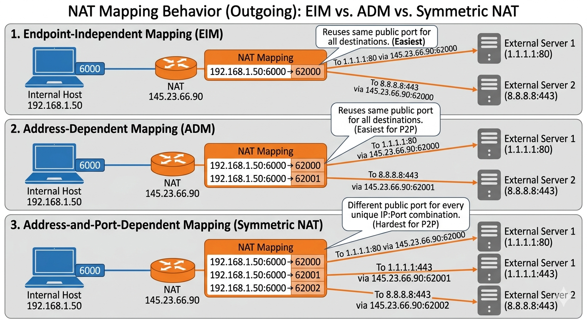
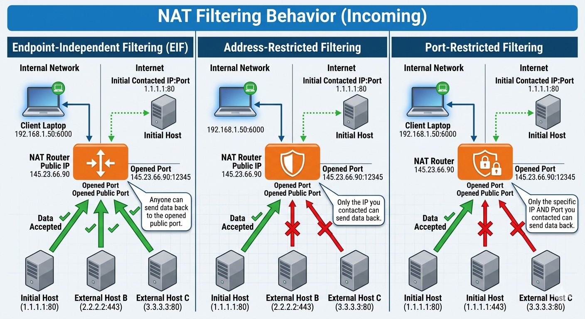

# Networking

## HTTP&#x20;

| Version      | Transport  | Key Feature                            | Primary Trade-off                                 |
| ------------ | ---------- | -------------------------------------- | ------------------------------------------------- |
| **HTTP/1.1** | TCP        | Persistent Connections                 | Head-of-Line (HOL) Blocking at Application Layer. |
| **HTTP/2**   | TCP        | Multiplexing & Binary Framing          | HOL Blocking at Transport Layer (TCP-level).      |
| **HTTP/3**   | UDP (QUIC) | No HOL Blocking & Connection Migration | Higher CPU usage; potential UDP firewall blocks.  |

* **Cookies:** Client-side storage. Small (\~4KB). Used for session IDs or user preferences.
* **Sessions:** Server-side storage. The client holds a `SessionID`, but data (cart, user info) stays on the server.
* **JWT (JSON Web Token):** Stateless authentication. The token contains all user data (claims) and is signed by the server.
* **Basic Auth:** Username/Password sent in headers (Base64). Must use HTTPS.
* **OAuth2:** Framework for delegated authorization (e.g., "Login with Google").

***

* **Connection Pooling:** Reusing a set of established TCP connections to avoid the "Three-way Handshake" latency.
* **Keep-Alive:** Header that prevents a connection from closing immediately after a request.
* **Cache-Control:**
  * `max-age`: Time (in seconds) the browser should trust the local copy.
  * `no-cache`: Must re-validate with the server before using.
  * `immutable`: The resource will never change (great for versioned assets).
* **ETag:** A unique hash of a resource. Server returns `304 Not Modified` if the hash hasn't changed.

***

* **HTTPS (TLS):** Encrypts the HTTP request/response. Essential for privacy and data integrity.
* **CORS (Cross-Origin Resource Sharing):** Security mechanism that restricts how a browser interacts with resources from a different domain.
* **Idempotency:**
  * **Idempotent:** GET, PUT, DELETE (Multiple identical requests have the same effect as one).
  * **Non-Idempotent:** POST (Multiple requests create multiple resources)

***

## Network Address Translation (NAT)

NAT was primarily created as a "stop-gap" solution for **IPv4 Exhaustion**. It allows multiple devices on a private network to share a single public IPv4 address.

Before getting into complex mapping, you should know the three basic functional types:

* **Static NAT (1-to-1):** Maps one private IP to one public IP. Used for servers inside a network that need to be accessible from the outside.
* **Dynamic NAT (M-to-M):** Maps a private IP to a public IP from a pool of available public addresses.
* **PAT (Port Address Translation / NAT Overload):** The most common form (used in homes). Thousands of private IPs share **one** public IP by using unique port numbers to distinguish sessions.

### Packet Flow & Terminology

* **Inside Local:** The real IP of the device (e.g., 192.168.1.50).
* **Inside Global:** The public IP assigned by the ISP (e.g., 145.23.66.90).
* **Outside Global:** The IP of the destination (e.g., Spotify).

**The Process:**

1. **Outgoing:** Device (Source: 192.168.1.50:5000) -> Router -> Router translates to (Source: 145.23.66.90:41200) -> Internet.
2. **NAT Table:** Router saves the mapping: `192.168.1.50:5000 <-> 145.23.66.90:41200`.
3. **Incoming:** Spotify replies to `145.23.66.90:41200`. Router looks at the table, sees it belongs to `192.168.1.50:5000`, and forwards it.

### NAT Mapping & Filtering (P2P Mechanics)

This determines how "friendly" a NAT is to Peer-to-Peer connections.

#### Mapping Behavior (Outgoing)

<figure><figcaption></figcaption></figure>

1. **Endpoint-Independent Mapping (EIM):** Reuses the same public port for all destinations. (Easiest for P2P).
2. **Address-Dependent Mapping (ADM):** Different public port for different destination IPs.
3. **Address-and-Port-Dependent (Symmetric):** Different public port for every unique IP:Port combination. (Hardest for P2P).

#### Filtering Behavior (Incoming)

<figure><figcaption></figcaption></figure>

1. **Endpoint-Independent Filtering (EIF):** Anyone can send data back to the opened public port.
2. **Address-Restricted:** Only the IP you contacted can send data back.
3. **Port-Restricted:** Only the specific IP AND Port you contacted can send data back.

### NAT Traversal (Hole Punching & Relays)

* **STUN (Session Traversal Utilities for NAT):** A "What's my IP?" service. Used for Hole Punching. Works for EIM/EIF but fails on Symmetric NAT.
* **TURN (Traversal Using Relays around NAT):** If STUN fails, traffic is relayed through a middle-man server. High latency/cost, but 100% success rate.
* **ICE (Interactive Connectivity Establishment):** The "manager" that tries STUN first, and falls back to TURN if needed.

### Advanced Concepts

* **Hairpinning (NAT Loopback):** Allows a device on the internal network to access another internal device using the **public** IP address. Without this, you can't "see" your own local server via its public URL while on the same Wi-Fi.
* **CGNAT (Carrier-Grade NAT):** Used by mobile ISPs and many home ISPs. Your "Public IP" on your router is actually _another_ private IP (usually `100.64.x.x`). This is "NAT behind a NAT" and makes port forwarding almost impossible without a VPN or Tunnel (Tailscale/Cloudflare).
* **UPnP / NAT-PMP:** Protocols that allow apps (like gaming consoles) to automatically ask the router to open a port.
