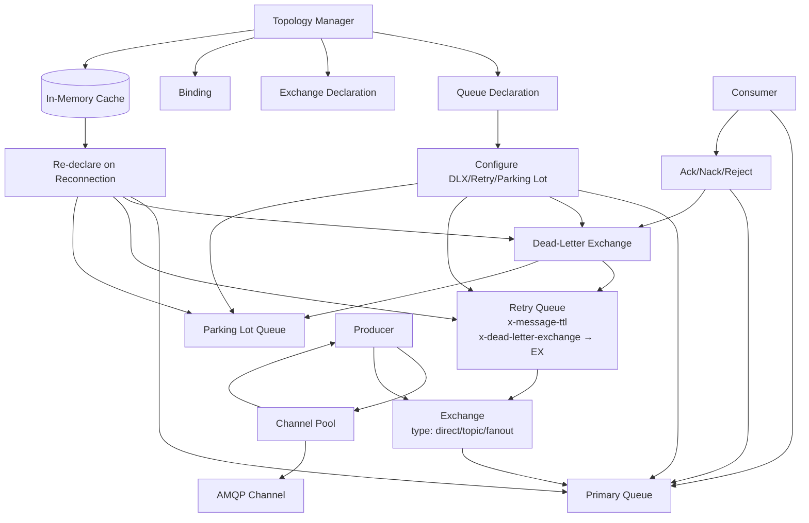

# RabbitMQ

This document describes the core building blocks of our RabbitMQ / AMQP 0-9-1 client library. The implementation offers robust message delivery with automatic recovery, publisher confirms, and efficient resource management.

***

## Topology Manager

The topology manager is responsible for declaring and caching the broker-side objects (exchanges, queues, bindings) that the application needs. It guarantees that all required topology exists before any message is published or consumed.

#### Queue Declaration (`queue.declare`)

* **Parameters**
  * `queue` – name of the queue (empty string lets the broker generate a unique name).
  * `durable` – `true` to survive broker restarts.
  * `exclusive` – `true` to restrict the queue to the declaring connection.
  * `auto-delete` – `true` to delete the queue when its last consumer cancels.
  * `arguments` – optional map (e.g., `x-message-ttl`, `x-dead-letter-exchange`).
* **Behaviour**\
  The manager always calls `queue.declare` idempotently. If the queue already exists with matching parameters the broker returns the current message count and consumer count; otherwise it creates the queue.

#### Exchange Declaration (`exchange.declare`)

* **Parameters**
  * `exchange` – exchange name.
  * `type` – `direct`, `topic`, `fanout`, `headers` or a custom type.
  * `durable` – survive broker restarts.
  * `auto-delete` – delete when all queues have unbound.
  * `internal` – `true` if the exchange cannot be published to by clients.
  * `arguments` – optional map (e.g., alternate exchange).

#### Binding (`queue.bind` / `exchange.bind`)

* Binds a queue to an exchange (or an exchange to another exchange) with a **routing key** and optional `arguments`.
* The topology manager can declare multiple bindings per queue.

#### Caching & Re-declaration after Reconnection

* The manager keeps an in-memory cache of all declared objects (queues, exchanges, bindings) together with their exact parameters.
* On **connection loss** the client reconnects and the topology manager **re-declares every cached object** in the same order (exchanges first, then queues, then bindings).
* **Idempotency** guarantees that re-declaration is safe – the broker either creates the missing object or confirms its existence.

#### Dead-Letter Exchange and Retry Queue

Many messaging patterns require automatic retries with a delay. The library implements this using a **dead-letter exchange (DLX)** and a **retry queue**.

1. The **primary queue** is declared with `x-dead-letter-exchange` set to a dedicated DLX.
2. A **retry queue** is created and bound to that DLX, usually with a routing key that matches the original queue (e.g., `"retry.#"`).
3. The retry queue has `x-message-ttl` and `x-dead-letter-exchange` pointing _back_ to the primary exchange, creating a delayed requeue cycle.
4. When a consumer **nacks** a message with `requeue=false`, the broker routes it to the DLX, which forwards it to the retry queue. After the TTL expires the message is re-published to the primary exchange.

#### Parking Lot Queue

After all retries are exhausted (e.g., a `x-death` header shows the message has been retried `N` times), the message is moved to a **parking lot** queue for manual inspection.

* The parking lot queue is **bound to the same DLX** but with a distinct routing key (e.g., `"parking_lot"`).
* When a consumer detects that `retry_count >= max_retries` it can **reject** the message without `requeue` and with a special header that causes the DLX to route it to the parking lot binding.
* Alternatively, the retry queue can be configured with an `x-dead-letter-exchange` that points to a second DLX for parking lot, but using a single DLX with routing-key differentiation simplifies topology.

***

## Consumer

The consumer module handles message delivery from a queue, with support for acknowledgement strategies and batch processing.

#### Acknowledgement Modes

* **Auto acknowledgement (`autoAck: true`)**\
  The broker considers a message delivered as soon as it sends it over the socket.
  * Fastest, no risk of forgetting to ack.
  * Messages can be lost if the consumer crashes before processing.
* **Manual acknowledgement (`autoAck: false`)**\
  The application must explicitly call `channel.ack(deliveryTag)` after successful processing.
  * `nack` (or `reject`) can be used with `requeue=true` to return the message to the queue, or `requeue=false` to dead-letter it (if DLX is configured).
  * Gives full control over at-least-once delivery semantics.

#### Batch Consume

For performance-sensitive scenarios the consumer can fetch and process messages in batches.

* **Prefetch** – set via `basic.qos(prefetchCount)` to limit the number of unacknowledged messages on the channel.
* **Batch size** – the consumer reads up to `prefetchCount` messages and then processes them together.
* **Batch acknowledgement** – after a whole batch is processed successfully, the client calls `channel.ack` with the `multiple` flag set to `true`, acknowledging all messages up to the highest delivery tag. On failure, individual `nack` can be used to selectively retry or dead-letter.

***

## Producer

Producers are responsible for publishing messages to an exchange. The library provides both single and batched publish operations.

#### Publish & Publish Batch

* **`publish(exchange, routingKey, content, properties)`**\
  Synchronous wrapper around `basic.publish`. The caller can set mandatory/immediate flags and custom headers.
* **`publishBatch(messages)`**\
  Publishes a list of messages on the same channel.
  * Uses a single AMQP channel to avoid per-message overhead.
  * When combined with publisher confirms (see below), the batch can be acknowledged after all messages have been confirmed.

#### Publisher Confirms

Publisher confirms provide an **acknowledgement from the broker** that a message has been safely handled (routed to all intended queues and persisted if the queue is durable).

* **Enabling** – `channel.confirmSelect()` puts the channel into confirm mode.
* **Process**
  1. After `basic.publish`, the broker sends an asynchronous `basic.ack` (or `basic.nack`) with the message’s delivery tag.
  2. The producer waits for the ack/nack (e.g., via a `CompletableFuture` or callback map).
  3. On `nack` the message can be republished or logged.

**Without Publisher Confirms**

* `basic.publish` returns as soon as the TCP stack accepts the data. The broker may later fail to route the message (e.g., exchange does not exist, queue is full, disk write error after memory alarm).
* **Loss scenarios include:**
  * Target exchange missing → message silently dropped unless `mandatory` flag is used.
  * Queue overflow with `x-max-length` → message dead-lettered or dropped.
  * Broker crash before fsync → durable messages may be lost.

With confirms, the producer knows exactly when the broker has accepted responsibility for the message.

***

### Channel Pool

RabbitMQ connections have a **finite number of channels** (protocol limit \~65,535, practical server limit often lower). Opening a new channel for each publish rapidly exhausts this resource. The **channel pool** avoids this by recycling a fixed set of pre-allocated AMQP channels.

#### Design

* **Pool size (`N`)** – configurable. Channels are created when the pool is initialised and placed in an idle queue.
* **Borrow / Return**
  * A producer borrows a channel, uses it for one or more publish operations, and returns it to the pool.
  * The pool tracks which channels are in use to prevent concurrent access (an AMQP channel is not thread-safe).
* **Channel lifecycle**
  * If a channel encounters an error (e.g., `channel.close` from broker), it is discarded and a new channel is created transparently.
  * After connection loss, the pool re-creates all channels on the new connection, resetting any confirm mode state.

#### Interaction with Publisher Confirms

When publisher confirms are enabled, each channel in the pool is put into confirm mode. The producer must ensure that:

* A confirmation callback (or `CompletableFuture`) is registered per publish before returning the channel.
* The channel is not returned to the pool until all outstanding confirms for that batch have been received (or a timeout occurs). This prevents interleaving of confirms from different producers.

**Simplified flow:**

1. Borrow a channel from the pool.
2. Enable confirm mode if not already (idempotent).
3. Publish one or more messages, storing a future for each delivery tag.
4. Wait for all outstanding acks/nacks.
5. Return the channel to the pool.

#### Why a Pool is Necessary

| Approach                | Risk                                                                      |
| ----------------------- | ------------------------------------------------------------------------- |
| New channel per publish | Channel count exhaustion; excessive TCP teardown/setup overhead.          |
| Single shared channel   | Not thread-safe; requires external synchronization, limiting concurrency. |
| **Pool of N channels**  | Bounded parallelism, safe concurrency, resource efficient.                |

The pool ensures that the number of open channels never exceeds the configured `maxChannels`, regardless of the number of concurrent producers.

***

### Summary

* **Topology Manager** ensures required queues, exchanges, bindings and DLX/retry/parking-lot infrastructure are always present, even after reconnection.
* **Consumers** support manual/auto ack and batched message processing with configurable prefetch.
* **Producers** offer simple publication, batch publishing, and reliable delivery via publisher confirms.
* **Channel Pool** recycles a fixed number of AMQP channels to prevent resource exhaustion and support high-throughput, concurrent publishing.

This architecture provides a resilient, high-performance foundation for AMQP-based microservices.
