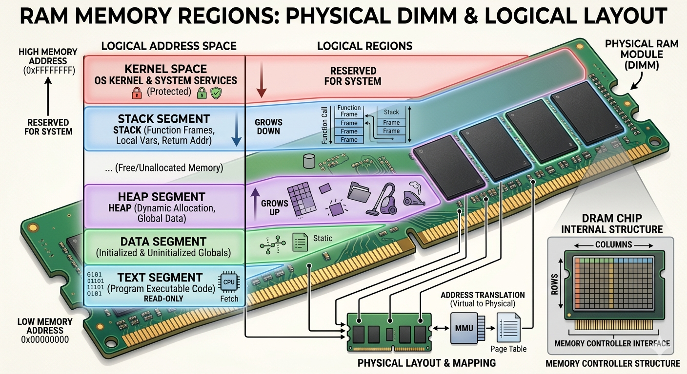

# Computing

## CPU and Memory Architecture

### Physical Hardware

<figure><figcaption></figcaption></figure>

To interact with RAM, the CPU uses a specific set of hardware components to locate and move data.

1. **Address Bus (The "Where"):** The CPU sends a specific location number to RAM. The bus width determines the maximum number of "slots" the CPU is capable of seeing.
2. **Data Bus (The "What"):** The highway that carries the actual bits. Its width determines how much data can be moved in a single "trip," regardless of how big the address was.
3. **Memory Controller (The "Gatekeeper"):** The intermediate manager. It takes the CPU's request, finds the physical electrical row in the RAM, and handles the timing of the data transfer.

### On-Chip Memory

Before reaching out to the relatively "slow" RAM, the CPU utilizes memory located directly on its own chip.

#### CPU Cache (L1, L2, L3)

High-speed buffers that store copies of frequently accessed data from RAM. The CPU checks these first to avoid the time-consuming trip across the Address Bus.

#### Registers

The fastest memory locations in existence, located inside the CPU core.

* **General Purpose:** Holds immediate data being processed (e.g., operands for addition).
* **Program Counter (PC):** Holds the address of the _next_ instruction to be executed.
* **Stack Pointer (SP):** Holds the memory address of the "top" of the stack to manage function calls.

### The Execution Cycle (Fetch-Execute)

This is the continuous loop the CPU performs to run a program.

1. **Fetch:** The CPU looks at the **Program Counter**, goes to that address in memory via the Address Bus, and grabs the instruction.
2. **Decode:** The Control Unit determines what the instruction means (e.g., a `MOV` or `ADD` command).
3. **Execute:** The ALU (Arithmetic Logic Unit) performs the operation, or data is moved between registers.
4. **Store (Write-Back):** The result is written back to a register or a specific memory address via the Data Bus.

### Virtual Memory and Addressing

The Operating System and CPU work together to provide a simplified view of memory to programs.

* **Virtual Address Space:** Every program is given its own continuous range of addresses (from 0 to Max). It doesn't know where its data is physically stored in the RAM chips; the MMU handles that translation.
* **Segmentation and Offsets:** The CPU often calculates addresses using a **Base Address** (start of a region) + an **Offset** (distance into that region).
  * _Example:_ If a data block starts at `1000` and you need the 5th item, the CPU accesses `1000 + 5`.
* **Memory Width:** A 64-bit CPU can address $$2^{64}$$bytes of memory, whereas a 32-bit CPU is limited to$$2^{32}$$ bytes (4GB).

### Memory Regions

<figure><figcaption></figcaption></figure>

The OS divides a program's virtual memory into specific "territories" to prevent data corruption.

| Feature        | The Stack                                    | The Heap                                  |
| -------------- | -------------------------------------------- | ----------------------------------------- |
| **Purpose**    | Short-term local variables & function calls. | Long-term data & large objects.           |
| **Management** | Automatic (LIFO - Last In, First Out).       | Manual (Programmer) or Garbage Collector. |
| **Growth**     | Starts at high addresses, grows **down**.    | Starts at low addresses, grows **up**.    |

> **Note on "Collision Prevention":** By having the Stack grow down and the Heap grow up from opposite ends of the memory space, the system ensures they have the maximum possible room to expand before crashing into each other.

## Bits & Bytes

A **bit** is the smallest unit of information in computer — **0 or 1**.

* 1 bit → 2 possibilities → `0`, `1`
* 2 bits → 2² = 4 possibilities → `00`, `01`, `10`, `11`
* 3 bits → 2³ = 8 possibilities
* 8 bits → 2⁸ = 256 possibilities → **1 byte**

if you have **n bits**, you can represent **2ⁿ unique values**.

| Encoding         | Bits per symbol      | Example characters  |
| ---------------- | -------------------- | ------------------- |
| **Base2**        | 1                    | 0,1                 |
| **Base16 (hex)** | 4 bits per char      | 0–9, A–F            |
| **Base32**       | 5 bits per char      | A–Z, 2–7            |
| **Base58**       | \~5.86 bits per char | Bitcoin addresses   |
| **Base62**       | \~5.95 bits per char | 0–9, A–Z, a–z       |
| **Base64**       | 6 bits per char      | A–Z, a–z, 0–9, +, / |

**Example**:

generate unique code 10.000/day using base64 with max length code 8

<pre><code><strong>// Base64
</strong><strong>64⁸ = if its represented to bits become (2^6)^8 = 2^48 
</strong>combinations = 281 474 976 710 656

// 10.000 per day
days = 281,474,976,710,656 / 10,000 = 28,147,497,671.0656 (days till it maxed out)
years = 28,147,497,671.0656 / 365 ≈ 77,127,390 years (approx.)

// 100.000.000 per day
days = 281,474,976,710,656 / 100,000,000 = 2,814,749.76710656 days
years = 2,814,749.76710656 / 365 ≈ 7,711.64 years

// 1.000.000.000 per day
days = 281,474,976,710,656 / 1,000,000,000 = 281,474.976710656 days
years = 281,474.976710656 / 365 ≈ 771.17 years

// Base62
62⁸ = 218,340,105,584,896
218,340,105,584,896 / 10,000 = 21,834,010,558.49 days
21,834,010,558.49 / 365 ≈ 59,834,276 year
</code></pre>

## ASCII

| Character       | Decimal | Binary   | Hex  |
| --------------- | ------- | -------- | ---- |
| A               | 65      | 01000001 | 0x41 |
| B               | 66      | 01000010 | 0x42 |
| a               | 97      | 01100001 | 0x61 |
| z               | 122     | 01111010 | 0x7A |
| Space           | 32      | 00100000 | 0x20 |
| Enter (newline) | 10      | 00001010 | 0x0A |

ASCII only defines **128 characters**, which works for English, but not for other languages — no ñ, é, ü, 中, or 😄.

### **Unicode**

**Unicode** assigns a unique **code point** (a number) to every character

| Character | Unicode Code Point | Hex Notation |
| --------- | ------------------ | ------------ |
| A         | U+0041             | 0x0041       |
| ñ         | U+00F1             | 0x00F1       |
| 中         | U+4E2D             | 0x4E2D       |
| 😄        | U+1F604            | 0x1F604      |

A **code point** is _not_ a byte, it’s just a number (like an ID). Unicode defines several **encoding forms** to represent those code points as bytes

### UTF-8

* Variable-length encoding: **1–4 bytes per character**
* Backward compatible with ASCII

| Character | Code Point | UTF-8 Bytes (Hex) | Binary form                         |
| --------- | ---------- | ----------------- | ----------------------------------- |
| A         | U+0041     | 41                | 01000001                            |
| ñ         | U+00F1     | C3 B1             | 11000011 10110001                   |
| 中         | U+4E2D     | E4 B8 AD          | 11100100 10111000 10101101          |
| 😄        | U+1F604    | F0 9F 98 84       | 11110000 10011111 10011000 10000100 |

Notice:

* 1-byte for ASCII
* 2-byte for Latin symbols
* 3-byte for most Asian scripts
* 4-byte for emoji and rare symbols

### UTF-16

Uses 2 or 4 bytes per character.

### UTF-32

Always uses 4 bytes per character (fixed length).

| Character | Code Point | UTF-32 (Hex) |
| --------- | ---------- | ------------ |
| A         | U+0041     | 00 00 00 41  |
| 😄        | U+1F604    | 00 01 F6 04  |
