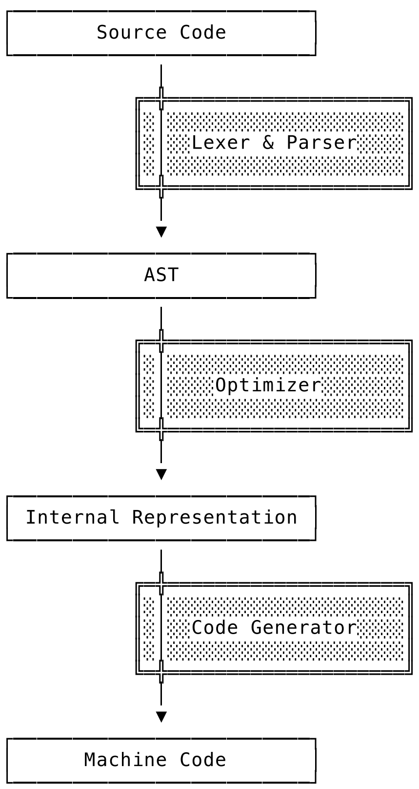

# Compiler

<figure><figcaption></figcaption></figure>

## Parsing

source code is tokenized (lexical analysis), parsed (syntax analysis), and a syntax tree is constructed for each source file.

### **Lexical Analysis (The Lexer)**

The lexer reads the source code and breaks it down into tokens. A token is the smallest meaningful unit of the language (keywords, identifiers, operators, punctuation).

Example Code:

```go
package main
```

What the Lexer sees:

1. `_package` (Keyword)
2. `main` (Identifier)
3. `;` (Implicit semicolon added by the lexer)

### Syntax Analysis (The Parser)

The parser is a Pattern Matcher. It does not look at characters; it looks at the _sequence_ of tokens provided by the lexer and asks: _"Does this sequence follow the rules of the Go Language Specification?"_

**The "Valid Order" Example**

Imagine the lexer produces these tokens: `INT(10)`, `ADD(+)`, `IDENT(x)`. The parser accepts this because `Expression = Term { "+" Term }` is a valid rule in Go's grammar.

However, if the lexer produces: `PACKAGE`, `MAIN`, `PACKAGE`, `UTILS`. The Parser triggers an error:

> `syntax error: unexpected package, expecting semicolon or newline or }` Why? Because the grammar rule for a Go file is `SourceFile = PackageClause ";" { ImportDecl ";" } ...`. It expects exactly one package declaration at the top.

### **Construction of the Syntax Tree**

The output of the parser is a Syntax Tree. Each source file is turned into a tree where:

* Nodes represent elements like expressions (`a + b`), declarations (`var x int`), or statements (`if x > 0`).
* Leafs represent the actual values or names (like the number `10` or the variable `x`).

The Syntax Tree is an exact representation of the source file. It even includes the line and column numbers (position information) so that if there is an error later, the compiler can tell you exactly where it happened.

**Example: What a Syntax Tree looks like**

```go
total := 5 + n
```

The compiler creates a node in the tree of type `*syntax.AssignStmt`.

```go
0  *syntax.AssignStmt {
1  .  Op: :=                  // The operation type
2  .  Lhs: *syntax.Name {     // Left Hand Side
3  .  .  Value: "total"       // The variable name
4  .  }
5  .  Rhs: *syntax.BinaryExpr { // Right Hand Side (An expression)
6  .  .  Op: +                 // The operator
7  .  .  X: *syntax.BasicLit { // The first part of the addition
8  .  .  .  Value: "5"
9  .  .  .  Kind: 0 (IntLit)
10 .  .  }
11 .  .  Y: *syntax.Name {     // The second part of the addition
12 .  .  .  Value: "n"
13 .  .  }
14 .  }
15 }
```

At this stage, the compiler is "blind" to meaning.

* It knows `total` is a name.
* It does not know if `total` was already declared.
* It does not know if `n` is an integer, a string, or a function.
* It only knows that the _grammar_ is correct.

## Type Checking

Location: `cmd/compile/internal/types2`

While Phase 1 checked if the "grammar" was correct, Phase 2 checks if the "meaning" is correct. According to the official Go compiler README, this phase is primarily handled by the `types2` package.

### The "Inventory" Pass (collectObjects)

Before verifying logic, the compiler scans all files in your package to build a complete list of declarations.&#x20;

* It creates placeholder objects for every `func`, `var`, `const`, and `type`.
* The "Color" System: The compiler marks objects as White (not started), Grey (processing), or Black (finished). If it encounters a Grey object while trying to resolve another, it knows you have a circular dependency (e.g., `type A B; type B A`) and throws an error.

### Constant Evaluation

If you have expressions like `const Max = 1024 * 1024`, the compiler evaluates this result (`1048576`) during this phase. This ensures that the math is done once during compilation, not every time the program runs.

```go
const (
    SecondsInHour = 60 * 60          // Evaluated to 3600
    IsVisible     = (10 > 5) && true // Evaluated to true
)
```

### Type Inference and Validation

This is the core of the "Type Safety" Go is known for. The compiler walks the tree and:

* Resolves Identifiers: Connects a name like `fmt.Println` to the actual function in the `fmt` package.
* Deduces Types: In `x := 5`, it deduces that `x` is an `int`.
* Checks Compatibility: Ensures you aren't trying to add a `string` to an `int` or passing a `float64` to a function that expects an `int`.
* Interface Verification: Confirms that if you assign a `struct` to an `interface`, the struct actually implements all required methods.

## IR Construction (Noding)

Location:&#x20;

* `cmd/compile/internal/types` (compiler types)
* `cmd/compile/internal/ir` (compiler AST)
* `cmd/compile/internal/noder` (create compiler AST)

The compiler has two things on its desk:

1. The Syntax Tree: The structure of your code (`total := 5 + n`).
2. The Type Info: A side-table from `types2` that says "`n` is an `int`" and "`total` is a new variable."

Noding is the process of smashing these two things together to create a single, unified "Node" tree that the rest of the compiler can use.

**Serialization (Writing the IR)**

The compiler takes the `syntax tree` and the `types2` information and "pickles" (serializes) them into a compact binary format called Unified IR.

* Why? Because this binary format is much easier for the computer to move around than the complex syntax tree.

**Deserialization (Reading the IR)**

The compiler immediately reads that binary data back. While reading, it constructs the `ir.Node` tree.

* The Transformation: It turns `syntax.AssignStmt` (which is just about grammar) into `ir.AssignStmt` (which is about execution).

**Lowering and Implicit Logic**

This is the most important part of Noding. The compiler adds things that weren't in your source code but are required for the program to work:

* Implicit Conversions: If you have `var x interface{} = 10`, the Noder inserts a `CONVIFACE` node. Your source code didn't show a conversion, but the Noder makes it explicit.
* Closure Wrapping: If you have a function inside a function, the Noder starts the work of figuring out how to "capture" variables.
* Dictionary Insertion: For Generics, the Noder inserts "dictionaries" that tell the code which specific types to use (e.g., turning `List[T]` into `List[int]`).

By the end of Noding, the compiler has a Middle-end IR (Intermediate Representation). Compared to your Syntax Tree example, the IR Tree looks like this

```go
// The IR Node for: total := 5 + n
AS2 (Assignment)
.  LHS: NAME-main.total (Type: int, Escapes: no)
.  RHS: ADD (Type: int)
.  .  X: LITERAL-5 (Type: int)
.  .  Y: NAME-main.n (Type: int)
```

Notice the difference:

* Syntax Tree: Only knew the name was `"total"`.
* IR Tree: Knows `total` belongs to `package main`, it's an `int`, and it already knows (after a quick check) if the variable "escapes" to the heap or stays on the stack.

## Middle End

Several optimization passes are performed on the IR representation: dead code elimination, (early) devirtualization, function call inlining, and escape analysis. For example

**Inlining (`cmd/compile/internal/inline`)**

This is often the most impactful optimization.

* The Goal: Eliminate the overhead of calling a function.
* The Process: If you have a small function like `func IsPositive(x int) bool { return x > 0 }`, the compiler replaces the _call_ to that function with the actual _logic_ inside the function.
* The Benefit: It saves the time it takes to push arguments onto the stack and jump to a new memory address.

**Devirtualization (`cmd/compile/internal/devirtualize`)**

* The Goal: Turn "interface" calls into "direct" calls.
* The Process: If the compiler can prove that an interface variable always contains a specific concrete type (e.g., you are calling `Write` on an interface, but the compiler sees it's _always_ a `os.File`), it rewrites the IR to call the `os.File.Write` method directly.
* The Benefit: It bypasses the "itabs" (interface tables) lookups, which is much faster.

**Escape Analysis (`cmd/compile/internal/escape`)**

* The Goal: Decide where memory should live.
* The Process: The compiler looks at the IR nodes to see if a variable's address is passed outside the function.
  * Stack: If the variable stays inside the function, it's kept on the stack (very fast, cleaned up automatically).
  * Heap: If the variable "escapes" (e.g., returned as a pointer), it is moved to the heap (slower, requires Garbage Collection).
* The Benefit: This is why Go developers don't have to manually choose between stack and heap; the Middle End calculates it for you.

and many more...

## Walk

* `cmd/compile/internal/walk` (order of evaluation, desugaring)

The final pass over the IR representation is “walk,” which serves two purposes:

**Order of Evaluation (The "Order" part)**

It decomposes complex statements into individual, simpler statements, introducing temporary variables and respecting order of evaluation. This step is also referred to as “order.” In Go, you can write complex single lines of code. The CPU, however, can only do one tiny thing at a time.

* The Problem: `f(g(), h())`. Which runs first? `g` or `h`?
* The Walk Solution: It breaks that one line into three:
  1. `temp1 := g()`
  2. `temp2 := h()`
  3. `f(temp1, temp2)`
* Result: It ensures the program follows the Go spec's rules for exactly what happens in what order.

**Desugaring (The "Runtime" part)**

"Syntactic Sugar" refers to features that make life easy for humans but don't exist in hardware. CPUs don't know what a `map`, a `channel`, or a `select` statement is.

* The Process: Walk "desugars" these into calls to the Go Runtime (the `runtime` package).
* Examples:
  * `make(map[string]int)` becomes a call to `runtime.makemap`.
  * `ch <- x` becomes a call to `runtime.chansend1`.
  * `append(slice, x)` becomes logic that checks capacity and potentially calls `runtime.growslice`.

It is called "Walk" because the compiler walks the IR tree one last time. As it visits each node, it replaces high-level nodes with a sequence of lower-level nodes.

## Generic SSA

In this phase, IR is converted into Static Single Assignment (SSA) form, a lower-level intermediate representation with specific properties that make it easier to implement optimizations and to eventually generate machine code from it.

* `cmd/compile/internal/ssa` (SSA passes and rules)
* `cmd/compile/internal/ssagen` (converting IR to SSA)

### What is SSA?

In regular Go code, you can change a variable's value many times:

```go
x := 1
x = x + 2
x = 5
```

In SSA, a variable is never changed. Every time a value is assigned, a new "version" of that variable is created. The code above becomes

```go
x_1 = 1
x_2 = x_1 + 2
x_3 = 5
```

Why do this? It makes it incredibly easy for the compiler to see that `x_2` is never actually used, so the math `1 + 2` can be deleted entirely. For example

**The Conversion (`ssagen`)**

The compiler "walks" your simplified IR and builds a Control Flow Graph (CFG). Instead of a list of lines, your code becomes a series of "blocks" connected by arrows (jumps).

**Intrinsics (The "Fast Track")**

If you use a function like `math.Sqrt(x)`, the compiler doesn't actually call a Go function. It swaps that node for a single, high-speed CPU instruction (like `SQRTSD` on Intel).

**Generic Rewrite Rules (Architecture Independent)**

Before the compiler worries about whether you are on an iPhone (ARM) or a PC (Intel), it applies "Generic" rules that work everywhere.

* Lowering `copy`: It turns the `copy()` function into raw memory-move instructions.
* Algebraic Simplification: If the code says `x * 1`, the SSA pass simply deletes the `* 1`. If it sees `x << 0`, it deletes the shift.
* Nil Check Elimination: If the compiler can prove you already checked if a pointer is nil (or if it was just created), it removes all subsequent nil checks for that pointer.

## Generating Machine Code

The machine-dependent phase of the compiler begins with the “lower” pass, which rewrites generic values into their machine-specific variants. For example, on amd64 memory operands are possible, so many load-store operations may be combined.

* `cmd/compile/internal/ssa` (SSA lowering and arch-specific passes)
* `cmd/internal/obj` (machine code generation)

### "Lowering" Pass

In the previous phase, we had "Generic SSA" (like `Add64`). In this phase, the Lower pass looks at your target `GOARCH` (like `amd64` or `arm64`) and rewrites the code.

* Example (amd64): On an Intel/AMD chip, you can add a value directly from memory to a register in one instruction.
  * _Generic:_ `Load` then `Add`.
  * _Lowered:_ `ADDQ (SP), AX` (One instruction).
* Example (arm64): ARM chips usually require you to load memory into a register _before_ doing math. The lower pass ensures the code respects these "rules of the house."

#### Machine-Specific Optimizations

Once the code is "lowered," the compiler runs more optimizations that are only possible now that it knows the CPU type:

* Value Moving: It moves values closer to where they are used so the CPU can keep them in its high-speed "L1 cache" or registers longer.
* Dead Code Elimination (Again): Now that the compiler has expanded high-level Go into many small machine instructions, some of those machine instructions might turn out to be useless. It cleans them up one last time.

#### The "Housekeeping" (Stack & GC)

This part is unique to Go’s high-performance runtime:

* Stack Frame Layout: The compiler decides exactly where `variable x` sits on the stack relative to the "Stack Pointer."
* Pointer Liveness (The GC Secret): This is critical. The compiler creates a "map" for the Garbage Collector (GC). It says: _"If the GC runs at this exact instruction, the values in registers RAX and RBX are pointers and must not be deleted!"_ Without this, Go's memory safety would break.

#### From SSA to `obj.Prog`

At the very end of the SSA phase, the compiler converts the "Graph" of blocks into a linear list of `obj.Prog` structures.

* An `obj.Prog` is a "Portable Assembly" instruction. It’s not quite 0s and 1s yet, but it looks like `MOVQ`, `ADDQ`, or `PUSHQ`.

#### `cmd/internal/obj` (The Assembler)

The compiler hands that list of instructions to the Assembler.

* The Assembler translates `ADDQ` into the actual hexadecimal machine code (e.g., `0x48 0x01...`).
* It writes the Object File (`.a` or `.o`).
* The Bonus Data: It attaches the "Reflect data" (so `reflect.TypeOf` works) and "Dwarf info" (so debuggers like Delve can show you your source code while you debug).

## Export

Go compiler "saves its work" so that other packages don't have to re-calculate everything from scratch. In a large project, you don't want the compiler to re-read the source code of `fmt` every time you import it. Instead, the compiler reads a pre-compiled Export Data file.

#### The "Package Memo" (What is saved)

When Package P is compiled, it creates Export Data for any Package Q that imports it. This file is a complete summary containing:

* Definitions: All exported types, variables, and constants.
* Logic (IR): The internal code for functions that might be inlined or generic functions that need to be created with new types later.
* Analysis Results: The results of Escape Analysis, so the importer knows how the package handles memory.

#### The "Unified" Format

Go uses a "Unified" binary format to store this data.

* Object Graph: It serializes the complex web of types and relationships into a bitstream.
* Indexing & Lazy Loading: The file has an index. The compiler doesn't read the whole file; it only "lazy decodes" the specific parts (symbols) that the importing package actually uses.

#### "Deep" vs. "Shallow" Summaries

This refers to how much information about _indirect_ dependencies is included.

* Deep Summary (Compiler default): Package B's export data includes everything from its dependency, Package C.
  * Benefit: The compiler only needs to open files for direct imports.
  * Trade-off: File sizes grow larger as you move up the import chain (redundant data).
* Shallow Summary (Used by `gopls`): Only contains info for that specific package.
  * Benefit: Much smaller files and faster for IDE tools.
  * Trade-off: The tool must have access to the export files of _every_ dependency in the entire tree.

## Tools

```go
// Print optimization info, including inlining and escape analysis
go build -gcflags=-m=2

// Print bounds check (BCE) info to see if the compiler is adding safety checks 
go build -gcflags=-d=ssa/check_bce/debug

// Print the internal parse tree after type checking is finished 
go build -gcflags=-W

// Generate an interactive ssa.html file for a specific function named Foo 
GOSSAFUNC=Foo go build

// Print the final machine assembly code for the package 
go build -gcflags=-S

// Print the timing of each compiler phase to a text file for benchmarking 
go tool compile -bench=out.txt x.go

// Force the compiler to panic and show a stack trace on the first error found 
go tool compile -h file.go

// Enable additional, stricter checks for unsafe pointer usage 
go build -gcflags=-d=checkptr=2

// List all available general compiler flags 
go tool compile -h

// List all available debug flags for the -d flag 
go tool compile -d help

// List all flags related specifically to the SSA optimization passes 
go tool compile -d ssa/help

// Run all tests located in the compiler's top-level test directory 
go test cmd/internal/testdir

// Save a copy of the current, working toolchain to prevent bootstrap failure 
toolstash save

// Restore the saved known-good compiler and install the current working version 
toolstash restore && go install cmd/compile

// Build and compare the current compiler's output against the saved version 
go build -toolexec "toolstash -cmp" -a -v std

// Compare benchmark results to see if your changes improved performance 
benchstat old.txt new.txt
```
