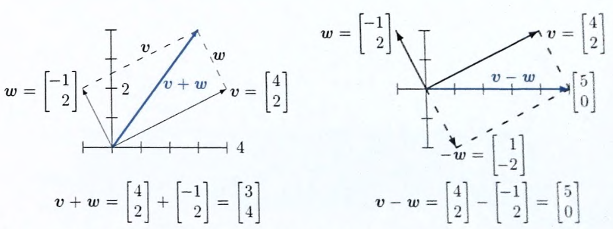
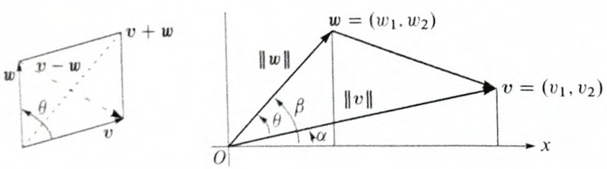

# Algebra Linear

1D Vector: A single value (a scalar).

2D Vector: A coordinate pair $$[x, y]$$ used to position a pixel on a screen.

n-Dimensional Vector: A list of 1,000 numbers representing a user's preferences in a Netflix recommendation algorithm.

***

### Linear Combination

<figure><figcaption></figcaption></figure>

Scalar Multiplication

$$\vec{v} = \begin{bmatrix} 2 \\ 3 \end{bmatrix}$$ and a scalar $$c = 2$$.

The scalar multiplication $$c\vec{v}$$ would be:

$$2 \times \begin{bmatrix} 2 \\ 3 \end{bmatrix} = \begin{bmatrix} 2 \times 2 \\ 2 \times 3 \end{bmatrix} = \begin{bmatrix} 4 \\ 6 \end{bmatrix}$$

***

Vector Addition

$$\vec{a} = \begin{bmatrix} 4 \\ 6 \end{bmatrix}$$ and $$\vec{b} = \begin{bmatrix} 1 \\ -2 \end{bmatrix}$$

The vector addition $$\vec{a} + \vec{b}$$ would be:

$$\begin{bmatrix} 4 \\ 6 \end{bmatrix} + \begin{bmatrix} 1 \\ -2 \end{bmatrix} = \begin{bmatrix} 4 + 1 \\ 6 + (-2) \end{bmatrix} = \begin{bmatrix} 5 \\ 4 \end{bmatrix}$$

### Dot Product

dot product is a single number that reveals the relationship between two vectors.&#x20;

$$\vec{A} = [3, 4]$$ and $$\vec{B} = [1, 2]$$

$$(3 \times 1) + (4 \times 2) = 3 + 8 = \mathbf{11}$$

The number 11. It is no longer a point on a graph; it is a "score."

This tells you how intense or strong the data is. example: In music: It’s the Volume. A loud song has a long vector; a quiet song has a short vector.

***

**Schwarz Inequality**

&#x20;$$|v \cdot w| \leq \|v\| \|w\|$$

***

the length is $$\|\vec{v}\| = \sqrt{x^2 + y^2}$$

Length of $$\vec{A}$$ is 5 (because $$\sqrt{3^2 + 4^2} = 5$$). The Length of $$\vec{B}$$ is 2.23.

$$\|v\| \|w\| = 5 \times 2.23 = \mathbf{11.15}$$. (Maximum possible dot product you could get if two specific vectors were perfectly aligned)

***

**Cosine Rule (The Angle)**

$$\text{Similarity} = \frac{\text{Actual Score (Dot Product)}}{\text{Potential Score (Product of Lengths)}}$$

$$\frac{11.0}{11.15} \approx \mathbf{0.986}$$

If a "Loud" song and a "Quiet" song are both Heavy Metal, they will point in the same direction (small angle).

* $$\cos(\theta) = 0.986$$.
* $$\cos^{-1}(0.986)$$ $$\approx 9.6^\circ$$

<table><thead><tr><th width="206.199951171875">If Similarity (Cosine) is...</th><th width="187.60003662109375">The Angle (θ) is...</th><th>What it means</th></tr></thead><tbody><tr><td>1.00</td><td>0°</td><td>Perfectly identical direction.</td></tr><tr><td>0.707</td><td>45°</td><td>Halfway between same and different.</td></tr><tr><td>0.00</td><td>90°</td><td>Completely different (Perpendicular).</td></tr></tbody></table>

***

**Unit Vector**

we often want to keep the direction of a vector but change its length to 1. This is called a Unit Vector ($$\mathbf{u}$$).

$$\mathbf{u} = \frac{\mathbf{v}}{\|\mathbf{v}\|}$$

$$\vec{A} = [3, 4]$$ and its length is $$5$$.

$$\mathbf{u} = [3/5, 4/5] = [0.6, 0.8]$$.

This "normalizes" data so you can compare different vectors fairly, regardless of how big the numbers started.

***

**Triangle Inequality**

<figure><figcaption></figcaption></figure>

It states that the shortest distance between two points is a straight line.

$$\|v + w\| \leq \|v\| + \|w\|$$

Example

* Home: $$(0,0)$$
* Grocery Store: Point $$(4, 0)$$
* Coffee Shop: Point $$(4, 3)$$

First, you walk from Home to the Store, then from the Store to the Coffee Shop.

1. Vector $$\vec{v}$$ (Home to Store): You move 4 units East.
   * $$\vec{v} = [4, 0]$$
   * Length $$\|v\| = 4$$
2. Vector $$\vec{w}$$ (Store to Coffee): You move 3 units North.
   * $$\vec{w} = [0, 3]$$
   * Length $$\|w\| = 3$$

Total Distance of Path B: $$4 + 3 = \mathbf{7}$$

If you had walked straight from Home to the Coffee Shop, you are looking for the length of the vector $$\vec{v} + \vec{w}$$.

* Combined Vector: $$[4+0, 0+3] = [4, 3]$$
* Length $$\|v+w\|$$: Using Pythagoras: $$\sqrt{4^2 + 3^2} = \sqrt{16 + 9} = \sqrt{25} = \mathbf{5}$$

Now we plug these numbers into the inequality:

$$\|v + w\| \leq \|v\| + \|w\|$$

$$\mathbf{5} \leq \mathbf{4 + 3}$$

$$\mathbf{5} \leq \mathbf{7}$$

The inequality is True. The straight line ($$5$$) is shorter than the two-step path ($$7$$).

If you then walk from the Coffee Shop back to Home, you walk another $$5$$ units.

* Total Trip with the Store stop: $$4 + 3 + 5 = \mathbf{12}$$ units.
* Total Trip without the Store stop: $$5 + 5 = \mathbf{10}$$ units.

### Matrix
