# Precalculus

## **Fundamental**

### **Number**

**Real number**

<figure><figcaption></figcaption></figure>

there is no real number that, when multiplied by itself, results in a negative number. The expression $$\sqrt{-9}$$ asks the question: What real number, when multiplied by itself (squared), equals $$-9$$?

Let's test all possibilities for a Real Number $$x$$:

1.  If $$x$$ is Positive (e.g., 3)

    $$x \times x = 3 \times 3 = 9$$ (Result is Positive)
2.  If $$x$$ is Negative (e.g., $$-3$$)

    $$x \times x = (-3) \times (-3) = 9$$ (Result is Positive)
3.  If $$x$$ is Zero (i.e., $$0$$)

    $$x \times x = 0 \times 0 = 0$$ (Result is Zero)

Since there is no way to multiply a real number by itself and get a negative result like $$-9$$, the answer to $$\sqrt{-9}$$ cannot be found on the Real Number Line.

***

**Natural number** positive number

**Irrational number** Any real number that cannot be written as a ratio of two integers ($$p/q$$) like $$\mathbf{\sqrt{2}}$$, $$\mathbf{\pi}$$, $$\mathbf{e}$$ (Euler's number)

**Variables** (like $$x$$ or $$y$$)

**Coefficients** (the number multiplying the variable, like the 3 in $$3x^2$$)

**Terms** (parts separated by addition/subtraction, like $$3x^2$$, $$-5x$$, and $$7$$)

**Constant** Term (the term with no variable, like 7)

**Modulus** $$a = (n \times q) + r$$

* $$1 = (10 \times 0) + r$$, r =1
* $$99 = (100 \times 0) + r$$, r=99

***

#### **Distributive Property**

* $$a(b + c) = ab + ac$$
* $$a(b - c) = ab - ac$$
* $$(a + b)(x + y) = \underbrace{a(x + y)}_{\text{Distribute } a} + \underbrace{b(x + y)}_{\text{Distribute } b}$$

Imagine you are buying items for a school trip:

* First Group ($$\mathbf{a+b}$$): The number of people going.
  * $$a = 10$$ students.
  * $$b = 2$$ teachers.
  * $$\mathbf{a+b = 12}$$ people.
* Second Group ($$\mathbf{x+y}$$): The cost per person.
  * $$x = \$5$$ for lunch.
  * $$y = \$3$$ for a drink/snack.
  * $$\mathbf{x+y = \$8}$$ total cost per person.

The total cost is the product of the two: $$(10 + 2)(5 + 3)$$

|                   | Lunch ($5)                      | Snack ($3)                      |
| ----------------- | ------------------------------- | ------------------------------- |
| Students ($$10$$) | $$10 \times 5 = \mathbf{\$50}$$ | $$10 \times 3 = \mathbf{\$30}$$ |
| Teachers ($$2$$)  | $$2 \times 5 = \mathbf{\$10}$$  | $$2 \times 3 = \mathbf{\$6}$$   |

Total Cost = $$\$50 + \$30 + \$10 + \$6 = \mathbf{\$96}$$

***

#### **Associative Property**

* $$(a + b) + c = a + (b + c)$$
* $$(ab) c = a (bc)$$

***

#### Fractions

<figure><figcaption></figcaption></figure>

***

#### **Greatest Common Factor (GCF)**

* GCF of $$10x^4 - 15x^3 + 5x^2$$.
* Coefficients (10, 15, 5): The largest number that divides all three is $$\mathbf{5}$$.
* Variable ($$x^4, x^3, x^2$$): The lowest power is $$\mathbf{x^2}$$.
* GCF: $$5x^2$$

***

### **Discriminant**

$$\mathbf{D = b^2 - 4ac}$$

$$3x^2 + 5x + 1 = 0$$

* $$a$$: The number in front of $$x^2$$ (In this case, 3).
* $$b$$: The number in front of $$x$$ (In this case, 5).
* $$c$$: The "constant" number at the end (In this case, 1).

$$25 - 12 = \mathbf{13}$$

### **Intervals**

<figure><figcaption></figcaption></figure>

### **Absolute Value**

<figure><figcaption></figcaption></figure>

### **Integer Exponents**

<figure><figcaption></figcaption></figure>

A product of identical numbers is usually written in exponential notation

* $$2^5 = 2 \times 2 \times 2 \times 2 \times 2 = 32$$
* $$\left(\frac{1}{2}\right)^5 = \frac{1^5}{2^5}$$
* $$\left(\frac{2}{5}\right)^6 = \frac{2^6}{5^6}$$
* $$x^a \cdot x^b = x^{a+b}$$
* $$\frac{x^a}{x^b} = x^{a-b}$$
* $$\left(\frac{a}{b}\right)^n = \frac{a^n}{b^n}$$
* $$(x^a)^b = x^{ab}$$

***

### **Radicals**

The number inside the root _must_ be a result of something being raised to the power of $$n$$

<figure><figcaption></figcaption></figure>

The expression to simplify is $$\sqrt[4]{81x^8y^4}$$.

$$\sqrt[4]{81x^8y^4} = \sqrt[4]{81}\sqrt[4]{x^8}\sqrt[4]{y^4}$$ This step uses Property 1 ($$\sqrt[n]{ab} = \sqrt[n]{a} \cdot \sqrt[n]{b}$$) to separate the single radical into a product of three individual radicals.

= 3\sqrt[4]{(x^2)^4}|y|

This step simplifies each of the three terms separately:

1. Simplifying $$\sqrt[4]{81}$$ Since $$3^4 = 3 \times 3 \times 3 \times 3 = 81$$, the fourth root of 81 is 3.
2. Simplifying $$\sqrt[4]{x^8}$$:
   * This is rewritten by expressing $$x^8$$ as a power of 4: $$x^8 = (x^2)^4$$.
   * The term becomes $$\sqrt[4]{(x^2)^4}$$.
3. Simplifying $$\sqrt[4]{y^4}$$
   * This uses Property 5 ($$\sqrt[n]{a^n} = |a|$$, if $$n$$ is even). Since $$n=4$$ (even), the fourth root of $$y^4$$ must be the absolute value of $$y$$, or $$|y|$$.

= 3x^2|y|

Simplifying $$\sqrt[4]{(x^2)^4}$$

* This uses Property 5 again. The $$n$$th root cancels the $$n$$th power, and since $$n=4$$ is even, we use the absolute value: $$\sqrt[4]{(x^2)^4} = |x^2|$$.
* However, because any real number squared ($$x^2$$) is always non-negative, the absolute value signs are not necessary. So, $$|x^2|$$ simplifies to just $$x^2$$.

The final simplified expression is $$3x^2|y|$$.

The key takeaway is that the absolute value signs are essential when simplifying an even root of a variable raised to the same power (like $$\sqrt[4]{y^4}$$), unless you are certain the result is non-negative (like in the case of $$x^2$$).

***

### Product Formulas

<figure><figcaption></figcaption></figure>

$$(3x + 4)(3x - 4) = (3x)^2 - (4)^2$$

$$(3x + 4)(3x - 4) = 9x^2 - 16$$

$$(2y + 5)^2 = (2y)^2 + 2(2y)(5) + (5)^2$$

$$(2y + 5)^2 = 4y^2 + 20y + 25$$

$$(z - 6)^2 = (z)^2 - 2(z)(6) + (6)^2$$

$$(z - 6)^2 = z^2 - 12z + 36$$

$$(x + 2)^3 = (x)^3 + 3(x)^2(2) + 3(x)(2)^2 + (2)^3$$

$$(x + 2)^3 = x^3 + 6x^2 + 12x + 8$$

$$(2m - 1)^3 = (2m)^3 - 3(2m)^2(1) + 3(2m)(1)^2 - (1)^3$$

$$(2m - 1)^3 = 8m^3 - 3(4m^2)(1) + 3(2m)(1) - 1$$

$$(2m - 1)^3 = 8m^3 - 12m^2 + 6m - 1$$

***

### Rational

A rational expression is simply a fraction (a ratio) where both the numerator (top) and the denominator (bottom) are polynomials. It is also sometimes referred to as an algebraic fraction.

$$\frac{x^2 + 5x + 6}{x^2 - 4} = \frac{(x + 2)(x + 3)}{(x - 2)(x + 2)}$$\
\
$$\frac{\cancel{(x + 2)}(x + 3)}{(x - 2)\cancel{(x + 2)}} = \frac{x + 3}{x - 2}$$

A rational expression can be written in the form $$\frac{P(x)}{Q(x)}$$, where $$P(x)$$ and $$Q(x)$$ are polynomials.

denominator, $$Q(x)$$, cannot be equal to zero. Division by zero is undefined

#### Rational Exponent

$$a^{\frac{m}{n}} = \sqrt[n]{a^m} = (\sqrt[n]{a})^m$$

$$8^{\frac{2}{3}} =$$$$(\sqrt[3]{8})^2$$ = $$2^2$$ = $$4$$

### Equations

<figure>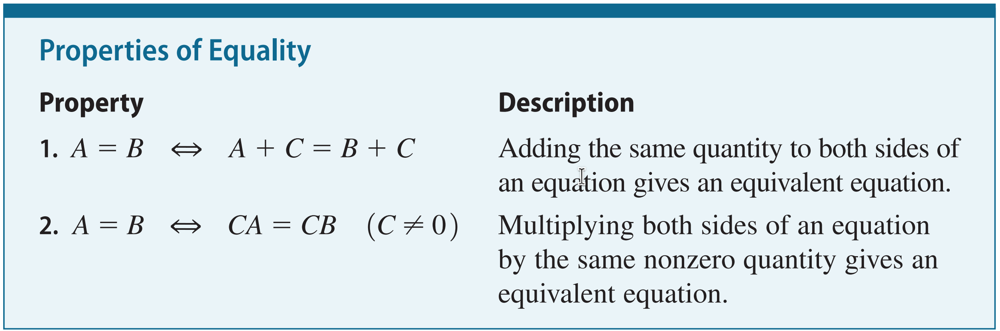<figcaption></figcaption></figure>

its always a straight line, so the of degree power (exponent) is 1

* $$y = mx + b$$
* $$ax + by = c$$

the exponent is greater than 1

* $$y = 3x^2 - 4x + 1$$
* $$x^3 + y = 7$$

Quadratic equations are essential for modeling paths, areas, and optimization problems. They are defined by the standard form $$ax^2 + bx + c = 0$$, where $$x$$ is the unknown, and $$a$$, $$b$$, and $$c$$ are known coefficients.

#### Quadratic Formula

Must degree of 2

$$x = \frac{-b \pm \sqrt{b^2 - 4ac}}{2a}$$

With the formula, you just plug in $$a=3$$, $$b=5$$, and $$c=-4$$ directly, avoiding all the complicated steps:

$$x = \frac{-5 \pm \sqrt{5^2 - 4(3)(-4)}}{2(3)}$$

We use quadratic functions whenever a relationship involves squaring a value, ex: Projectile Motion (Physics), Optimization (Business & Engineering)

### Complex Number

Real number + imaginary number

$$a + bi$$

The Real Part ($$a$$): These are normal numbers like $$5$$, $$-3$$

The Imaginary Part ($$bi$$): This is a real number multiplied by $$i$$

<figure><figcaption></figcaption></figure>

Imagine you are controlling a drone.

* The Real part ($$a$$) is how far East the drone is.
* The Imaginary part ($$bi$$) is how far North the drone is.

You want to fly your drone to a specific landmark. You know that:

1. The drone is currently at $$3 + 4i$$ (3 miles East, 4 miles North).
2. The landmark is located at $$5 - 2i$$ (5 miles East, 2 miles South).

If you want the drone to fly in a straight line from its current spot to the landmark, what is the "path" (the difference) it needs to take?

To find the path, we subtract the current position from the destination:

$$(5 - 2i) - (3 + 4i)$$

* East/West change: $$5 - 3 = 2$$ (Go 2 miles further East)
* North/South change: $$-2i - 4i = -6i$$ (Go 6 miles South)

The Path: The drone needs to move $$2 - 6i$$

If you want to tell that drone to "turn 90 degrees," you don't need a complicated formula; you just multiply its position by $$i$$.

* Current position: $$3 + 4i$$
* Rotate 90°: $$(3 + 4i) \times i = 3i + 4i^2$$
* Since $$i^2 = -1$$, this becomes $$-4 + 3i$$.

<figure>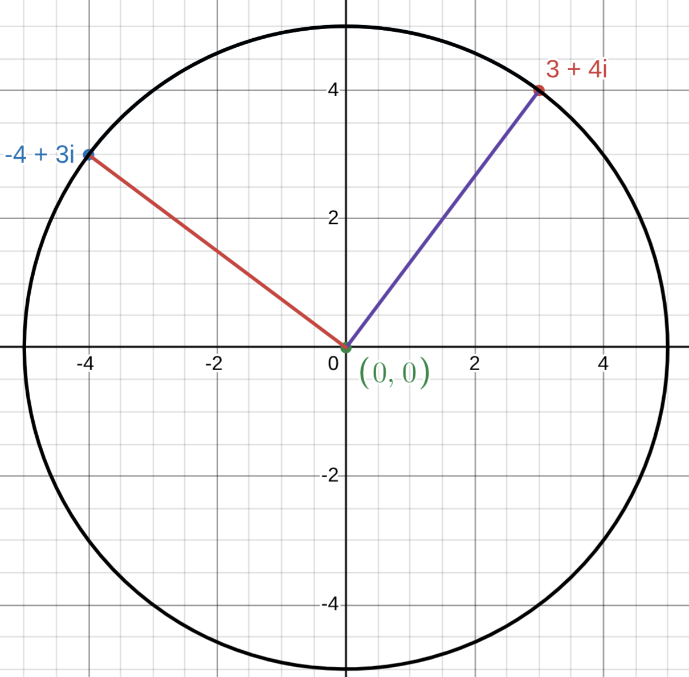<figcaption></figcaption></figure>

<table><thead><tr><th width="162.20001220703125">Power</th><th width="175.79998779296875">Simplified</th><th>Rule</th></tr></thead><tbody><tr><td>i^1</td><td>i</td><td>Remainder of 1</td></tr><tr><td>i^2</td><td>-1</td><td>Remainder of 2</td></tr><tr><td>i^3</td><td>-i</td><td>Remainder of 3</td></tr><tr><td>i^4</td><td>1</td><td>Remainder of 0 (no remainder)</td></tr></tbody></table>

**The 180-Degree "Flip"**

Think of the number line. If you are at 1 and you multiply by $$-1$$, you "flip" over to $$-1$$.

* Geometrically, this is a 180-degree rotation around the center (zero).
* If you multiply by $$-1$$ again, you flip back to 1. Another 180 degrees.
* Total rotation for two steps: $$180^\circ + 180^\circ = 360^\circ$$ (a full circle).

Now, look at the math definition: $$i \times i = -1$$ This means that doing the "multiply by $$i$$" action twice is the exact same thing as "multiplying by $$-1$$" once.

If "multiplying by $$-1$$" is a 180-degree turn, then "multiplying by $$i$$" must be half of that turn to make the math work. Half of 180 degrees is 90 degrees.

### Factoring

**Greatest Common Factor (GCF)**

This is always the first step. You look for the largest number or variable that divides evenly into every single term.

&#x20;$$3x^2 + 6x = 3x(x + 2)$$

***

**Factoring by Grouping**

Used mostly when you have four terms. You split the expression into two pairs, factor out the GCF of each pair, and then look for a common binomial.

&#x20;$$x^3 + 2x^2 + 5x + 10 \rightarrow x^2(x+2) + 5(x+2) = (x^2+5)(x+2)$$

***

**Difference of Squares**

Used for two terms that are both perfect squares being subtracted.

* &#x20;$$a^2 - b^2 = (a - b)(a + b)$$
* The _sum_ of squares ($$a^2 + b^2$$) cannot be factored using real numbers.

***

**Factoring Trinomials**

&#x20;($$x^2 + bx + c$$)

Used for three terms where the $$x^2$$ coefficient is 1. You look for two numbers that multiply to $$c$$ and add to $$b$$.

$$x^2 + 5x + 6 = (x + 2)(x + 3)$$ (Because $$2 \times 3 = 6$$ and $$2 + 3 = 5$$)

***

**Factor by Grouping**

Group the first two terms and the last two terms. Find the GCF for each pair.

$$(2x^2 + 1x) + (6x + 3)$$

* The GCF of $$(2x^2 + 1x)$$ is $$x$$. Result: $$x(2x + 1)$$
* The GCF of $$(6x + 3)$$ is $$3$$. Result: $$3(2x + 1)$$

Notice that $$(2x + 1)$$ is now common to both parts. "Pull it out" as one factor.

$$(2x + 1)(x + 3)$$

***

**Sum or Difference of Cubes**

Used for two terms that are perfect cubes.

* Sum: $$a^3 + b^3 = (a + b)(a^2 - ab + b^2)$$
* Difference: $$a^3 - b^3 = (a - b)(a^2 + ab + b^2)$$

### Guidelines for Modeling with Equations

1. Identify the Variable. **Identify the quantity** that the problem asks you to find. This quantity can usually be determined by a careful reading of the question that is posed at the end of the problem. Then introduce notation for the variable (call it x or some other letter).
2. Translate from **Words to Algebra**. Read each sentence in the problem again, and express all the quantities mentioned in the problem in terms of the variable you defined in Step 1. To organize this information, it is sometimes helpful to draw a diagram or make a table.
3. Set Up the Model. Find the crucial fact in the problem that gives a relationship between the expressions you listed in Step 2. Set up an equation (or model) that expresses this relationship.
4. Solve the Equation and Check Your Answer. Solve the equation, check your answer, and state your answer as a sentence.

A car rental company charges $30 a day and 15¢ a mile for renting a car. A tourist rents\
a car for two days, and the bill comes to $108. How many miles was the car driven?

* Let $$x$$ = the number of miles driven.
* Daily cost: The company charges $$\$30$$ per day. Since the car was rented for 2 days, the cost is $$2 \times 30 = 60$$.
* Mileage cost: The company charges $$15¢$$ (or $$\$0.15$$) per mile. For $$x$$ miles, the cost is $$0.15x$$.
* Total Bill: The problem states the final bill comes to $$\$108$$.
* $$\text{Daily Cost} + \text{Mileage Cost} = \text{Total Bill}$$
* $$60 + 0.15x = 108$$

### Inequalities

<figure>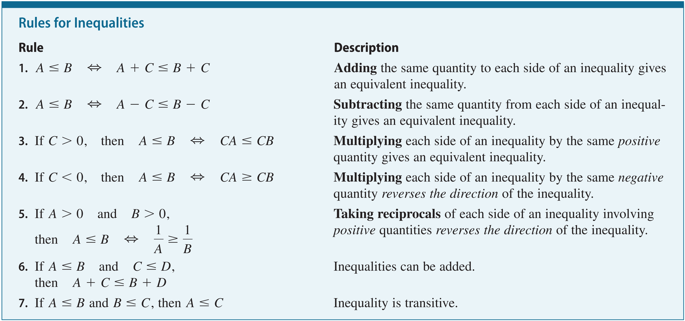<figcaption></figcaption></figure>

A linear inequality is one where the variable has a power of 1. When you graph these, they always form a straight line that divides the plane into two regions.

* $$ax + b < c$$ or $$y > mx + b$$
* $$2x + 3 \leq 7$$

> Subtract 3: $$2x \leq 4$$
>
> Divide by 2: $$x \leq 2$$

A nonlinear inequality contains a variable with a power other than 1 (like $$x^2$$, $$x^3$$), or variables multiplied together, or variables in a denominator.

* Quadratic ($$x^2$$), Rational ($$\frac{1}{x}$$), or Absolute Value ($$|x|$$).
* $$x^2 - 4 > 0$$

> Find the "critical points" where $$x^2 - 4 = 0$$. This happens at $$x = 2$$ and $$x = -2$$.
>
> Test the intervals:
>
> * If $$x = 0$$ (between -2 and 2): $$0^2 - 4 > 0$$ is False.
> * If $$x = 3$$ (greater than 2): $$3^2 - 4 > 0$$ is True.
> *   If $$x = -3$$ (less than -2): $$(-3)^2 - 4 > 0$$ is True.
>
>     The solution is $$x < -2$$ or $$x > 2$$.

### Coordinate Plane, Graphs of Equations, Line, Circles

<figure><figcaption></figcaption></figure>

**Distance formula** $$d = \sqrt{(x_2 - x_1)^2 + (y_2 - y_1)^2}$$

* The Subtraction $$(x_2 - x_1)$$: This is just a math way of saying "how many steps did I walk sideways?" If you start at $$x=2$$ and end at $$x=5$$, you walked $$5 - 2 = 3$$ steps.
* The Squaring $$(...)^2$$: This comes directly from Pythagoras ($$a^2 + b^2 = c^2$$). Squaring also makes sure that even if you walk "backwards" (negative numbers), the result becomes positive, because distance is always positive.
* The Plus Sign $$(+)$$: We add the "sideways steps" squared and the "upward steps" squared together, just like $$a^2 + b^2$$.
* The Square Root $$(\sqrt{\dots})$$: In the Pythagorean theorem, we have $$c^2$$. To get just $$c$$ (the distance), we have to "undo" the square by taking the square root.

**Example**

<figure>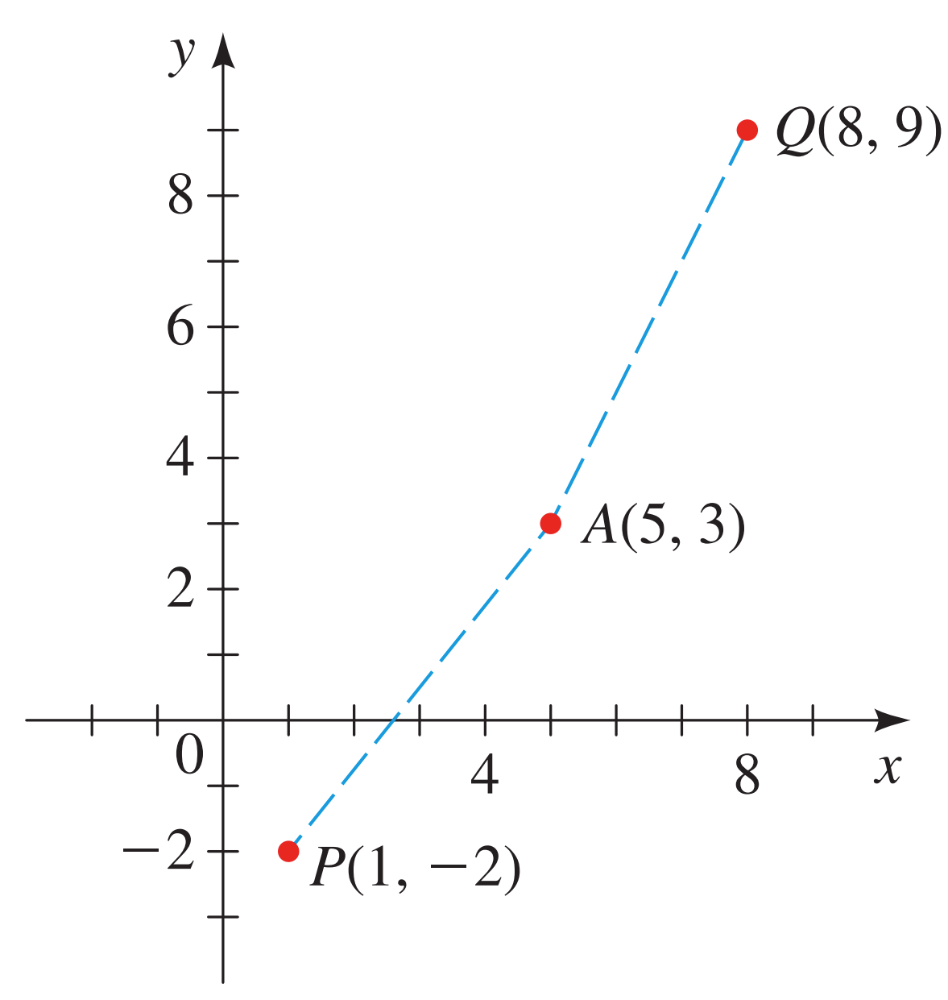<figcaption></figcaption></figure>

The goal is to find which point is closer to $$A(5, 3)$$. To do that, we find the distance to $$P(1, -2)$$ and the distance to $$Q(8, 9)$$.

Distance from $$A(5, 3)$$ to $$P(1, -2)$$

* Step 1 (Subtract): $$5 - 1 = 4$$ and $$3 - (-2) = 5$$
* Step 2 (Square): $$4^2 = 16$$ and $$5^2 = 25$$
* Step 3 (Add): $$16 + 25 = 41$$
* Step 4 (Root): The distance is $$\sqrt{41} \approx \mathbf{6.40}$$

Distance from $$A(5, 3)$$ to $$Q(8, 9)$$

* Step 1 (Subtract): $$5 - 8 = -3$$ and $$3 - 9 = -6$$
* Step 2 (Square): $$(-3)^2 = 9$$ and $$(-6)^2 = 36$$
* Step 3 (Add): $$9 + 36 = 45$$
* Step 4 (Root): The distance is $$\sqrt{45} \approx \mathbf{6.71}$$

Since $$\sqrt{41}$$ is a smaller number than $$\sqrt{45}$$, Point $$P$$ is closer to $$A$$ than Point $$Q$$ is.

***

<figure>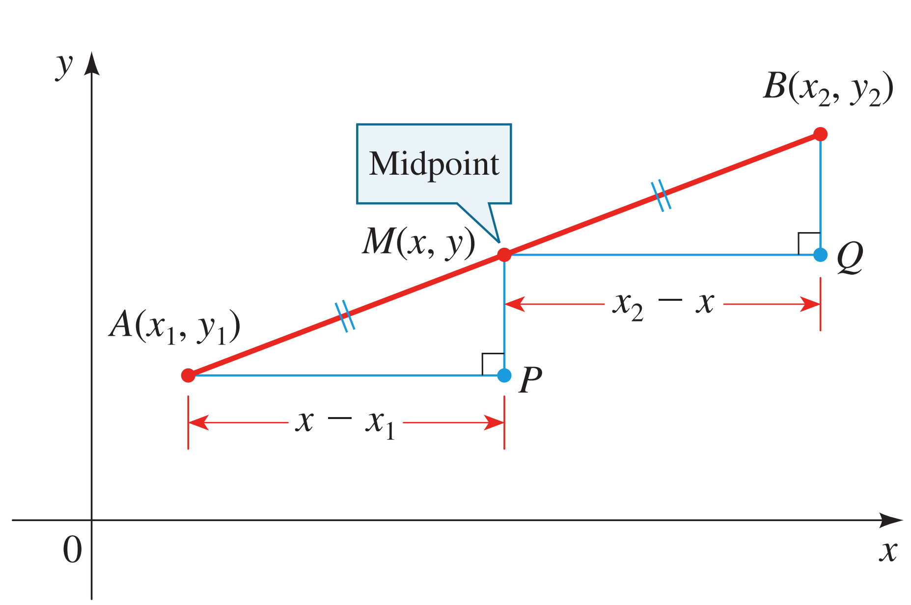<figcaption></figcaption></figure>

**Midpoint formula** finds the coordinates of the point that lies exactly halfway between two endpoints.

$$M = \left( \frac{x_1 + x_2}{2}, \frac{y_1 + y_2}{2} \right)$$

**Circle equation standard Form (Center-Radius Form)**

This is the most common and useful form because it tells you the center and the radius at a glance.

$$(x - h)^2 + (y - k)^2 = r^2$$

* $$(h, k)$$: The coordinates of the center.
* $$r$$: The radius of the circle.
* $$(x, y)$$: Any point on the edge of the circle.

#### **Intercept**

<figure>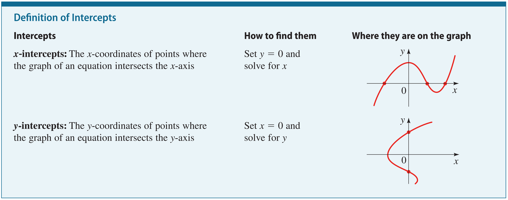<figcaption></figcaption></figure>

#### Lines

slope is the measure of steepness

$$slope = rise/sun$$

$$m = \frac{y_2 - y_1}{x_2 - x_1}$$

* Numerator ($$y_2 - y_1$$): This is the Rise. It tells you how much the line goes up or down.
* Denominator ($$x_2 - x_1$$): This is the Run. It tells you how much the line goes left or right.

<figure><figcaption></figcaption></figure>

#### Circle Equation

<figure>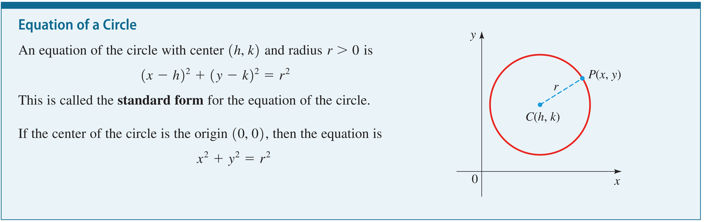<figcaption></figcaption></figure>

point-slope equation: $$y - y_1 = m(x - x_1)$$

**Parallel Lines**: Two non-vertical lines are parallel if they have the same slope ($$m_1 = m_2$$).

**Perpendicular line** is a line that intersects another line at a perfect 90° angle (also known as a right angle). Two lines with slopes m1 and m2 are perpendicular if and only if m1m2 = -1,\
that is, their slopes are negative reciprocals: $$m_2 = -\frac{1}{m_1}$$

## Functions

**Range notation**

Range of $$f = \{f(x) \mid x \in A\}$$ _(The set of all_ $$f(x)$$ _values such that_ $$x$$ _is an element of the domain_ $$A$$_.)_

**Domain of function**

$$f(x) = \frac{5}{x-3}$$

* $$x - 3 = 0 \rightarrow x = 3$$
* Domain: $$x \neq 3$$ (or $$(-\infty, 3) \cup (3, \infty)$$)

**4 ways to represent a function**

* verbally (by a description in words)
* algebraically (by an explicit formula)
* visually (by a graph)
* numerically (by a table of values)

**Graph of functions**

If $$f$$ is a function with domain $$A$$, then the graph of $$f$$ is the set of ordered pairs: $$\{(x, f(x)) \mid x \in A\}$$ plotted in a coordinate plane. In other words, the graph of $$f$$ is the set of all points $$(x, y)$$ such that $$y = f(x)$$

<figure>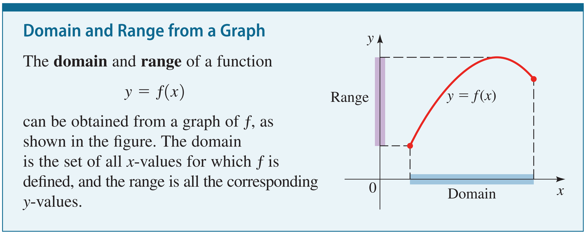<figcaption></figcaption></figure>

#### Average Rate of Change of a Function

$$\text{AROC} = \frac{f(b) - f(a)}{b - a}$$

In simple terms:

$$\frac{\text{Change in Output}}{\text{Change in Input}} = \frac{\Delta y}{\Delta x}$$

$$\text{AROC} = \frac{\text{Change in Distance}}{\text{Change in Time}} = \text{Average Speed}$$

#### Transformation of Functions

**Transformation of functions** is a set of mathematical operations that change the position, size, or orientation of a graph without losing its fundamental "family" shape.

$$y = a \cdot f(b(x - h)) + k$$

$$a$$ (Vertical Stretch, Compression, and Reflection):

* If $$|a| > 1$$: The graph is stretched vertically (becomes steeper).
* If $$0 < |a| < 1$$: The graph is compressed vertically (becomes flatter).
* If $$a$$ is negative: The graph is reflected across the $$x$$-axis (flips upside down).

$$k$$ (Vertical Shift):

* If $$k > 0$$: The graph moves up $$k$$ units.
* If $$k < 0$$: The graph moves down $$k$$ units.

Vertical/Horizontal Shifting: $$f(x) \pm c$$ or $$f(x \pm c)$$

Reflecting: $$-f(x)$$ (over x-axis) or $$f(-x)$$ (over y-axis)

Stretching/Shrinking: $$cf(x)$$ or $$f(cx)$$

#### Combining Functions

$$f(g(x))$$

Let’s use $$f(x) = x + 5$$ and $$g(x) = 2x$$.

If I ask for $$(f \circ g)(3)$$:

1. Start with the inside: $$g(3) = 2 \cdot 3 = \mathbf{6}$$.
2. Move to the outside: Put that 6 into $$f$$.
3. $$f(6) = 6 + 5 = \mathbf{11}$$.

## Polynomial and Rational functions

**Polynomial**

Question: Current: $$\$20$$ price, $$60$$ units sold. Change: $$+\$1$$ price $$\rightarrow$$ $$-2$$ units sold.&#x20;

Find $$x$$ (price increases) for Max Revenue ($$R$$)

$$revenue = price \times quantity$$

$$R(x) = (20 + 1x)(60 - 2x)$$

$$R(x) = 1200 - 40x + 60x - 2x^2$$

$$R(x) = -2x^2 + 20x + 1200$$

Finding the Maximum ($$x = \frac{-b}{2a}$$):

$$a = -2, \quad b = 20$$

$$x = \frac{-(20)}{2(-2)}$$

$$x = \frac{-20}{-4}$$

$$x = 5$$

$$\text{Optimal Price} = 20 + 5 = \$25$$

$$\text{Units Sold} = 60 - 2(5) = 50$$

$$R_{max} = 25 \times 50 = \$1,250$$

#### Long Division Polynomial

<figure>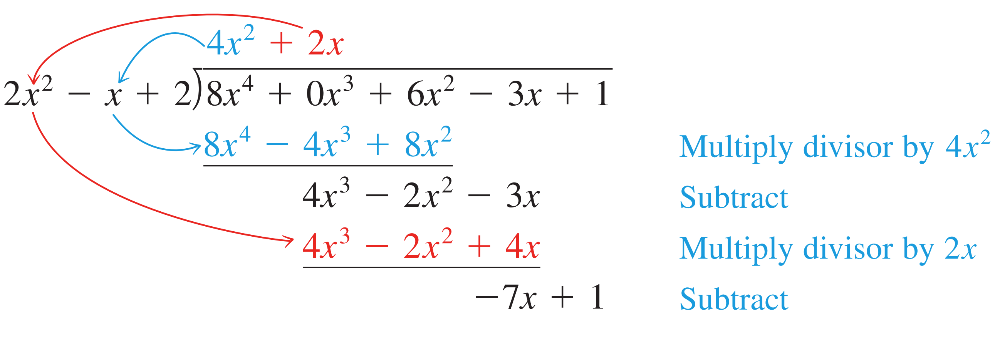<figcaption></figcaption></figure>

#### Synthetic Division

<figure>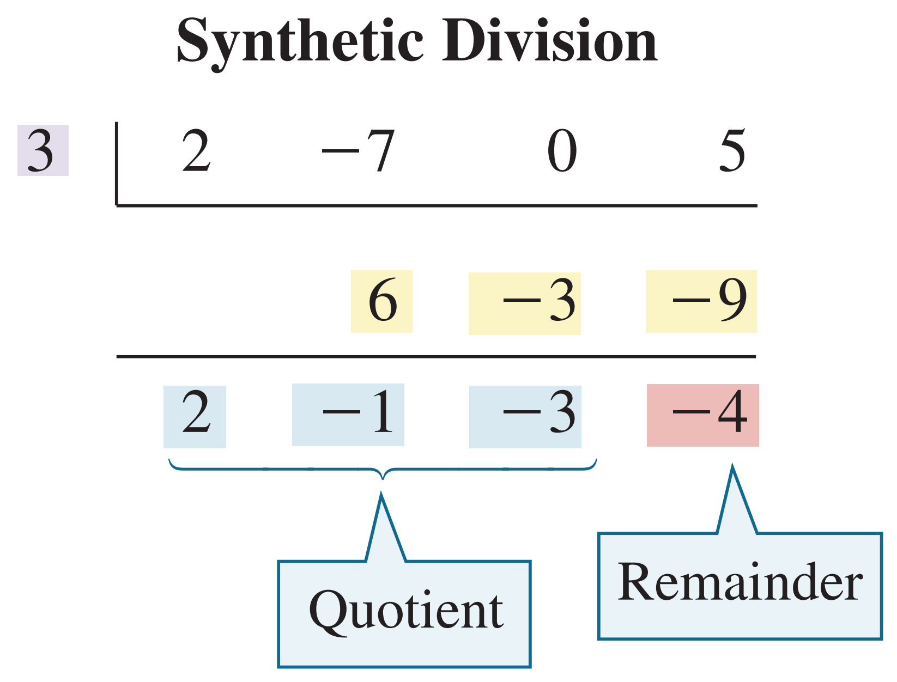<figcaption></figcaption></figure>

#### Factor Theorem

Factor Theorem is a specialized version of the Polynomial Remainder Theorem. It provides a quick way to determine if a linear binomial is a factor of a polynomial without performing long division.

Question: Is $$(x - 1)$$ a factor of $$x^3 - 6x^2 + 11x - 6$$?

1. The Test Value: Since we are testing $$(x - 1)$$, our value is $$1$$.
2.  The Calculation:

    $$f(1) = (1)^3 - 6(1)^2 + 11(1) - 6$$\
    $$f(1) = 1 - 6 + 11 - 6$$\
    $$f(1) = 0$$
3. The Verdict: Because we got 0, $$(x - 1)$$ is a factor. It divides the big equation perfectly with no leftovers.

#### Rational Function

$$f(x) = \frac{P(x)}{Q(x)}$$

where $$P(x)$$ and $$Q(x)$$ are polynomials, and $$Q(x) \neq 0$$.

A company produces custom sneakers. They have a fixed monthly cost (rent, machines) of $5,000 and a variable cost (materials, labor) of $30 per pair.

If they produce $$x$$ pairs of sneakers, the total cost is:

$$T(x) = 5000 + 30x$$

The Average Cost per pair ($$A(x)$$) is a rational function:

$$A(x) = \frac{5000 + 30x}{x}$$

<figure>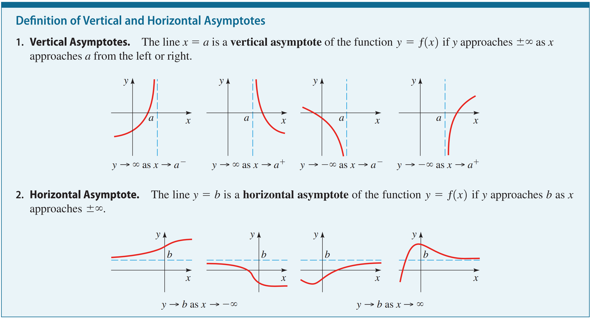<figcaption></figcaption></figure>

* Vertical Asymptote ($$x=0$$): You can't calculate the average cost for 0 sneakers (division by zero). As production gets closer to zero, the average cost per unit skyrockets.
* Horizontal Asymptote ($$y=30$$): As production increases to very large numbers, the $5,000 fixed cost is spread so thin that it becomes negligible. The average cost "levels off" toward the variable cost of $30.

**The Factor Theorem for Rational Functions**

In a rational function, we are usually looking for zeros (where the graph hits the x-axis).

* The Rule: $$(x - c)$$ is a factor of the rational function if and only if it is a factor of the numerator $$P(x)$$, and $$c$$ does not make the denominator $$Q(x)$$ zero
* If $$f(c) = \frac{P(c)}{Q(c)} = 0$$, then $$P(c)$$ must be $$0$$.

$$f(x) = \frac{x^2 - 9}{x + 5}$$

* Test $$(x - 3)$$: Plug in $$3$$.
* $$f(3) = \frac{3^2 - 9}{3 + 5} = \frac{0}{8} = 0$$.
* Verdict: $$(x - 3)$$ is a factor of the function

***

When you divide polynomials in a rational function, sometimes a factor appears in both the top and bottom. This is a special case of division called Point Discontinuity.

If you have:

$$f(x) = \frac{(x - 2)(x + 3)}{(x - 2)}$$

* Divide/Cancel: You can divide $$(x-2)$$ by $$(x-2)$$, which equals $$1$$.
* The Result: The function simplifies to $$f(x) = x + 3$$.
* The Catch: Even though the $$(x-2)$$ divided out, the original function is still "undefined" at $$x=2$$. This creates a Hole in the graph at that exact spot.

***

**Long Division and Asymptotes**

If you use Polynomial Long Division on a rational function where the top power is higher than the bottom, the Quotient tells you the end behavior (the Slant Asymptote).

$$f(x) = \frac{x^2 + 3x + 5}{x + 1}$$

Using Long Division:

$$\begin{array}{rll} \phantom{x+1} & x + 2 \\ x+1 & \overline{\smash{)} x^2 + 3x + 5 } \\ & \underline{-(x^2 + x)} \\ & \phantom{0000} 2x + 5 \\ & \phantom{000} \underline{-(2x + 2)} \\ & \phantom{0000000} 3 & \text{(Remainder)} \end{array}$$

* The Equation: $$f(x) = (x + 2) + \frac{3}{x+1}$$
* quotient is the answer to a division problem = $$x + 2$$
* Since the remainder is 3 (not zero), we know $$(x+1)$$ is not a factor of the numerator.
* The Graphing Connection: As $$x$$ gets huge, the fraction $$\frac{3}{x+1}$$ disappears, and the graph starts to look exactly like the line $$y = x + 2$$.
