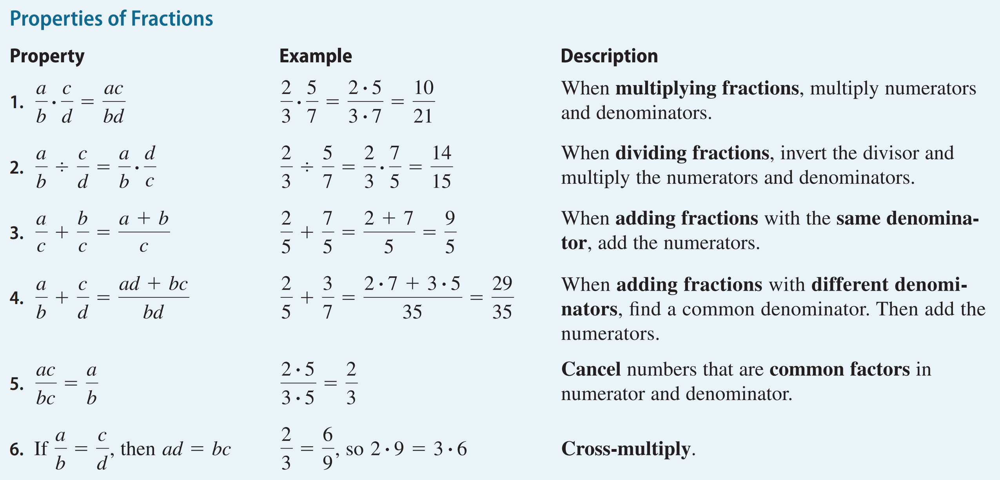
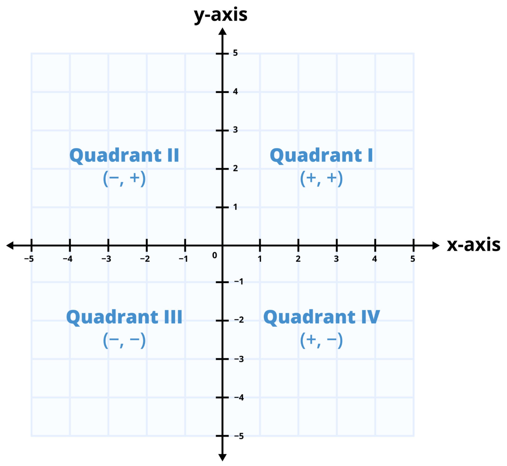

# Basic

**Real number**

<figure><figcaption></figcaption></figure>

there is no real number that, when multiplied by itself, results in a negative number. The expression $$\sqrt{-9}$$ asks the question: What real number, when multiplied by itself (squared), equals $$-9$$?

Let's test all possibilities for a Real Number $$x$$:

1.  If $$x$$ is Positive (e.g., 3)

    $$x \times x = 3 \times 3 = 9$$ (Result is Positive)
2.  If $$x$$ is Negative (e.g., $$-3$$)

    $$x \times x = (-3) \times (-3) = 9$$ (Result is Positive)
3.  If $$x$$ is Zero (i.e., $$0$$)

    $$x \times x = 0 \times 0 = 0$$ (Result is Zero)

Since there is no way to multiply a real number by itself and get a negative result like $$-9$$, the answer to $$\sqrt{-9}$$ cannot be found on the Real Number Line.

***

**Rational number** number that can be represent as ratio $$\mathbf{p/q}$$

**Natural number** positive number

**Irrational number** Any real number that cannot be written as a ratio of two integers ($$p/q$$) like $$\mathbf{\sqrt{2}}$$, $$\mathbf{\pi}$$, $$\mathbf{e}$$ (Euler's number)

**Variables** (like $$x$$ or $$y$$)

**Coefficients** (the number multiplying the variable, like the 3 in $$3x^2$$)

**Terms** (parts separated by addition/subtraction, like $$3x^2$$, $$-5x$$, and $$7$$)

**Constant** Term (the term with no variable, like 7)

**Modulus** $$a = (n \times q) + r$$

* $$1 = (10 \times 0) + r$$, r =1
* $$99 = (100 \times 0) + r$$, r=99

***

**Distributive Property**

* $$a(b + c) = ab + ac$$
* $$a(b - c) = ab - ac$$
* $$(a + b)(x + y) = \underbrace{a(x + y)}_{\text{Distribute } a} + \underbrace{b(x + y)}_{\text{Distribute } b}$$

Imagine you are buying items for a school trip:

* First Group ($$\mathbf{a+b}$$): The number of people going.
  * $$a = 10$$ students.
  * $$b = 2$$ teachers.
  * $$\mathbf{a+b = 12}$$ people.
* Second Group ($$\mathbf{x+y}$$): The cost per person.
  * $$x = \$5$$ for lunch.
  * $$y = \$3$$ for a drink/snack.
  * $$\mathbf{x+y = \$8}$$ total cost per person.

The total cost is the product of the two: $$(10 + 2)(5 + 3)$$

|                   | Lunch ($5)                      | Snack ($3)                      |
| ----------------- | ------------------------------- | ------------------------------- |
| Students ($$10$$) | $$10 \times 5 = \mathbf{\$50}$$ | $$10 \times 3 = \mathbf{\$30}$$ |
| Teachers ($$2$$)  | $$2 \times 5 = \mathbf{\$10}$$  | $$2 \times 3 = \mathbf{\$6}$$   |

Total Cost = $$\$50 + \$30 + \$10 + \$6 = \mathbf{\$96}$$

***

**Associative Property**

* $$(a + b) + c = a + (b + c)$$
* $$(ab) c = a (bc)$$

***

<figure><figcaption></figcaption></figure>

***

**Least Common Denominator (LCD)**

***

**Greatest Common Factor (GCF)**

* GCF of $$10x^4 - 15x^3 + 5x^2$$.
* Coefficients (10, 15, 5): The largest number that divides all three is $$\mathbf{5}$$.
* Variable ($$x^4, x^3, x^2$$): The lowest power is $$\mathbf{x^2}$$.
* GCF: $$5x^2$$

**Special Products**

| Product Type                          | Multiplication Formula (Multiplying) | Factoring Formula (Factoring)   |
| ------------------------------------- | ------------------------------------ | ------------------------------- |
| Difference of Squares                 | $$(a + b)(a - b) = a^2 - b^2$$       | $$a^2 - b^2 = (a - b)(a + b)$$  |
| Perfect Square Trinomial (Sum)        | $$(a + b)^2 = a^2 + 2ab + b^2$$      | $$a^2 + 2ab + b^2 = (a + b)^2$$ |
| Perfect Square Trinomial (Difference) | $$(a - b)^2 = a^2 - 2ab + b^2$$      | $$a^2 - 2ab + b^2 = (a - b)^2$$ |

* Difference of Squares: $$4x^2 - 9 = (2x)^2 - 3^2 = (2x - 3)(2x + 3)$$
* Perfect Square Trinomial: $$x^2 - 10x + 25 = (x)^2 - 2(x)(5) + 5^2 = (x - 5)^2$$

**Cartesian Coordinate System**

<figure><figcaption></figcaption></figure>

***

**Intervals**

<figure><figcaption></figcaption></figure>

**Absolute Value**

<figure><figcaption></figcaption></figure>
