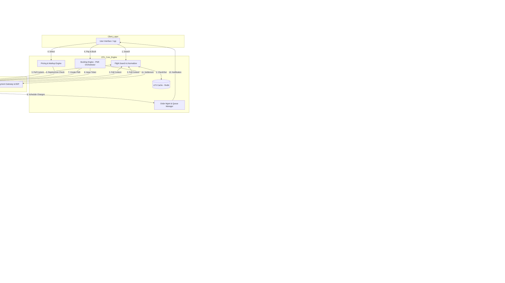

# Basic II

#### **Integer Exponents**

<figure><figcaption></figcaption></figure>

A product of identical numbers is usually written in exponential notation

* $$2^5 = 2 \times 2 \times 2 \times 2 \times 2 = 32$$
* $$\left(\frac{1}{2}\right)^5 = \frac{1^5}{2^5}$$
* $$\left(\frac{2}{5}\right)^6 = \frac{2^6}{5^6}$$
* $$x^a \cdot x^b = x^{a+b}$$
* $$\frac{x^a}{x^b} = x^{a-b}$$
* $$\left(\frac{a}{b}\right)^n = \frac{a^n}{b^n}$$
* $$(x^a)^b = x^{ab}$$

#### **Radicals**

The number inside the root _must_ be a result of something being raised to the power of $$ $n$ $$

<figure><figcaption></figcaption></figure>

The expression to simplify is $$\sqrt[4]{81x^8y^4}$$.

$$\sqrt[4]{81x^8y^4} = \sqrt[4]{81}\sqrt[4]{x^8}\sqrt[4]{y^4}$$ This step uses Property 1 ($$\sqrt[n]{ab} = \sqrt[n]{a} \cdot \sqrt[n]{b}$$) to separate the single radical into a product of three individual radicals.

= 3\sqrt[4]{(x^2)^4}|y|

This step simplifies each of the three terms separately:

1. Simplifying $$\sqrt[4]{81}$$ Since $$ $3^4 = 3 \times 3 \times 3 \times 3 = 81$ $$, the fourth root of 81 is 3.
2. Simplifying $$\sqrt[4]{x^8}$$:
   * This is rewritten by expressing $$x^8$$ as a power of 4: $$x^8 = (x^2)^4$$.
   * The term becomes $$\sqrt[4]{(x^2)^4}$$.
3. Simplifying $$\sqrt[4]{y^4}$$
   * This uses Property 5 ($$\sqrt[n]{a^n} = |a|$$, if $$n$$ is even). Since $$n=4$$ (even), the fourth root of $$y^4$$ must be the absolute value of $$y$$, or $$|y|$$.

= 3x^2|y|

Simplifying $$\sqrt[4]{(x^2)^4}$$

* This uses Property 5 again. The $$n$$th root cancels the $$n$$th power, and since $$n=4$$ is even, we use the absolute value: $$\sqrt[4]{(x^2)^4} = |x^2|$$.
* However, because any real number squared ($$x^2$$) is always non-negative, the absolute value signs are not necessary. So, $$|x^2|$$ simplifies to just $$x^2$$.

The final simplified expression is $$3x^2|y|$$.

The key takeaway is that the absolute value signs are essential when simplifying an even root of a variable raised to the same power (like $$\sqrt[4]{y^4}$$), unless you are certain the result is non-negative (like in the case of $$x^2$$).

#### Product Formulas

<figure><figcaption></figcaption></figure>

$$(3x + 4)(3x - 4) = (3x)^2 - (4)^2$$

$$(3x + 4)(3x - 4) = 9x^2 - 16$$

$$(2y + 5)^2 = (2y)^2 + 2(2y)(5) + (5)^2$$

$$(2y + 5)^2 = 4y^2 + 20y + 25$$

$$(z - 6)^2 = (z)^2 - 2(z)(6) + (6)^2$$

$$(z - 6)^2 = z^2 - 12z + 36$$

$$(x + 2)^3 = (x)^3 + 3(x)^2(2) + 3(x)(2)^2 + (2)^3$$

$$(x + 2)^3 = x^3 + 6x^2 + 12x + 8$$

$$(2m - 1)^3 = (2m)^3 - 3(2m)^2(1) + 3(2m)(1)^2 - (1)^3$$

$$(2m - 1)^3 = 8m^3 - 3(4m^2)(1) + 3(2m)(1) - 1$$

$$(2m - 1)^3 = 8m^3 - 12m^2 + 6m - 1$$
